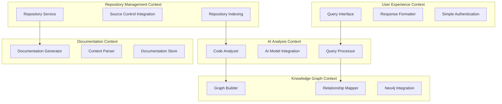
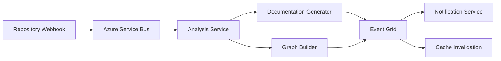

# DeepWiki Clone - Comprehensive Architecture Plan

## Executive Summary

This document outlines the architecture for a private AI-powered repository documentation platform similar to DeepWiki. The system will provide conversational AI interfaces for exploring and understanding code repositories, leveraging Azure cloud services, Neo4j graph database, and modern .NET technologies.

**Business Value**: Enable developers and researchers to quickly understand complex codebases through AI-powered conversational documentation, reducing onboarding time and improving code comprehension.

**Key Success Metrics**:
- Repository processing time < 5 minutes for typical repositories
- AI response time < 3 seconds for user queries
- Support for organization's repositories
- 95% uptime SLA

## System Overview

### Core Functionalities

1. **Repository Integration**
   - Connect and synchronize with Git repositories
   - Parse and analyze codebase structure, documentation, and metadata
   - Track repository changes and maintain up-to-date documentation

2. **AI-Powered Documentation Analysis**
   - Generate comprehensive documentation from code analysis
   - Create conversational AI interfaces for each repository
   - Provide contextual code explanations and insights

3. **Interactive Query System**
   - Natural language querying of repository content
   - Context-aware responses based on codebase structure
   - Support for complex technical questions about architecture and implementation

4. **Knowledge Graph Construction**
   - Build relationships between code components, dependencies, and concepts
   - Track code evolution and architectural patterns
   - Enable graph-based navigation and discovery

## Domain Modeling and Bounded Contexts

### Bounded Contexts



### Core Domain Models

#### Repository Management Context
- **Repository**: Represents a source code repository with metadata
- **Branch**: Individual branches within repositories
- **Commit**: Version control commits with change tracking
- **File**: Individual files with content and metadata

#### Documentation Context
- **Documentation**: Generated documentation for repositories
- **Section**: Individual documentation sections
- **CodeReference**: Links between documentation and code elements

#### AI Analysis Context
- **AnalysisJob**: Background jobs for code analysis
- **Insight**: AI-generated insights about code structure
- **Query**: User queries with context and responses

#### Knowledge Graph Context
- **CodeEntity**: Represents classes, functions, modules, etc.
- **Dependency**: Relationships between code entities
- **Concept**: Abstract concepts extracted from code

## Event-Driven Architecture Patterns

### Event Categories

1. **Repository Events**
   - RepositoryAdded
   - RepositoryUpdated
   - BranchCreated
   - CommitPushed

2. **Analysis Events**
   - AnalysisRequested
   - AnalysisCompleted
   - DocumentationGenerated
   - GraphUpdated

3. **Query Events**
   - QuerySubmitted
   - ResponseGenerated
   - FeedbackReceived

### Event Flow Architecture



## Azure Service Architecture

### Core Azure Services

1. **Azure App Service**
   - GraphQL API hosting
   - Auto-scaling for variable loads
   - Integrated with Application Insights

2. **Azure Functions**
   - Repository synchronization
   - Background analysis processing
   - Event-driven workflows

3. **Azure Service Bus**
   - Reliable message queuing
   - Event-driven communication
   - Dead letter queue handling

4. **Azure Event Grid**
   - Event routing and delivery
   - Webhook integration
   - Custom event schemas

5. **Azure Container Instances**
   - AI model hosting
   - Isolated processing environments
   - Dynamic scaling

6. **Azure Cognitive Services**
   - OpenAI integration
   - Text analysis and summarization
   - Custom model training

7. **Azure Key Vault**
   - Secure secrets management
   - API keys and connection strings
   - Certificate management

8. **Azure Application Insights**
   - Performance monitoring
   - Custom telemetry
   - Dependency tracking

### Service Selection Justifications

- **App Service**: Managed platform with built-in scaling, perfect for GraphQL APIs
- **Functions**: Event-driven processing aligns with EDA principles
- **Service Bus**: Guaranteed message delivery for critical repository updates
- **Event Grid**: Lightweight event routing for loose coupling
- **Container Instances**: Flexible hosting for AI models without Kubernetes complexity
- **Cognitive Services**: Managed AI services reduce infrastructure overhead

## Data Architecture

### Neo4j Graph Database Design

#### Node Types
```cypher
// Repository nodes
(:Repository {id, name, url, language, description, createdAt, updatedAt})
(:Branch {name, repository_id, lastCommit, isDefault})
(:Commit {hash, message, author, timestamp, repository_id})

// Code structure nodes
(:File {path, name, extension, size, repository_id})
(:Class {name, namespace, file_path, lines, repository_id})
(:Method {name, class_id, parameters, returnType, lines})
(:Interface {name, namespace, file_path, repository_id})

// Documentation nodes
(:Documentation {id, repository_id, content, version, generatedAt})
(:Section {title, content, order, documentation_id})

// Concept nodes
(:Concept {name, description, category, confidence})
(:Pattern {name, description, category, examples})
```

#### Relationship Types
```cypher
// Code relationships
(:Class)-[:IMPLEMENTS]->(:Interface)
(:Class)-[:EXTENDS]->(:Class)
(:Method)-[:CALLS]->(:Method)
(:File)-[:DEPENDS_ON]->(:File)

// Repository relationships
(:Repository)-[:HAS_BRANCH]->(:Branch)
(:Branch)-[:HAS_COMMIT]->(:Commit)
(:Repository)-[:CONTAINS]->(:File)

// Documentation relationships
(:Repository)-[:HAS_DOCUMENTATION]->(:Documentation)
(:Documentation)-[:HAS_SECTION]->(:Section)
(:Section)-[:REFERENCES]->(:Class|:Method|:File)

// Concept relationships
(:Repository)-[:IMPLEMENTS]->(:Pattern)
(:Class)-[:REPRESENTS]->(:Concept)
(:Method)-[:DEMONSTRATES]->(:Pattern)
```

### Complementary Data Storage

#### Azure Cosmos DB (Optional)
- Query history and preferences
- Cache for frequently accessed documentation

#### Azure Blob Storage
- Raw repository content
- Generated documentation files
- AI model artifacts and embeddings

## GraphQL API Design

### Schema Structure

```graphql
type Repository {
  id: ID!
  name: String!
  url: String!
  language: String!
  description: String
  branches: [Branch!]!
  documentation: Documentation
  insights: [Insight!]!
  lastAnalyzed: DateTime
}

type Documentation {
  id: ID!
  repository: Repository!
  sections: [Section!]!
  generatedAt: DateTime!
  version: String!
}

type Query {
  repositories(filter: RepositoryFilter): [Repository!]!
  repository(id: ID!): Repository
  searchRepositories(query: String!): [Repository!]!
  askRepository(repositoryId: ID!, query: String!): QueryResponse!
}

type Mutation {
  addRepository(input: AddRepositoryInput!): Repository!
  refreshRepository(id: ID!): Repository!
  submitQuery(repositoryId: ID!, query: String!): QueryResponse!
}

type Subscription {
  repositoryAnalysisUpdates(repositoryId: ID!): AnalysisUpdate!
  queryResponses(sessionId: ID!): QueryResponse!
}
```

### API Design Approach

1. **Schema-First Design**: Define GraphQL schema before implementation
2. **Resolver Pattern**: Clean separation of data fetching logic
3. **DataLoader Integration**: Efficient N+1 query resolution
4. **Real-time Updates**: WebSocket subscriptions for live updates
5. **Caching Strategy**: Redis-based caching with intelligent invalidation

## MVP Implementation Phases

### Phase 1: Core Repository Integration (Weeks 1-4)
**Goal**: Basic repository ingestion and storage

**Features**:
- Git repository connection and cloning
- Basic file parsing and indexing
- Simple Neo4j graph population
- GraphQL API skeleton
- Azure DevOps pipeline setup

**Azure Resources**:
- 1x App Service (Basic tier)
- 1x Neo4j AuraDB instance
- 1x Service Bus namespace
- 1x Key Vault
- Basic Application Insights

**Success Criteria**:
- Successfully ingest and parse 10 test repositories
- Basic GraphQL queries returning repository data
- Automated deployment pipeline functional

### Phase 2: AI-Powered Documentation (Weeks 5-8)
**Goal**: Generate and serve AI-powered documentation

**Features**:
- Integration with Azure OpenAI
- Documentation generation from code analysis
- Basic conversational query interface
- Simple natural language processing
- Documentation storage in Neo4j

**Additional Azure Resources**:
- Azure OpenAI service
- Container Instances for processing
- Blob Storage for artifacts

**Success Criteria**:
- Generate meaningful documentation for repositories
- Answer basic questions about code structure
- Response time < 5 seconds for simple queries

### Phase 3: Advanced Graph Intelligence (Weeks 9-12)
**Goal**: Sophisticated relationship mapping and insights

**Features**:
- Advanced code relationship analysis
- Dependency tracking and visualization
- Architectural pattern detection
- Code quality insights
- Enhanced query capabilities

**Enhancements**:
- Advanced Neo4j queries and algorithms
- Machine learning for pattern recognition
- Improved caching strategies
- Performance optimizations

**Success Criteria**:
- Accurate dependency mapping
- Intelligent architectural insights
- Sub-3-second query responses
- Support for 100+ repositories

### Phase 4: Enhanced Features (Weeks 13-16)
**Goal**: Production-ready capabilities

**Features**:
- BitBucket integration
- Enhanced authentication with existing Azure AD
- Advanced security features
- Comprehensive monitoring and alerting

**Additional Azure Resources**:
- Advanced Application Insights
- Azure Monitor and alerts
- Load balancer and CDN

**Success Criteria**:
- Support both Git and BitBucket
- Secure single-tenant operation
- 99.9% uptime achievement
- Production-grade monitoring

### Phase 5: Scale and Intelligence (Weeks 17-20)
**Goal**: Large-scale operation and advanced AI features

**Features**:
- Auto-scaling infrastructure
- Advanced AI model fine-tuning
- Predictive analysis capabilities
- Integration with external tools
- Advanced analytics and reporting

**Enhancements**:
- Premium App Service with auto-scaling
- Custom AI model deployment
- Advanced caching with Redis
- CDN for global performance

**Success Criteria**:
- Support 1000+ repositories
- Advanced AI insights and predictions
- Global deployment readiness
- Comprehensive analytics dashboard

## Deployment and DevOps Strategy

### Azure DevOps Pipeline Architecture

```yaml
# azure-pipelines.yml structure
stages:
  - Build
  - Test
  - Security_Scan
  - Deploy_Dev
  - Integration_Tests
  - Deploy_Staging
  - Performance_Tests
  - Deploy_Production
```

### Infrastructure as Code

**Bicep Templates**:
- Resource group management
- App Service configuration
- Service Bus and Event Grid setup
- Key Vault and security configuration
- Neo4j deployment scripts

### Deployment Strategy

1. **Blue-Green Deployment**
   - Zero-downtime deployments
   - Instant rollback capability
   - Production traffic validation

2. **Environment Promotion**
   - Dev → Staging → Production
   - Automated testing gates
   - Manual approval for production

3. **Database Migration Strategy**
   - Neo4j schema versioning
   - Forward-compatible changes
   - Rollback procedures

### Monitoring and Observability

1. **Application Performance Monitoring**
   - Azure Application Insights integration
   - Custom metrics and dashboards
   - Proactive alerting

2. **Infrastructure Monitoring**
   - Azure Monitor for resource health
   - Service Bus queue monitoring
   - Neo4j performance tracking

3. **Business Metrics**
   - Repository processing success rates
   - Query response accuracy
   - User engagement metrics

## Scalability Considerations

### Horizontal Scaling Strategies

1. **API Layer Scaling**
   - App Service auto-scaling rules
   - Load balancing across instances
   - Stateless design principles

2. **Processing Layer Scaling**
   - Azure Functions consumption plan
   - Container Instances scaling
   - Queue-based load distribution

3. **Database Scaling**
   - Neo4j cluster deployment
   - Read replicas for query distribution
   - Partitioning strategies for large graphs

### Performance Optimization

1. **Caching Strategy**
   - Redis cache for frequently accessed data
   - GraphQL query result caching
   - CDN for static content

2. **Query Optimization**
   - Neo4j query performance tuning
   - GraphQL resolver optimization
   - Database indexing strategies

3. **Content Delivery**
   - Azure CDN integration
   - Compressed response formats
   - Lazy loading strategies

## Security and Compliance Considerations

### Authentication and Authorization

1. **Azure Active Directory Integration**
   - OAuth 2.0 / OpenID Connect
   - Organization authentication
   - Role-based access within organization

2. **API Security**
   - JWT token validation
   - GraphQL query depth limiting
   - Rate limiting and throttling

3. **Data Access Control**
   - Repository-level permissions
   - Simple role-based access control
   - Basic audit logging

### Data Protection

1. **Encryption**
   - Data at rest encryption (Azure Storage)
   - Data in transit encryption (TLS 1.3)
   - Key management via Key Vault

2. **Privacy Compliance**
   - GDPR compliance measures
   - Data retention policies
   - Right to erasure implementation

3. **Security Scanning**
   - Vulnerability scanning in CI/CD
   - Dependency security checks
   - Regular penetration testing

### Compliance Framework

1. **SOC 2 Type II Readiness**
   - Security control implementation
   - Audit trail maintenance
   - Incident response procedures

2. **ISO 27001 Alignment**
   - Information security management
   - Risk assessment procedures
   - Continuous improvement process

## Risk Assessment and Mitigation

### Technical Risks

1. **High Risk: Neo4j Performance at Scale**
   - *Mitigation*: Implement read replicas and query optimization
   - *Contingency*: Hybrid approach with Cosmos DB for specific queries

2. **Medium Risk: AI Model Response Quality**
   - *Mitigation*: Continuous model fine-tuning and feedback loops
   - *Contingency*: Fallback to rule-based responses for critical queries

3. **Medium Risk: Repository Processing Failures**
   - *Mitigation*: Robust error handling and retry mechanisms
   - *Contingency*: Manual intervention workflows and monitoring

### Business Risks

1. **High Risk: Third-party API Dependencies**
   - *Mitigation*: Rate limiting and graceful degradation
   - *Contingency*: Alternative AI service providers

2. **Medium Risk: Scaling Costs**
   - *Mitigation*: Cost monitoring and optimization
   - *Contingency*: Tiered service offerings

## Implementation Guidelines

### Development Standards

1. **Domain-Driven Design Implementation**
   - Bounded context isolation
   - Domain service patterns
   - Event sourcing where appropriate

2. **Event-Driven Architecture Patterns**
   - Command Query Responsibility Segregation (CQRS)
   - Event sourcing for audit trails
   - Saga pattern for complex workflows

3. **Code Quality Standards**
   - Fluent Validation for input validation
   - Comprehensive unit test coverage (>80%)
   - Integration tests for critical paths

### Technology Implementation Details

1. **.NET Architecture**
   - Clean Architecture principles
   - MediatR for CQRS implementation
   - AutoMapper for object mapping
   - Polly for resilience patterns

2. **Neo4j Integration**
   - Neo4j.Driver for database connectivity
   - Cypher query builders
   - Graph algorithm implementations

3. **GraphQL Implementation**
   - HotChocolate framework
   - Custom middleware for authentication
   - Subscription handling with SignalR

## Success Metrics and KPIs

### Phase-Specific Metrics

**Phase 1**:
- Repository ingestion success rate: >95%
- API response time: <500ms
- Pipeline success rate: >90%

**Phase 2**:
- Documentation quality score: >80%
- Query response accuracy: >85%
- User query completion rate: >90%

**Phase 3**:
- Graph query performance: <3s
- Relationship accuracy: >90%
- System uptime: >99%

**Phase 4**:
- Authentication integration: 100%
- Security scan pass rate: 100%
- Repository onboarding time: <1 day

**Phase 5**:
- System capacity: 1000+ repositories
- Global response time: <2s
- Customer satisfaction: >4.5/5

### Overall Success Criteria

1. **Technical Excellence**
   - 99.9% system availability
   - <3-second average response time
   - Zero security incidents

2. **Business Impact**
   - 50% reduction in developer onboarding time
   - 300% increase in code comprehension speed
   - Positive ROI within 12 months

3. **User Experience**
   - >4.5/5 user satisfaction score
   - >80% feature adoption rate
   - <5% user churn rate

## Conclusion

This architecture provides a robust foundation for building a private DeepWiki-style application. The phased approach ensures continuous value delivery while building toward a comprehensive solution that leverages Azure cloud services, Neo4j graph capabilities, and modern .NET technologies.

The simplified single-tenant design ensures maintainability and extensibility, while the DevOps strategy provides reliable delivery and operation capabilities for private organizational use.