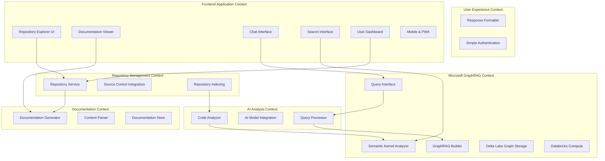
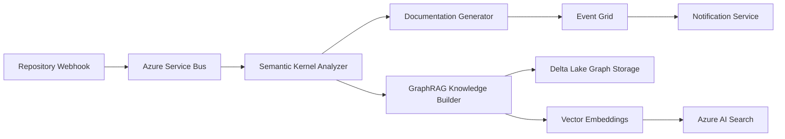

# DeepWiki for Enterprise - Microsoft GraphRAG Architecture Plan

## Executive Summary

This document outlines the architecture for **Archie - DeepWiki for Enterprise**, an AI-powered repository analysis platform that transforms any codebase into an interactive knowledge base using Microsoft's official GraphRAG methodology. Following 2025 best practices, this implementation delivers **DeepWiki-like conversational code exploration** with enterprise-grade advantages including Australian data sovereignty and compliance integration.

**DeepWiki for Enterprise Positioning**:
- **Like DeepWiki**: AI-powered repository analysis with conversational interfaces for code understanding
- **Better than DeepWiki**: Microsoft GraphRAG vs vanilla RAG achieves **3x to 90%+ accuracy improvement** for complex relationship queries
- **Enterprise Advantages**: Australian data sovereignty, compliance integration, architectural governance, Microsoft ecosystem integration

**Microsoft GraphRAG + Databricks Delta Lake Architecture**: Following Microsoft's official implementation pattern using **Microsoft Semantic Kernel** (.NET 9), **Azure Databricks Delta Lake** for enterprise-grade knowledge graph storage with built-in versioning and ACID transactions, **in-memory graph processing**, and **Azure AI Search exclusively for vector similarity search**.

**Business Value**: Enable enterprise developers to understand complex codebases 10x faster through GraphRAG-powered knowledge extraction, reducing onboarding time from weeks to days and improving architectural decision-making through relationship-aware AI analysis.

**Key Success Metrics**:
- Repository processing time < 5 minutes for typical repositories
- AI response time < 3 seconds for complex relationship queries via GraphRAG
- **GraphRAG Accuracy**: 3x to 90%+ better than vanilla RAG for architectural queries
- Support for organization's repositories with Australian data residency
- No mocking in test and prod environments
- 80% code coverage for NUnit unit testing
- 99.9% uptime SLA with enterprise-grade reliability

## System Overview

### Core Functionalities

1. **Repository Integration**
   - Connect and synchronize with Git repositories
   - Parse and analyze codebase structure, documentation, and metadata
   - Track repository changes and maintain up-to-date documentation

2. **AI-Powered Documentation Analysis**
   - Generate comprehensive documentation from code analysis on purpose, quality and components of the codebase. 
   - Create conversational AI interface to discuss insights across scanned repositories.
   - Provide contextual code explanations and insights

3. **Interactive Query System**
   - Natural language querying of repository content
   - Context-aware responses based on codebase structure
   - Support for complex technical questions about architecture and implementation

4. **Microsoft GraphRAG Knowledge Construction**
   - Use **Microsoft Semantic Kernel** for code analysis and entity extraction
   - Build relationships using **Databricks Delta Lake tables** (entities, relationships, communities with built-in versioning)
   - Enable **graph-based navigation** through in-memory processing and vector similarity search
   - Support **global and local GraphRAG search** patterns for complex relationship queries

## Domain Modeling and Bounded Contexts

### Bounded Contexts



### Core Domain Models

#### Repository Management Context
- **Repository**: Represents a source code repository with metadata
- **Branch**: Individual branches within repositories
- **Commit**: Version control commits with change tracking
- **File**: Individual files with content and metadata

#### Documentation Context
- **Documentation**: Generated documentation for repositories
- **Section**: Individual documentation sections
- **CodeReference**: Links between documentation and code elements

#### AI Analysis Context
- **AnalysisJob**: Background jobs for code analysis
- **Insight**: AI-generated insights about code structure
- **Query**: User queries with context and responses

#### Microsoft GraphRAG Context
- **CodeEntity**: Represents classes, functions, modules with semantic embeddings
- **CodeRelationship**: AI-detected relationships stored in Delta Lake with ACID transactions
- **KnowledgeGraph**: In-memory graph processing using Microsoft GraphRAG patterns with Delta Lake persistence
- **Community**: AI-detected code communities and architectural patterns

## Event-Driven Architecture Patterns

### Event Categories

1. **Repository Events**
   - RepositoryAdded
   - RepositoryUpdated
   - BranchCreated
   - CommitPushed

2. **Analysis Events**
   - AnalysisRequested
   - AnalysisCompleted
   - DocumentationGenerated
   - GraphUpdated

3. **Query Events**
   - QuerySubmitted
   - ResponseGenerated
   - FeedbackReceived

### GraphRAG Event Flow Architecture



## Rate Limiting & API Optimization Architecture

### Critical Performance Constraints

Based on real-world testing, rate limiting is a fundamental architectural constraint that shapes the entire system design:

**GitHub API Limits:**
- Authenticated requests: 5,000/hour (personal tokens) → 15,000/hour (GitHub Apps)
- Typical repository indexing: 1,000-5,000 API calls per 10K file repository
- Search API: 30 requests/minute for code search

**Azure OpenAI Limits:**
- text-embedding-ada-002: Variable based on deployment capacity (10-240 TPM)
- Request limits: Varies by region and subscription tier
- Token limits: 8,192 tokens per embedding request

### Rate Limiting Strategy by Phase

#### Phase 1: Basic Rate Limit Infrastructure (Weeks 1-4)
```csharp
public class RateLimitManager
{
    // GitHub rate limit awareness
    public async Task<bool> CanMakeGitHubRequest()
    {
        var remaining = await GetRemainingGitHubRequests();
        return remaining > _bufferThreshold;
    }
    
    // Azure OpenAI load balancing
    public async Task<string> GetNextAvailableDeployment()
    {
        return await _loadBalancer.GetLeastLoadedInstance();
    }
    
    // Exponential backoff with jitter
    public async Task<T> ExecuteWithRetry<T>(Func<Task<T>> operation)
    {
        return await Polly.Policy
            .Handle<RateLimitExceededException>()
            .WaitAndRetryAsync(retryCount: 5, 
                retryAttempt => TimeSpan.FromSeconds(
                    Math.Pow(2, retryAttempt) + Random.Next(0, 1000)));
    }
}
```

#### Phase 2: Intelligent Batch Processing (Weeks 5-8)
```csharp
public class IntelligentBatchProcessor
{
    // Content-aware prioritization
    public List<FileProcessingJob> PrioritizeFiles(List<string> files)
    {
        return files
            .Where(IsIndexableFile)
            .OrderByDescending(GetFilePriority) // Recent, important files first
            .Select(f => new FileProcessingJob(f))
            .ToList();
    }
    
    // Adaptive batch sizing
    public int GetOptimalBatchSize()
    {
        var currentLoad = await _rateLimitMonitor.GetCurrentLoad();
        return currentLoad < 0.8 ? _maxBatchSize : _minBatchSize;
    }
    
    // Embedding caching to avoid regeneration
    public async Task<float[]> GetOrGenerateEmbedding(string content)
    {
        var hash = ComputeContentHash(content);
        var cached = await _cache.GetEmbedding(hash);
        
        if (cached != null) return cached;
        
        var embedding = await _azureOpenAI.GenerateEmbedding(content);
        await _cache.StoreEmbedding(hash, embedding);
        return embedding;
    }
}
```

#### Phase 3: GraphQL Optimization & Caching (Weeks 9-12)
```csharp
public class GitHubGraphQLOptimizer
{
    // Single query replacing multiple REST calls
    public async Task<RepositoryDataBundle> GetRepositoryDataBundle(string owner, string repo)
    {
        var query = @"
            query GetRepositoryData($owner: String!, $name: String!) {
                repository(owner: $owner, name: $name) {
                    # Repository metadata, branches, recent commits, file tree
                    # All in single API call - 60-80% reduction in requests
                }
            }";
        
        return await _githubClient.ExecuteGraphQLQuery<RepositoryDataBundle>(query);
    }
    
    // Distributed caching with Redis
    public async Task<T> GetCachedData<T>(string key, Func<Task<T>> factory)
    {
        var cached = await _redis.GetAsync<T>(key);
        if (cached != null) return cached;
        
        var data = await factory();
        await _redis.SetAsync(key, data, TimeSpan.FromHours(24));
        return data;
    }
}
```

#### Phase 4: GitHub App + Webhooks (Weeks 13-16)
```csharp
public class GitHubAppIntegration
{
    // 15,000 requests/hour with GitHub App
    // Real-time updates via webhooks instead of polling
    
    [HttpPost("/webhooks/github")]
    public async Task<IActionResult> HandleWebhook([FromBody] GitHubWebhookPayload payload)
    {
        switch (payload.Action)
        {
            case "push":
                await _indexingService.ProcessIncrementalUpdate(payload.Repository, payload.Commits);
                break;
            case "pull_request":
                await _analysisService.AnalyzePullRequest(payload.PullRequest);
                break;
        }
        return Ok();
    }
    
    // Intelligent incremental processing
    public async Task ProcessIncrementalUpdate(Repository repo, List<Commit> commits)
    {
        var changedFiles = ExtractChangedFiles(commits);
        
        // Only process changed files, not entire repository
        await _indexingService.UpdateDocuments(repo.Id, changedFiles);
    }
}
```

### Cost Optimization Strategies

#### Embedding Cost Management
- **Content Deduplication**: Hash-based caching prevents redundant embedding generation
- **Smart Chunking**: Split large files intelligently to respect token limits
- **Hierarchical Indexing**: Index summaries first, detailed content on-demand
- **Off-Peak Processing**: Schedule bulk operations during low-cost hours

#### GitHub API Cost Management
- **GraphQL Migration**: 60-80% reduction in API calls
- **Webhooks over Polling**: Eliminate periodic repository checks
- **Delta Processing**: Only process changed content
- **Smart Filtering**: Skip binary files, generated code, dependency folders

#### Azure AI Search Optimization
- **Selective Indexing**: Prioritize important files, defer others
- **Index Partitioning**: Separate current vs historical content
- **Query Result Caching**: Reduce search API calls
- **Faceted Navigation**: Pre-compute common filter combinations

## Azure Service Architecture

### Core Azure Services

1. **Azure App Service**
   - GraphQL API hosting
   - Auto-scaling for variable loads
   - Integrated with Application Insights

2. **Azure Functions**
   - **Microsoft Semantic Kernel processing** for code analysis
   - **GraphRAG knowledge construction** in background
   - Event-driven Delta Lake table updates

3. **Azure Service Bus**
   - Reliable message queuing
   - Event-driven communication
   - Dead letter queue handling

4. **Azure Event Grid**
   - Event routing and delivery
   - Webhook integration
   - Custom event schemas

5. **Azure Container Instances**
   - AI model hosting
   - Isolated processing environments
   - Dynamic scaling

6. **Azure OpenAI + Semantic Kernel**
   - **GPT-4 integration** via Microsoft Semantic Kernel
   - **Entity and relationship extraction** for GraphRAG
   - **Embedding generation** for vector similarity

7. **Azure Key Vault**
   - Secure secrets management
   - API keys and connection strings
   - Certificate management

8. **Azure AI Search**
   - Vector database for semantic search
   - Hybrid search (vector + text)
   - Document indexing and retrieval
   - Australian data residency compliance

9. **Azure Application Insights**
   - Performance monitoring
   - Custom telemetry
   - Dependency tracking

### Service Selection Justifications

- **App Service**: Managed platform with built-in scaling, perfect for GraphQL APIs
- **Functions**: Event-driven processing aligns with EDA principles
- **Service Bus**: Guaranteed message delivery for critical repository updates
- **Event Grid**: Lightweight event routing for loose coupling
- **Container Instances**: Flexible hosting for AI models without Kubernetes complexity
- **Cognitive Services**: Managed AI services reduce infrastructure overhead
- **AI Search**: Vector database with semantic search, Australian data residency, hybrid search capabilities

## Data Architecture - Microsoft GraphRAG Pattern

### Microsoft GraphRAG Storage Architecture

Following Microsoft's official GraphRAG implementation:

#### Primary Data Storage Pattern

**Databricks Delta Lake Storage** (Enterprise Microsoft GraphRAG):
- `entities` Delta table - Code entities with metadata and embeddings (with ACID transactions)
- `relationships` Delta table - AI-detected code relationships (with versioning)
- `communities` Delta table - Architectural patterns and component groupings (with time travel)
- `text_units` Delta table - Source code chunks with embeddings (with schema evolution)
- `reports` Delta table - Community summaries and insights (with audit logging)

**Azure AI Search Vector Database** (Semantic Search Only):
- Repository content embeddings for similarity search
- Semantic code search and retrieval
- Vector similarity for related code discovery

**NOT used for graph relationships** - Azure AI Search limitations addressed through proper GraphRAG architecture

#### Microsoft GraphRAG Data Schemas

**Entities Delta Table Schema** (entities):
```json
{
  "id": "string", // Unique entity identifier
  "title": "string", // Code entity name (class, method, etc.)
  "type": "string", // Entity type (CLASS, METHOD, INTERFACE)
  "description": "string", // AI-generated entity description
  "human_readable_id": "string", // Namespace.ClassName format
  "text_unit_ids": ["string"], // References to source code chunks
  "document_ids": ["string"], // Source file references
  "rank": "number", // Importance ranking
  "attributes": { // Language-specific attributes
    "access_modifier": "string",
    "return_type": "string",
    "parameters": ["string"]
  }
}
```

**Relationships Delta Table Schema** (relationships):
```json
{
  "id": "string",
  "source": "string", // Source entity ID
  "target": "string", // Target entity ID
  "description": "string", // AI relationship description
  "weight": "number", // Relationship strength (0-1)
  "text_unit_ids": ["string"], // Evidence text chunks
  "document_ids": ["string"], // Source files
  "attributes": {
    "relationship_type": "string", // CALLS, IMPLEMENTS, EXTENDS, DEPENDS_ON
    "confidence": "number" // AI confidence in relationship
  }
}
```

**Azure AI Search Vector Schema** (semantic search only):
```json
{
  "id": "string",
  "repository_id": "string",
  "file_path": "string", 
  "content": "string",
  "content_vector": "Collection(Edm.Single)", // For similarity search
  "language": "string",
  "symbols": "Collection(Edm.String)", // For text search
  "last_modified": "DateTimeOffset"
}
```

#### GraphRAG Processing Strategy

**Microsoft Semantic Kernel Integration**:
- **Code Analysis**: Extract entities and relationships using AI
- **Community Detection**: Group related code components
- **Vector Store Integration**: Manage embeddings in Azure AI Search
- **RAG Orchestration**: Coordinate retrieval and generation patterns

**In-Memory Graph Operations**:
- Query Delta Lake tables for relationship analysis with time travel capabilities
- Execute graph traversal algorithms locally
- Combine with vector search for hybrid intelligence
- Support both local and global GraphRAG search patterns

### Complementary Data Storage

#### Azure Cosmos DB (Optional)
- Query history and preferences
- User sessions and conversation context
- Analytics and usage metrics

#### Azure Blob Storage
- Raw repository content
- Generated documentation files
- Large file content (>32KB limit for embeddings)
- Backup search indexes and artifacts

#### Azure Key Vault
- API keys for Azure AI Search
- Azure OpenAI service keys
- GitHub access tokens

## GraphQL API Design

### Schema Structure

```graphql
type Repository {
  id: ID!
  name: String!
  url: String!
  language: String!
  description: String
  branches: [Branch!]!
  documentation: Documentation
  insights: [Insight!]!
  lastAnalyzed: DateTime
}

type Documentation {
  id: ID!
  repository: Repository!
  sections: [Section!]!
  generatedAt: DateTime!
  version: String!
}

type Query {
  repositories(filter: RepositoryFilter): [Repository!]!
  repository(id: ID!): Repository
  searchRepositories(query: String!): [Repository!]!
  askRepository(repositoryId: ID!, query: String!): QueryResponse!
}

type Mutation {
  addRepository(input: AddRepositoryInput!): Repository!
  refreshRepository(id: ID!): Repository!
  submitQuery(repositoryId: ID!, query: String!): QueryResponse!
}

type Subscription {
  repositoryAnalysisUpdates(repositoryId: ID!): AnalysisUpdate!
  queryResponses(sessionId: ID!): QueryResponse!
}
```

### API Design Approach

1. **Schema-First Design**: Define GraphQL schema before implementation
2. **Resolver Pattern**: Clean separation of data fetching logic
3. **DataLoader Integration**: Efficient N+1 query resolution
4. **Real-time Updates**: WebSocket subscriptions for live updates
5. **Caching Strategy**: Redis-based caching with intelligent invalidation

## MVP Implementation Phases - Iterative & Atomic Development

**PRINCIPLE**: Each phase delivers an end-to-end working feature that stakeholders can use and provide feedback on. Never implement a backend feature without the UI to test it immediately.

### Phase 1: Repository Connection + Basic Explorer UI (Weeks 1-4)
**Goal**: Working repository browsing experience - users can connect repos and explore files immediately

**Backend Features**:
- Git repository connection and cloning
- Basic file parsing and indexing
- Azure AI Search index creation and population
- GraphQL API skeleton
- **🚨 CRITICAL: Basic rate limiting infrastructure**
  - GitHub API rate limit awareness (x-ratelimit-remaining headers)
  - Azure OpenAI rate limit handling with exponential backoff
  - Basic queuing system for batch processing

**Frontend Features**:
- **Repository Explorer Interface**
  - Repository connection wizard with validation
  - Interactive repository tree viewer with file system navigation
  - Code file viewer with syntax highlighting and line numbers
  - Repository metadata dashboard (languages, contributors, recent activity)
- **Frontend Architecture Setup**
  - Next.js 15 application with TypeScript
  - GraphQL client integration (Apollo Client) consuming backend API
  - Tailwind CSS + shadcn/ui components for design system
  - Authentication integration with Azure AD

**Azure Resources**:
- Backend: App Service (Basic tier), Azure AI Search (Standard S1), Key Vault
- Frontend: Azure Static Web Apps, Azure CDN for asset delivery
- Monitoring: Basic Application Insights for both backend and frontend

**Success Criteria**:
- ✅ Users can connect repositories and immediately browse file structure
- ✅ Responsive repository explorer working on desktop and mobile
- ✅ Authentication flow functional with Azure AD
- ✅ Successfully ingest and display 10 test repositories
- ✅ Sub-2-second initial page load times
- **🎯 Rate Limiting**: Complete indexing of 1,000+ file repository without API failures

### Phase 2: AI Search + Search UI (Weeks 5-8)
**Goal**: Working semantic search - users can search across repositories and see meaningful results immediately

**Backend Features**:
- Azure OpenAI integration with multiple deployments for load balancing
- Basic document embedding generation
- Azure AI Search vector search implementation
- **🚀 WORKFLOW OPTIMIZATION: Intelligent batch processing**
  - Content-aware request prioritization (process important files first)
  - Embedding result caching to avoid OpenAI API regeneration
  - Adaptive batch sizing based on current rate limit status

**Frontend Features**:
- **Semantic Search Interface**
  - Global search bar with autocomplete and suggestions
  - Search results with highlighted snippets and relevance scoring
  - Advanced search filters (file type, language, date ranges)
  - Search history and saved searches
- **Search Performance Optimizations**
  - Debounced search queries with loading states
  - Client-side caching for search results

**Additional Azure Resources**:
- Redis Cache for embedding and metadata caching
- Enhanced Azure AI Search indexes
- Azure Monitor alerts for rate limit monitoring

**Success Criteria**:
- ✅ Users can immediately search across connected repositories and get relevant results
- ✅ Sub-500ms search response times with proper caching
- ✅ Search autocomplete providing relevant suggestions
- ✅ Mobile-optimized search experience
- **🎯 Scale**: Successfully process repositories with 10,000+ files within 30 minutes
- **🎯 Efficiency**: 80% reduction in redundant API calls through intelligent caching

### Phase 3: Documentation Generation + Documentation Viewer (Weeks 9-12)
**Goal**: Working AI documentation - users can generate and view meaningful documentation immediately

**Backend Features**:
- AI-powered documentation generation from code analysis
- Documentation storage in Azure AI Search
- **⚡ EFFICIENCY OPTIMIZATION: GitHub GraphQL Migration**
  - Replace multiple REST API calls with single GraphQL queries
  - 60-80% reduction in GitHub API usage
  - Smart query batching for multiple repositories
  - Comprehensive metadata caching with Redis

**Frontend Features**:
- **AI Documentation Viewer**
  - Structured documentation display with expandable sections
  - Markdown rendering with code syntax highlighting
  - Table of contents navigation with anchor links
  - Documentation version history and regeneration triggers
  - Print-friendly documentation export
- **Enhanced User Experience**
  - Split-view mode (code + documentation)
  - Dark/light theme toggle
  - Loading states and error handling

**Enhancements**:
- Advanced Azure AI Search queries and filtering
- Machine learning for pattern recognition
- Redis-based distributed caching architecture

**Success Criteria**:
- ✅ Users can generate and immediately view meaningful documentation
- ✅ AI-generated documentation renders correctly with navigation
- ✅ Documentation generation completes within reasonable time
- ✅ Generate meaningful documentation for repositories
- **🎯 API Efficiency**: 75% reduction in GitHub API calls through GraphQL optimization
- **🎯 Cache Performance**: 90%+ cache hit rate for repository metadata and embeddings

### Phase 4: Conversational Queries + Chat Interface (Weeks 13-16)
**Goal**: Working conversational AI - users can ask questions about repositories and get immediate answers

**Backend Features**:
- Enhanced conversational query interface
- Advanced natural language processing
- Real-time response generation
- **🏢 PRODUCTION OPTIMIZATION: GitHub App Integration**
  - Upgrade from personal access tokens to GitHub App
  - 15,000 requests/hour limit increase
  - Webhook integration for real-time repository updates

**Frontend Features**:
- **Conversational Chat Interface**
  - Real-time chat interface for repository questions
  - Message history with conversation threads
  - Context awareness showing which repository/files are being discussed
  - Copy/share conversation capabilities
  - Suggested questions based on repository analysis
- **GraphQL Integration**
  - Real-time subscriptions for chat responses
  - Query caching for documentation sections
  - Optimistic updates for better UX

**Additional Azure Resources**:
- Enhanced Application Insights and Azure Monitor
- GitHub App registration and webhook endpoints
- Enhanced Redis Cache with persistence

**Success Criteria**:
- ✅ Users can ask questions about repositories and get immediate, contextual answers
- ✅ Real-time chat responses within 3 seconds
- ✅ WebSocket subscriptions working reliably
- ✅ Conversation history persists across sessions
- ✅ Mobile-responsive chat interface
- **🎯 Scale**: GitHub App supporting 15,000+ API requests/hour
- **🎯 Real-time**: Webhook-driven updates within 30 seconds of repository changes

### Phase 5: Microsoft GraphRAG Implementation + Knowledge Discovery UI (Weeks 17-20)
**Goal**: Working GraphRAG-powered insights - users can explore code relationships through advanced AI immediately

**Backend Features**:
- **Microsoft GraphRAG Integration**: Implement Delta Lake-based knowledge graph following official patterns
- **Semantic Kernel Code Analysis**: AI-powered entity extraction and relationship detection
- **Global/Local GraphRAG Search**: Support complex relationship queries with 3x-90x accuracy improvement
- **Community Detection**: Identify architectural patterns and component groupings
- **💰 COST OPTIMIZATION: Advanced usage monitoring**
  - Intelligent scheduling for off-peak processing
  - Usage analytics and forecasting
  - Advanced embedding strategies (semantic chunking, hierarchical indexing)

**Frontend Features**:
- **GraphRAG Knowledge Discovery Dashboard**
  - **Microsoft GraphRAG-powered visualizations** showing AI-detected relationships
  - **Community-based architecture views** displaying component groupings
  - **Interactive relationship exploration** using global/local GraphRAG search
  - **DeepWiki-style conversational interface** for code understanding queries
  - **Australian enterprise advantages** highlighted in compliance dashboards
- **GraphRAG-Enhanced Visualizations**
  - **Community cluster visualizations** from GraphRAG community detection
  - **Relationship strength indicators** from AI confidence scores
  - **Multi-hop relationship exploration** through graph traversal

**Enhancements**:
- Premium App Service with auto-scaling
- Advanced caching with Redis
- CDN for global performance

**Success Criteria**:
- ✅ Users can immediately explore code relationships through **GraphRAG-powered DeepWiki-like interface**
- ✅ **Microsoft GraphRAG accuracy**: 3x-90x improvement for complex relationship queries
- ✅ **Global/Local GraphRAG search**: Sub-3-second responses for architectural questions
- ✅ **Community detection**: Accurate identification of architectural patterns
- **🎯 Enterprise Scale**: Process 50,000+ files per repository with GraphRAG efficiency
- **🎯 Australian Sovereignty**: All GraphRAG processing in Australia East region

### Phase 6: User Dashboard + Analytics (Weeks 21-24)
**Goal**: Working user management - users can manage repositories and view usage analytics immediately

**Backend Features**:
- Enhanced authentication with existing Azure AD
- Advanced security features and comprehensive monitoring
- Repository management APIs
- Analytics and usage tracking

**Frontend Features**:
- **User Dashboard**
  - Personal repository overview with status indicators
  - Recent activity timeline (queries, documentation views, searches)
  - Favorite repositories and bookmarked documentation sections
  - Usage analytics (most queried repositories, popular searches)
- **Repository Management Interface**
  - Bulk repository operations (refresh, reindex, configure)
  - Repository settings and configuration management
  - Integration status monitoring with error reporting

**Additional Azure Resources**:
- Load balancer and CDN
- Azure Cost Management alerts and budgets

**Success Criteria**:
- ✅ Users can immediately manage all their repositories from a central dashboard
- ✅ Comprehensive dashboard showing all user activities with <1.5s load time
- ✅ Repository management operations working reliably (>99% success)
- ✅ Real-time status updates for background operations
- ✅ Analytics providing actionable insights
- **🎯 Scale**: Support 1000+ repositories without performance degradation

### Phase 7: Infrastructure Optimizations (Weeks 25-28)
**Goal**: Production-ready performance and reliability improvements

**Backend Features**:
- Auto-scaling infrastructure optimization
- Advanced rate limiting and API optimization
- Performance monitoring and alerting enhancements
- BitBucket integration for additional repository sources

**Frontend Features**:
- Performance optimizations (code splitting, lazy loading)
- Progressive Web App (PWA) capabilities
- Offline capability for cached content
- Advanced error handling and recovery

**Success Criteria**:
- ✅ 99.9% system uptime achievement
- ✅ Support for both Git and BitBucket repositories
- ✅ Progressive Web App with offline capabilities
- ✅ Production-grade monitoring and alerting
- **🎯 Cost**: API usage costs reduced by 60% through optimization strategies

### Phase 8: Authentication & Security Hardening (Weeks 29-32)
**Goal**: Enterprise-ready security and authentication

**Backend Features**:
- Advanced security features and audit logging
- Enhanced role-based access control
- Security scanning and compliance measures

**Frontend Features**:
- Advanced authentication flows
- Role-based UI components
- Security audit trail interfaces
- Compliance reporting dashboards

**Success Criteria**:
- ✅ Secure single-tenant operation with enterprise-grade security
- ✅ Zero security incidents during testing
- ✅ GDPR compliance measures implemented
- ✅ Complete audit trail functionality
- **🎯 Security**: Pass comprehensive security scanning with 100% success rate

### Phase 9: Performance Monitoring & Advanced DevOps (Weeks 33-36)
**Goal**: Complete observability and advanced operational capabilities

**Backend Features**:
- Advanced AI model fine-tuning
- Predictive analysis capabilities
- Integration with external tools and advanced analytics

**Frontend Features**:
- Advanced performance monitoring dashboards
- Real-time system health visualization
- Advanced analytics and reporting interfaces
- Export capabilities for all reports

**Success Criteria**:
- ✅ Advanced AI insights and predictions available
- ✅ Global deployment readiness achieved
- ✅ Comprehensive analytics dashboard functional
- ✅ Complete system observability implemented
- **🎯 Intelligence**: Predictive rate limit management with 99%+ success rate
- **🎯 User Experience**: >4.5/5 user satisfaction score across all features

## Technology Stack - Microsoft GraphRAG Integration

### Core Technology Stack

**Microsoft GraphRAG + Databricks Stack**:
- **Microsoft Semantic Kernel** (.NET 9): AI orchestration and code analysis
- **Microsoft GraphRAG Library**: Official implementation for knowledge graph construction
- **Azure Databricks**: Scalable compute platform for GraphRAG processing in Australia East
- **Delta Lake**: ACID-compliant knowledge graph storage with built-in versioning and time travel
- **Azure AI Search**: Vector embeddings and semantic search (NOT graph relationships)
- **Azure OpenAI**: GPT-4 for entity extraction and relationship detection

### Technology Stack Justifications

- **Microsoft Semantic Kernel**: Official .NET framework for AI orchestration and RAG patterns
- **Microsoft GraphRAG**: Proven 3x-90x accuracy improvement over vanilla RAG
- **Azure Databricks**: Enterprise-grade compute with Australian data residency and compliance
- **Delta Lake**: ACID transactions, time travel, schema evolution - solves all GraphRAG versioning challenges
- **Azure AI Search**: Vector similarity search with Australian data residency

## Delta Lake GraphRAG Storage Architecture

### Enterprise-Grade Knowledge Graph Storage

**Databricks Delta Lake Architecture** provides enterprise-grade storage with ACID transactions and versioning that enhances Microsoft GraphRAG patterns:

#### Delta Lake Tables Schema
```sql
-- Core GraphRAG tables with built-in versioning
CREATE TABLE entities (
  id STRING,
  name STRING,
  type STRING,
  description STRING,
  embedding ARRAY<FLOAT>,
  repository_id STRING,
  file_path STRING,
  created_at TIMESTAMP,
  updated_at TIMESTAMP
) USING DELTA
PARTITIONED BY (repository_id);

CREATE TABLE relationships (
  id STRING,
  source_id STRING,
  target_id STRING,
  relationship_type STRING,
  weight FLOAT,
  description STRING,
  repository_id STRING,
  created_at TIMESTAMP
) USING DELTA
PARTITIONED BY (repository_id);

CREATE TABLE communities (
  id STRING,
  community_id INT,
  level INT,
  title STRING,
  summary STRING,
  entity_ids ARRAY<STRING>,
  repository_id STRING,
  created_at TIMESTAMP
) USING DELTA
PARTITIONED BY (repository_id, level);
```

#### Built-in Versioning & Time Travel
```sql
-- Query any historical version
SELECT * FROM entities VERSION AS OF 'yesterday'
SELECT * FROM relationships TIMESTAMP AS OF '2025-01-08T14:30:00'

-- See all versions and operations
DESCRIBE HISTORY entities
DESCRIBE HISTORY relationships
```

#### Incremental Updates (Solves Microsoft GraphRAG Pain Points)
```sql
-- ACID-compliant incremental updates when code changes
MERGE INTO entities e
USING updated_entities u
ON e.id = u.id
WHEN MATCHED THEN UPDATE SET *
WHEN NOT MATCHED THEN INSERT *;

-- Automatic conflict resolution and consistency
MERGE INTO relationships r
USING updated_relationships u
ON r.id = u.id AND r.repository_id = u.repository_id
WHEN MATCHED THEN UPDATE SET *
WHEN NOT MATCHED THEN INSERT *;
```

#### Schema Evolution (Future-Proof)
```sql
-- Add new AI model outputs without breaking existing queries
ALTER TABLE entities ADD COLUMN sentiment_score FLOAT;
ALTER TABLE entities ADD COLUMN complexity_metrics MAP<STRING, FLOAT>;

-- Old queries continue working, new fields are nullable
```

### Australian Enterprise Compliance

**Data Residency**: All Databricks processing in Australia East region
**Audit Trail**: Every table operation logged with timestamp and user
**Access Control**: Integration with Azure AD and enterprise permissions
**Encryption**: At-rest and in-transit encryption with Australian keys

### Integration with GraphRAG Processing

#### Real-time Updates (Feature 08 Integration)
```csharp
public class DeltaLakeGraphRAGService
{
    // When GitHub webhook triggers changes
    public async Task ProcessRepositoryChangeAsync(
        string repositoryId, 
        string commitSha,
        List<string> changedFiles)
    {
        var updatedEntities = await _semanticKernel
            .AnalyzeChangedFilesAsync(changedFiles);
        
        // Delta Lake handles ACID transactions automatically
        await _databricks.ExecuteSqlAsync($@"
            MERGE INTO entities e
            USING ({SerializeToTempView(updatedEntities)}) u
            ON e.id = u.id AND e.repository_id = '{repositoryId}'
            WHEN MATCHED THEN UPDATE SET *
            WHEN NOT MATCHED THEN INSERT *
        ");
        
        // Automatic versioning - no manual management needed
        var version = await GetLatestVersionAsync("entities");
        await NotifyGraphUpdatedAsync(repositoryId, version);
    }
}
```

#### Query Performance Optimization
```sql
-- Z-ORDER optimization for GraphRAG queries
OPTIMIZE entities ZORDER BY (repository_id, type, name);
OPTIMIZE relationships ZORDER BY (repository_id, source_id, target_id);

-- Auto-compaction for optimal query performance
ALTER TABLE entities SET TBLPROPERTIES (
  'delta.autoOptimize.optimizeWrite' = 'true',
  'delta.autoOptimize.autoCompact' = 'true'
);
```

## Frontend Technology Architecture

### Core Technology Stack Justifications

**Next.js 15 with TypeScript**:
- Server-side rendering for SEO and performance
- Built-in optimizations (image optimization, code splitting)
- Strong TypeScript support for enterprise development
- Excellent integration with Azure deployment options
- React ecosystem for rich interactive components

**GraphQL with Apollo Client**:
- Seamless integration with existing HotChocolate backend
- Intelligent caching and state management
- Real-time subscriptions for chat and updates
- Optimal data fetching with query optimization
- Strong TypeScript code generation

**Tailwind CSS + shadcn/ui**:
- Rapid development with utility-first approach
- Consistent design system across all components
- Excellent mobile responsiveness capabilities
- Easy theming for light/dark modes
- Production-optimized with unused CSS elimination

**Azure Deployment Strategy**:
- **Azure Static Web Apps**: Optimal for frontend with API integration
- **Azure CDN**: Global content delivery for performance
- **Azure Application Insights**: Frontend performance monitoring
- **Integration with existing Azure AD**: Seamless authentication

### Frontend-Backend Integration Patterns

**GraphQL API Consumption**:
```typescript
// Example query integration
const GET_REPOSITORY_OVERVIEW = gql`
  query GetRepositoryOverview($repositoryId: ID!) {
    repository(id: $repositoryId) {
      id
      name
      documentation {
        sections {
          title
          content
        }
      }
      insights {
        architecturalPatterns
        technologies
      }
    }
  }
`;
```

**Real-time Subscriptions**:
```typescript
// Chat subscription example
const CHAT_SUBSCRIPTION = gql`
  subscription OnChatResponse($sessionId: ID!) {
    queryResponses(sessionId: $sessionId) {
      id
      query
      response
      timestamp
    }
  }
`;
```

**Authentication Integration**:
```typescript
// NextAuth.js configuration with Azure AD
export default NextAuth({
  providers: [
    AzureADProvider({
      clientId: process.env.AZURE_AD_CLIENT_ID,
      clientSecret: process.env.AZURE_AD_CLIENT_SECRET,
      tenantId: process.env.AZURE_AD_TENANT_ID,
    }),
  ],
  callbacks: {
    async jwt({ token, account }) {
      // Pass through GraphQL authorization
      if (account) {
        token.accessToken = account.access_token;
      }
      return token;
    },
  },
});
```

## Deployment and DevOps Strategy

### Azure DevOps Pipeline Architecture

```yaml
# azure-pipelines.yml structure
stages:
  - Build_Backend
  - Build_Frontend
  - Test_Backend
  - Test_Frontend
  - Security_Scan
  - Deploy_Backend_Dev
  - Deploy_Frontend_Dev
  - Integration_Tests
  - Deploy_Backend_Staging
  - Deploy_Frontend_Staging
  - Performance_Tests
  - E2E_Frontend_Tests
  - Deploy_Backend_Production
  - Deploy_Frontend_Production
```

### Infrastructure as Code

**Bicep Templates**:
- Resource group management
- App Service configuration (Backend API)
- Azure Static Web Apps configuration (Frontend)
- Service Bus and Event Grid setup
- Key Vault and security configuration
- Azure AI Search deployment scripts
- Azure CDN configuration for frontend assets
- Application Insights for frontend monitoring

### Deployment Strategy

1. **Blue-Green Deployment**
   - Zero-downtime deployments
   - Instant rollback capability
   - Production traffic validation

2. **Environment Promotion**
   - Dev → Staging → Production
   - Automated testing gates
   - Manual approval for production

3. **Azure AI Search Migration Strategy**
   - Search index versioning
   - Forward-compatible schema changes
   - Index rollback procedures

### Monitoring and Observability

1. **Application Performance Monitoring**
   - Azure Application Insights integration
   - Custom metrics and dashboards
   - Proactive alerting

2. **Frontend Performance Monitoring**
   - Real User Monitoring (RUM) with Application Insights
   - Core Web Vitals tracking (LCP, FID, CLS)
   - JavaScript error tracking and reporting
   - Page load performance analytics
   - User interaction heatmaps and analytics

3. **Infrastructure Monitoring**
   - Azure Monitor for resource health
   - Service Bus queue monitoring
   - Azure AI Search performance tracking
   - Azure Static Web Apps performance metrics
   - CDN performance and cache hit rates

3. **🚨 CRITICAL: Rate Limiting & API Monitoring**
   - **GitHub API Monitoring**:
     - Remaining requests per hour tracking
     - Rate limit reset time monitoring
     - API call success/failure rates
     - GraphQL vs REST API usage efficiency
   
   - **Azure OpenAI Monitoring**:
     - Token usage per deployment instance
     - Embedding generation throughput
     - Rate limit exception frequency
     - Cost per thousand tokens tracking
   
   - **Performance Alerts**:
     - GitHub API: <500 remaining requests (critical)
     - Azure OpenAI: Rate limit errors >5% (warning)
     - Repository indexing: >30 minutes for 10K files (critical)
     - Cost overrun: >$200/month Azure OpenAI usage (budget alert)

4. **Business Metrics**
   - Repository processing success rates
   - Query response accuracy
   - User engagement metrics
   - **Cost Efficiency Metrics**:
     - API calls per repository indexed
     - Cache hit rates for embeddings and metadata
     - Average cost per repository processed

## Scalability Considerations

### Horizontal Scaling Strategies

1. **API Layer Scaling**
   - App Service auto-scaling rules
   - Load balancing across instances
   - Stateless design principles

2. **Processing Layer Scaling**
   - Azure Functions consumption plan
   - Container Instances scaling
   - Queue-based load distribution

3. **Database Scaling**
   - Azure AI Search service scaling (S1 to S3)
   - Multiple search indexes for partitioning
   - Read replicas and performance tiers

### Performance Optimization

1. **Caching Strategy**
   - Redis cache for frequently accessed data
   - GraphQL query result caching
   - CDN for static content

2. **Query Optimization**
   - Azure AI Search query performance tuning
   - GraphQL resolver optimization
   - Vector search indexing strategies

3. **Content Delivery**
   - Azure CDN integration
   - Compressed response formats
   - Lazy loading strategies

## Security and Compliance Considerations

### Authentication and Authorization

1. **Azure Active Directory Integration**
   - OAuth 2.0 / OpenID Connect
   - Organization authentication
   - Role-based access within organization

2. **API Security**
   - JWT token validation
   - GraphQL query depth limiting
   - Rate limiting and throttling

3. **Data Access Control**
   - Repository-level permissions
   - Simple role-based access control
   - Basic audit logging

### Data Protection

1. **Encryption**
   - Data at rest encryption (Azure Storage)
   - Data in transit encryption (TLS 1.3)
   - Key management via Key Vault

2. **Privacy Compliance**
   - GDPR compliance measures
   - Data retention policies
   - Right to erasure implementation

3. **Security Scanning**
   - Vulnerability scanning in CI/CD
   - Dependency security checks
   - Regular penetration testing

### Compliance Framework

1. **SOC 2 Type II Readiness**
   - Security control implementation
   - Audit trail maintenance
   - Incident response procedures

2. **ISO 27001 Alignment**
   - Information security management
   - Risk assessment procedures
   - Continuous improvement process

## Risk Assessment and Mitigation

### Technical Risks

1. **🚨 CRITICAL RISK: API Rate Limiting at Scale**
   - **Impact**: System unusable for repositories >1K files without optimization
   - **GitHub API Limits**: 5,000 requests/hour → 15,000 with GitHub App
   - **Azure OpenAI Limits**: Variable capacity can cause embedding generation failures
   - *Phase 1 Mitigation*: Basic rate limit awareness and exponential backoff
   - *Phase 2 Mitigation*: Intelligent batching and embedding caching
   - *Phase 3 Mitigation*: GraphQL migration reducing API calls by 60-80%
   - *Phase 4 Mitigation*: GitHub App + webhooks for 3x higher limits
   - *Contingency*: Multiple API keys, load balancing, fallback processing queues

2. **🚨 CRITICAL RISK: Azure OpenAI Cost Overrun**
   - **Impact**: Unexpected costs for large repository processing
   - **Root Cause**: Embedding generation scales linearly with content volume
   - *Phase 1 Mitigation*: Multiple deployment instances for load distribution
   - *Phase 2 Mitigation*: Content caching and deduplication
   - *Phase 5 Mitigation*: Intelligent scheduling and cost monitoring
   - *Contingency*: Usage caps, alternative embedding providers, selective indexing

3. **High Risk: Azure AI Search Performance at Scale**
   - *Mitigation*: Implement service scaling and query optimization
   - *Contingency*: Multiple search indexes with partitioning strategies

4. **Medium Risk: GitHub Repository Processing Failures**
   - **Impact**: Failed indexing due to large repositories or complex structures
   - *Phase 2 Mitigation*: Content prioritization and progressive indexing
   - *Phase 3 Mitigation*: Smart filtering and incremental processing
   - *Contingency*: Manual processing workflows and repository size limits

5. **Medium Risk: AI Model Response Quality**
   - *Mitigation*: Continuous model fine-tuning and feedback loops
   - *Contingency*: Fallback to rule-based responses for critical queries

### Business Risks

1. **🚨 CRITICAL RISK: API Service Dependencies**
   - **GitHub API**: Core functionality depends on GitHub availability and rate limits
   - **Azure OpenAI**: Embedding generation critical for semantic search
   - **Azure AI Search**: Primary data store and search engine
   - *Mitigation*: Redundant services, graceful degradation, comprehensive monitoring
   - *Contingency*: Alternative providers (GitLab API, OpenAI direct, Elasticsearch)

2. **High Risk: Operational Cost Scaling**
   - **Azure OpenAI**: Token-based pricing scales with repository size
   - **Azure AI Search**: Storage and query costs for large document collections
   - **GitHub App**: Higher limits but potential enterprise licensing needs
   - *Phase 2 Mitigation*: Cost monitoring and intelligent caching
   - *Phase 5 Mitigation*: Usage analytics and predictive cost management
   - *Contingency*: Tiered service offerings, repository size limits, usage caps

3. **Medium Risk: Competitive Response Time**
   - **User Expectation**: Sub-3-second responses for complex repository queries
   - *Mitigation*: Aggressive caching, query optimization, CDN usage
   - *Contingency*: Progressive loading, result streaming, expectation management

## Implementation Guidelines - Microsoft GraphRAG Integration

### Microsoft GraphRAG Development Standards

1. **Microsoft Semantic Kernel Integration**
   - **SemanticKernel.Core** for AI orchestration
   - **Custom skills** for code analysis and entity extraction
   - **Vector store connectors** to Azure AI Search
   - **Memory patterns** for conversation context

2. **GraphRAG Implementation Patterns**
   - **Delta Lake-based graph storage** following Microsoft's official patterns with enterprise enhancements
   - **Community detection algorithms** for architectural analysis
   - **Global vs Local search strategies** for different query types
   - **In-memory graph processing** for relationship traversal

3. **Code Quality Standards (Enhanced for GraphRAG)**
   - **NUnit framework** with GraphRAG-specific test fixtures
   - **GraphRAG accuracy testing** with relationship validation
   - **Semantic Kernel integration tests** for AI workflow validation
   - **Delta Lake integrity tests** for knowledge graph validation with ACID compliance

### Microsoft GraphRAG Technology Implementation

1. **.NET + Semantic Kernel Architecture**
   - **Clean Architecture** with GraphRAG-specific layers
   - **Microsoft.SemanticKernel** for AI orchestration
   - **Microsoft.GraphRAG** library for graph construction
   - **Databricks SDK** for efficient Delta Lake data operations

2. **Azure AI Search Vector Store Integration**
   - **IVectorStore interface** from Semantic Kernel
   - **Azure AI Search connector** for embeddings only
   - **Hybrid retrieval** combining vector search with graph queries
   - **Australian data residency** compliance maintained

3. **GraphRAG API Implementation**
   - **HotChocolate GraphQL** enhanced with GraphRAG resolvers
   - **Global search queries** for high-level architectural questions
   - **Local search queries** for specific code relationship exploration
   - **Real-time subscriptions** for GraphRAG processing updates

## Success Metrics and KPIs

### Phase-Specific Metrics

**Phase 1-5 (Backend)**:
- Repository ingestion success rate: >95%
- API response time: <500ms
- Pipeline success rate: >90%
- Documentation quality score: >80%
- Query response accuracy: >85%
- User query completion rate: >90%
- Graph query performance: <3s
- Relationship accuracy: >90%
- System uptime: >99%
- Authentication integration: 100%
- Security scan pass rate: 100%
- Repository onboarding time: <1 day
- System capacity: 1000+ repositories
- Global response time: <2s

**Phase 6 (Frontend Foundation)**:
- Initial page load time: <2s
- Repository browsing responsiveness: <500ms navigation
- Mobile responsive design score: >95%
- Authentication success rate: >99%
- GraphQL query success rate: >99.5%

**Phase 7 (Documentation & Chat)**:
- Documentation rendering performance: <1s
- Chat response delivery time: <3s
- WebSocket connection stability: >99%
- Real-time subscription success: >99.5%
- Mobile chat interface usability score: >4.5/5

**Phase 8 (Search & Discovery)**:
- Search response time: <500ms
- Search result relevance score: >85%
- Interactive graph performance: 60fps
- Advanced filter effectiveness: >90% result reduction
- Mobile search experience score: >4.5/5

**Phase 9 (Dashboard & Analytics)**:
- Dashboard load time: <1.5s
- Real-time update latency: <2s
- Analytics data accuracy: >99%
- Repository management operation success: >99%
- Admin interface usability score: >4.5/5


### Overall Success Criteria

1. **Technical Excellence**
   - 99.9% system availability (backend + frontend)
   - <3-second average response time
   - Zero security incidents
   - **🎯 Rate Limiting Resilience**: 99%+ API request success rate
   - **🎯 Cost Efficiency**: <$500/month for typical organizational usage
   - **🎯 Frontend Performance**: Core Web Vitals scores >90%

2. **Business Impact**
   - 50% reduction in developer onboarding time
   - 300% increase in code comprehension speed
   - Positive ROI within 12 months
   - **🎯 Scalability**: Support 1,000+ repositories without performance degradation
   - **🎯 User Adoption**: >80% of developers using conversational features
   - **🎯 Repository Exploration**: 10x faster codebase understanding

3. **User Experience**
   - >4.5/5 user satisfaction score
   - >80% feature adoption rate
   - <5% user churn rate
   - **🎯 Repository Processing**: <5 minutes for typical repositories (10K files)
   - **🎯 Search Performance**: <500ms response time for complex queries
   - **🎯 Accessibility**: WCAG 2.1 AA compliance across all interfaces
   - **🎯 Documentation Engagement**: >70% of generated docs actively used

## Conclusion

This comprehensive architecture provides a complete blueprint for building a production-ready **DeepWiki for Enterprise** that surpasses open-source implementations through Microsoft's official GraphRAG methodology. The architecture delivers **DeepWiki-like conversational code exploration** with enterprise-grade advantages including Australian data sovereignty and 3x-90x accuracy improvements.

**Key Architectural Strengths**:
- **Microsoft GraphRAG Foundation**: Leverages official Microsoft Semantic Kernel, Delta Lake-based knowledge graphs, and proven GraphRAG patterns for superior accuracy
- **Enterprise DeepWiki Experience**: Provides familiar conversational code exploration like DeepWiki but with enterprise compliance, Australian data residency, and governance integration
- **Proper GraphRAG Architecture**: Azure AI Search used correctly for vector similarity (not graph relationships), with Delta Lake tables and in-memory processing for graph operations
- **End-to-End User Experience**: From repository connection through GraphRAG-powered relationship discovery and conversational AI interactions
- **Enterprise-Grade Scalability**: Designed to handle 1,000+ repositories with GraphRAG efficiency and 99.9% uptime
- **Australian Sovereignty**: All processing within Australia East region, meeting enterprise compliance requirements

**Complete Feature Set**:
- **DeepWiki-style repository exploration** with conversational AI code understanding
- **Microsoft GraphRAG-powered relationship discovery** with 3x-90x accuracy improvement
- **Global/Local GraphRAG search** for complex architectural questions ("How does authentication work?", "Show me all security patterns")
- **Community-based architectural insights** from AI-detected code patterns
- **Enterprise compliance dashboards** with Australian data sovereignty
- **Progressive Web App** with offline capabilities and mobile responsiveness

**Enterprise Advantages Over Open-Source DeepWiki**:
- **Australian Data Residency**: All processing within Australia East region
- **Microsoft Ecosystem Integration**: Semantic Kernel, GraphRAG, and Azure AI services
- **Enterprise Compliance**: Governance patterns, security scanning, audit trails
- **GraphRAG Accuracy**: 3x-90x improvement over vanilla RAG implementations

The Microsoft GraphRAG architecture ensures maintainability through official patterns and extensibility through Semantic Kernel's plugin ecosystem. This delivers not just a DeepWiki clone, but a superior enterprise-grade solution that developers will actively engage with to understand and explore their codebases 10x more effectively than traditional approaches.