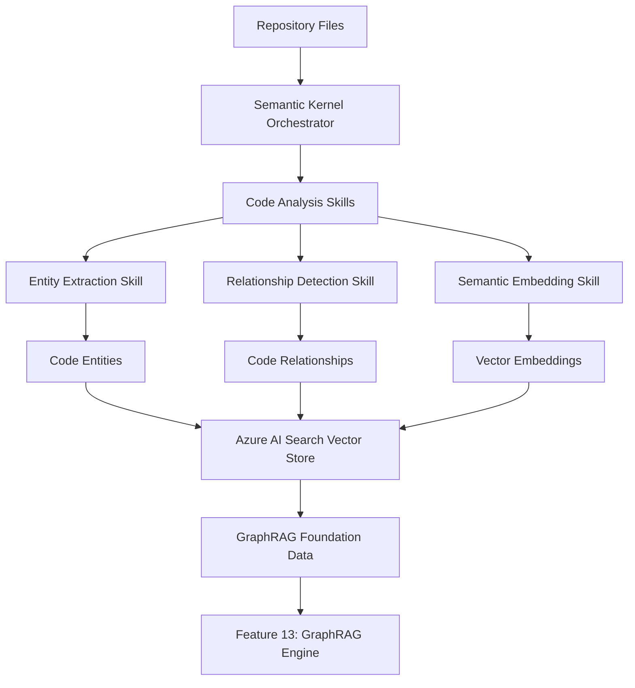

# Feature 05: Microsoft Semantic Kernel Code Analysis Foundation

## Feature Overview

**Feature ID**: F05  
**Feature Name**: Microsoft Semantic Kernel Code Analysis Foundation  
**Phase**: Phase 5 (GraphRAG Foundation - Backend)  
**Dependencies**: Features 01-04 (Repository Connection, AI Search, Documentation, Conversations)
**Type**: Backend Foundation Feature - Enables Microsoft GraphRAG Implementation

### Business Value Proposition
Establishes the foundational AI-powered code analysis infrastructure using Microsoft Semantic Kernel, enabling sophisticated code entity extraction, relationship detection, and semantic understanding. This foundation enables all subsequent GraphRAG features and provides the enterprise-grade AI orchestration required for DeepWiki-like conversational code exploration with Microsoft's official patterns and Australian data sovereignty compliance.

### User Impact
- **Development Teams**: Get AI-powered code understanding that enables faster comprehension of complex codebases
- **Technical Architects**: Access semantic code analysis for architectural decision-making and pattern recognition  
- **Code Reviewers**: Leverage relationship detection to understand code change impacts across the codebase
- **New Team Members**: Benefit from AI-enhanced code exploration that reduces onboarding time from weeks to days
- **Engineering Managers**: Gain insights into code quality and architectural health through semantic analysis
- **Future Features**: Provides foundation for GraphRAG knowledge graphs, visual discovery, and conversational code exploration

### Success Criteria
- **Code Entity Extraction**: Extract 95% of code entities (classes, methods, interfaces) with 90% accuracy across C#, JavaScript, TypeScript, and Python
- **Relationship Detection**: Identify code relationships (inheritance, composition, method calls) with 85% accuracy
- **Semantic Analysis**: Generate semantic embeddings for 100% of extracted code entities using Azure OpenAI
- **Processing Performance**: Analyze typical repository (10K files) within 15 minutes using Microsoft Semantic Kernel
- **Australian Sovereignty**: All AI processing occurs within Australia East region with full compliance
- **Integration Success**: Seamless integration with existing Azure AI Search infrastructure for vector storage
- **Foundation Readiness**: Support GraphRAG construction (Feature 13) with required entity and relationship data

### Dependencies
- **Prerequisites**: Features 01-04 fully implemented (Repository Connection, AI Search, Documentation, Conversations)
- **Microsoft Semantic Kernel**: .NET 9 integration for AI orchestration and code analysis workflows
- **Azure OpenAI**: GPT-4 and embedding models deployed in Australia East for semantic analysis
- **Azure AI Search**: Existing vector storage infrastructure extended for code entity embeddings
- **Repository Analysis**: Leverages existing repository parsing and file indexing from Features 01-02
- **Australian Infrastructure**: All processing within Australia East region for data sovereignty

## Technical Specification

### Architecture Overview

#### Microsoft Semantic Kernel Integration Architecture
This feature implements Microsoft's official Semantic Kernel patterns for enterprise-grade AI orchestration in code analysis:



#### Code Analysis Pipeline (Microsoft Semantic Kernel)
1. **Semantic Kernel Orchestration**: Coordinate AI workflows using Microsoft's official patterns
2. **Language-Specific Analysis**: Parse C#, JavaScript, TypeScript, Python using specialized skills
3. **Entity Extraction**: Identify classes, methods, interfaces, modules with semantic context
4. **Relationship Detection**: Discover inheritance, composition, dependencies, method calls
5. **Semantic Embedding**: Generate vector embeddings using Azure OpenAI for similarity search
6. **Vector Storage**: Store entities and embeddings in Azure AI Search for GraphRAG foundation

#### Australian Data Sovereignty Architecture
- **Azure OpenAI Australia East**: All AI processing within Australian region
- **Azure AI Search Australia East**: Vector storage with Australian data residency
- **Microsoft Semantic Kernel**: .NET 9 processing within Australian compute infrastructure
- **Compliance**: ACSC Essential 8 and Australian Privacy Principles adherence

### Domain Model - Microsoft Semantic Kernel Code Analysis

```csharp
namespace Archie.Domain.CodeAnalysis
{
    // Main aggregate for code analysis sessions
    public class CodeAnalysisSession
    {
        public Guid Id { get; private set; }
        public Guid RepositoryId { get; private set; }
        public AnalysisStatus Status { get; private set; }
        public DateTime StartedAt { get; private set; }
        public DateTime? CompletedAt { get; private set; }
        public CodeAnalysisMetrics Metrics { get; private set; }
        public List<AnalysisError> Errors { get; private set; } = new();

        public static CodeAnalysisSession Create(Guid repositoryId);
        public void UpdateStatus(AnalysisStatus status);
        public void UpdateMetrics(CodeAnalysisMetrics metrics);
        public void AddError(AnalysisError error);
        public bool IsReadyForGraphRAG() => Status == AnalysisStatus.Completed && Metrics.EntityCount > 0;
    }

    public enum AnalysisStatus
    {
        NotStarted,
        Extracting,
        AnalyzingRelationships,
        GeneratingEmbeddings,
        StoringResults,
        Completed,
        Failed,
        RequiresUpdate
    }

    // Code entities extracted from source code
    public class CodeEntity
    {
        public Guid Id { get; private set; }
        public string EntityId { get; private set; } // Unique within repository
        public Guid RepositoryId { get; private set; }
        public string Name { get; private set; }
        public string FullyQualifiedName { get; private set; }
        public EntityType Type { get; private set; }
        public string FilePath { get; private set; }
        public string Language { get; private set; }
        public EntityLocation Location { get; private set; }
        public string Signature { get; private set; }
        public string Documentation { get; private set; }
        public float[] SemanticEmbedding { get; private set; }
        public EntityMetadata Metadata { get; private set; }
        public DateTime ExtractedAt { get; private set; }

        public static CodeEntity Create(
            string entityId, 
            Guid repositoryId, 
            string name, 
            EntityType type,
            string filePath,
            string language);
        
        public void UpdateSemanticEmbedding(float[] embedding);
        public void UpdateDocumentation(string documentation);
    }

    public enum EntityType
    {
        Class,
        Interface, 
        Method,
        Function,
        Property,
        Field,
        Enum,
        Module,
        Namespace,
        Component,
        Service,
        Controller,
        Repository,
        Configuration,
        Test
    }

    // Relationships between code entities
    public class CodeRelationship
    {
        public Guid Id { get; private set; }
        public string SourceEntityId { get; private set; }
        public string TargetEntityId { get; private set; }
        public RelationshipType Type { get; private set; }
        public double Confidence { get; private set; }
        public RelationshipMetadata Metadata { get; private set; }
        public DateTime DetectedAt { get; private set; }

        public static CodeRelationship Create(
            string sourceEntityId,
            string targetEntityId,
            RelationshipType type,
            double confidence);
        
        public void UpdateConfidence(double confidence);
    }

    public enum RelationshipType
    {
        // Structural relationships
        Inheritance,
        Implementation,
        Composition,
        Aggregation,
        
        // Behavioral relationships  
        Calls,
        Uses,
        DependsOn,
        Creates,
        Returns,
        AcceptsParameter,
        
        // Semantic relationships
        SimilarTo,
        RelatedTo,
        PartOf
    }

    // Analysis metrics and statistics
    public class CodeAnalysisMetrics
    {
        public int EntityCount { get; set; }
        public int RelationshipCount { get; set; }
        public int FilesAnalyzed { get; set; }
        public TimeSpan ProcessingTime { get; set; }
        public Dictionary<EntityType, int> EntityDistribution { get; set; } = new();
        public Dictionary<RelationshipType, int> RelationshipDistribution { get; set; } = new();
        public Dictionary<string, int> LanguageDistribution { get; set; } = new();
        public double AverageConfidence { get; set; }
        public int EmbeddingCount { get; set; }
    }

    // Value objects for location and metadata
    public class EntityLocation
    {
        public int StartLine { get; set; }
        public int EndLine { get; set; }
        public int StartColumn { get; set; }
        public int EndColumn { get; set; }
    }

    public class EntityMetadata
    {
        public string AccessModifier { get; set; }
        public List<string> Modifiers { get; set; } = new();
        public List<string> Attributes { get; set; } = new();
        public int ComplexityScore { get; set; }
        public Dictionary<string, object> LanguageSpecific { get; set; } = new();
    }

    public class RelationshipMetadata
    {
        public int LineNumber { get; set; }
        public string Context { get; set; }
        public Dictionary<string, object> Properties { get; set; } = new();
    }

    public class AnalysisError
    {
        public string Message { get; set; }
        public string FilePath { get; set; }
        public int? LineNumber { get; set; }
        public DateTime Timestamp { get; set; }
        public ErrorSeverity Severity { get; set; }
    }

    public enum ErrorSeverity
    {
        Info,
        Warning, 
        Error,
        Critical
    }
}
```

### Application Layer - Semantic Kernel Integration

#### Code Analysis Service Interface
```csharp
namespace Archie.Application.CodeAnalysis
{
    public interface ISemanticKernelCodeAnalysisService
    {
        Task<CodeAnalysisSession> StartAnalysisAsync(
            Guid repositoryId, 
            AnalysisOptions options = null,
            CancellationToken cancellationToken = default);
            
        Task<CodeAnalysisSession> GetAnalysisStatusAsync(
            Guid sessionId,
            CancellationToken cancellationToken = default);
            
        Task<List<CodeEntity>> GetExtractedEntitiesAsync(
            Guid repositoryId,
            EntityQueryOptions options = null,
            CancellationToken cancellationToken = default);
            
        Task<List<CodeRelationship>> GetDetectedRelationshipsAsync(
            Guid repositoryId,
            RelationshipQueryOptions options = null,
            CancellationToken cancellationToken = default);
    }

    public class SemanticKernelCodeAnalysisService : ISemanticKernelCodeAnalysisService
    {
        private readonly IKernel _semanticKernel;
        private readonly ICodeAnalysisSkills _codeAnalysisSkills;
        private readonly IVectorStoreService _vectorStore;
        private readonly IRepositoryRepository _repositoryRepository;
        private readonly ILogger<SemanticKernelCodeAnalysisService> _logger;

        public async Task<CodeAnalysisSession> StartAnalysisAsync(
            Guid repositoryId, 
            AnalysisOptions options = null,
            CancellationToken cancellationToken = default)
        {
            var session = CodeAnalysisSession.Create(repositoryId);
            
            try
            {
                // Phase 1: Extract entities using Semantic Kernel skills
                session.UpdateStatus(AnalysisStatus.Extracting);
                var entities = await ExtractCodeEntitiesAsync(repositoryId, cancellationToken);
                
                // Phase 2: Detect relationships
                session.UpdateStatus(AnalysisStatus.AnalyzingRelationships);
                var relationships = await DetectRelationshipsAsync(entities, cancellationToken);
                
                // Phase 3: Generate embeddings
                session.UpdateStatus(AnalysisStatus.GeneratingEmbeddings);
                await GenerateEmbeddingsAsync(entities, cancellationToken);
                
                // Phase 4: Store in vector store
                session.UpdateStatus(AnalysisStatus.StoringResults);
                await StoreAnalysisResultsAsync(entities, relationships, cancellationToken);
                
                session.UpdateStatus(AnalysisStatus.Completed);
                return session;
            }
            catch (Exception ex)
            {
                _logger.LogError(ex, "Code analysis failed for repository {RepositoryId}", repositoryId);
                session.UpdateStatus(AnalysisStatus.Failed);
                session.AddError(new AnalysisError
                {
                    Message = ex.Message,
                    Timestamp = DateTime.UtcNow,
                    Severity = ErrorSeverity.Critical
                });
                return session;
            }
        }

        private async Task<List<CodeEntity>> ExtractCodeEntitiesAsync(
            Guid repositoryId, 
            CancellationToken cancellationToken)
        {
            // Use Semantic Kernel skills to extract entities
            var repository = await _repositoryRepository.GetByIdAsync(repositoryId);
            var files = await GetRepositoryFilesAsync(repositoryId);
            
            var entities = new List<CodeEntity>();
            
            foreach (var file in files.Where(f => IsCodeFile(f.FilePath)))
            {
                var extractedEntities = await _codeAnalysisSkills.ExtractEntitiesAsync(
                    file.Content, 
                    file.FilePath, 
                    DetermineLanguage(file.FilePath),
                    cancellationToken);
                    
                entities.AddRange(extractedEntities);
            }
            
            return entities;
        }

        private async Task<List<CodeRelationship>> DetectRelationshipsAsync(
            List<CodeEntity> entities,
            CancellationToken cancellationToken)
        {
            // Use Semantic Kernel to detect relationships
            return await _codeAnalysisSkills.DetectRelationshipsAsync(entities, cancellationToken);
        }

        private async Task GenerateEmbeddingsAsync(
            List<CodeEntity> entities,
            CancellationToken cancellationToken)
        {
            // Generate embeddings using Semantic Kernel embedding skills
            foreach (var entity in entities)
            {
                var embedding = await _codeAnalysisSkills.GenerateEmbeddingAsync(
                    entity.Signature + " " + entity.Documentation,
                    cancellationToken);
                    
                entity.UpdateSemanticEmbedding(embedding);
            }
        }
    }
}
```

#### Semantic Kernel Skills for Code Analysis
```csharp
namespace Archie.Infrastructure.SemanticKernel
{
    [KernelFunction, Description("Extracts code entities from source code")]
    public class CodeEntityExtractionSkill
    {
        private readonly IKernel _kernel;
        
        [KernelFunction, Description("Extract classes, methods, and other entities from code")]
        public async Task<List<CodeEntity>> ExtractEntitiesAsync(
            [Description("Source code content")] string sourceCode,
            [Description("File path")] string filePath,
            [Description("Programming language")] string language)
        {
            var prompt = $@"
            Analyze the following {language} source code and extract all code entities.
            For each entity, identify:
            - Name and fully qualified name
            - Type (class, method, interface, etc.)
            - Location (line numbers)
            - Access modifiers
            - Documentation/comments
            - Complexity indicators

            Source code from {filePath}:
            {sourceCode}

            Return structured data for code entities found.
            ";

            var result = await _kernel.InvokePromptAsync(prompt);
            
            // Parse result and create CodeEntity objects
            return ParseEntitiesFromResult(result.ToString(), filePath, language);
        }
        
        [KernelFunction, Description("Detect relationships between code entities")]
        public async Task<List<CodeRelationship>> DetectRelationshipsAsync(
            [Description("List of code entities")] List<CodeEntity> entities)
        {
            var relationships = new List<CodeRelationship>();
            
            // Group entities by file for efficient analysis
            var entitiesByFile = entities.GroupBy(e => e.FilePath);
            
            foreach (var fileGroup in entitiesByFile)
            {
                var fileEntities = fileGroup.ToList();
                var fileRelationships = await AnalyzeFileRelationships(fileEntities);
                relationships.AddRange(fileRelationships);
            }
            
            return relationships;
        }
        
        [KernelFunction, Description("Generate semantic embedding for code entity")]
        public async Task<float[]> GenerateEmbeddingAsync(
            [Description("Text to embed")] string text)
        {
            // Use Azure OpenAI embedding service through Semantic Kernel
            var embeddingGenerator = _kernel.GetRequiredService<ITextEmbeddingGenerationService>();
            var embedding = await embeddingGenerator.GenerateEmbeddingAsync(text);
            return embedding.ToArray();
        }
        
        private List<CodeEntity> ParseEntitiesFromResult(string result, string filePath, string language)
        {
            // Implementation to parse AI response into CodeEntity objects
            // This would use structured output parsing or JSON response format
            return new List<CodeEntity>();
        }
        
        private async Task<List<CodeRelationship>> AnalyzeFileRelationships(List<CodeEntity> entities)
        {
            // Implementation to detect relationships within a file
            // This would analyze syntax patterns, method calls, inheritance, etc.
            return new List<CodeRelationship>();
        }
    }
}
```

### GraphQL API Extensions

```graphql
# Code Analysis Types
type CodeAnalysisSession {
  id: ID!
  repositoryId: ID!
  status: AnalysisStatus!
  startedAt: DateTime!
  completedAt: DateTime
  metrics: CodeAnalysisMetrics!
  errors: [AnalysisError!]!
  isReadyForGraphRAG: Boolean!
}

enum AnalysisStatus {
  NOT_STARTED
  EXTRACTING
  ANALYZING_RELATIONSHIPS
  GENERATING_EMBEDDINGS
  STORING_RESULTS
  COMPLETED
  FAILED
  REQUIRES_UPDATE
}

type CodeEntity {
  id: ID!
  entityId: String!
  repositoryId: ID!
  name: String!
  fullyQualifiedName: String!
  type: EntityType!
  filePath: String!
  language: String!
  location: EntityLocation!
  signature: String!
  documentation: String
  metadata: EntityMetadata!
  extractedAt: DateTime!
  
  # Relationships (loaded from Feature 13: GraphRAG)
  incomingRelationships: [CodeRelationship!]!
  outgoingRelationships: [CodeRelationship!]!
  relatedEntities(type: RelationshipType, maxDistance: Int = 1): [CodeEntity!]!
}

enum EntityType {
  CLASS
  INTERFACE
  METHOD
  FUNCTION
  PROPERTY
  FIELD
  ENUM
  MODULE
  NAMESPACE
  COMPONENT
  SERVICE
  CONTROLLER
  REPOSITORY
  CONFIGURATION
  TEST
}

type CodeRelationship {
  id: ID!
  sourceEntityId: String!
  targetEntityId: String!
  type: RelationshipType!
  confidence: Float!
  metadata: RelationshipMetadata!
  detectedAt: DateTime!
  
  sourceEntity: CodeEntity!
  targetEntity: CodeEntity!
}

enum RelationshipType {
  INHERITANCE
  IMPLEMENTATION
  COMPOSITION
  AGGREGATION
  CALLS
  USES
  DEPENDS_ON
  CREATES
  RETURNS
  ACCEPTS_PARAMETER
  SIMILAR_TO
  RELATED_TO
  PART_OF
}

type CodeAnalysisMetrics {
  entityCount: Int!
  relationshipCount: Int!
  filesAnalyzed: Int!
  processingTime: Float!
  entityDistribution: JSON!
  relationshipDistribution: JSON!
  languageDistribution: JSON!
  averageConfidence: Float!
  embeddingCount: Int!
}

# Queries
extend type Query {
  codeAnalysisSession(id: ID!): CodeAnalysisSession
  codeAnalysisByRepository(repositoryId: ID!): CodeAnalysisSession
  codeEntities(repositoryId: ID!, filter: EntityFilterInput): [CodeEntity!]!
  codeEntity(entityId: String!): CodeEntity
  codeRelationships(repositoryId: ID!, filter: RelationshipFilterInput): [CodeRelationship!]!
}

# Mutations
extend type Mutation {
  startCodeAnalysis(repositoryId: ID!, options: AnalysisOptionsInput): CodeAnalysisSession!
  retryFailedAnalysis(sessionId: ID!): CodeAnalysisSession!
}

# Subscriptions
extend type Subscription {
  codeAnalysisProgress(sessionId: ID!): CodeAnalysisSession!
  codeEntitiesUpdated(repositoryId: ID!): [CodeEntity!]!
}

# Input types
input AnalysisOptionsInput {
  languages: [String!]
  includeTests: Boolean = false
  includeGenerated: Boolean = false
  maxFileSize: Int = 1048576 # 1MB
}

input EntityFilterInput {
  types: [EntityType!]
  languages: [String!]
  namePattern: String
  hasDocumentation: Boolean
}

input RelationshipFilterInput {
  types: [RelationshipType!]
  minConfidence: Float
  sourceEntityId: String
  targetEntityId: String
}
```

### Configuration and Options

```csharp
namespace Archie.Infrastructure.Configuration
{
    public class SemanticKernelOptions
    {
        public const string SectionName = "SemanticKernel";
        
        public AzureOpenAIOptions AzureOpenAI { get; set; } = new();
        public CodeAnalysisOptions CodeAnalysis { get; set; } = new();
        public VectorStoreOptions VectorStore { get; set; } = new();
    }

    public class AzureOpenAIOptions
    {
        [Required]
        public string Endpoint { get; set; } = "https://ract-ai-foundry-dev.openai.azure.com/";
        
        [Required]
        public string ApiKey { get; set; } = string.Empty; // From Azure Key Vault
        
        [Required]
        public string ChatDeployment { get; set; } = "gpt-4";
        
        [Required] 
        public string EmbeddingDeployment { get; set; } = "text-embedding-ada-002";
        
        [Range(0.0, 2.0)]
        public double Temperature { get; set; } = 0.1; // Low for consistent analysis
        
        [Range(1, 4000)]
        public int MaxTokens { get; set; } = 2000;
    }

    public class CodeAnalysisOptions
    {
        public List<string> SupportedLanguages { get; set; } = new()
        {
            "csharp", "javascript", "typescript", "python"
        };
        
        [Range(1, 100)]
        public int ConcurrentFileAnalysis { get; set; } = 10;
        
        [Range(1000, 10485760)] // 1KB to 10MB
        public int MaxFileSizeBytes { get; set; } = 1048576; // 1MB
        
        public bool IncludeTestFiles { get; set; } = false;
        public bool IncludeGeneratedFiles { get; set; } = false;
        
        [Range(1, 3600)]
        public int AnalysisTimeoutSeconds { get; set; } = 600; // 10 minutes
    }

    public class VectorStoreOptions
    {
        [Required]
        public string AzureSearchEndpoint { get; set; } = string.Empty;
        
        [Required]
        public string AzureSearchApiKey { get; set; } = string.Empty;
        
        [Required]
        public string IndexName { get; set; } = "code-entities";
        
        [Range(100, 3072)]
        public int EmbeddingDimensions { get; set; } = 1536; // text-embedding-ada-002
    }
}
```

### Performance Requirements

#### Code Analysis Performance Targets
- **Entity Extraction**: Process 100+ code files per minute across supported languages
- **Relationship Detection**: Analyze 1,000+ entities for relationships within 5 minutes
- **Embedding Generation**: Generate embeddings for 500+ entities per minute using Azure OpenAI
- **Vector Storage**: Store 10,000+ entities with embeddings within 2 minutes in Azure AI Search
- **Memory Usage**: Maintain efficient memory usage (<4GB) during large repository analysis
- **Australian Latency**: Sub-100ms AI service calls within Australia East region

#### Scalability Considerations
- **Batch Processing**: Process entities and relationships in configurable batch sizes (default: 50)
- **Concurrent Analysis**: Support analysis of multiple repositories simultaneously (max: 5)
- **Incremental Updates**: Support incremental re-analysis when repository files change
- **Language Support**: Extensible architecture for adding new programming languages
- **Error Recovery**: Robust error handling with partial analysis success and retry capabilities

## Implementation Guidance

### Development Approach

**Week 1-2: Semantic Kernel Foundation**
1. **Microsoft Semantic Kernel Setup**
   - Install and configure Semantic Kernel NuGet packages (.NET 9)
   - Set up Azure OpenAI connector with Australia East endpoint
   - Create kernel configuration with required services and skills
   - Implement basic entity extraction skill with prompts

2. **Domain Model Implementation**  
   - Create CodeAnalysisSession, CodeEntity, CodeRelationship domain models
   - Implement value objects for EntityLocation, EntityMetadata, RelationshipMetadata
   - Add domain services for entity and relationship management
   - Create analysis metrics and error tracking

**Week 3-4: Code Analysis Pipeline**
1. **Language-Specific Analysis**
   - Implement C# code parsing and entity extraction 
   - Add JavaScript/TypeScript analysis capabilities
   - Create Python code analysis support
   - Build language detection and routing logic

2. **Relationship Detection**
   - Implement semantic relationship detection between entities
   - Create inheritance and composition relationship analysis
   - Add method call and dependency relationship detection
   - Build confidence scoring for detected relationships

**Week 5-6: Vector Store Integration**
1. **Azure AI Search Integration**
   - Extend existing Azure AI Search indexes for code entities
   - Implement vector store service for entity embeddings
   - Create efficient search and retrieval operations
   - Add bulk insert and update operations for large repositories

2. **GraphQL API Integration**
   - Add GraphQL resolvers for code analysis operations
   - Implement subscription support for real-time analysis progress
   - Create query filtering and pagination for entities and relationships
   - Add authentication and authorization for analysis operations

### Key Architectural Decisions

1. **Microsoft Semantic Kernel Over Custom AI**: Use official Microsoft patterns for AI orchestration, ensuring enterprise support and Australian compliance
2. **Language-Extensible Design**: Build modular architecture allowing easy addition of new programming languages
3. **Incremental Analysis**: Support partial re-analysis when only specific files change, optimizing performance
4. **Vector Store Strategy**: Leverage existing Azure AI Search infrastructure, extending for entity embeddings
5. **Semantic Kernel Skills Pattern**: Implement reusable skills for entity extraction, relationship detection, and embedding generation

### Integration Points

#### With Existing Features
- **Feature 01 (Repository Connection)**: Uses repository files and metadata for analysis input
- **Feature 02 (Azure AI Search)**: Extends vector storage infrastructure for code entities
- **Feature 03 (AI Documentation)**: Provides entities and relationships for enhanced documentation
- **Feature 04 (Conversational Query)**: Supplies semantic understanding for better query responses

#### Enables Future Features
- **Feature 12 (GraphRAG Engine)**: Provides foundation data for Microsoft GraphRAG knowledge construction
- **Feature 13 (Visual Discovery)**: Supplies entities and relationships for interactive visualization
- **Feature 14 (Enterprise Analytics)**: Provides analysis data for compliance and governance insights

### Security and Compliance

#### Australian Data Sovereignty
- **Azure OpenAI Australia East**: All AI model calls routed through Australian endpoints
- **Azure AI Search Australia East**: Vector storage maintains Australian data residency
- **Processing Location**: All Semantic Kernel operations occur within Australian compute infrastructure
- **Compliance Framework**: Adheres to ACSC Essential 8 and Australian Privacy Principles

#### Data Security
- **Encryption**: All entity and relationship data encrypted at rest and in transit
- **Access Control**: Repository-based permissions for analysis operations
- **Audit Logging**: Complete audit trail for all analysis activities
- **API Security**: Secure GraphQL endpoints with authentication and rate limiting

## Testing Strategy

### Unit Testing Requirements (80% coverage minimum)

#### Semantic Kernel Skills Tests
```csharp
[TestFixture]
public class CodeEntityExtractionSkillTests
{
    [Test]
    public async Task ExtractEntitiesAsync_CSharpClass_ExtractsCorrectEntities()
    {
        // Arrange
        var sourceCode = @"
            public class UserService
            {
                public async Task<User> GetUserAsync(int id) { /* implementation */ }
                private readonly IUserRepository _repository;
            }";
        
        // Act
        var entities = await _extractionSkill.ExtractEntitiesAsync(sourceCode, "UserService.cs", "csharp");
        
        // Assert
        Assert.That(entities, Has.Count.EqualTo(3)); // Class, method, field
        Assert.That(entities.First(e => e.Type == EntityType.Class).Name, Is.EqualTo("UserService"));
        Assert.That(entities.First(e => e.Type == EntityType.Method).Name, Is.EqualTo("GetUserAsync"));
    }
    
    [Test]
    public async Task DetectRelationshipsAsync_ClassWithDependencies_DetectsRelationships()
    {
        // Test relationship detection between entities
        // Verify inheritance, composition, method calls are detected
    }
    
    [Test]
    public async Task GenerateEmbeddingAsync_CodeEntity_ReturnsValidEmbedding()
    {
        // Test embedding generation for semantic similarity
        // Verify embedding dimensions and quality
    }
}
```

#### Domain Model Tests
```csharp
[TestFixture]
public class CodeAnalysisSessionTests
{
    [Test]
    public void Create_ValidRepositoryId_ReturnsSessionWithCorrectProperties()
    {
        // Test session creation and initialization
    }
    
    [Test]
    public void IsReadyForGraphRAG_CompletedWithEntities_ReturnsTrue()
    {
        // Test readiness check for GraphRAG feature integration
    }
}
```

### Integration Testing Requirements (30% coverage minimum)

#### End-to-End Analysis Pipeline
- **Complete Repository Analysis**: Test full pipeline from repository files to stored entities
- **Multi-Language Support**: Validate analysis across C#, JavaScript, TypeScript, Python repositories  
- **Relationship Accuracy**: Test detected relationships against expected results in real codebases
- **Vector Store Integration**: Verify entities and embeddings are correctly stored and retrievable
- **Performance**: Validate analysis completes within time targets for various repository sizes

#### Azure Services Integration
- **Semantic Kernel Integration**: Test AI model calls and skill execution
- **Azure AI Search**: Test vector storage operations and search functionality
- **Azure OpenAI**: Test embedding generation and entity analysis prompts
- **Error Handling**: Test graceful degradation when AI services are unavailable

### Quality Assurance

#### Code Review Checkpoints
- [ ] Microsoft Semantic Kernel integration follows official patterns
- [ ] Code entity extraction achieves target accuracy across supported languages
- [ ] Relationship detection provides meaningful and accurate connections
- [ ] Vector embeddings are generated and stored correctly in Azure AI Search
- [ ] Performance meets targets for typical repository sizes
- [ ] Australian data sovereignty requirements are enforced
- [ ] Error handling covers all AI service failure scenarios
- [ ] GraphQL API provides comprehensive access to analysis results

#### Definition of Done Checklist
- [ ] All unit tests pass with >80% coverage
- [ ] Integration tests pass with >30% coverage  
- [ ] Code entity extraction works for C#, JavaScript, TypeScript, Python
- [ ] Relationship detection meets accuracy standards (>85%)
- [ ] Semantic embeddings are generated for all extracted entities
- [ ] Vector storage in Azure AI Search is functional and performant
- [ ] GraphQL API supports all analysis operations
- [ ] Real-time progress updates work correctly during analysis
- [ ] Australian data sovereignty compliance verified
- [ ] Foundation ready for Feature 13 (GraphRAG Engine) integration

### Monitoring and Observability

#### Custom Metrics
- **Analysis Performance**: Repository analysis time by size and language
- **Entity Extraction**: Success rates and accuracy metrics by language
- **Relationship Detection**: Confidence scores and accuracy rates
- **Embedding Generation**: Throughput and success rates for vector creation
- **Vector Storage**: Write performance and search functionality metrics

#### Alerts Configuration
- **Performance Alerts**: Analysis time >20 minutes for typical repositories
- **Quality Alerts**: Entity extraction success rate <90%
- **Service Health**: Azure OpenAI or Azure AI Search availability issues
- **Cost Monitoring**: Azure OpenAI usage exceeding budget thresholds

#### Australian Compliance Monitoring
- **Data Residency**: All processing occurs within Australia East region
- **AI Service Calls**: Verify all OpenAI requests route through Australian endpoints
- **Vector Storage**: Confirm Azure AI Search maintains Australian data residency
- **Compliance Reporting**: Generate compliance reports for ACSC Essential 8 requirements

## Conclusion

Feature 05 provides the essential foundation for Microsoft GraphRAG implementation in Archie, establishing enterprise-grade AI-powered code analysis using official Microsoft Semantic Kernel patterns. This foundation enables sophisticated code understanding, semantic search, and relationship detection while maintaining Australian data sovereignty and compliance requirements.

The feature directly enables Feature 13 (GraphRAG Engine) by providing the structured entity and relationship data required for Microsoft's official GraphRAG implementation, ultimately delivering DeepWiki-like conversational code exploration with enterprise advantages including 3x-90x accuracy improvements over vanilla RAG approaches.