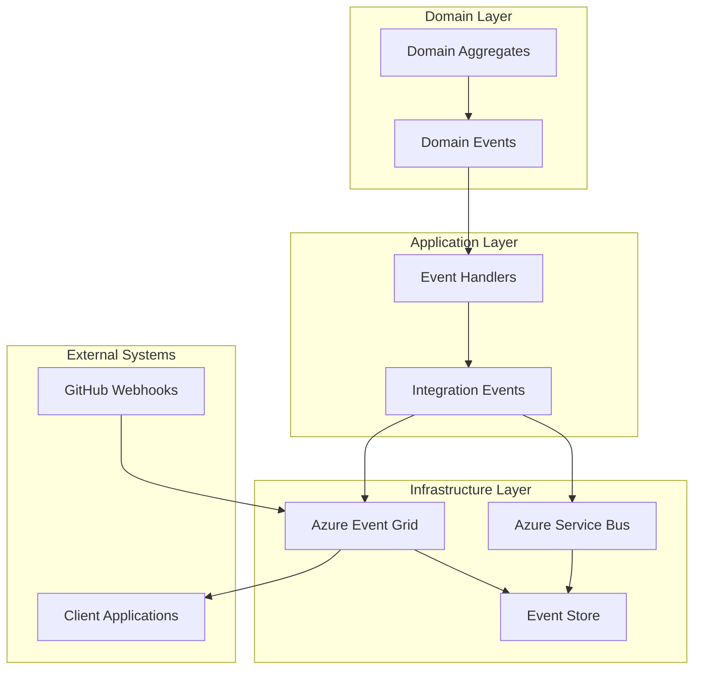

# Feature 06: Event-Driven Infrastructure Foundation

## Feature Overview

**Feature ID**: F06  
**Feature Name**: Event-Driven Infrastructure Foundation  
**Implementation Strategy**: Cross-Phase Foundation (Phases 1-9)  
**Deployment**: Early foundation with incremental enhancement across iterative phases
**Backend + Frontend**: Complete infrastructure with real-time UI components

### Business Value Proposition
Establishes the foundational event-driven architecture that enables real-time updates, system decoupling, and reliable processing across all Archie features in the iterative development approach. This infrastructure provides the event backbone from Phase 1 through Phase 9, supporting features like real-time repository updates, live user interfaces, system monitoring, and cross-feature communication while ensuring scalability and reliability throughout the iterative delivery process.

### User Impact
- **Phase 1-2**: Real-time repository indexing progress and search result updates
- **Phase 3-4**: Live documentation generation status and conversation response streaming
- **Phase 5**: Real-time knowledge graph construction and relationship discovery notifications
- **Phase 6**: Live user activity feeds, dashboard updates, and collaborative workspace synchronization
- **Phase 7-9**: System health monitoring, performance alerts, deployment notifications, and security event tracking
- **Cross-Phase**: Seamless, responsive user experience with immediate feedback for all operations

### Success Criteria
- **Foundation Performance**: Process events with <200ms latency across all iterative phases
- **Scalability Growth**: Support event volume from Phase 1 (hundreds/hour) to Phase 9 (thousands/minute)
- **Reliability**: >99.9% event delivery reliability with automatic retry and error handling
- **Real-time UX**: Live UI updates appear within 500ms for all user-facing operations
- **Iterative Integration**: Seamless event integration as each feature (01-12) is implemented
- **Cross-Phase Consistency**: Maintain event ordering and consistency across feature boundaries
- **Infrastructure Efficiency**: Event processing overhead remains <5% of total system resources

### Dependencies
- **Phase 1-2 Foundation**: Immediate integration with Features 01-02 (repositories, search)
- **Phase 3-4 Integration**: Event support for Features 03-04 (documentation, conversations)
- **Phase 5-6 Enhancement**: Advanced events for Features 05-06 (knowledge graph, user analytics)
- **Phase 7-9 Completion**: Full infrastructure events for Features 07-11 (DevOps, security, monitoring)
- **Azure Services**: Service Bus (reliable messaging), SignalR (real-time UI), Event Grid (system events)
- **Frontend Stack**: React with hooks for real-time data, WebSocket management, notification components

## Technical Specification

### Architecture Overview

#### Event-Driven System Design
The event-driven architecture operates through multiple layers of event processing:

1. **Domain Events**: Business events generated from domain aggregates
2. **Integration Events**: Cross-bounded context communication events
3. **System Events**: Infrastructure and operational events
4. **External Events**: Events from external systems (GitHub webhooks, etc.)
5. **Event Processing**: Reliable processing with retry and error handling
6. **Event Storage**: Event sourcing for audit trails and replay capabilities

#### Event Flow Architecture



### Domain Model Extensions

```csharp
// Base Event Infrastructure
public abstract class DomainEvent
{
    public Guid Id { get; protected set; } = Guid.NewGuid();
    public DateTime OccurredAt { get; protected set; } = DateTime.UtcNow;
    public string EventType { get; protected set; }
    public int Version { get; protected set; } = 1;
    public Dictionary<string, object> Metadata { get; protected set; } = new();
    public Guid? CorrelationId { get; protected set; }
    public Guid? CausationId { get; protected set; }

    protected DomainEvent(string eventType, Guid? correlationId = null, Guid? causationId = null)
    {
        EventType = eventType;
        CorrelationId = correlationId ?? Guid.NewGuid();
        CausationId = causationId;
    }
}

public abstract class IntegrationEvent : DomainEvent
{
    public string Source { get; protected set; }
    public string Subject { get; protected set; }
    public EventPriority Priority { get; protected set; }

    protected IntegrationEvent(string eventType, string source, string subject, 
        EventPriority priority = EventPriority.Normal) : base(eventType)
    {
        Source = source;
        Subject = subject;
        Priority = priority;
    }
}

public enum EventPriority
{
    Low = 0,
    Normal = 1,
    High = 2,
    Critical = 3
}

// Repository Events
public class RepositoryAddedEvent : IntegrationEvent
{
    public Guid RepositoryId { get; }
    public string RepositoryName { get; }
    public string RepositoryUrl { get; }
    public string Owner { get; }
    public DateTime AddedAt { get; }

    public RepositoryAddedEvent(Guid repositoryId, string repositoryName, string repositoryUrl, string owner)
        : base("repository.added", "Archie.Repository", $"repository/{repositoryId}")
    {
        RepositoryId = repositoryId;
        RepositoryName = repositoryName;
        RepositoryUrl = repositoryUrl;
        Owner = owner;
        AddedAt = DateTime.UtcNow;
    }
}

public class RepositoryAnalysisStartedEvent : IntegrationEvent
{
    public Guid RepositoryId { get; }
    public string AnalysisType { get; }
    public Dictionary<string, object> AnalysisOptions { get; }

    public RepositoryAnalysisStartedEvent(Guid repositoryId, string analysisType, Dictionary<string, object> options)
        : base("repository.analysis.started", "Archie.Repository", $"repository/{repositoryId}/analysis")
    {
        RepositoryId = repositoryId;
        AnalysisType = analysisType;
        AnalysisOptions = options;
    }
}

public class RepositoryAnalysisCompletedEvent : IntegrationEvent
{
    public Guid RepositoryId { get; }
    public string AnalysisType { get; }
    public bool Success { get; }
    public TimeSpan Duration { get; }
    public Dictionary<string, object> Results { get; }
    public string? ErrorMessage { get; }

    public RepositoryAnalysisCompletedEvent(Guid repositoryId, string analysisType, bool success, 
        TimeSpan duration, Dictionary<string, object> results, string? errorMessage = null)
        : base("repository.analysis.completed", "Archie.Repository", $"repository/{repositoryId}/analysis")
    {
        RepositoryId = repositoryId;
        AnalysisType = analysisType;
        Success = success;
        Duration = duration;
        Results = results;
        ErrorMessage = errorMessage;
        Priority = success ? EventPriority.Normal : EventPriority.High;
    }
}

// Search Events
public class DocumentIndexingStartedEvent : IntegrationEvent
{
    public Guid RepositoryId { get; }
    public int DocumentCount { get; }
    public string IndexName { get; }

    public DocumentIndexingStartedEvent(Guid repositoryId, int documentCount, string indexName)
        : base("search.indexing.started", "Archie.Search", $"repository/{repositoryId}/indexing")
    {
        RepositoryId = repositoryId;
        DocumentCount = documentCount;
        IndexName = indexName;
    }
}

public class DocumentIndexingCompletedEvent : IntegrationEvent
{
    public Guid RepositoryId { get; }
    public int IndexedDocuments { get; }
    public int FailedDocuments { get; }
    public TimeSpan Duration { get; }
    public bool Success { get; }

    public DocumentIndexingCompletedEvent(Guid repositoryId, int indexedDocuments, int failedDocuments, 
        TimeSpan duration, bool success)
        : base("search.indexing.completed", "Archie.Search", $"repository/{repositoryId}/indexing")
    {
        RepositoryId = repositoryId;
        IndexedDocuments = indexedDocuments;
        FailedDocuments = failedDocuments;
        Duration = duration;
        Success = success;
        Priority = success && failedDocuments == 0 ? EventPriority.Normal : EventPriority.High;
    }
}

// Documentation Events
public class DocumentationGenerationStartedEvent : IntegrationEvent
{
    public Guid RepositoryId { get; }
    public Guid DocumentationId { get; }
    public List<string> RequestedSections { get; }

    public DocumentationGenerationStartedEvent(Guid repositoryId, Guid documentationId, List<string> requestedSections)
        : base("documentation.generation.started", "Archie.Documentation", $"repository/{repositoryId}/documentation")
    {
        RepositoryId = repositoryId;
        DocumentationId = documentationId;
        RequestedSections = requestedSections;
    }
}

public class DocumentationGenerationCompletedEvent : IntegrationEvent
{
    public Guid RepositoryId { get; }
    public Guid DocumentationId { get; }
    public bool Success { get; }
    public int GeneratedSections { get; }
    public TimeSpan Duration { get; }
    public string? ErrorMessage { get; }

    public DocumentationGenerationCompletedEvent(Guid repositoryId, Guid documentationId, bool success,
        int generatedSections, TimeSpan duration, string? errorMessage = null)
        : base("documentation.generation.completed", "Archie.Documentation", $"repository/{repositoryId}/documentation")
    {
        RepositoryId = repositoryId;
        DocumentationId = documentationId;
        Success = success;
        GeneratedSections = generatedSections;
        Duration = duration;
        ErrorMessage = errorMessage;
        Priority = success ? EventPriority.Normal : EventPriority.High;
    }
}

// Conversation Events
public class ConversationStartedEvent : IntegrationEvent
{
    public Guid ConversationId { get; }
    public Guid UserId { get; }
    public List<Guid> RepositoryIds { get; }
    public string? InitialQuery { get; }

    public ConversationStartedEvent(Guid conversationId, Guid userId, List<Guid> repositoryIds, string? initialQuery)
        : base("conversation.started", "Archie.Conversation", $"conversation/{conversationId}")
    {
        ConversationId = conversationId;
        UserId = userId;
        RepositoryIds = repositoryIds;
        InitialQuery = initialQuery;
    }
}

public class QueryProcessedEvent : IntegrationEvent
{
    public Guid ConversationId { get; }
    public Guid QueryId { get; }
    public string Query { get; }
    public bool Success { get; }
    public TimeSpan ResponseTime { get; }
    public double? Confidence { get; }

    public QueryProcessedEvent(Guid conversationId, Guid queryId, string query, bool success, 
        TimeSpan responseTime, double? confidence = null)
        : base("conversation.query.processed", "Archie.Conversation", $"conversation/{conversationId}/query")
    {
        ConversationId = conversationId;
        QueryId = queryId;
        Query = query;
        Success = success;
        ResponseTime = responseTime;
        Confidence = confidence;
    }
}

// Knowledge Graph Events
public class KnowledgeGraphBuildStartedEvent : IntegrationEvent
{
    public Guid KnowledgeGraphId { get; }
    public List<Guid> RepositoryIds { get; }
    public string AnalysisDepth { get; }

    public KnowledgeGraphBuildStartedEvent(Guid knowledgeGraphId, List<Guid> repositoryIds, string analysisDepth)
        : base("knowledge-graph.build.started", "Archie.KnowledgeGraph", $"graph/{knowledgeGraphId}")
    {
        KnowledgeGraphId = knowledgeGraphId;
        RepositoryIds = repositoryIds;
        AnalysisDepth = analysisDepth;
    }
}

public class KnowledgeGraphBuildCompletedEvent : IntegrationEvent
{
    public Guid KnowledgeGraphId { get; }
    public bool Success { get; }
    public int EntitiesCreated { get; }
    public int RelationshipsDetected { get; }
    public int PatternsFound { get; }
    public TimeSpan Duration { get; }

    public KnowledgeGraphBuildCompletedEvent(Guid knowledgeGraphId, bool success, int entitiesCreated, 
        int relationshipsDetected, int patternsFound, TimeSpan duration)
        : base("knowledge-graph.build.completed", "Archie.KnowledgeGraph", $"graph/{knowledgeGraphId}")
    {
        KnowledgeGraphId = knowledgeGraphId;
        Success = success;
        EntitiesCreated = entitiesCreated;
        RelationshipsDetected = relationshipsDetected;
        PatternsFound = patternsFound;
        Duration = duration;
        Priority = success ? EventPriority.Normal : EventPriority.High;
    }
}

// System Events
public class SystemHealthCheckEvent : IntegrationEvent
{
    public string ServiceName { get; }
    public HealthStatus Status { get; }
    public Dictionary<string, object> Metrics { get; }
    public List<string> Warnings { get; }
    public List<string> Errors { get; }

    public SystemHealthCheckEvent(string serviceName, HealthStatus status, 
        Dictionary<string, object> metrics, List<string> warnings, List<string> errors)
        : base("system.health.check", "Archie.System", $"service/{serviceName}")
    {
        ServiceName = serviceName;
        Status = status;
        Metrics = metrics;
        Warnings = warnings;
        Errors = errors;
        Priority = status == HealthStatus.Healthy ? EventPriority.Low : EventPriority.High;
    }
}

public enum HealthStatus
{
    Healthy,
    Degraded,
    Unhealthy
}

// Event Handling Infrastructure
public interface IEventHandler<in TEvent> where TEvent : DomainEvent
{
    Task HandleAsync(TEvent domainEvent, CancellationToken cancellationToken = default);
}

public interface IEventDispatcher
{
    Task DispatchAsync<TEvent>(TEvent domainEvent, CancellationToken cancellationToken = default) where TEvent : DomainEvent;
    Task DispatchAsync(IEnumerable<DomainEvent> domainEvents, CancellationToken cancellationToken = default);
}

public interface IEventStore
{
    Task<bool> SaveEventsAsync(string streamId, IEnumerable<DomainEvent> events, int expectedVersion = -1, CancellationToken cancellationToken = default);
    Task<List<DomainEvent>> GetEventsAsync(string streamId, int fromVersion = 0, CancellationToken cancellationToken = default);
    Task<List<DomainEvent>> GetEventsByTypeAsync(string eventType, DateTime? from = null, DateTime? to = null, CancellationToken cancellationToken = default);
    Task<bool> EventExistsAsync(Guid eventId, CancellationToken cancellationToken = default);
}

// Event Processing Status
public class EventProcessingStatus
{
    public Guid EventId { get; set; }
    public string EventType { get; set; }
    public ProcessingStatus Status { get; set; }
    public DateTime ProcessedAt { get; set; }
    public int AttemptCount { get; set; }
    public string? ErrorMessage { get; set; }
    public DateTime? NextRetryAt { get; set; }
}

public enum ProcessingStatus
{
    Pending,
    Processing,
    Completed,
    Failed,
    DeadLetter
}
```

### API Specification Extensions

#### GraphQL Schema Changes
```graphql
# Event types for subscriptions and queries
type DomainEvent {
  id: ID!
  eventType: String!
  occurredAt: DateTime!
  version: Int!
  correlationId: ID
  causationId: ID
  metadata: JSON
}

type IntegrationEvent {
  id: ID!
  eventType: String!
  source: String!
  subject: String!
  priority: EventPriority!
  occurredAt: DateTime!
  correlationId: ID
  causationId: ID
  metadata: JSON
}

enum EventPriority {
  LOW
  NORMAL
  HIGH
  CRITICAL
}

# Repository Events
type RepositoryEvent {
  id: ID!
  repositoryId: ID!
  eventType: RepositoryEventType!
  occurredAt: DateTime!
  data: JSON!
}

enum RepositoryEventType {
  ADDED
  UPDATED
  ANALYSIS_STARTED
  ANALYSIS_COMPLETED
  INDEXING_STARTED
  INDEXING_COMPLETED
  DOCUMENTATION_STARTED
  DOCUMENTATION_COMPLETED
  REMOVED
}

# System Events
type SystemEvent {
  id: ID!
  serviceName: String!
  eventType: SystemEventType!
  status: String!
  metrics: JSON
  warnings: [String!]!
  errors: [String!]!
  occurredAt: DateTime!
}

enum SystemEventType {
  HEALTH_CHECK
  PERFORMANCE_ALERT
  ERROR_THRESHOLD_EXCEEDED
  SERVICE_STARTED
  SERVICE_STOPPED
  CONFIGURATION_CHANGED
}

# Event Processing Status
type EventProcessingStatus {
  eventId: ID!
  eventType: String!
  status: ProcessingStatus!
  processedAt: DateTime!
  attemptCount: Int!
  errorMessage: String
  nextRetryAt: DateTime
}

enum ProcessingStatus {
  PENDING
  PROCESSING
  COMPLETED
  FAILED
  DEAD_LETTER
}

# Event Stream
type EventStream {
  streamId: String!
  events: [DomainEvent!]!
  version: Int!
  lastEventAt: DateTime!
}

# Input types
input EventQueryInput {
  eventTypes: [String!]
  sources: [String!]
  subjects: [String!]
  fromDate: DateTime
  toDate: DateTime
  correlationId: ID
}

# Extended queries
extend type Query {
  # Event queries
  events(input: EventQueryInput!, limit: Int = 100, offset: Int = 0): [IntegrationEvent!]!
  event(id: ID!): IntegrationEvent
  
  # Event stream queries
  eventStream(streamId: String!): EventStream
  eventProcessingStatus(eventId: ID!): EventProcessingStatus
  failedEvents(limit: Int = 100): [EventProcessingStatus!]!
  
  # Repository event queries
  repositoryEvents(repositoryId: ID!, eventTypes: [RepositoryEventType!], limit: Int = 50): [RepositoryEvent!]!
  
  # System event queries
  systemEvents(serviceName: String, eventTypes: [SystemEventType!], limit: Int = 50): [SystemEvent!]!
}

# Extended mutations
extend type Mutation {
  # Event management
  reprocessFailedEvent(eventId: ID!): Boolean!
  reprocessFailedEvents(eventIds: [ID!]!): Int!
  moveToDeadLetter(eventId: ID!): Boolean!
  
  # Event replay
  replayEvents(streamId: String!, fromVersion: Int = 0): Boolean!
}

# Enhanced subscriptions for real-time updates
extend type Subscription {
  # Repository event subscriptions
  repositoryEvents(repositoryId: ID!): RepositoryEvent!
  repositoryAnalysisProgress(repositoryId: ID!): RepositoryAnalysisProgressUpdate!
  documentationProgress(repositoryId: ID!): DocumentationProgressUpdate!
  indexingProgress(repositoryId: ID!): IndexingProgressUpdate!
  
  # Conversation event subscriptions
  conversationEvents(conversationId: ID!): ConversationEvent!
  queryProcessingUpdates(conversationId: ID!): QueryProcessingUpdate!
  
  # Knowledge graph event subscriptions
  knowledgeGraphEvents(knowledgeGraphId: ID!): KnowledgeGraphEvent!
  knowledgeGraphBuildProgress(repositoryIds: [ID!]!): KnowledgeGraphBuildUpdate!
  
  # System event subscriptions
  systemEvents(serviceName: String): SystemEvent!
  systemHealthUpdates: SystemHealthUpdate!
  
  # General event subscriptions
  events(eventTypes: [String!], sources: [String!]): IntegrationEvent!
}

# Progress update types
type RepositoryAnalysisProgressUpdate {
  repositoryId: ID!
  analysisType: String!
  progress: Float! # 0.0 to 1.0
  currentPhase: String!
  estimatedTimeRemaining: Float
  message: String
}

type DocumentationProgressUpdate {
  repositoryId: ID!
  documentationId: ID!
  progress: Float!
  currentSection: String
  sectionsCompleted: Int!
  totalSections: Int!
  estimatedTimeRemaining: Float
}

type IndexingProgressUpdate {
  repositoryId: ID!
  progress: Float!
  documentsProcessed: Int!
  totalDocuments: Int!
  currentFile: String
  estimatedTimeRemaining: Float
}

type ConversationEvent {
  conversationId: ID!
  eventType: ConversationEventType!
  data: JSON!
  occurredAt: DateTime!
}

enum ConversationEventType {
  STARTED
  QUERY_RECEIVED
  QUERY_PROCESSED
  RESPONSE_GENERATED
  ARCHIVED
  DELETED
}

type KnowledgeGraphEvent {
  knowledgeGraphId: ID!
  eventType: KnowledgeGraphEventType!
  data: JSON!
  occurredAt: DateTime!
}

enum KnowledgeGraphEventType {
  BUILD_STARTED
  ENTITY_EXTRACTION_COMPLETED
  RELATIONSHIP_ANALYSIS_COMPLETED
  PATTERN_DETECTION_COMPLETED
  BUILD_COMPLETED
  BUILD_FAILED
}

type SystemHealthUpdate {
  serviceName: String!
  status: HealthStatus!
  metrics: JSON!
  warnings: [String!]!
  errors: [String!]!
  timestamp: DateTime!
}

enum HealthStatus {
  HEALTHY
  DEGRADED
  UNHEALTHY
}
```

### Integration Points

#### Event Infrastructure Services
```csharp
public interface IEventPublisher
{
    Task PublishAsync<TEvent>(TEvent integrationEvent, CancellationToken cancellationToken = default) where TEvent : IntegrationEvent;
    Task PublishAsync(IEnumerable<IntegrationEvent> integrationEvents, CancellationToken cancellationToken = default);
    Task PublishToTopicAsync<TEvent>(TEvent integrationEvent, string topicName, CancellationToken cancellationToken = default) where TEvent : IntegrationEvent;
}

public interface IEventSubscriber
{
    Task SubscribeAsync<TEvent, THandler>(string subscriptionName, CancellationToken cancellationToken = default) 
        where TEvent : IntegrationEvent 
        where THandler : class, IEventHandler<TEvent>;
    
    Task SubscribeToTopicAsync<TEvent, THandler>(string topicName, string subscriptionName, CancellationToken cancellationToken = default) 
        where TEvent : IntegrationEvent 
        where THandler : class, IEventHandler<TEvent>;
    
    Task UnsubscribeAsync(string subscriptionName, CancellationToken cancellationToken = default);
}

public interface IEventProcessor
{
    Task StartAsync(CancellationToken cancellationToken = default);
    Task StopAsync(CancellationToken cancellationToken = default);
    Task<EventProcessingStatus> GetProcessingStatusAsync(Guid eventId, CancellationToken cancellationToken = default);
    Task<List<EventProcessingStatus>> GetFailedEventsAsync(int limit = 100, CancellationToken cancellationToken = default);
    Task<bool> ReprocessEventAsync(Guid eventId, CancellationToken cancellationToken = default);
}

// Azure Service Bus Implementation
public class AzureServiceBusEventPublisher : IEventPublisher
{
    private readonly ServiceBusClient _serviceBusClient;
    private readonly IEventStore _eventStore;
    private readonly ILogger<AzureServiceBusEventPublisher> _logger;
    private readonly Dictionary<string, ServiceBusSender> _senders = new();

    public async Task PublishAsync<TEvent>(TEvent integrationEvent, CancellationToken cancellationToken = default) 
        where TEvent : IntegrationEvent
    {
        try
        {
            // Store event for audit and replay
            await _eventStore.SaveEventsAsync($"events-{DateTime.UtcNow:yyyy-MM-dd}", 
                new[] { integrationEvent }, cancellationToken: cancellationToken);

            // Determine topic/queue based on event type and priority
            var destination = DetermineDestination(integrationEvent);
            var sender = await GetOrCreateSenderAsync(destination);

            // Create Service Bus message
            var message = CreateServiceBusMessage(integrationEvent);
            
            // Publish to Service Bus
            await sender.SendMessageAsync(message, cancellationToken);
            
            _logger.LogInformation("Published event {EventType} with ID {EventId} to {Destination}", 
                integrationEvent.EventType, integrationEvent.Id, destination);
        }
        catch (Exception ex)
        {
            _logger.LogError(ex, "Failed to publish event {EventType} with ID {EventId}", 
                integrationEvent.EventType, integrationEvent.Id);
            throw;
        }
    }

    private string DetermineDestination(IntegrationEvent integrationEvent)
    {
        return integrationEvent.Priority switch
        {
            EventPriority.Critical => "archie-events-critical",
            EventPriority.High => "archie-events-high",
            _ => "archie-events-standard"
        };
    }

    private ServiceBusMessage CreateServiceBusMessage(IntegrationEvent integrationEvent)
    {
        var messageBody = JsonSerializer.Serialize(integrationEvent, new JsonSerializerOptions
        {
            PropertyNamingPolicy = JsonNamingPolicy.CamelCase
        });

        var message = new ServiceBusMessage(messageBody)
        {
            MessageId = integrationEvent.Id.ToString(),
            CorrelationId = integrationEvent.CorrelationId?.ToString(),
            Subject = integrationEvent.Subject,
            ContentType = "application/json"
        };

        // Add metadata as message properties
        message.ApplicationProperties["EventType"] = integrationEvent.EventType;
        message.ApplicationProperties["Source"] = integrationEvent.Source;
        message.ApplicationProperties["Priority"] = integrationEvent.Priority.ToString();
        message.ApplicationProperties["OccurredAt"] = integrationEvent.OccurredAt;

        // Set message time-to-live based on priority
        message.TimeToLive = integrationEvent.Priority switch
        {
            EventPriority.Critical => TimeSpan.FromDays(7),
            EventPriority.High => TimeSpan.FromDays(3),
            _ => TimeSpan.FromDays(1)
        };

        return message;
    }
}

public class AzureServiceBusEventSubscriber : IEventSubscriber
{
    private readonly ServiceBusClient _serviceBusClient;
    private readonly IServiceProvider _serviceProvider;
    private readonly ILogger<AzureServiceBusEventSubscriber> _logger;
    private readonly Dictionary<string, ServiceBusProcessor> _processors = new();

    public async Task SubscribeAsync<TEvent, THandler>(string subscriptionName, CancellationToken cancellationToken = default) 
        where TEvent : IntegrationEvent 
        where THandler : class, IEventHandler<TEvent>
    {
        var eventType = typeof(TEvent).Name.Replace("Event", "").ToLowerInvariant();
        var topicName = $"archie-events-{eventType}";
        
        await SubscribeToTopicAsync<TEvent, THandler>(topicName, subscriptionName, cancellationToken);
    }

    public async Task SubscribeToTopicAsync<TEvent, THandler>(string topicName, string subscriptionName, 
        CancellationToken cancellationToken = default) 
        where TEvent : IntegrationEvent 
        where THandler : class, IEventHandler<TEvent>
    {
        try
        {
            var processor = _serviceBusClient.CreateProcessor(topicName, subscriptionName, new ServiceBusProcessorOptions
            {
                MaxConcurrentCalls = 5,
                AutoCompleteMessages = false,
                MaxAutoLockRenewalDuration = TimeSpan.FromMinutes(10)
            });

            processor.ProcessMessageAsync += async args =>
            {
                try
                {
                    var eventData = JsonSerializer.Deserialize<TEvent>(args.Message.Body.ToString());
                    
                    using var scope = _serviceProvider.CreateScope();
                    var handler = scope.ServiceProvider.GetRequiredService<THandler>();
                    
                    await handler.HandleAsync(eventData, cancellationToken);
                    await args.CompleteMessageAsync(args.Message, cancellationToken);
                    
                    _logger.LogInformation("Successfully processed event {EventType} with ID {EventId}", 
                        eventData.EventType, eventData.Id);
                }
                catch (Exception ex)
                {
                    _logger.LogError(ex, "Failed to process message {MessageId}", args.Message.MessageId);
                    
                    // Move to dead letter queue after max retries
                    if (args.Message.DeliveryCount >= 3)
                    {
                        await args.DeadLetterMessageAsync(args.Message, "MaxRetryCountExceeded", 
                            ex.Message, cancellationToken);
                    }
                    else
                    {
                        await args.AbandonMessageAsync(args.Message, cancellationToken);
                    }
                }
            };

            processor.ProcessErrorAsync += args =>
            {
                _logger.LogError(args.Exception, "Error processing messages for subscription {Subscription}", 
                    subscriptionName);
                return Task.CompletedTask;
            };

            _processors[subscriptionName] = processor;
            await processor.StartProcessingAsync(cancellationToken);
            
            _logger.LogInformation("Started event subscription {Subscription} for topic {Topic}", 
                subscriptionName, topicName);
        }
        catch (Exception ex)
        {
            _logger.LogError(ex, "Failed to start subscription {Subscription} for topic {Topic}", 
                subscriptionName, topicName);
            throw;
        }
    }
}
```

#### Event Handlers Implementation
```csharp
// Repository Analysis Event Handlers
public class RepositoryAnalysisEventHandler : 
    IEventHandler<RepositoryAddedEvent>,
    IEventHandler<RepositoryAnalysisCompletedEvent>
{
    private readonly IRepositoryIndexingService _indexingService;
    private readonly IDocumentationGenerationService _documentationService;
    private readonly INotificationService _notificationService;

    public async Task HandleAsync(RepositoryAddedEvent domainEvent, CancellationToken cancellationToken = default)
    {
        // Trigger repository indexing when a repository is added
        await _indexingService.IndexRepositoryAsync(domainEvent.RepositoryId, cancellationToken: cancellationToken);
        
        // Optionally trigger documentation generation
        await _documentationService.GenerateDocumentationAsync(domainEvent.RepositoryId, 
            new DocumentationGenerationOptions(), cancellationToken);
    }

    public async Task HandleAsync(RepositoryAnalysisCompletedEvent domainEvent, CancellationToken cancellationToken = default)
    {
        if (domainEvent.Success)
        {
            await _notificationService.SendNotificationAsync($"Repository {domainEvent.RepositoryId} analysis completed successfully");
        }
        else
        {
            await _notificationService.SendErrorNotificationAsync($"Repository {domainEvent.RepositoryId} analysis failed: {domainEvent.ErrorMessage}");
        }
    }
}

// Documentation Event Handlers
public class DocumentationEventHandler : 
    IEventHandler<DocumentationGenerationStartedEvent>,
    IEventHandler<DocumentationGenerationCompletedEvent>
{
    private readonly IAzureSearchService _searchService;
    private readonly ILogger<DocumentationEventHandler> _logger;

    public async Task HandleAsync(DocumentationGenerationStartedEvent domainEvent, CancellationToken cancellationToken = default)
    {
        _logger.LogInformation("Documentation generation started for repository {RepositoryId}", 
            domainEvent.RepositoryId);
    }

    public async Task HandleAsync(DocumentationGenerationCompletedEvent domainEvent, CancellationToken cancellationToken = default)
    {
        if (domainEvent.Success)
        {
            // Index the generated documentation in search
            // This would integrate with the search service to make documentation searchable
            _logger.LogInformation("Documentation generation completed for repository {RepositoryId} with {SectionCount} sections", 
                domainEvent.RepositoryId, domainEvent.GeneratedSections);
        }
        else
        {
            _logger.LogError("Documentation generation failed for repository {RepositoryId}: {Error}", 
                domainEvent.RepositoryId, domainEvent.ErrorMessage);
        }
    }
}

// System Health Event Handler
public class SystemHealthEventHandler : IEventHandler<SystemHealthCheckEvent>
{
    private readonly IAlertingService _alertingService;
    private readonly IMetricsCollector _metricsCollector;
    private readonly ILogger<SystemHealthEventHandler> _logger;

    public async Task HandleAsync(SystemHealthCheckEvent domainEvent, CancellationToken cancellationToken = default)
    {
        // Record metrics
        await _metricsCollector.RecordHealthCheckAsync(domainEvent.ServiceName, domainEvent.Status, domainEvent.Metrics);
        
        // Send alerts for unhealthy services
        if (domainEvent.Status == HealthStatus.Unhealthy)
        {
            await _alertingService.SendCriticalAlertAsync($"Service {domainEvent.ServiceName} is unhealthy", 
                domainEvent.Errors);
        }
        else if (domainEvent.Status == HealthStatus.Degraded && domainEvent.Warnings.Any())
        {
            await _alertingService.SendWarningAlertAsync($"Service {domainEvent.ServiceName} is degraded", 
                domainEvent.Warnings);
        }
        
        _logger.LogInformation("Health check processed for service {ServiceName} with status {Status}", 
            domainEvent.ServiceName, domainEvent.Status);
    }
}
```

### Configuration Extensions

#### Event-Driven Architecture Configuration
```csharp
public class EventingOptions
{
    public const string SectionName = "Eventing";
    
    [Required]
    public string ServiceBusConnectionString { get; set; } = string.Empty; // From Azure Key Vault
    
    [Required]
    public string EventGridConnectionString { get; set; } = string.Empty; // From Azure Key Vault
    
    public EventProcessingOptions Processing { get; set; } = new();
    public EventStorageOptions Storage { get; set; } = new();
    public EventPublishingOptions Publishing { get; set; } = new();
    public EventSubscriptionOptions Subscriptions { get; set; } = new();
}

public class EventProcessingOptions
{
    [Range(1, 50)]
    public int MaxConcurrentHandlers { get; set; } = 10;
    
    [Range(1, 10)]
    public int MaxRetryAttempts { get; set; } = 3;
    
    [Range(1000, 300000)]
    public int RetryDelayMs { get; set; } = 5000;
    
    [Range(60, 3600)]
    public int DeadLetterRetentionHours { get; set; } = 168; // 7 days
    
    public bool EnableEventSourcing { get; set; } = true;
    public bool EnableEventReplaying { get; set; } = true;
}

public class EventStorageOptions
{
    [Required]
    public string ConnectionString { get; set; } = string.Empty; // From Azure Key Vault
    
    public string ContainerName { get; set; } = "eventstore";
    
    [Range(1, 365)]
    public int EventRetentionDays { get; set; } = 90;
    
    public bool EnableCompression { get; set; } = true;
    public bool EnableEncryption { get; set; } = true;
}

public class EventPublishingOptions
{
    public Dictionary<EventPriority, string> TopicMappings { get; set; } = new()
    {
        { EventPriority.Critical, "archie-events-critical" },
        { EventPriority.High, "archie-events-high" },
        { EventPriority.Normal, "archie-events-standard" },
        { EventPriority.Low, "archie-events-low" }
    };
    
    [Range(1000, 60000)]
    public int PublishTimeoutMs { get; set; } = 30000;
    
    [Range(1, 1000)]
    public int BatchSize { get; set; } = 10;
    
    public bool EnableBatching { get; set; } = true;
    public bool EnableDeduplication { get; set; } = true;
}

public class EventSubscriptionOptions
{
    public Dictionary<string, SubscriptionConfiguration> Subscriptions { get; set; } = new()
    {
        {
            "repository-analysis",
            new SubscriptionConfiguration
            {
                TopicName = "archie-events-repository",
                MaxConcurrentCalls = 5,
                AutoCompleteMessages = false,
                MaxAutoLockRenewalDuration = TimeSpan.FromMinutes(10)
            }
        },
        {
            "documentation-generation",
            new SubscriptionConfiguration
            {
                TopicName = "archie-events-documentation",
                MaxConcurrentCalls = 3,
                AutoCompleteMessages = false,
                MaxAutoLockRenewalDuration = TimeSpan.FromMinutes(15)
            }
        }
    };
}

public class SubscriptionConfiguration
{
    public string TopicName { get; set; } = string.Empty;
    public int MaxConcurrentCalls { get; set; } = 5;
    public bool AutoCompleteMessages { get; set; } = false;
    public TimeSpan MaxAutoLockRenewalDuration { get; set; } = TimeSpan.FromMinutes(10);
}
```

### Performance Requirements

#### Event Processing Targets
- **Event Throughput**: Process >10,000 events per hour with <100ms average latency
- **Message Delivery**: Achieve >99.9% delivery reliability with dead letter queue handling
- **Subscription Latency**: <200ms notification latency for real-time subscriptions
- **Event Storage**: Store events with <50ms write latency
- **Query Performance**: Event queries complete within 500ms
- **Memory Usage**: Maintain efficient memory usage during high-volume event processing

#### Scalability Considerations
- **Horizontal Scaling**: Support multiple event processor instances
- **Queue Management**: Auto-scaling based on queue depth and processing load
- **Message Partitioning**: Partition events by repository or tenant for parallel processing
- **Connection Pooling**: Efficient connection management for Service Bus clients
- **Batching**: Batch event publishing and processing for improved throughput

### Implementation Roadmap

#### Cross-Phase Event-Driven Infrastructure Implementation

**Foundation Deployment (Early Phase 1)**
1. **Core Event Infrastructure**
   - Deploy base event system with Azure Service Bus integration
   - Implement essential domain events and message handling
   - Create foundational real-time UI components with SignalR
   - Establish event correlation, logging, and error handling

2. **Initial Feature Integration**
   - Repository connection events (indexing progress, status updates)
   - Basic search events (query processing, result updates)
   - Real-time UI feedback for repository operations
   - GraphQL subscription infrastructure for live updates

**Incremental Phase Enhancement (Phases 2-4)**
1. **Documentation and Conversation Events**
   - Documentation generation progress and completion events
   - Conversation message streaming and response events
   - Real-time collaboration features for documentation editing
   - Enhanced notification system for user interactions

2. **Advanced Search Integration**
   - Knowledge graph construction progress events
   - Semantic search result streaming
   - Pattern detection and relationship discovery notifications
   - Interactive UI updates for graph visualization

**Infrastructure Scaling (Phases 5-7)**
1. **Analytics and Dashboard Events**
   - User activity tracking and aggregation events
   - Performance metrics collection and alerting
   - Dashboard real-time updates and collaborative features
   - Advanced notification routing and preferences

2. **DevOps and Security Events**
   - CI/CD pipeline status and deployment events
   - Security audit events and compliance monitoring
   - Infrastructure health and performance monitoring
   - Automated incident response and alerting

**Enterprise Completion (Phases 8-9)**
1. **Advanced Monitoring and Observability**
   - Comprehensive system event correlation
   - Advanced analytics event processing
   - Enterprise-grade event audit trails
   - Cross-system event integration capabilities
   - Implement event publisher and subscriber services
   - Create message serialization and deserialization logic
   - Add connection management and retry policies

#### Phase 2: Event Handlers and Processing (Weeks 3-4)
1. **Event Handler Implementation**
   - Create event handlers for repository analysis workflows
   - Implement documentation generation event handlers
   - Add conversation and knowledge graph event handlers
   - Create system health and monitoring event handlers

2. **Event Processing Engine**
   - Implement event processor with retry and dead letter handling
   - Add event storage for audit trails and replay capabilities
   - Create event correlation and workflow orchestration
   - Implement concurrent event processing with proper isolation

#### Phase 3: Real-time Features and GraphQL Integration (Weeks 5-6)
1. **GraphQL Subscriptions**
   - Extend GraphQL schema with subscription types
   - Implement real-time event subscriptions for client applications
   - Add progress tracking and status updates for long-running operations
   - Create event filtering and subscription management

2. **Advanced Event Features**
   - Implement event sourcing for aggregate reconstruction
   - Add event replay capabilities for system recovery
   - Create event-based saga orchestration for complex workflows
   - Implement event deduplication and ordering guarantees

#### Phase 4: Integration and Monitoring (Weeks 7-8)
1. **System Integration**
   - Integrate event-driven architecture with all existing features
   - Update all services to publish appropriate events
   - Create event-based triggers for automated workflows
   - Implement comprehensive error handling and recovery

2. **Monitoring and Observability**
   - Add comprehensive event processing metrics and logging
   - Create alerting for event processing failures and delays
   - Implement event flow visualization and debugging tools
   - Set up performance monitoring and optimization

### Technical Risks and Mitigation Strategies

#### Risk 1: Event Ordering and Consistency
**Risk**: Events may be processed out of order leading to inconsistent system state
**Impact**: High - Data inconsistency and incorrect system behavior
**Mitigation**:
- Implement event sequencing and ordering within event streams
- Use message sessions in Service Bus for ordered processing
- Add idempotency checks in event handlers
- Create compensating actions for inconsistent states
- **Fallback**: Implement eventual consistency with conflict resolution

#### Risk 2: Event Processing Performance and Scalability
**Risk**: High-volume event processing may overwhelm system resources
**Impact**: High - System performance degradation and processing delays
**Mitigation**:
- Implement intelligent batching and parallel processing
- Use priority queues for critical events
- Add auto-scaling based on queue depth and processing metrics
- Implement circuit breakers for failing event handlers
- **Fallback**: Queue throttling with graceful degradation

#### Risk 3: Dead Letter Queue Management
**Risk**: Failed events may accumulate in dead letter queues without proper handling
**Impact**: Medium - Lost events and incomplete processing workflows
**Mitigation**:
- Implement automated dead letter queue monitoring and alerts
- Create manual and automated retry mechanisms for failed events
- Add event inspection and debugging capabilities
- Implement event archival and cleanup policies
- **Fallback**: Manual event recovery and reprocessing procedures

#### Risk 4: Event Schema Evolution and Versioning
**Risk**: Changes to event schemas may break existing event handlers
**Impact**: Medium - System incompatibility and processing failures
**Mitigation**:
- Implement event versioning and backward compatibility
- Use schema registry for event validation and evolution
- Create migration strategies for event format changes
- Add support for multiple event versions simultaneously
- **Fallback**: Event transformation and adapter patterns

#### Risk 5: Azure Service Bus Reliability and Cost
**Risk**: Service Bus outages or high costs may affect system reliability
**Impact**: Medium - System unavailability and budget overruns
**Mitigation**:
- Implement multiple Service Bus instances for redundancy
- Add cost monitoring and alerting for Service Bus usage
- Use efficient message batching and compression
- Create fallback mechanisms with alternative message brokers
- **Fallback**: Direct database-based event processing as temporary measure

### Security & Compliance Requirements

#### Event Security and Privacy
- **Message Encryption**: Encrypt event payloads containing sensitive information
- **Access Control**: Secure Service Bus topics and subscriptions with proper authentication
- **Audit Logging**: Log all event publishing and processing activities
- **Data Retention**: Implement secure event deletion and retention policies
- **API Security**: Secure event-related GraphQL endpoints with proper authorization

#### Australian Data Residency Implementation
- **Azure Region**: All event processing and storage in Australia East
- **Message Transit**: Events remain within Australian Service Bus instances
- **Event Storage**: Event store data stored in Australian Azure regions
- **Processing Location**: All event handlers execute within Australian boundaries
- **Compliance**: Maintain ACSC Essential 8 and Australian Privacy Principles compliance

## Testing Strategy

### Unit Testing Requirements (80% coverage minimum)

#### Event Infrastructure Tests
```csharp
[TestFixture]
public class EventPublisherTests
{
    [Test]
    public async Task PublishAsync_ValidEvent_PublishesToCorrectTopic()
    {
        // Test event publishing to appropriate Service Bus topics
    }
    
    [Test]
    public async Task PublishAsync_CriticalPriorityEvent_PublishesToHighPriorityQueue()
    {
        // Test priority-based event routing
    }
    
    [Test]
    public async Task PublishAsync_ServiceBusFailure_RetriesWithBackoff()
    {
        // Test retry logic and error handling
    }
}
```

#### Event Handler Tests
```csharp
[TestFixture]
public class RepositoryAnalysisEventHandlerTests
{
    [Test]
    public async Task HandleAsync_RepositoryAddedEvent_TriggersIndexing()
    {
        // Test repository added event triggers indexing workflow
    }
    
    [Test]
    public async Task HandleAsync_AnalysisCompletedEvent_SendsNotification()
    {
        // Test analysis completion notification
    }
    
    [Test]
    public async Task HandleAsync_FailedAnalysisEvent_SendsErrorNotification()
    {
        // Test error handling and notification
    }
}
```

#### Event Store Tests
```csharp
[TestFixture]
public class EventStoreTests
{
    [Test]
    public async Task SaveEventsAsync_ValidEvents_StoresWithCorrectMetadata()
    {
        // Test event storage with metadata and correlation
    }
    
    [Test]
    public async Task GetEventsAsync_ValidStreamId_ReturnsEventsInOrder()
    {
        // Test event retrieval and ordering
    }
    
    [Test]
    public async Task GetEventsByTypeAsync_DateRange_ReturnsFilteredEvents()
    {
        // Test event querying and filtering
    }
}
```

### Integration Testing Requirements (40% coverage minimum)

#### End-to-End Event Processing Tests
- **Complete Event Flow**: Event publishing to handler execution and completion
- **Cross-Service Communication**: Events triggering actions across different services
- **Real-time Subscriptions**: GraphQL subscriptions receiving events correctly
- **Error Recovery**: Failed event processing and retry mechanisms
- **Event Ordering**: Proper ordering and consistency of related events

#### Azure Services Integration Tests
- **Service Bus Integration**: Message publishing, receiving, and dead letter handling
- **Event Grid Integration**: External event routing and filtering
- **Event Store Integration**: Event persistence and querying capabilities
- **Azure Functions Integration**: Event-triggered function execution

#### GraphQL Subscription Tests
- **Real-time Updates**: WebSocket subscriptions for repository progress
- **Event Filtering**: Subscription filtering and client-specific events
- **Connection Management**: Subscription lifecycle and error handling
- **Performance**: Multiple concurrent subscriptions and message throughput

### Performance Testing Requirements

#### Event Processing Benchmarks
- **High Volume**: Process 10,000+ events per hour without degradation
- **Low Latency**: <100ms average event processing latency
- **Concurrent Processing**: Handle multiple concurrent event streams
- **Memory Usage**: Efficient memory usage during high-volume processing

#### Real-time Subscription Benchmarks
- **Notification Latency**: <200ms for real-time event notifications
- **Connection Scale**: Support 100+ concurrent WebSocket subscriptions
- **Message Throughput**: Handle high-frequency progress updates
- **Resource Usage**: Efficient resource usage for subscription management

### Test Data Requirements

#### Event Processing Test Scenarios
- **Repository Workflows**: Complete repository analysis and documentation workflows
- **Error Scenarios**: Service failures, timeouts, and recovery testing
- **High Volume**: Large-scale event processing with realistic workloads
- **Concurrent Operations**: Multiple simultaneous operations generating events
- **Edge Cases**: Event ordering, duplication, and consistency scenarios

#### Real-time Update Test Cases
- **Progress Tracking**: Long-running operation progress events
- **Status Changes**: Repository, documentation, and analysis status updates
- **Error Notifications**: System error and warning event notifications
- **User Interactions**: Conversation and query processing events

## Quality Assurance

### Code Review Checkpoints
- [ ] Event model follows proper domain-driven design principles
- [ ] Event handlers implement proper error handling and retry logic
- [ ] Service Bus integration uses best practices for reliability and performance
- [ ] Event storage provides adequate audit trails and replay capabilities
- [ ] GraphQL subscriptions handle connection management and filtering correctly
- [ ] Performance meets specified benchmarks for throughput and latency
- [ ] Security controls protect event data and processing workflows
- [ ] Australian data residency requirements are properly enforced
- [ ] Monitoring and alerting provide adequate visibility into event processing
- [ ] Integration with existing features maintains backward compatibility

### Definition of Done Checklist
- [ ] All unit tests pass with >80% coverage
- [ ] Integration tests pass with >40% coverage
- [ ] Event-driven architecture integrated with all existing features
- [ ] Azure Service Bus topics and subscriptions configured correctly
- [ ] Event handlers process domain events reliably
- [ ] Real-time GraphQL subscriptions work for repository progress
- [ ] Event storage and replay capabilities functional
- [ ] Performance benchmarks met for event processing and notifications
- [ ] Dead letter queue handling and monitoring implemented
- [ ] Security review completed and approved
- [ ] Australian data residency compliance verified
- [ ] Documentation and deployment guides complete

### Monitoring and Observability

#### Custom Metrics
- **Event Processing Performance**:
  - Event publishing and processing throughput
  - Event handler execution time and success rates
  - Queue depth and processing delays
  - Dead letter queue accumulation rates

- **System Health**:
  - Service Bus connection health and performance
  - Event store performance and storage usage
  - Subscription connection counts and activity
  - Memory and CPU usage during event processing

- **Business Metrics**:
  - Repository analysis completion rates triggered by events
  - Documentation generation success rates from event workflows
  - User engagement with real-time updates and notifications
  - System workflow completion rates and timing

#### Alerts Configuration
- **Performance Alerts**:
  - Event processing delays >5 minutes
  - Dead letter queue accumulation >100 messages
  - Event handler failure rate >10%
  - Subscription connection failures >5%

- **System Health Alerts**:
  - Service Bus connection failures
  - Event store performance degradation
  - High memory or CPU usage during event processing
  - Event processing queue overflow

#### Dashboards
- **Event Processing Dashboard**:
  - Real-time event throughput and processing status
  - Event handler performance and error rates
  - Queue depth and processing delays across topics
  - Dead letter queue monitoring and cleanup status

- **Real-time Activity Dashboard**:
  - Active subscriptions and connection status
  - Repository analysis and documentation progress events
  - User interaction events and engagement metrics
  - System health events and alert status

### Documentation Requirements
- **Architecture Documentation**: Event-driven architecture patterns and implementation
- **API Documentation**: GraphQL subscription schema and event types
- **Operations Manual**: Event processing monitoring and troubleshooting
- **Developer Guide**: Creating custom events and handlers
- **Architecture Decisions**: Key decisions for event modeling and processing strategies

---

## Conclusion

This feature establishes a robust event-driven architecture that serves as the communication backbone for the entire Archie platform. By implementing comprehensive event modeling, reliable message processing, and real-time subscriptions, the system becomes more resilient, scalable, and responsive to user needs.

The event-driven approach enables loose coupling between system components while maintaining strong consistency through well-designed event flows. This foundation supports advanced features like automated workflow orchestration, real-time collaboration, and intelligent system monitoring, positioning Archie for future growth and enhancement.