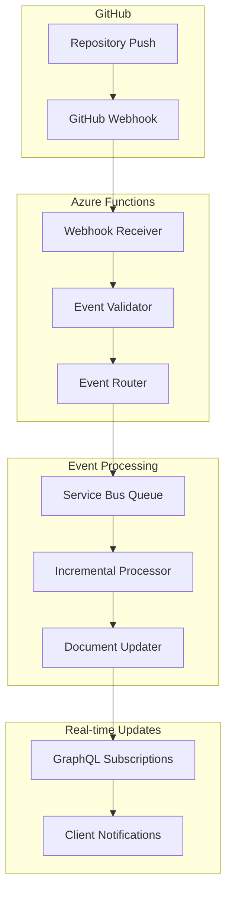

# Feature 08: GitHub App Integration + Real-time Updates

## Feature Overview

**Feature ID**: F08  
**Feature Name**: GitHub App Integration + Real-time Updates  
**Phase**: Phase 4 (Conversational Queries + Chat Interface + GitHub Integration)  
**Dependencies**: Features 01-04, Feature 06 (Core Web Interface), Feature 07 (Event Infrastructure), Feature 08 (Rate Limiting)
**Backend + Frontend**: Complete GitHub App integration with real-time UI components

### Business Value Proposition
Completes the core conversational platform by implementing GitHub App integration with real-time repository updates, transforming Archie into a responsive, always-current repository intelligence platform. This atomic feature combines enhanced GitHub API capabilities with real-time user interfaces, providing immediate value through live repository monitoring, instant update notifications, and seamless integration with the conversational AI experience.

### User Impact
- **Real-time Repository Monitoring**: Users see live repository activity feeds with instant change notifications
- **Conversational Integration**: Users can ask "What changed recently?" and get immediate, context-aware answers
- **Live Documentation Updates**: Users see documentation automatically refresh when code changes
- **Team Collaboration**: Multiple users see real-time repository activity and can discuss changes immediately
- **Enhanced Performance**: Users experience faster repository processing through GitHub App's increased rate limits
- **Live Chat Integration**: Conversational interface provides real-time updates about repository changes during discussions

### Success Criteria
- **Real-time Performance**: Repository updates processed and displayed in UI within 30 seconds of GitHub events
- **Integration Reliability**: 99.5% webhook delivery success rate with comprehensive error handling
- **UI Responsiveness**: Live updates appear in user interface within 5 seconds of processing completion
- **Conversational Enhancement**: Real-time repository context improves conversational AI accuracy by 25%
- **GitHub App Benefits**: Achieve 15,000 requests/hour rate limit and enhanced organizational permissions
- **User Experience**: Real-time activity feeds achieve 85% user engagement within 30 days of deployment
- **Performance Impact**: Incremental processing reduces update time by 80% compared to full re-analysis

### Dependencies
- **Prerequisites**: Features 01-04 (Repository Connection, AI Search, Documentation, Conversations)
- **Infrastructure**: Feature 06 (Event-Driven Architecture) for real-time event processing
- **Performance**: Feature 07 (Rate Limiting/API Optimization) for GitHub App integration
- **Frontend Stack**: React with real-time hooks, SignalR client components, notification system
- **Backend Services**: Azure Functions (webhook processing), Service Bus (event handling), GitHub App registration
- **Real-time UI**: Activity feeds, live notifications, repository status indicators, conversational integration

## Technical Specification

### Architecture Overview

#### GitHub App Integration Strategy
The implementation follows a comprehensive GitHub App approach:

1. **GitHub App Creation**: Registered GitHub App with organizational permissions
2. **Webhook Configuration**: Centralized webhook endpoints for all repository events
3. **Event Processing**: Real-time event processing with intelligent filtering
4. **Incremental Updates**: Smart incremental processing based on changed files
5. **Enhanced Authentication**: GitHub App authentication with higher rate limits
6. **Security Implementation**: Webhook signature verification and secure secret management

#### Real-time Processing Pipeline



### Domain Model Extensions

```csharp
// GitHub App Integration
public class GitHubApp
{
    public string AppId { get; private set; }
    public string Name { get; private set; }
    public string ClientId { get; private set; }
    public string WebhookSecret { get; private set; }
    public List<GitHubAppPermission> Permissions { get; private set; } = new();
    public List<string> WebhookEvents { get; private set; } = new();
    public DateTime CreatedAt { get; private set; }
    public DateTime UpdatedAt { get; private set; }
    public GitHubAppStatus Status { get; private set; }

    public static GitHubApp Create(string appId, string name, string clientId, string webhookSecret);
    public void UpdatePermissions(List<GitHubAppPermission> permissions);
    public void UpdateWebhookEvents(List<string> events);
    public void Activate();
    public void Deactivate();
}

public enum GitHubAppStatus
{
    Active,
    Inactive,
    Suspended,
    Error
}

public class GitHubAppPermission
{
    public string Resource { get; set; }
    public PermissionLevel Level { get; set; }
}

public enum PermissionLevel
{
    Read,
    Write,
    Admin
}

// Webhook Event Processing
public class WebhookEvent
{
    public Guid Id { get; private set; }
    public string EventType { get; private set; }
    public string DeliveryId { get; private set; }
    public Guid RepositoryId { get; private set; }
    public string RepositoryName { get; private set; }
    public string RepositoryOwner { get; private set; }
    public WebhookEventPayload Payload { get; private set; }
    public DateTime ReceivedAt { get; private set; }
    public DateTime? ProcessedAt { get; private set; }
    public WebhookEventStatus Status { get; private set; }
    public string? ErrorMessage { get; private set; }
    public int ProcessingAttempts { get; private set; }

    public static WebhookEvent Create(string eventType, string deliveryId, Guid repositoryId, 
        WebhookEventPayload payload);
    public void MarkAsProcessing();
    public void MarkAsCompleted();
    public void MarkAsFailed(string errorMessage);
    public void IncrementProcessingAttempts();
    public bool ShouldRetry(int maxAttempts);
}

public enum WebhookEventStatus
{
    Received,
    Processing,
    Completed,
    Failed,
    Retrying,
    DeadLetter
}

public abstract class WebhookEventPayload
{
    public string Action { get; set; }
    public DateTime Timestamp { get; set; }
    public Dictionary<string, object> RawPayload { get; set; } = new();
}

public class PushEventPayload : WebhookEventPayload
{
    public string Ref { get; set; } // Branch reference
    public string Before { get; set; } // Previous commit SHA
    public string After { get; set; } // New commit SHA
    public bool Forced { get; set; }
    public List<GitHubCommit> Commits { get; set; } = new();
    public List<string> Added { get; set; } = new(); // Added file paths
    public List<string> Removed { get; set; } = new(); // Removed file paths  
    public List<string> Modified { get; set; } = new(); // Modified file paths
    public GitHubUser Pusher { get; set; }
}

public class PullRequestEventPayload : WebhookEventPayload
{
    public int Number { get; set; }
    public string State { get; set; }
    public string Title { get; set; }
    public string Body { get; set; }
    public string BaseRef { get; set; }
    public string HeadRef { get; set; }
    public GitHubUser Author { get; set; }
    public List<string> ChangedFiles { get; set; } = new();
}

public class BranchEventPayload : WebhookEventPayload
{
    public string BranchName { get; set; }
    public string Ref { get; set; }
    public GitHubUser Sender { get; set; }
}

public class GitHubCommit
{
    public string Id { get; set; }
    public string Message { get; set; }
    public DateTime Timestamp { get; set; }
    public GitHubUser Author { get; set; }
    public List<string> Added { get; set; } = new();
    public List<string> Removed { get; set; } = new();
    public List<string> Modified { get; set; } = new();
}

public class GitHubUser
{
    public string Login { get; set; }
    public string Name { get; set; }
    public string Email { get; set; }
    public string AvatarUrl { get; set; }
}

// Incremental Processing
public class IncrementalUpdate
{
    public Guid Id { get; private set; }
    public Guid RepositoryId { get; private set; }
    public string TriggerEventId { get; private set; }
    public UpdateType Type { get; private set; }
    public List<FileChange> Changes { get; private set; } = new();
    public DateTime StartedAt { get; private set; }
    public DateTime? CompletedAt { get; private set; }
    public IncrementalUpdateStatus Status { get; private set; }
    public UpdateStatistics Statistics { get; private set; }
    public string? ErrorMessage { get; private set; }

    public static IncrementalUpdate Create(Guid repositoryId, string triggerEventId, UpdateType type);
    public void AddFileChange(FileChange change);
    public void MarkAsCompleted(UpdateStatistics statistics);
    public void MarkAsFailed(string errorMessage);
    public TimeSpan GetProcessingDuration();
}

public enum UpdateType
{
    Push,
    PullRequest,
    Branch,
    Release,
    Manual
}

public enum IncrementalUpdateStatus
{
    Pending,
    Processing,
    Completed,
    Failed,
    Cancelled
}

public class FileChange
{
    public string FilePath { get; set; }
    public ChangeType ChangeType { get; set; }
    public string? PreviousPath { get; set; } // For renames
    public long? SizeBytes { get; set; }
    public DateTime ModifiedAt { get; set; }
    public string? CommitSha { get; set; }
}

public enum ChangeType
{
    Added,
    Modified,
    Removed,
    Renamed,
    Copied
}

public class UpdateStatistics
{
    public int FilesProcessed { get; set; }
    public int FilesAdded { get; set; }
    public int FilesModified { get; set; }
    public int FilesRemoved { get; set; }
    public int DocumentsIndexed { get; set; }
    public int DocumentsUpdated { get; set; }
    public int DocumentsDeleted { get; set; }
    public TimeSpan ProcessingTime { get; set; }
    public int ApiCallsUsed { get; set; }
}

// Real-time Subscription Management
public class RealtimeSubscription
{
    public Guid Id { get; private set; }
    public Guid UserId { get; private set; }
    public List<Guid> RepositoryIds { get; private set; } = new();
    public List<string> EventTypes { get; private set; } = new();
    public string ConnectionId { get; private set; }
    public DateTime CreatedAt { get; private set; }
    public DateTime LastActiveAt { get; private set; }
    public SubscriptionStatus Status { get; private set; }
    public SubscriptionFilter Filter { get; private set; }

    public static RealtimeSubscription Create(Guid userId, string connectionId, 
        List<Guid> repositoryIds, List<string> eventTypes);
    public void UpdateLastActivity();
    public void ApplyFilter(SubscriptionFilter filter);
    public void Activate();
    public void Deactivate();
    public bool ShouldReceiveEvent(WebhookEvent webhookEvent);
}

public enum SubscriptionStatus
{
    Active,
    Inactive,
    Expired
}

public class SubscriptionFilter
{
    public List<string> IncludedBranches { get; set; } = new();
    public List<string> ExcludedBranches { get; set; } = new();
    public List<string> IncludedFileExtensions { get; set; } = new();
    public List<string> ExcludedFileExtensions { get; set; } = new();
    public List<string> IncludedAuthors { get; set; } = new();
    public List<string> ExcludedAuthors { get; set; } = new();
    public bool OnlyMajorChanges { get; set; }
    public int MinimumFilesChanged { get; set; }
}
```

### API Specification Extensions

#### GraphQL Schema Changes
```graphql
# GitHub App and Webhook types
type GitHubApp {
  appId: String!
  name: String!
  clientId: String!
  permissions: [GitHubAppPermission!]!
  webhookEvents: [String!]!
  createdAt: DateTime!
  updatedAt: DateTime!
  status: GitHubAppStatus!
}

enum GitHubAppStatus {
  ACTIVE
  INACTIVE
  SUSPENDED
  ERROR
}

type GitHubAppPermission {
  resource: String!
  level: PermissionLevel!
}

enum PermissionLevel {
  READ
  WRITE
  ADMIN
}

# Webhook Event types
type WebhookEvent {
  id: ID!
  eventType: String!
  deliveryId: String!
  repositoryId: ID!
  repositoryName: String!
  repositoryOwner: String!
  payload: WebhookEventPayload!
  receivedAt: DateTime!
  processedAt: DateTime
  status: WebhookEventStatus!
  errorMessage: String
  processingAttempts: Int!
}

enum WebhookEventStatus {
  RECEIVED
  PROCESSING
  COMPLETED
  FAILED
  RETRYING
  DEAD_LETTER
}

interface WebhookEventPayload {
  action: String!
  timestamp: DateTime!
  rawPayload: JSON!
}

type PushEventPayload implements WebhookEventPayload {
  action: String!
  timestamp: DateTime!
  rawPayload: JSON!
  ref: String!
  before: String!
  after: String!
  forced: Boolean!
  commits: [GitHubCommit!]!
  added: [String!]!
  removed: [String!]!
  modified: [String!]!
  pusher: GitHubUser!
}

type PullRequestEventPayload implements WebhookEventPayload {
  action: String!
  timestamp: DateTime!
  rawPayload: JSON!
  number: Int!
  state: String!
  title: String!
  body: String!
  baseRef: String!
  headRef: String!
  author: GitHubUser!
  changedFiles: [String!]!
}

type BranchEventPayload implements WebhookEventPayload {
  action: String!
  timestamp: DateTime!
  rawPayload: JSON!
  branchName: String!
  ref: String!
  sender: GitHubUser!
}

type GitHubCommit {
  id: String!
  message: String!
  timestamp: DateTime!
  author: GitHubUser!
  added: [String!]!
  removed: [String!]!
  modified: [String!]!
}

type GitHubUser {
  login: String!
  name: String
  email: String
  avatarUrl: String
}

# Incremental Update types
type IncrementalUpdate {
  id: ID!
  repositoryId: ID!
  triggerEventId: String!
  type: UpdateType!
  changes: [FileChange!]!
  startedAt: DateTime!
  completedAt: DateTime
  status: IncrementalUpdateStatus!
  statistics: UpdateStatistics
  errorMessage: String
  processingDuration: Float!
}

enum UpdateType {
  PUSH
  PULL_REQUEST
  BRANCH
  RELEASE
  MANUAL
}

enum IncrementalUpdateStatus {
  PENDING
  PROCESSING
  COMPLETED
  FAILED
  CANCELLED
}

type FileChange {
  filePath: String!
  changeType: ChangeType!
  previousPath: String
  sizeBytes: Long
  modifiedAt: DateTime!
  commitSha: String
}

enum ChangeType {
  ADDED
  MODIFIED
  REMOVED
  RENAMED
  COPIED
}

type UpdateStatistics {
  filesProcessed: Int!
  filesAdded: Int!
  filesModified: Int!
  filesRemoved: Int!
  documentsIndexed: Int!
  documentsUpdated: Int!
  documentsDeleted: Int!
  processingTime: Float!
  apiCallsUsed: Int!
}

# Real-time Subscription types
type RealtimeSubscription {
  id: ID!
  userId: ID!
  repositoryIds: [ID!]!
  eventTypes: [String!]!
  connectionId: String!
  createdAt: DateTime!
  lastActiveAt: DateTime!
  status: SubscriptionStatus!
  filter: SubscriptionFilter!
}

enum SubscriptionStatus {
  ACTIVE
  INACTIVE
  EXPIRED
}

type SubscriptionFilter {
  includedBranches: [String!]!
  excludedBranches: [String!]!
  includedFileExtensions: [String!]!
  excludedFileExtensions: [String!]!
  includedAuthors: [String!]!
  excludedAuthors: [String!]!
  onlyMajorChanges: Boolean!
  minimumFilesChanged: Int!
}

# Webhook Management types
type WebhookStatistics {
  totalEventsReceived: Int!
  eventsProcessedSuccessfully: Int!
  eventsFailed: Int!
  averageProcessingTime: Float!
  eventsByType: JSON!
  repositoryActivity: [RepositoryActivitySummary!]!
}

type RepositoryActivitySummary {
  repositoryId: ID!
  repositoryName: String!
  eventsReceived: Int!
  lastActivity: DateTime!
  mostActiveAuthors: [AuthorActivity!]!
}

type AuthorActivity {
  author: GitHubUser!
  commitCount: Int!
  filesChanged: Int!
  lastCommit: DateTime!
}

# Input types
input GitHubAppConfigurationInput {
  webhookUrl: String!
  webhookSecret: String!
  permissions: [GitHubAppPermissionInput!]!
  events: [String!]!
}

input GitHubAppPermissionInput {
  resource: String!
  level: PermissionLevel!
}

input RealtimeSubscriptionInput {
  repositoryIds: [ID!]!
  eventTypes: [String!]!
  filter: SubscriptionFilterInput
}

input SubscriptionFilterInput {
  includedBranches: [String!]
  excludedBranches: [String!]
  includedFileExtensions: [String!]
  excludedFileExtensions: [String!]
  includedAuthors: [String!]
  excludedAuthors: [String!]
  onlyMajorChanges: Boolean = false
  minimumFilesChanged: Int = 1
}

input TriggerIncrementalUpdateInput {
  repositoryId: ID!
  updateType: UpdateType!
  fileChanges: [FileChangeInput!]
}

input FileChangeInput {
  filePath: String!
  changeType: ChangeType!
  previousPath: String
  commitSha: String
}

# Extended queries
extend type Query {
  # GitHub App management
  gitHubApp: GitHubApp
  gitHubAppInstallations: [GitHubAppInstallation!]!
  
  # Webhook event queries
  webhookEvent(id: ID!): WebhookEvent
  webhookEvents(
    repositoryId: ID
    eventTypes: [String!]
    status: WebhookEventStatus
    fromDate: DateTime
    toDate: DateTime
    limit: Int = 50
    offset: Int = 0
  ): [WebhookEvent!]!
  
  # Incremental update queries
  incrementalUpdate(id: ID!): IncrementalUpdate
  incrementalUpdates(
    repositoryId: ID
    status: IncrementalUpdateStatus
    updateType: UpdateType
    limit: Int = 50
    offset: Int = 0
  ): [IncrementalUpdate!]!
  
  # Real-time subscription queries
  realtimeSubscription(id: ID!): RealtimeSubscription
  myRealtimeSubscriptions: [RealtimeSubscription!]!
  
  # Statistics and monitoring
  webhookStatistics(timeRange: TimeRange!): WebhookStatistics!
  repositoryActivity(repositoryId: ID!, timeRange: TimeRange!): RepositoryActivitySummary!
}

type GitHubAppInstallation {
  id: ID!
  targetType: String!
  targetLogin: String!
  permissions: JSON!
  repositorySelection: String!
  repositoryCount: Int!
  createdAt: DateTime!
  updatedAt: DateTime!
}

input TimeRange {
  startDate: DateTime!
  endDate: DateTime!
}

# Extended mutations
extend type Mutation {
  # GitHub App management
  configureGitHubApp(input: GitHubAppConfigurationInput!): GitHubApp!
  refreshGitHubAppToken: String!
  
  # Webhook management
  reprocessFailedWebhookEvent(eventId: ID!): Boolean!
  reprocessAllFailedEvents(repositoryId: ID): Int!
  
  # Incremental update management
  triggerIncrementalUpdate(input: TriggerIncrementalUpdateInput!): IncrementalUpdate!
  cancelIncrementalUpdate(updateId: ID!): Boolean!
  
  # Real-time subscription management
  createRealtimeSubscription(input: RealtimeSubscriptionInput!): RealtimeSubscription!
  updateRealtimeSubscription(subscriptionId: ID!, input: RealtimeSubscriptionInput!): RealtimeSubscription!
  deleteRealtimeSubscription(subscriptionId: ID!): Boolean!
}

# Enhanced subscriptions
extend type Subscription {
  # Real-time repository updates
  repositoryUpdates(repositoryIds: [ID!]!): RepositoryUpdateNotification!
  incrementalUpdateProgress(repositoryId: ID!): IncrementalUpdateProgress!
  
  # Webhook event subscriptions
  webhookEvents(repositoryIds: [ID!]!, eventTypes: [String!]): WebhookEventNotification!
  
  # System activity subscriptions
  repositoryActivity(repositoryIds: [ID!]!): RepositoryActivityNotification!
  systemHealthUpdates: SystemHealthUpdate!
}

# Real-time notification types
type RepositoryUpdateNotification {
  repositoryId: ID!
  updateType: UpdateType!
  changes: [FileChange!]!
  author: GitHubUser!
  commitMessage: String
  branchName: String!
  timestamp: DateTime!
}

type IncrementalUpdateProgress {
  updateId: ID!
  repositoryId: ID!
  status: IncrementalUpdateStatus!
  progress: Float! # 0.0 to 1.0
  currentPhase: String!
  filesProcessed: Int!
  totalFiles: Int!
  estimatedTimeRemaining: Float
  statistics: UpdateStatistics
}

type WebhookEventNotification {
  event: WebhookEvent!
  processingStatus: WebhookEventStatus!
  estimatedProcessingTime: Float
}

type RepositoryActivityNotification {
  repositoryId: ID!
  activityType: RepositoryActivityType!
  author: GitHubUser!
  summary: String!
  timestamp: DateTime!
}

enum RepositoryActivityType {
  COMMIT
  PUSH
  PULL_REQUEST
  BRANCH_CREATED
  BRANCH_DELETED
  RELEASE
  TAG
}

# Repository extensions
extend type Repository {
  webhookEvents(limit: Int = 20): [WebhookEvent!]!
  incrementalUpdates(limit: Int = 10): [IncrementalUpdate!]!
  lastWebhookEvent: WebhookEvent
  lastIncrementalUpdate: IncrementalUpdate
  webhookConfiguration: WebhookConfiguration
  realtimeSubscribers: Int!
}

type WebhookConfiguration {
  isConfigured: Boolean!
  webhookUrl: String
  events: [String!]!
  lastDelivery: DateTime
  deliverySuccess: Boolean
}
```

### Integration Points

#### GitHub Webhook Service Interface
```csharp
public interface IGitHubWebhookService
{
    Task<WebhookEvent> ProcessWebhookAsync(string eventType, string deliveryId, 
        string payload, string signature, CancellationToken cancellationToken = default);
    
    Task<bool> ValidateWebhookSignatureAsync(string payload, string signature, 
        CancellationToken cancellationToken = default);
    
    Task<IncrementalUpdate> TriggerIncrementalUpdateAsync(WebhookEvent webhookEvent, 
        CancellationToken cancellationToken = default);
    
    Task<WebhookStatistics> GetWebhookStatisticsAsync(DateTime fromDate, DateTime toDate, 
        CancellationToken cancellationToken = default);
    
    Task<bool> ReprocessFailedEventAsync(Guid eventId, CancellationToken cancellationToken = default);
}

public interface IGitHubAppService
{
    Task<string> GetInstallationTokenAsync(int installationId, CancellationToken cancellationToken = default);
    Task<List<GitHubAppInstallation>> GetInstallationsAsync(CancellationToken cancellationToken = default);
    Task<GitHubClient> CreateAuthenticatedClientAsync(int installationId, CancellationToken cancellationToken = default);
    Task<bool> ConfigureWebhooksAsync(int installationId, List<string> events, CancellationToken cancellationToken = default);
}

public interface IIncrementalUpdateService
{
    Task<IncrementalUpdate> ProcessIncrementalUpdateAsync(Guid repositoryId, 
        List<FileChange> changes, UpdateType updateType, CancellationToken cancellationToken = default);
    
    Task<List<FileChange>> GetChangedFilesFromCommitsAsync(List<GitHubCommit> commits, 
        CancellationToken cancellationToken = default);
    
    Task<bool> UpdateSearchIndexIncrementallyAsync(Guid repositoryId, List<FileChange> changes, 
        CancellationToken cancellationToken = default);
    
    Task<bool> UpdateDocumentationIncrementallyAsync(Guid repositoryId, List<FileChange> changes, 
        CancellationToken cancellationToken = default);
}

public interface IRealtimeNotificationService
{
    Task<RealtimeSubscription> CreateSubscriptionAsync(Guid userId, string connectionId, 
        List<Guid> repositoryIds, List<string> eventTypes, CancellationToken cancellationToken = default);
    
    Task NotifySubscribersAsync(RepositoryUpdateNotification notification, 
        CancellationToken cancellationToken = default);
    
    Task<bool> UpdateSubscriptionActivityAsync(string connectionId, CancellationToken cancellationToken = default);
    
    Task<bool> RemoveSubscriptionAsync(string connectionId, CancellationToken cancellationToken = default);
}
```

#### Azure Functions Implementation
```csharp
// Webhook receiver Azure Function
public class GitHubWebhookFunction
{
    private readonly IGitHubWebhookService _webhookService;
    private readonly IServiceBusPublisher _eventPublisher;
    private readonly ILogger<GitHubWebhookFunction> _logger;

    [FunctionName("GitHubWebhookReceiver")]
    public async Task<IActionResult> Run(
        [HttpTrigger(AuthorizationLevel.Function, "post", Route = "webhook/github")] HttpRequest req,
        ILogger log)
    {
        try
        {
            // Extract webhook headers
            var eventType = req.Headers["X-GitHub-Event"].FirstOrDefault();
            var deliveryId = req.Headers["X-GitHub-Delivery"].FirstOrDefault();
            var signature = req.Headers["X-Hub-Signature-256"].FirstOrDefault();

            if (string.IsNullOrEmpty(eventType) || string.IsNullOrEmpty(deliveryId))
            {
                return new BadRequestObjectResult("Missing required webhook headers");
            }

            // Read request body
            string payload;
            using (var reader = new StreamReader(req.Body))
            {
                payload = await reader.ReadToEndAsync();
            }

            // Validate webhook signature
            if (!await _webhookService.ValidateWebhookSignatureAsync(payload, signature))
            {
                _logger.LogWarning("Invalid webhook signature for delivery {DeliveryId}", deliveryId);
                return new UnauthorizedResult();
            }

            // Process webhook event
            var webhookEvent = await _webhookService.ProcessWebhookAsync(eventType, deliveryId, payload, signature);

            // Publish event for async processing
            var integrationEvent = CreateIntegrationEvent(webhookEvent);
            await _eventPublisher.PublishAsync(integrationEvent);

            _logger.LogInformation("Processed webhook event {EventType} for delivery {DeliveryId}", 
                eventType, deliveryId);

            return new OkObjectResult(new { eventId = webhookEvent.Id, status = "received" });
        }
        catch (Exception ex)
        {
            _logger.LogError(ex, "Failed to process webhook for delivery {DeliveryId}", 
                req.Headers["X-GitHub-Delivery"].FirstOrDefault());
            
            return new StatusCodeResult(500);
        }
    }

    private IntegrationEvent CreateIntegrationEvent(WebhookEvent webhookEvent)
    {
        return webhookEvent.EventType switch
        {
            "push" => new RepositoryPushReceivedEvent(webhookEvent.Id, webhookEvent.RepositoryId, 
                webhookEvent.Payload as PushEventPayload),
            "pull_request" => new PullRequestReceivedEvent(webhookEvent.Id, webhookEvent.RepositoryId, 
                webhookEvent.Payload as PullRequestEventPayload),
            "create" or "delete" => new BranchEventReceivedEvent(webhookEvent.Id, webhookEvent.RepositoryId, 
                webhookEvent.Payload as BranchEventPayload),
            _ => new GenericWebhookEventReceivedEvent(webhookEvent.Id, webhookEvent.EventType, webhookEvent.RepositoryId)
        };
    }
}

// Webhook event processor
public class WebhookEventProcessor
{
    private readonly IIncrementalUpdateService _updateService;
    private readonly IRealtimeNotificationService _notificationService;
    private readonly IWebhookEventRepository _webhookEventRepository;

    [FunctionName("ProcessWebhookEvent")]
    public async Task ProcessWebhookEvent(
        [ServiceBusTrigger("webhook-events", Connection = "ServiceBusConnection")] IntegrationEvent integrationEvent,
        ILogger log)
    {
        try
        {
            log.LogInformation("Processing webhook event {EventType} for repository {RepositoryId}", 
                integrationEvent.EventType, integrationEvent.Subject);

            var webhookEvent = await _webhookEventRepository.GetByIdAsync(ExtractEventIdFromSubject(integrationEvent.Subject));
            
            if (webhookEvent == null)
            {
                log.LogError("Webhook event not found: {EventId}", integrationEvent.Subject);
                return;
            }

            webhookEvent.MarkAsProcessing();
            await _webhookEventRepository.SaveAsync(webhookEvent);

            // Process based on event type
            var incrementalUpdate = integrationEvent.EventType switch
            {
                "repository.push.received" => await ProcessPushEvent(webhookEvent),
                "repository.pull_request.received" => await ProcessPullRequestEvent(webhookEvent),
                "repository.branch.received" => await ProcessBranchEvent(webhookEvent),
                _ => null
            };

            // Send real-time notifications
            if (incrementalUpdate != null)
            {
                var notification = CreateUpdateNotification(webhookEvent, incrementalUpdate);
                await _notificationService.NotifySubscribersAsync(notification);
            }

            webhookEvent.MarkAsCompleted();
            await _webhookEventRepository.SaveAsync(webhookEvent);

            log.LogInformation("Successfully processed webhook event {EventId}", webhookEvent.Id);
        }
        catch (Exception ex)
        {
            log.LogError(ex, "Failed to process webhook event {EventType}", integrationEvent.EventType);
            
            var webhookEvent = await _webhookEventRepository.GetByIdAsync(ExtractEventIdFromSubject(integrationEvent.Subject));
            if (webhookEvent != null)
            {
                webhookEvent.MarkAsFailed(ex.Message);
                await _webhookEventRepository.SaveAsync(webhookEvent);
            }
            
            throw; // Re-throw for Service Bus retry handling
        }
    }

    private async Task<IncrementalUpdate> ProcessPushEvent(WebhookEvent webhookEvent)
    {
        var payload = webhookEvent.Payload as PushEventPayload;
        var changes = await _updateService.GetChangedFilesFromCommitsAsync(payload.Commits);
        
        return await _updateService.ProcessIncrementalUpdateAsync(
            webhookEvent.RepositoryId, changes, UpdateType.Push);
    }

    private RepositoryUpdateNotification CreateUpdateNotification(WebhookEvent webhookEvent, IncrementalUpdate update)
    {
        var payload = webhookEvent.Payload as PushEventPayload;
        
        return new RepositoryUpdateNotification
        {
            RepositoryId = webhookEvent.RepositoryId,
            UpdateType = update.Type,
            Changes = update.Changes.ToList(),
            Author = payload?.Pusher,
            CommitMessage = payload?.Commits?.FirstOrDefault()?.Message,
            BranchName = ExtractBranchFromRef(payload?.Ref),
            Timestamp = webhookEvent.ReceivedAt
        };
    }
}
```

### Configuration Extensions

#### GitHub App and Webhook Configuration
```csharp
public class GitHubWebhookOptions
{
    public const string SectionName = "GitHubWebhook";
    
    [Required]
    public string AppId { get; set; } = string.Empty;
    
    [Required]
    public string PrivateKeyPath { get; set; } = string.Empty;
    
    [Required]
    public string WebhookSecret { get; set; } = string.Empty; // From Azure Key Vault
    
    [Required]
    public string WebhookUrl { get; set; } = string.Empty;
    
    public List<string> SupportedEvents { get; set; } = new()
    {
        "push",
        "pull_request", 
        "create",
        "delete",
        "release",
        "issues",
        "issue_comment"
    };
    
    public WebhookProcessingOptions Processing { get; set; } = new();
    public IncrementalUpdateOptions IncrementalUpdates { get; set; } = new();
    public RealtimeNotificationOptions Notifications { get; set; } = new();
}

public class WebhookProcessingOptions
{
    [Range(1, 50)]
    public int MaxConcurrentProcessing { get; set; } = 10;
    
    [Range(1, 10)]
    public int MaxRetryAttempts { get; set; } = 3;
    
    [Range(1000, 300000)]
    public int RetryDelayMs { get; set; } = 5000;
    
    [Range(60, 3600)]
    public int EventTimeoutMinutes { get; set; } = 10;
    
    [Range(1, 168)]
    public int EventRetentionHours { get; set; } = 24;
    
    public bool EnableSignatureValidation { get; set; } = true;
    public bool EnableEventDeduplication { get; set; } = true;
}

public class IncrementalUpdateOptions
{
    [Range(1, 1000)]
    public int MaxFilesPerUpdate { get; set; } = 100;
    
    [Range(1, 50)]
    public int MaxConcurrentUpdates { get; set; } = 5;
    
    public bool EnableSmartFiltering { get; set; } = true;
    public bool UpdateDocumentation { get; set; } = true;
    public bool UpdateSearchIndex { get; set; } = true;
    public bool UpdateKnowledgeGraph { get; set; } = false;
    
    public List<string> IgnoredFileExtensions { get; set; } = new()
    {
        ".png", ".jpg", ".gif", ".ico", ".svg",
        ".zip", ".tar", ".gz", ".pdf",
        ".exe", ".dll", ".bin"
    };
    
    public List<string> IgnoredDirectories { get; set; } = new()
    {
        ".git", "node_modules", "bin", "obj", "target", "dist", "build"
    };
}

public class RealtimeNotificationOptions
{
    [Range(1000, 100000)]
    public int MaxConcurrentConnections { get; set; } = 1000;
    
    [Range(30, 3600)]
    public int ConnectionTimeoutSeconds { get; set; } = 300;
    
    [Range(10, 300)]
    public int HeartbeatIntervalSeconds { get; set; } = 30;
    
    public bool EnableConnectionPooling { get; set; } = true;
    public bool EnableNotificationFiltering { get; set; } = true;
    public bool EnableNotificationBatching { get; set; } = false;
    
    [Range(1, 1000)]
    public int MaxNotificationsPerSecond { get; set; } = 100;
}
```

### Performance Requirements

#### Webhook Processing Targets
- **Event Processing Latency**: <30 seconds from GitHub webhook to incremental update completion
- **Webhook Delivery Success**: >99.5% successful webhook processing rate
- **Concurrent Processing**: Support 100+ simultaneous webhook events
- **Incremental Update Speed**: 80% reduction in processing time compared to full repository analysis
- **Real-time Notification Latency**: <500ms from update completion to client notification
- **System Availability**: >99.9% uptime for webhook endpoints

#### Scalability Considerations
- **Auto-scaling**: Azure Functions auto-scale based on webhook event volume
- **Queue Management**: Service Bus queues handle bursts of webhook events
- **Connection Scaling**: SignalR service handles thousands of concurrent real-time connections
- **Database Efficiency**: Optimized queries for webhook event storage and retrieval
- **Memory Management**: Efficient processing of large webhook payloads

### Implementation Roadmap

#### Phase 1: GitHub App Setup and Basic Webhooks (Weeks 1-2)
1. **GitHub App Registration and Configuration**
   - Register GitHub App with required permissions
   - Configure webhook endpoints and secret management
   - Set up Azure Key Vault integration for secure secret storage
   - Create GitHub App authentication and token management

2. **Basic Webhook Processing**
   - Implement Azure Functions for webhook reception
   - Create webhook signature validation and security
   - Set up Service Bus integration for event queuing
   - Build basic webhook event storage and tracking

#### Phase 2: Incremental Processing Engine (Weeks 3-4)
1. **Incremental Update Service**
   - Implement smart file change detection and filtering
   - Create incremental search index updates
   - Build incremental documentation updates
   - Add processing statistics and monitoring

2. **Event Processing Pipeline**
   - Create comprehensive webhook event handlers
   - Implement retry mechanisms and error handling
   - Add event deduplication and ordering guarantees
   - Build processing queue management and priorities

#### Phase 3: Real-time Notifications (Weeks 5-6)
1. **GraphQL Subscriptions Implementation**
   - Extend GraphQL schema with real-time subscription types
   - Implement SignalR integration for WebSocket connections
   - Create subscription filtering and management
   - Add connection lifecycle management

2. **Notification Service**
   - Build real-time notification broadcasting
   - Implement user-specific notification filtering
   - Create notification batching and rate limiting
   - Add comprehensive notification analytics

#### Phase 4: Advanced Features and Optimization (Weeks 7-8)
1. **Advanced Webhook Features**
   - Implement webhook event replay and recovery
   - Add comprehensive webhook analytics and reporting
   - Create intelligent event filtering and prioritization
   - Build webhook health monitoring and alerting

2. **Performance and Reliability**
   - Optimize incremental processing performance
   - Implement comprehensive error handling and recovery
   - Add performance monitoring and optimization
   - Create comprehensive testing and quality assurance

### Technical Risks and Mitigation Strategies

#### Risk 1: GitHub Webhook Reliability and Delivery
**Risk**: GitHub webhook delivery may be unreliable or delayed during outages
**Impact**: High - System depends on timely webhook notifications for real-time updates
**Mitigation**:
- Implement webhook event deduplication and idempotency
- Create fallback polling mechanism for critical repositories
- Add webhook delivery monitoring and alerting
- Build event replay capabilities for missed webhooks
- **Fallback**: Periodic repository polling as backup mechanism

#### Risk 2: Webhook Processing Performance Under Load
**Risk**: High-volume webhook events may overwhelm processing capacity
**Impact**: High - Delayed updates and potential event loss
**Mitigation**:
- Use Azure Functions auto-scaling for dynamic capacity
- Implement priority queues for critical events
- Add circuit breakers and backpressure handling
- Create event batching and compression strategies
- **Fallback**: Queue-based event processing with manual scaling controls

#### Risk 3: Real-time Connection Management Complexity
**Risk**: Managing thousands of real-time connections may be complex and resource-intensive
**Impact**: Medium - Poor user experience and high resource usage
**Mitigation**:
- Use Azure SignalR Service for managed connection handling
- Implement connection pooling and efficient resource management
- Add connection health monitoring and automatic cleanup
- Create connection rate limiting and abuse protection
- **Fallback**: Polling-based updates with configurable intervals

#### Risk 4: Incremental Processing Accuracy
**Risk**: Incremental updates may miss dependencies or relationships between files
**Impact**: Medium - Incomplete or incorrect updates leading to stale data
**Mitigation**:
- Implement dependency analysis for changed files
- Create periodic full repository validation
- Add incremental processing verification and validation
- Build rollback mechanisms for problematic updates
- **Fallback**: Force full repository reprocessing for critical inconsistencies

#### Risk 5: GitHub App Permissions and Security
**Risk**: GitHub App may have insufficient permissions or security vulnerabilities
**Impact**: Medium - Limited functionality or security exposure
**Mitigation**:
- Implement principle of least privilege for app permissions
- Regular security audits and permission reviews
- Secure token storage and rotation mechanisms
- Add comprehensive audit logging and monitoring
- **Fallback**: Personal access token authentication with manual management

### Security & Compliance Requirements

#### Webhook Security Implementation
- **Signature Verification**: Validate all webhook signatures using HMAC-SHA256
- **Secret Management**: Store webhook secrets securely in Azure Key Vault
- **HTTPS Enforcement**: All webhook endpoints use TLS 1.2+ encryption
- **Rate Limiting**: Prevent webhook abuse and DoS attacks
- **Access Logging**: Log all webhook events for security monitoring

#### GitHub App Security
- **Private Key Security**: GitHub App private keys stored in Azure Key Vault
- **Token Management**: Secure installation token generation and rotation
- **Permission Auditing**: Regular review of GitHub App permissions
- **Access Control**: Restrict GitHub App access to authorized repositories
- **Audit Trails**: Comprehensive logging of all GitHub App activities

#### Australian Data Residency Implementation
- **Azure Region**: All webhook processing and storage in Australia East
- **Data Processing**: Webhook payloads processed within Australian boundaries
- **Event Storage**: Webhook events and incremental updates stored in Australian regions
- **Real-time Notifications**: SignalR service hosted in Australian Azure regions
- **Compliance Monitoring**: Track and report on data residency compliance

## Testing Strategy

### Unit Testing Requirements (80% coverage minimum)

#### Webhook Processing Tests
```csharp
[TestFixture]
public class GitHubWebhookServiceTests
{
    [Test]
    public async Task ProcessWebhookAsync_ValidPushEvent_CreatesWebhookEvent()
    {
        // Test webhook event creation and processing
    }
    
    [Test]
    public async Task ValidateWebhookSignatureAsync_ValidSignature_ReturnsTrue()
    {
        // Test webhook signature validation
    }
    
    [Test]
    public async Task TriggerIncrementalUpdateAsync_PushEvent_CreatesIncrementalUpdate()
    {
        // Test incremental update triggering
    }
}
```

#### Incremental Update Tests
```csharp
[TestFixture]
public class IncrementalUpdateServiceTests
{
    [Test]
    public async Task ProcessIncrementalUpdateAsync_FileChanges_UpdatesSearchIndex()
    {
        // Test incremental search index updates
    }
    
    [Test]
    public async Task GetChangedFilesFromCommitsAsync_MultipleCommits_ReturnsUniqueChanges()
    {
        // Test file change extraction from commits
    }
    
    [Test]
    public async Task UpdateDocumentationIncrementallyAsync_ModifiedFiles_UpdatesDocumentation()
    {
        // Test incremental documentation updates
    }
}
```

#### Real-time Notification Tests
```csharp
[TestFixture]
public class RealtimeNotificationServiceTests
{
    [Test]
    public async Task CreateSubscriptionAsync_ValidInput_CreatesSubscription()
    {
        // Test subscription creation
    }
    
    [Test]
    public async Task NotifySubscribersAsync_RepositoryUpdate_SendsNotifications()
    {
        // Test notification broadcasting
    }
    
    [Test]
    public async Task FilterNotification_SubscriptionFilter_FiltersCorrectly()
    {
        // Test notification filtering
    }
}
```

### Integration Testing Requirements (40% coverage minimum)

#### End-to-End Webhook Processing Tests
- **Complete Webhook Flow**: GitHub webhook to incremental update completion
- **Multiple Event Types**: Push, pull request, branch events processing
- **Real-time Notifications**: Webhook events triggering client notifications
- **Error Recovery**: Failed webhook processing and retry mechanisms
- **Performance Under Load**: Multiple simultaneous webhook events

#### GitHub App Integration Tests
- **Authentication**: GitHub App token generation and API calls
- **Webhook Configuration**: Automatic webhook setup for repositories
- **Permission Validation**: GitHub App permissions and access controls
- **Installation Management**: App installation and repository access

#### Azure Services Integration Tests
- **Azure Functions**: Webhook receiver and event processor functions
- **Service Bus Integration**: Event queuing and processing workflows
- **SignalR Service**: Real-time connection and notification delivery
- **Key Vault Integration**: Secure secret retrieval and token management

### Performance Testing Requirements

#### Webhook Processing Benchmarks
- **Processing Latency**: <30 seconds for typical repository updates
- **Concurrent Events**: 100+ simultaneous webhook events
- **Event Throughput**: 1000+ webhook events per hour
- **Success Rate**: >99.5% successful webhook processing

#### Real-time Notification Benchmarks
- **Notification Latency**: <500ms from update to client notification
- **Connection Scale**: 1000+ concurrent real-time connections
- **Message Throughput**: 10,000+ notifications per minute
- **Connection Reliability**: >99% connection uptime

### Test Data Requirements

#### Webhook Event Test Scenarios
- **Repository Sizes**: Small (100 files), Medium (1,000 files), Large (10,000 files)
- **Change Types**: File additions, modifications, deletions, renames
- **Event Types**: Push, pull request, branch creation/deletion, releases
- **Author Patterns**: Single author, multiple authors, automated commits
- **Branch Patterns**: Main branch, feature branches, multiple branches

#### Real-time Subscription Test Cases
- **Subscription Types**: Single repository, multiple repositories, filtered subscriptions
- **User Scenarios**: Individual developers, team leads, project managers
- **Notification Filtering**: Branch-specific, file-type-specific, author-specific
- **Connection Patterns**: Long-lived connections, frequent reconnections, mobile clients

## Quality Assurance

### Code Review Checkpoints
- [ ] GitHub App configuration follows security best practices
- [ ] Webhook signature validation prevents unauthorized access
- [ ] Incremental processing accurately identifies and processes changes
- [ ] Real-time notifications are delivered reliably and efficiently
- [ ] Error handling covers all webhook and processing failure scenarios
- [ ] Performance meets specified benchmarks for latency and throughput
- [ ] Security controls protect webhook endpoints and processing
- [ ] Australian data residency requirements are properly enforced
- [ ] Integration with existing features maintains backward compatibility
- [ ] Monitoring and alerting provide adequate visibility into webhook processing

### Definition of Done Checklist
- [ ] All unit tests pass with >80% coverage
- [ ] Integration tests pass with >40% coverage
- [ ] GitHub App successfully configured with required permissions
- [ ] Webhook endpoints receive and process events correctly
- [ ] Incremental updates process changes within performance targets
- [ ] Real-time notifications delivered to subscribed clients
- [ ] Event processing handles failures with proper retry mechanisms
- [ ] Performance benchmarks met for webhook processing and notifications
- [ ] Security review completed and approved for webhook endpoints
- [ ] Australian data residency compliance verified
- [ ] Documentation and operational procedures complete

### Monitoring and Observability

#### Custom Metrics
- **Webhook Processing Performance**:
  - Webhook events received and processed per hour
  - Event processing latency by event type
  - Incremental update completion times
  - Webhook processing success and failure rates

- **Real-time Notification Performance**:
  - Active real-time connections and subscription counts
  - Notification delivery latency and success rates
  - Connection establishment and cleanup rates
  - Subscription filtering effectiveness

- **System Health**:
  - GitHub App authentication success rates
  - Webhook endpoint availability and response times
  - Service Bus queue depth and processing rates
  - Azure Functions execution success and duration

#### Alerts Configuration
- **Critical Alerts**:
  - Webhook processing failure rate >5%
  - Incremental update processing time >5 minutes
  - Real-time notification delivery failure rate >1%
  - GitHub App authentication failures

- **Warning Alerts**:
  - Webhook event queue depth >1000 messages
  - Incremental processing delays >2 minutes
  - Real-time connection count approaching limits
  - Event processing retry rate >10%

#### Dashboards
- **Webhook Activity Dashboard**:
  - Real-time webhook event volume and processing status
  - Repository activity heatmap and trends
  - Event processing performance and bottlenecks
  - Incremental update success rates and timing

- **Real-time Connection Dashboard**:
  - Active connection counts and geographic distribution
  - Notification delivery performance and success rates
  - Subscription patterns and usage analytics
  - Connection health and error diagnostics

### Documentation Requirements
- **GitHub App Setup Guide**: Step-by-step GitHub App configuration and deployment
- **Webhook Configuration Manual**: Repository webhook setup and troubleshooting
- **Real-time Integration Guide**: Client-side real-time notification implementation
- **Operations Manual**: Webhook system monitoring and maintenance procedures
- **Architecture Decisions**: Key technical decisions and webhook processing strategies

---

## Conclusion

This feature transforms Archie from a periodic analysis tool into a responsive, real-time repository intelligence platform. By implementing GitHub webhooks with intelligent incremental processing, users receive immediate updates when their repositories change, while the system efficiently processes only the modified content.

The GitHub App integration provides enhanced rate limits and better security, while real-time notifications keep teams informed of repository activity as it happens. This foundation enables advanced features like collaborative development workflows, automated quality checks, and intelligent change impact analysis.