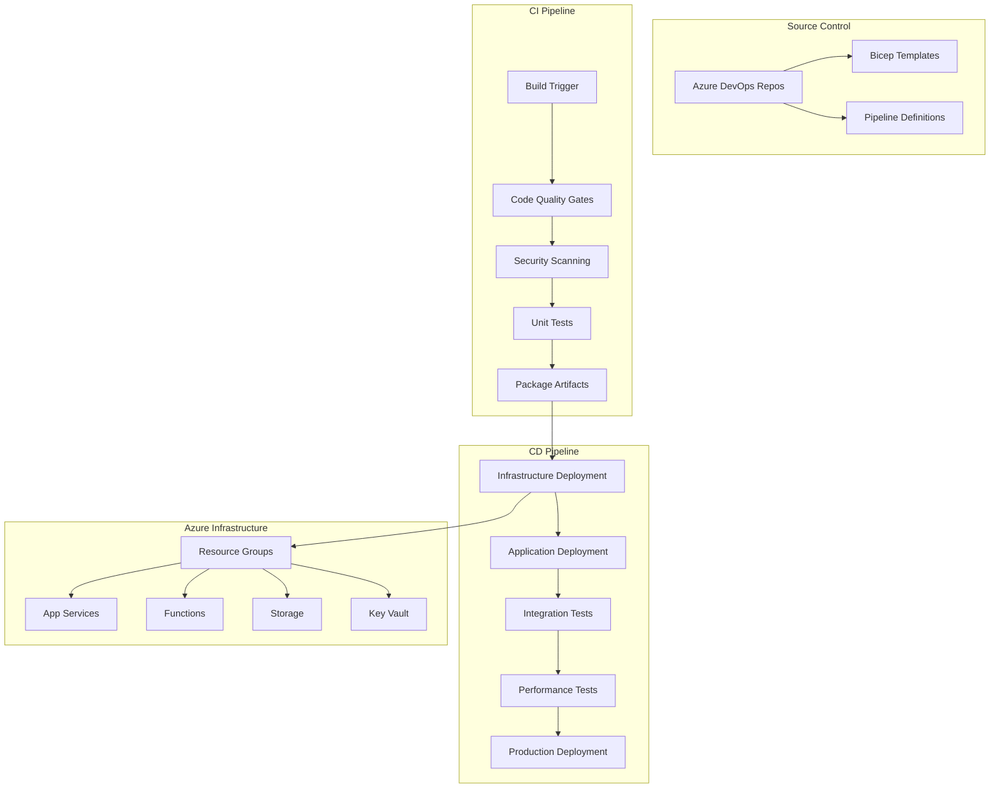

# Feature 09: Infrastructure Optimization + DevOps Enhancement

## Feature Overview

**Feature ID**: F09  
**Feature Name**: Infrastructure Optimization + DevOps Enhancement  
**Phase**: Phase 7 (Infrastructure + DevOps Optimization)  
**Dependencies**: Features 01-09 (Core platform features)
**Backend + Frontend**: Complete DevOps infrastructure with monitoring dashboards

### Business Value Proposition
Optimizes and enhances the existing infrastructure and DevOps capabilities to support enterprise-scale operations, advanced deployment strategies, and comprehensive infrastructure management. This feature transforms the foundational CI/CD pipeline into an enterprise-grade DevOps platform with advanced monitoring, automated scaling, and sophisticated deployment strategies that support the mature Archie platform.

### User Impact
- **Development Teams**: Advanced deployment strategies with feature flags, A/B testing, and automated performance validation
- **Operations Teams**: Sophisticated infrastructure automation with predictive scaling and automated incident response
- **DevOps Engineers**: Comprehensive monitoring dashboards with infrastructure insights and optimization recommendations
- **Security Teams**: Advanced compliance automation with continuous security scanning and audit capabilities
- **Business Stakeholders**: Enterprise-grade reliability with advanced analytics on deployment success and system performance
- **End Users**: Improved system reliability and performance through optimized infrastructure and deployment processes

### Success Criteria
- **Advanced Deployment**: Implement blue-green and canary deployment strategies with automated rollback
- **Infrastructure Optimization**: Achieve 30% cost reduction through automated scaling and resource optimization
- **Monitoring Excellence**: Comprehensive infrastructure monitoring with predictive alerts and automated responses
- **Performance Enhancement**: Reduce deployment time to <3 minutes with advanced pipeline optimization
- **Enterprise Reliability**: Achieve 99.95% uptime through advanced infrastructure resilience strategies
- **DevOps Dashboard**: Provide real-time infrastructure health and deployment status dashboards
- **Compliance Automation**: Automated Australian compliance validation with continuous audit reporting

### Dependencies
- **Foundation**: All Features 01-08 implemented and operational in production
- **Infrastructure Base**: Existing Azure DevOps pipelines and basic infrastructure components
- **Monitoring Integration**: Feature 11 (Performance Monitoring) for advanced observability
- **Security Foundation**: Feature 10 (Authentication/Security) for enhanced security automation
- **Advanced Services**: Azure Monitor, Application Insights, Azure Automation, Azure Policy
- **Frontend Components**: React dashboards for infrastructure monitoring and deployment management

## Technical Specification

### Architecture Overview

#### Multi-Environment Strategy
The DevOps implementation supports a comprehensive multi-environment approach:

1. **Development Environment**: Individual developer and feature branch testing
2. **Integration Environment**: Continuous integration and automated testing
3. **Staging Environment**: Pre-production testing and performance validation
4. **Production Environment**: Live production deployment with blue-green strategy
5. **Disaster Recovery**: Automated backup and recovery infrastructure

#### Infrastructure as Code Architecture



### Infrastructure as Code Implementation

#### Bicep Template Structure
```bicep
// main.bicep - Primary infrastructure template
targetScope = 'subscription'

@description('The environment name (dev, test, staging, prod)')
param environmentName string = 'dev'

@description('The Azure region for resource deployment')
param location string = 'australiaeast'

@description('The application name')
param applicationName string = 'archie'

@description('The unique suffix for resource names')
param uniqueSuffix string = uniqueString(subscription().id, environmentName)

// Common variables
var resourceGroupName = 'rg-${applicationName}-${environmentName}-${location}'
var keyVaultName = '${applicationName}-kv-${environmentName}-${uniqueSuffix}'
var appServicePlanName = '${applicationName}-asp-${environmentName}-${uniqueSuffix}'
var functionAppName = '${applicationName}-func-${environmentName}-${uniqueSuffix}'

// Create resource group
resource resourceGroup 'Microsoft.Resources/resourceGroups@2021-04-01' = {
  name: resourceGroupName
  location: location
  tags: {
    Environment: environmentName
    Application: applicationName
    ManagedBy: 'Infrastructure as Code'
    DataResidency: 'Australia'
  }
}

// Deploy core infrastructure
module coreInfrastructure 'modules/core-infrastructure.bicep' = {
  scope: resourceGroup
  name: 'coreInfrastructure'
  params: {
    location: location
    environmentName: environmentName
    applicationName: applicationName
    uniqueSuffix: uniqueSuffix
  }
}

// Deploy application services
module applicationServices 'modules/application-services.bicep' = {
  scope: resourceGroup
  name: 'applicationServices'
  params: {
    location: location
    environmentName: environmentName
    applicationName: applicationName
    uniqueSuffix: uniqueSuffix
    keyVaultName: keyVaultName
  }
  dependsOn: [
    coreInfrastructure
  ]
}

// Deploy monitoring and observability
module monitoring 'modules/monitoring.bicep' = {
  scope: resourceGroup
  name: 'monitoring'
  params: {
    location: location
    environmentName: environmentName
    applicationName: applicationName
    uniqueSuffix: uniqueSuffix
  }
  dependsOn: [
    applicationServices
  ]
}

// Output important values
output resourceGroupName string = resourceGroup.name
output keyVaultName string = keyVaultName
output applicationInsightsInstrumentationKey string = monitoring.outputs.instrumentationKey
```

#### Core Infrastructure Module
```bicep
// modules/core-infrastructure.bicep
param location string
param environmentName string
param applicationName string
param uniqueSuffix string

// Key Vault for secrets management
resource keyVault 'Microsoft.KeyVault/vaults@2023-02-01' = {
  name: '${applicationName}-kv-${environmentName}-${uniqueSuffix}'
  location: location
  properties: {
    sku: {
      family: 'A'
      name: 'standard'
    }
    tenantId: tenant().tenantId
    accessPolicies: []
    enabledForDeployment: false
    enabledForDiskEncryption: false
    enabledForTemplateDeployment: true
    enableSoftDelete: true
    softDeleteRetentionInDays: 90
    enableRbacAuthorization: true
    publicNetworkAccess: 'Enabled'
    networkAcls: {
      bypass: 'AzureServices'
      defaultAction: 'Allow'
    }
  }
  tags: {
    Environment: environmentName
    Application: applicationName
  }
}

// Storage Account for application data
resource storageAccount 'Microsoft.Storage/storageAccounts@2023-01-01' = {
  name: '${applicationName}st${environmentName}${uniqueSuffix}'
  location: location
  sku: {
    name: environmentName == 'prod' ? 'Standard_ZRS' : 'Standard_LRS'
  }
  kind: 'StorageV2'
  properties: {
    supportsHttpsTrafficOnly: true
    minimumTlsVersion: 'TLS1_2'
    allowBlobPublicAccess: false
    networkAcls: {
      bypass: 'AzureServices'
      defaultAction: 'Allow'
    }
    encryption: {
      requireInfrastructureEncryption: true
      services: {
        blob: {
          enabled: true
        }
        file: {
          enabled: true
        }
      }
    }
  }
  tags: {
    Environment: environmentName
    Application: applicationName
  }
}

// Service Bus Namespace for event-driven architecture
resource serviceBusNamespace 'Microsoft.ServiceBus/namespaces@2022-10-01-preview' = {
  name: '${applicationName}-sb-${environmentName}-${uniqueSuffix}'
  location: location
  sku: {
    name: environmentName == 'prod' ? 'Premium' : 'Standard'
    tier: environmentName == 'prod' ? 'Premium' : 'Standard'
  }
  properties: {
    minimumTlsVersion: '1.2'
    publicNetworkAccess: 'Enabled'
    disableLocalAuth: false
    zoneRedundant: environmentName == 'prod'
  }
  tags: {
    Environment: environmentName
    Application: applicationName
  }
}

// Redis Cache for application caching
resource redisCache 'Microsoft.Cache/redis@2023-04-01' = {
  name: '${applicationName}-redis-${environmentName}-${uniqueSuffix}'
  location: location
  properties: {
    sku: {
      name: environmentName == 'prod' ? 'Premium' : 'Basic'
      family: environmentName == 'prod' ? 'P' : 'C'
      capacity: environmentName == 'prod' ? 1 : 0
    }
    enableNonSslPort: false
    minimumTlsVersion: '1.2'
    publicNetworkAccess: 'Enabled'
    redisConfiguration: {
      'maxmemory-reserved': environmentName == 'prod' ? '50' : '30'
      'maxfragmentationmemory-reserved': environmentName == 'prod' ? '50' : '30'
      'maxmemory-delta': environmentName == 'prod' ? '50' : '30'
    }
  }
  tags: {
    Environment: environmentName
    Application: applicationName
  }
}

// Output values for dependent modules
output keyVaultName string = keyVault.name
output storageAccountName string = storageAccount.name
output serviceBusNamespaceName string = serviceBusNamespace.name
output redisCacheName string = redisCache.name
```

#### Application Services Module
```bicep
// modules/application-services.bicep
param location string
param environmentName string
param applicationName string
param uniqueSuffix string
param keyVaultName string

// App Service Plan
resource appServicePlan 'Microsoft.Web/serverfarms@2022-09-01' = {
  name: '${applicationName}-asp-${environmentName}-${uniqueSuffix}'
  location: location
  sku: {
    name: environmentName == 'prod' ? 'P2v3' : 'B2'
    tier: environmentName == 'prod' ? 'Premium' : 'Basic'
    capacity: environmentName == 'prod' ? 2 : 1
  }
  kind: 'linux'
  properties: {
    reserved: true
    zoneRedundant: environmentName == 'prod'
  }
  tags: {
    Environment: environmentName
    Application: applicationName
  }
}

// Main API App Service
resource apiAppService 'Microsoft.Web/sites@2022-09-01' = {
  name: '${applicationName}-api-${environmentName}-${uniqueSuffix}'
  location: location
  properties: {
    serverFarmId: appServicePlan.id
    siteConfig: {
      linuxFxVersion: 'DOTNETCORE|8.0'
      alwaysOn: true
      ftpsState: 'Disabled'
      minTlsVersion: '1.2'
      http20Enabled: true
      httpLoggingEnabled: true
      detailedErrorLoggingEnabled: true
      requestTracingEnabled: true
      appSettings: [
        {
          name: 'APPINSIGHTS_INSTRUMENTATIONKEY'
          value: '@Microsoft.KeyVault(SecretUri=https://${keyVaultName}.vault.azure.net/secrets/ApplicationInsights-InstrumentationKey/)'
        }
        {
          name: 'KeyVault__VaultUri'
          value: 'https://${keyVaultName}.vault.azure.net/'
        }
        {
          name: 'Environment'
          value: environmentName
        }
      ]
      connectionStrings: [
        {
          name: 'DefaultConnection'
          connectionString: '@Microsoft.KeyVault(SecretUri=https://${keyVaultName}.vault.azure.net/secrets/ConnectionStrings-Default/)'
          type: 'Custom'
        }
      ]
    }
    httpsOnly: true
    clientAffinityEnabled: false
    publicNetworkAccess: 'Enabled'
  }
  identity: {
    type: 'SystemAssigned'
  }
  tags: {
    Environment: environmentName
    Application: applicationName
  }
}

// Azure Functions App for background processing
resource functionApp 'Microsoft.Web/sites@2022-09-01' = {
  name: '${applicationName}-func-${environmentName}-${uniqueSuffix}'
  location: location
  kind: 'functionapp,linux'
  properties: {
    serverFarmId: appServicePlan.id
    siteConfig: {
      linuxFxVersion: 'DOTNET|8.0'
      alwaysOn: environmentName == 'prod'
      ftpsState: 'Disabled'
      minTlsVersion: '1.2'
      appSettings: [
        {
          name: 'AzureWebJobsStorage'
          value: '@Microsoft.KeyVault(SecretUri=https://${keyVaultName}.vault.azure.net/secrets/Storage-ConnectionString/)'
        }
        {
          name: 'FUNCTIONS_EXTENSION_VERSION'
          value: '~4'
        }
        {
          name: 'FUNCTIONS_WORKER_RUNTIME'
          value: 'dotnet'
        }
        {
          name: 'APPINSIGHTS_INSTRUMENTATIONKEY'
          value: '@Microsoft.KeyVault(SecretUri=https://${keyVaultName}.vault.azure.net/secrets/ApplicationInsights-InstrumentationKey/)'
        }
      ]
    }
    httpsOnly: true
    publicNetworkAccess: 'Enabled'
  }
  identity: {
    type: 'SystemAssigned'
  }
  tags: {
    Environment: environmentName
    Application: applicationName
  }
}

// Azure AI Search Service
resource searchService 'Microsoft.Search/searchServices@2023-11-01' = {
  name: '${applicationName}-search-${environmentName}-${uniqueSuffix}'
  location: location
  sku: {
    name: environmentName == 'prod' ? 'standard' : 'basic'
  }
  properties: {
    replicaCount: environmentName == 'prod' ? 2 : 1
    partitionCount: 1
    hostingMode: 'default'
    publicNetworkAccess: 'enabled'
    networkRuleSet: {
      ipRules: []
      bypass: 'AzurePortal'
    }
    encryptionWithCmk: {
      enforcement: 'Unspecified'
    }
    disableLocalAuth: false
    authOptions: {
      apiKeyOnly: {}
    }
  }
  tags: {
    Environment: environmentName
    Application: applicationName
  }
}

// Cognitive Services (Azure OpenAI)
resource cognitiveServices 'Microsoft.CognitiveServices/accounts@2023-05-01' = {
  name: '${applicationName}-openai-${environmentName}-${uniqueSuffix}'
  location: location
  kind: 'OpenAI'
  sku: {
    name: 'S0'
  }
  properties: {
    apiProperties: {
      statisticsEnabled: false
    }
    customSubDomainName: '${applicationName}-openai-${environmentName}-${uniqueSuffix}'
    networkAcls: {
      defaultAction: 'Allow'
      virtualNetworkRules: []
      ipRules: []
    }
    publicNetworkAccess: 'Enabled'
    disableLocalAuth: false
  }
  tags: {
    Environment: environmentName
    Application: applicationName
  }
}

// Output important values
output apiAppServiceName string = apiAppService.name
output functionAppName string = functionApp.name
output searchServiceName string = searchService.name
output cognitiveServicesName string = cognitiveServices.name
```

### CI/CD Pipeline Configuration

#### Azure DevOps Pipeline (YAML)
```yaml
# azure-pipelines.yml
trigger:
  branches:
    include:
    - main
    - develop
    - feature/*
  paths:
    exclude:
    - docs/*
    - README.md

variables:
  - group: 'Archie-Build-Variables'
  - name: buildConfiguration
    value: 'Release'
  - name: dotNetVersion
    value: '8.0.x'
  - name: vmImageName
    value: 'ubuntu-latest'

stages:
- stage: 'Build'
  displayName: 'Build Stage'
  jobs:
  - job: 'Build'
    displayName: 'Build Job'
    pool:
      vmImage: $(vmImageName)
    
    steps:
    - checkout: self
      fetchDepth: 0
    
    # Setup .NET
    - task: UseDotNet@2
      displayName: 'Use .NET $(dotNetVersion)'
      inputs:
        version: $(dotNetVersion)
        includePreviewVersions: false
    
    # Restore dependencies
    - task: DotNetCoreCLI@2
      displayName: 'Restore NuGet packages'
      inputs:
        command: 'restore'
        projects: '**/*.csproj'
    
    # Build solution
    - task: DotNetCoreCLI@2
      displayName: 'Build solution'
      inputs:
        command: 'build'
        projects: '**/*.csproj'
        arguments: '--configuration $(buildConfiguration) --no-restore'
    
    # Run unit tests
    - task: DotNetCoreCLI@2
      displayName: 'Run unit tests'
      inputs:
        command: 'test'
        projects: '**/tests/**/*.csproj'
        arguments: '--configuration $(buildConfiguration) --no-build --collect:"XPlat Code Coverage" --logger trx --results-directory $(Agent.TempDirectory)'
        publishTestResults: true
    
    # Publish code coverage results
    - task: PublishCodeCoverageResults@1
      displayName: 'Publish code coverage'
      inputs:
        codeCoverageTool: 'Cobertura'
        summaryFileLocation: '$(Agent.TempDirectory)/**/coverage.cobertura.xml'
    
    # Security scan with CodeQL
    - task: CodeQL@1
      displayName: 'Security scan with CodeQL'
      inputs:
        language: 'csharp'
    
    # Publish API application
    - task: DotNetCoreCLI@2
      displayName: 'Publish API application'
      inputs:
        command: 'publish'
        publishWebProjects: false
        projects: '**/Archie.Api.csproj'
        arguments: '--configuration $(buildConfiguration) --output $(Build.ArtifactStagingDirectory)/api'
        zipAfterPublish: true
        modifyOutputPath: false
    
    # Publish Function App
    - task: DotNetCoreCLI@2
      displayName: 'Publish Function App'
      inputs:
        command: 'publish'
        publishWebProjects: false
        projects: '**/Archie.Functions.csproj'
        arguments: '--configuration $(buildConfiguration) --output $(Build.ArtifactStagingDirectory)/functions'
        zipAfterPublish: true
        modifyOutputPath: false
    
    # Copy infrastructure templates
    - task: CopyFiles@2
      displayName: 'Copy infrastructure templates'
      inputs:
        SourceFolder: 'infrastructure'
        Contents: '**/*.bicep'
        TargetFolder: '$(Build.ArtifactStagingDirectory)/infrastructure'
    
    # Publish build artifacts
    - task: PublishBuildArtifacts@1
      displayName: 'Publish build artifacts'
      inputs:
        PathtoPublish: '$(Build.ArtifactStagingDirectory)'
        ArtifactName: 'drop'

# Development environment deployment
- stage: 'DeployDev'
  displayName: 'Deploy to Development'
  dependsOn: 'Build'
  condition: and(succeeded(), eq(variables['Build.SourceBranch'], 'refs/heads/develop'))
  jobs:
  - deployment: 'DeployToDev'
    displayName: 'Deploy to Development Environment'
    pool:
      vmImage: $(vmImageName)
    environment: 'archie-dev'
    variables:
    - group: 'Archie-Dev-Variables'
    strategy:
      runOnce:
        deploy:
          steps:
          - template: templates/deploy-infrastructure.yml
            parameters:
              environment: 'dev'
              serviceConnection: 'Azure-Dev-ServiceConnection'
          
          - template: templates/deploy-applications.yml
            parameters:
              environment: 'dev'
              serviceConnection: 'Azure-Dev-ServiceConnection'

# Staging environment deployment
- stage: 'DeployStaging'
  displayName: 'Deploy to Staging'
  dependsOn: 'Build'
  condition: and(succeeded(), eq(variables['Build.SourceBranch'], 'refs/heads/main'))
  jobs:
  - deployment: 'DeployToStaging'
    displayName: 'Deploy to Staging Environment'
    pool:
      vmImage: $(vmImageName)
    environment: 'archie-staging'
    variables:
    - group: 'Archie-Staging-Variables'
    strategy:
      runOnce:
        deploy:
          steps:
          - template: templates/deploy-infrastructure.yml
            parameters:
              environment: 'staging'
              serviceConnection: 'Azure-Staging-ServiceConnection'
          
          - template: templates/deploy-applications.yml
            parameters:
              environment: 'staging'
              serviceConnection: 'Azure-Staging-ServiceConnection'
          
          - template: templates/run-integration-tests.yml
            parameters:
              environment: 'staging'

# Production deployment with approval
- stage: 'DeployProd'
  displayName: 'Deploy to Production'
  dependsOn: 'DeployStaging'
  condition: and(succeeded(), eq(variables['Build.SourceBranch'], 'refs/heads/main'))
  jobs:
  - deployment: 'DeployToProduction'
    displayName: 'Deploy to Production Environment'
    pool:
      vmImage: $(vmImageName)
    environment: 'archie-prod'
    variables:
    - group: 'Archie-Prod-Variables'
    strategy:
      runOnce:
        deploy:
          steps:
          - template: templates/deploy-infrastructure.yml
            parameters:
              environment: 'prod'
              serviceConnection: 'Azure-Prod-ServiceConnection'
          
          - template: templates/deploy-applications.yml
            parameters:
              environment: 'prod'
              serviceConnection: 'Azure-Prod-ServiceConnection'
              deploymentSlot: 'staging'
          
          - template: templates/run-smoke-tests.yml
            parameters:
              environment: 'prod'
          
          - template: templates/swap-deployment-slots.yml
            parameters:
              environment: 'prod'
              serviceConnection: 'Azure-Prod-ServiceConnection'
```

#### Infrastructure Deployment Template
```yaml
# templates/deploy-infrastructure.yml
parameters:
- name: environment
  type: string
- name: serviceConnection
  type: string

steps:
- download: current
  artifact: drop

- task: AzureCLI@2
  displayName: 'Deploy infrastructure'
  inputs:
    azureSubscription: '${{ parameters.serviceConnection }}'
    scriptType: 'bash'
    scriptLocation: 'inlineScript'
    inlineScript: |
      echo "Deploying infrastructure for environment: ${{ parameters.environment }}"
      
      # Set variables
      LOCATION="australiaeast"
      ENVIRONMENT="${{ parameters.environment }}"
      
      # Deploy main infrastructure template
      az deployment sub create \
        --location $LOCATION \
        --template-file $(Pipeline.Workspace)/drop/infrastructure/main.bicep \
        --parameters \
          environmentName=$ENVIRONMENT \
          location=$LOCATION \
          applicationName=archie
      
      # Get deployment outputs
      RESOURCE_GROUP_NAME=$(az deployment sub show --name main --query properties.outputs.resourceGroupName.value -o tsv)
      KEY_VAULT_NAME=$(az deployment sub show --name main --query properties.outputs.keyVaultName.value -o tsv)
      
      echo "##vso[task.setvariable variable=ResourceGroupName]$RESOURCE_GROUP_NAME"
      echo "##vso[task.setvariable variable=KeyVaultName]$KEY_VAULT_NAME"

- task: AzureKeyVault@2
  displayName: 'Get secrets from Key Vault'
  inputs:
    azureSubscription: '${{ parameters.serviceConnection }}'
    KeyVaultName: '$(KeyVaultName)'
    SecretsFilter: '*'
    RunAsPreJob: false

- task: AzureCLI@2
  displayName: 'Configure application settings'
  inputs:
    azureSubscription: '${{ parameters.serviceConnection }}'
    scriptType: 'bash'
    scriptLocation: 'inlineScript'
    inlineScript: |
      # Update Key Vault with environment-specific secrets
      az keyvault secret set --vault-name $(KeyVaultName) --name "Environment" --value "${{ parameters.environment }}"
      
      # Set connection strings (these would come from your variable groups)
      if [ ! -z "$(AzureSearchApiKey)" ]; then
        az keyvault secret set --vault-name $(KeyVaultName) --name "AzureSearch-ApiKey" --value "$(AzureSearchApiKey)"
      fi
      
      if [ ! -z "$(AzureOpenAIApiKey)" ]; then
        az keyvault secret set --vault-name $(KeyVaultName) --name "AzureOpenAI-ApiKey" --value "$(AzureOpenAIApiKey)"
      fi
```

#### Application Deployment Template
```yaml
# templates/deploy-applications.yml
parameters:
- name: environment
  type: string
- name: serviceConnection
  type: string
- name: deploymentSlot
  type: string
  default: 'production'

steps:
- download: current
  artifact: drop

- task: AzureRmWebAppDeployment@4
  displayName: 'Deploy API Application'
  inputs:
    ConnectionType: 'AzureRM'
    azureSubscription: '${{ parameters.serviceConnection }}'
    appType: 'webAppLinux'
    WebAppName: 'archie-api-${{ parameters.environment }}-$(UniqueSuffix)'
    deployToSlotOrASE: ${{ ne(parameters.deploymentSlot, 'production') }}
    ResourceGroupName: '$(ResourceGroupName)'
    SlotName: '${{ parameters.deploymentSlot }}'
    packageForLinux: '$(Pipeline.Workspace)/drop/api/*.zip'
    RuntimeStack: 'DOTNETCORE|8.0'
    StartupCommand: ''

- task: AzureFunctionApp@1
  displayName: 'Deploy Function App'
  inputs:
    azureSubscription: '${{ parameters.serviceConnection }}'
    appType: 'functionAppLinux'
    appName: 'archie-func-${{ parameters.environment }}-$(UniqueSuffix)'
    package: '$(Pipeline.Workspace)/drop/functions/*.zip'
    runtimeStack: 'DOTNET|8.0'

- task: AzureCLI@2
  displayName: 'Run post-deployment configuration'
  inputs:
    azureSubscription: '${{ parameters.serviceConnection }}'
    scriptType: 'bash'
    scriptLocation: 'inlineScript'
    inlineScript: |
      echo "Running post-deployment configuration for ${{ parameters.environment }}"
      
      # Restart applications to pick up new configuration
      az webapp restart --name "archie-api-${{ parameters.environment }}-$(UniqueSuffix)" --resource-group "$(ResourceGroupName)"
      az functionapp restart --name "archie-func-${{ parameters.environment }}-$(UniqueSuffix)" --resource-group "$(ResourceGroupName)"
      
      # Run health checks
      HEALTH_URL="https://archie-api-${{ parameters.environment }}-$(UniqueSuffix).azurewebsites.net/health"
      echo "Checking application health at: $HEALTH_URL"
      
      # Wait for application to start
      sleep 30
      
      # Check health endpoint
      for i in {1..10}; do
        HTTP_STATUS=$(curl -s -o /dev/null -w "%{http_code}" $HEALTH_URL)
        if [ $HTTP_STATUS -eq 200 ]; then
          echo "Health check passed (HTTP $HTTP_STATUS)"
          break
        else
          echo "Health check attempt $i failed (HTTP $HTTP_STATUS), retrying..."
          sleep 10
        fi
        
        if [ $i -eq 10 ]; then
          echo "Health check failed after 10 attempts"
          exit 1
        fi
      done
```

### Security and Compliance Configuration

#### Azure Security Center Integration
```yaml
# templates/security-compliance.yml
parameters:
- name: environment
  type: string
- name: serviceConnection
  type: string

steps:
- task: AzureCLI@2
  displayName: 'Configure Security Center policies'
  inputs:
    azureSubscription: '${{ parameters.serviceConnection }}'
    scriptType: 'bash'
    scriptLocation: 'inlineScript'
    inlineScript: |
      # Enable Security Center for the subscription
      az security auto-provisioning-setting update --name default --auto-provision on
      
      # Configure security policies for Australian compliance
      az policy assignment create \
        --policy-set-definition "Australian Government ISM PROTECTED" \
        --name "ISM-PROTECTED-${{ parameters.environment }}" \
        --scope "/subscriptions/$(az account show --query id -o tsv)/resourceGroups/$(ResourceGroupName)"
      
      # Enable diagnostic logging
      az monitor diagnostic-settings create \
        --resource "$(ResourceGroupName)" \
        --name "security-diagnostics" \
        --logs '[{"category":"Administrative","enabled":true},{"category":"Security","enabled":true}]' \
        --workspace "$(LogAnalyticsWorkspaceId)"

- task: AzureCLI@2
  displayName: 'Configure Key Vault access policies'
  inputs:
    azureSubscription: '${{ parameters.serviceConnection }}'
    scriptType: 'bash'
    scriptLocation: 'inlineScript'
    inlineScript: |
      # Get managed identity IDs
      API_IDENTITY=$(az webapp identity show --name "archie-api-${{ parameters.environment }}-$(UniqueSuffix)" --resource-group "$(ResourceGroupName)" --query principalId -o tsv)
      FUNCTION_IDENTITY=$(az functionapp identity show --name "archie-func-${{ parameters.environment }}-$(UniqueSuffix)" --resource-group "$(ResourceGroupName)" --query principalId -o tsv)
      
      # Grant Key Vault access to managed identities
      az keyvault set-policy --name "$(KeyVaultName)" --object-id "$API_IDENTITY" --secret-permissions get list
      az keyvault set-policy --name "$(KeyVaultName)" --object-id "$FUNCTION_IDENTITY" --secret-permissions get list
      
      # Configure network access restrictions
      az keyvault network-rule add --name "$(KeyVaultName)" --ip-address "$(Build.Agent.IPAddress)"
```

#### Compliance Validation
```yaml
# templates/compliance-validation.yml
parameters:
- name: environment
  type: string
- name: serviceConnection
  type: string

steps:
- task: AzureCLI@2
  displayName: 'Run compliance validation'
  inputs:
    azureSubscription: '${{ parameters.serviceConnection }}'
    scriptType: 'bash'
    scriptLocation: 'inlineScript'
    inlineScript: |
      echo "Running compliance validation for ${{ parameters.environment }}"
      
      # Check data residency compliance
      RESOURCES=$(az resource list --resource-group "$(ResourceGroupName)" --query "[?location!='australiaeast'].{name:name,type:type,location:location}" -o json)
      
      if [ "$RESOURCES" != "[]" ]; then
        echo "COMPLIANCE FAILURE: Resources found outside Australia East region:"
        echo "$RESOURCES" | jq '.'
        exit 1
      else
        echo "COMPLIANCE PASS: All resources are in Australia East region"
      fi
      
      # Check encryption settings
      STORAGE_ENCRYPTION=$(az storage account show --name "archiest${{ parameters.environment }}$(UniqueSuffix)" --resource-group "$(ResourceGroupName)" --query "encryption.requireInfrastructureEncryption" -o tsv)
      
      if [ "$STORAGE_ENCRYPTION" != "true" ]; then
        echo "COMPLIANCE FAILURE: Storage account encryption not properly configured"
        exit 1
      else
        echo "COMPLIANCE PASS: Storage encryption properly configured"
      fi
      
      # Check TLS settings
      TLS_VERSION=$(az webapp config show --name "archie-api-${{ parameters.environment }}-$(UniqueSuffix)" --resource-group "$(ResourceGroupName)" --query "minTlsVersion" -o tsv)
      
      if [ "$TLS_VERSION" != "1.2" ]; then
        echo "COMPLIANCE FAILURE: TLS version not properly configured (found: $TLS_VERSION)"
        exit 1
      else
        echo "COMPLIANCE PASS: TLS 1.2 properly configured"
      fi

- task: PowerShell@2
  displayName: 'Generate compliance report'
  inputs:
    targetType: 'inline'
    script: |
      # Generate compliance report
      $report = @{
        Environment = "${{ parameters.environment }}"
        Timestamp = (Get-Date).ToString("yyyy-MM-dd HH:mm:ss")
        ResourceGroup = "$(ResourceGroupName)"
        DataResidency = "Australia East"
        EncryptionEnabled = $true
        TLSVersion = "1.2"
        ComplianceFramework = "Australian Government ISM PROTECTED"
      }
      
      $report | ConvertTo-Json | Out-File "$(Build.ArtifactStagingDirectory)/compliance-report-${{ parameters.environment }}.json"
      
      Write-Host "Compliance report generated for ${{ parameters.environment }}"

- task: PublishBuildArtifacts@1
  displayName: 'Publish compliance report'
  inputs:
    PathtoPublish: '$(Build.ArtifactStagingDirectory)'
    ArtifactName: 'compliance-reports'
```

### Performance Requirements

#### Build and Deployment Targets
- **Build Time**: <5 minutes for typical code changes
- **Unit Test Execution**: <2 minutes for complete test suite
- **Infrastructure Deployment**: <15 minutes for new environment provisioning
- **Application Deployment**: <5 minutes for application updates
- **Integration Test Execution**: <10 minutes for complete integration test suite
- **Deployment Success Rate**: >99% across all environments

#### Infrastructure Provisioning Targets
- **Resource Creation**: <10 minutes for complete infrastructure stack
- **Configuration Application**: <3 minutes for application settings and secrets
- **Health Check Validation**: <2 minutes for post-deployment validation
- **Blue-Green Swap**: <30 seconds for production slot swaps
- **Rollback Time**: <5 minutes for complete rollback to previous version

### Implementation Roadmap

#### Phase 1: Foundation Setup (Weeks 1-2)
1. **Azure DevOps Configuration**
   - Set up Azure DevOps organization and project
   - Configure service connections for each environment
   - Create variable groups for environment-specific settings
   - Set up Azure Active Directory integration for security

2. **Basic Infrastructure as Code**
   - Create core Bicep templates for infrastructure components
   - Implement basic CI pipeline for build and test
   - Set up artifact publishing and basic deployment
   - Configure Key Vault integration for secret management

#### Phase 2: Multi-Environment Deployment (Weeks 3-6)
1. **Environment Strategy Implementation**
   - Create development, staging, and production environments
   - Implement environment-specific configuration management
   - Set up approval gates for production deployments
   - Create blue-green deployment slots for zero-downtime deployments

2. **Security and Compliance Integration**
   - Implement security scanning in CI pipeline
   - Add compliance validation and reporting
   - Configure Australian data residency validation
   - Set up audit logging and monitoring

#### Phase 3: Advanced DevOps Features (Weeks 7-12)
1. **Advanced Pipeline Features**
   - Implement infrastructure drift detection
   - Add performance testing and load testing
   - Create automated rollback mechanisms
   - Build comprehensive monitoring and alerting

2. **Optimization and Reliability**
   - Optimize build and deployment performance
   - Implement infrastructure cost optimization
   - Add chaos engineering and resilience testing
   - Create disaster recovery automation

#### Phase 4: Enterprise Features (Weeks 13-16)
1. **Enterprise Integration**
   - Implement advanced security policies
   - Add compliance automation and reporting
   - Create multi-region deployment capabilities
   - Build advanced monitoring and analytics

2. **Operational Excellence**
   - Implement GitOps workflows
   - Add infrastructure documentation automation
   - Create operational runbooks and procedures
   - Build advanced troubleshooting and diagnostics

### Technical Risks and Mitigation Strategies

#### Risk 1: Infrastructure Drift and Configuration Management
**Risk**: Manual changes to infrastructure may cause drift from Infrastructure as Code definitions
**Impact**: High - Inconsistent environments and deployment failures
**Mitigation**:
- Implement infrastructure drift detection in CI/CD pipeline
- Use Azure Policy to prevent unauthorized changes
- Create automated drift correction mechanisms
- Add comprehensive audit logging and alerting
- **Fallback**: Regular infrastructure validation and manual correction procedures

#### Risk 2: Deployment Failures and Service Availability
**Risk**: Failed deployments may cause service outages or data loss
**Impact**: High - Business disruption and user impact
**Mitigation**:
- Implement blue-green deployment with automatic rollback
- Create comprehensive health checks and validation
- Use deployment rings for gradual rollout
- Add automated smoke testing and validation
- **Fallback**: Manual rollback procedures and incident response playbooks

#### Risk 3: Security Vulnerabilities in CI/CD Pipeline
**Risk**: Security vulnerabilities in pipeline or infrastructure may expose sensitive data
**Impact**: High - Data breach and compliance violations
**Mitigation**:
- Implement security scanning at multiple pipeline stages
- Use managed identities and avoid service principal credentials
- Add secret scanning and credential rotation
- Create secure artifact storage and transmission
- **Fallback**: Manual security reviews and incident response procedures

#### Risk 4: Australian Compliance and Data Residency
**Risk**: Infrastructure or data may inadvertently be deployed outside Australian regions
**Impact**: High - Compliance violations and regulatory issues
**Mitigation**:
- Implement automated compliance validation in all deployments
- Use Azure Policy to enforce regional restrictions
- Create data residency monitoring and alerting
- Add comprehensive audit trails for compliance reporting
- **Fallback**: Manual compliance audits and correction procedures

#### Risk 5: Cost Overruns and Resource Management
**Risk**: Infrastructure costs may exceed budget due to overprovisioning or unused resources
**Impact**: Medium - Budget overruns and resource waste
**Mitigation**:
- Implement cost monitoring and budget alerts
- Use appropriate resource SKUs for each environment
- Add automated resource cleanup and optimization
- Create cost reporting and optimization recommendations
- **Fallback**: Manual cost reviews and resource optimization

### Security & Compliance Requirements

#### DevOps Security Implementation
- **Pipeline Security**: Secure build agents and artifact storage
- **Secret Management**: All secrets stored in Azure Key Vault with automated rotation
- **Access Control**: Role-based access control for all DevOps resources
- **Audit Logging**: Comprehensive logging of all deployment and configuration activities
- **Vulnerability Scanning**: Automated security scanning at multiple pipeline stages

#### Australian Compliance Framework
- **Data Residency**: All infrastructure provisioned in Australia East region
- **Compliance Validation**: Automated validation of Australian Government ISM PROTECTED requirements
- **Audit Trails**: Comprehensive audit trails for all infrastructure changes and deployments
- **Encryption**: All data encrypted at rest and in transit using Australian-approved encryption standards
- **Access Monitoring**: Comprehensive monitoring and logging of all access to infrastructure resources

## Testing Strategy

### Unit Testing Requirements (80% coverage minimum)

#### Infrastructure Testing
```powershell
# tests/infrastructure/infrastructure.tests.ps1
Describe "Infrastructure Templates" {
    Context "Bicep Template Validation" {
        It "Should validate main template successfully" {
            $result = Test-AzResourceGroupDeployment -ResourceGroupName "test-rg" -TemplateFile "main.bicep"
            $result | Should -BeNullOrEmpty
        }
        
        It "Should create all required resources" {
            # Test that all expected resources are defined in template
        }
        
        It "Should enforce Australian data residency" {
            # Test that all resources are configured for Australia East
        }
    }
}
```

#### Pipeline Testing
```csharp
[TestFixture]
public class PipelineConfigurationTests
{
    [Test]
    public void Pipeline_Configuration_Should_Include_Required_Stages()
    {
        // Test pipeline configuration completeness
    }
    
    [Test]
    public void Security_Scanning_Should_Be_Configured()
    {
        // Test security scanning configuration
    }
    
    [Test]
    public void Compliance_Validation_Should_Be_Enabled()
    {
        // Test compliance validation steps
    }
}
```

### Integration Testing Requirements (40% coverage minimum)

#### End-to-End Deployment Tests
- **Complete Pipeline Execution**: Full CI/CD pipeline from code commit to production deployment
- **Multi-Environment Deployment**: Deployment across development, staging, and production environments
- **Rollback Testing**: Automated rollback mechanisms and recovery procedures
- **Compliance Validation**: End-to-end compliance checking and reporting
- **Security Integration**: Security scanning and vulnerability remediation

#### Infrastructure Integration Tests
- **Resource Provisioning**: Complete infrastructure stack provisioning and configuration
- **Service Integration**: Integration between Azure services and application components
- **Network Connectivity**: Network security and connectivity testing
- **Monitoring Integration**: Monitoring and alerting system integration

### Performance Testing Requirements

#### Build and Deployment Performance
- **Build Performance**: <5 minutes for typical code changes
- **Test Execution**: <2 minutes for unit tests, <10 minutes for integration tests
- **Deployment Performance**: <15 minutes for complete infrastructure and application deployment
- **Rollback Performance**: <5 minutes for complete rollback to previous version

#### Infrastructure Performance
- **Resource Provisioning**: <15 minutes for complete new environment
- **Configuration Updates**: <3 minutes for application configuration changes
- **Scaling Performance**: <5 minutes for horizontal or vertical scaling operations
- **Monitoring Response**: <1 minute for alert generation and notification

### Test Data Requirements

#### Pipeline Test Scenarios
- **Code Changes**: Various types of code changes (features, bug fixes, configuration)
- **Infrastructure Changes**: Infrastructure template modifications and updates
- **Security Scenarios**: Security vulnerability introduction and remediation
- **Compliance Scenarios**: Compliance violation introduction and correction
- **Failure Scenarios**: Various failure types (build, test, deployment, validation)

#### Environment Test Cases
- **Clean Deployment**: Deployment to completely new environment
- **Update Deployment**: Updates to existing environment with data preservation
- **Disaster Recovery**: Recovery from various disaster scenarios
- **Multi-Region**: Deployment and synchronization across multiple regions (future)

## Quality Assurance

### Code Review Checkpoints
- [ ] Infrastructure as Code templates follow Azure best practices
- [ ] CI/CD pipeline implements proper security scanning and validation
- [ ] Deployment strategies ensure zero-downtime and reliable rollbacks
- [ ] Australian compliance requirements are properly validated
- [ ] Secret management follows principle of least privilege
- [ ] Monitoring and alerting provide comprehensive visibility
- [ ] Error handling covers all deployment and infrastructure failure scenarios
- [ ] Performance meets specified benchmarks for build and deployment
- [ ] Documentation provides adequate operational procedures
- [ ] Cost optimization strategies are properly implemented

### Definition of Done Checklist
- [ ] All unit tests pass with >80% coverage
- [ ] Integration tests pass with >40% coverage
- [ ] Infrastructure templates deploy successfully across all environments
- [ ] CI/CD pipeline executes end-to-end without manual intervention
- [ ] Blue-green deployment works correctly with automatic rollback
- [ ] Security scanning identifies and blocks deployment of vulnerabilities
- [ ] Australian compliance validation passes for all environments
- [ ] Performance benchmarks met for build and deployment times
- [ ] Cost monitoring and budgeting alerts configured correctly
- [ ] Disaster recovery procedures tested and documented
- [ ] Operational runbooks and procedures complete
- [ ] Security review completed and approved

### Monitoring and Observability

#### Custom Metrics
- **Pipeline Performance**:
  - Build duration and success rates by pipeline stage
  - Test execution times and coverage percentages
  - Deployment success rates and rollback frequency
  - Security scan results and vulnerability remediation times

- **Infrastructure Health**:
  - Resource provisioning times and success rates
  - Configuration drift detection and correction
  - Cost trends and budget utilization
  - Compliance validation results and remediation

- **Operational Excellence**:
  - Mean time to deployment (MTTD) and mean time to recovery (MTTR)
  - Change failure rates and rollback success rates
  - Infrastructure uptime and availability metrics
  - Audit trail completeness and compliance reporting

#### Alerts Configuration
- **Critical Alerts**:
  - Pipeline failure rate >5%
  - Deployment rollback rate >10%
  - Security scan failures or vulnerabilities found
  - Compliance validation failures
  - Infrastructure cost overruns >20% of budget

- **Warning Alerts**:
  - Build time increases >50% from baseline
  - Test coverage drops below 75%
  - Infrastructure provisioning delays >20 minutes
  - Configuration drift detected

#### Dashboards
- **DevOps Performance Dashboard**:
  - Real-time pipeline execution status and performance
  - Historical deployment success rates and trends
  - Build and test performance metrics
  - Security and compliance validation results

- **Infrastructure Operations Dashboard**:
  - Real-time infrastructure health and performance
  - Cost tracking and budget utilization
  - Compliance status and audit trail summaries
  - Operational metrics and SLA achievement

### Documentation Requirements
- **DevOps Playbook**: Comprehensive procedures for pipeline management and troubleshooting
- **Infrastructure Guide**: Infrastructure as Code templates and deployment procedures
- **Security Manual**: Security configurations and compliance validation procedures
- **Operations Runbook**: Day-to-day operational procedures and incident response
- **Architecture Decisions**: Key technical decisions and DevOps strategy rationales

---

## Conclusion

This feature establishes a comprehensive DevOps foundation that enables reliable, secure, and compliant deployment of Archie across multiple environments. By implementing Infrastructure as Code, automated CI/CD pipelines, and comprehensive security and compliance validation, the system can scale from development prototype to enterprise-grade production deployment.

The multi-phase approach ensures that basic deployment capabilities are available immediately while advanced features like blue-green deployments, automated compliance validation, and comprehensive monitoring are built incrementally. This foundation is critical for all other features and provides the operational excellence required for organizational adoption.