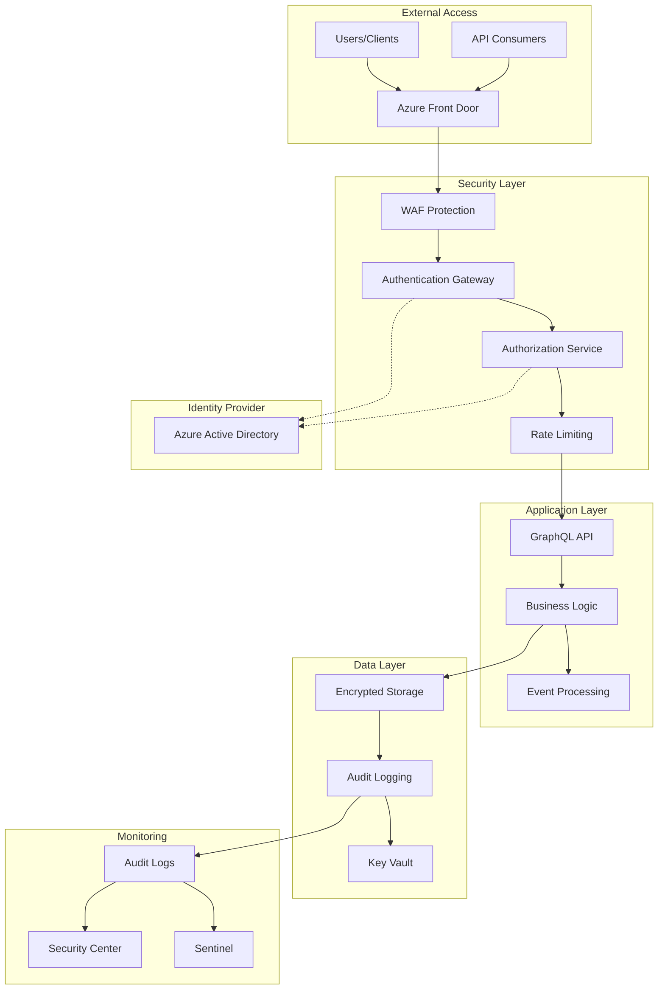

# Feature 11: Authentication + Security Hardening

## Feature Overview

**Feature ID**: F10  
**Feature Name**: Authentication + Security Hardening  
**Phase**: Phase 8 (Authentication + Security Hardening)  
**Dependencies**: Features 01-10 (Full platform foundation)
**Backend + Frontend**: Complete security infrastructure with user management UI

### Business Value Proposition
Hardens the mature Archie platform with enterprise-grade authentication, authorization, and comprehensive security controls that enable secure organizational deployment while maintaining compliance with Australian security frameworks. This feature transforms the fully functional platform into a secure, enterprise-ready system with advanced security features, comprehensive audit capabilities, and sophisticated access management suitable for large-scale organizational deployment.

### User Impact
- **Enterprise Users**: Seamless single sign-on experience with existing organizational identity systems and advanced user profile management
- **System Administrators**: Comprehensive user management dashboards with role-based access control and bulk user operations
- **Security Officers**: Advanced security monitoring dashboards with real-time threat detection and automated incident response
- **Compliance Teams**: Automated Australian Government ISM PROTECTED reporting with comprehensive audit trail interfaces
- **End Users**: Enhanced security features like multi-factor authentication, session management, and secure collaboration spaces
- **IT Departments**: Advanced identity federation, directory synchronization, and centralized security policy management

### Success Criteria
- **Enterprise Authentication**: 100% Azure Active Directory integration with advanced features like conditional access
- **Advanced RBAC**: Implement granular role-based access control with custom roles and permissions
- **Security Monitoring**: Real-time security event monitoring with automated threat detection and response
- **Compliance Excellence**: Pass Australian Government ISM PROTECTED assessment with automated compliance reporting
- **Scale Performance**: Support 1000+ concurrent users with sub-200ms authentication response times
- **Security UI**: Comprehensive security management interfaces with 95% administrator satisfaction scores
- **Advanced Features**: Multi-factor authentication, session management, and secure API gateway implementation

### Dependencies
- **Platform Foundation**: Features 01-08 fully implemented and operational in production
- **Infrastructure Base**: Existing authentication and basic security controls from earlier phases
- **Monitoring Integration**: Feature 11 (Performance Monitoring) for security event correlation
- **DevOps Foundation**: Feature 09 (Infrastructure Optimization) for secure deployment practices
- **Advanced Azure Services**: Azure AD Premium, Azure Sentinel, Azure Security Center, Azure Policy
- **Frontend Security**: React security components, user management interfaces, security dashboards

## Technical Specification

### Architecture Overview

#### Security-First Design Approach
The security implementation follows a comprehensive defense-in-depth strategy:

1. **Identity and Access Management**: Azure Active Directory integration with RBAC
2. **API Security**: JWT token-based authentication with proper validation
3. **Data Protection**: Encryption at rest and in transit with key management
4. **Network Security**: Secure communication and network access controls  
5. **Application Security**: Input validation, output encoding, and secure coding practices
6. **Monitoring and Auditing**: Comprehensive security event logging and monitoring
7. **Compliance Framework**: Australian Government ISM PROTECTED alignment

#### Security Architecture Diagram



### Domain Model Extensions

```csharp
// Identity and Access Management
public class User
{
    public Guid Id { get; private set; }
    public string EmailAddress { get; private set; }
    public string DisplayName { get; private set; }
    public string? GivenName { get; private set; }
    public string? Surname { get; private set; }
    public string AzureAdObjectId { get; private set; }
    public string? Department { get; private set; }
    public string? JobTitle { get; private set; }
    public UserStatus Status { get; private set; }
    public List<UserRole> Roles { get; private set; } = new();
    public List<RepositoryPermission> RepositoryPermissions { get; private set; } = new();
    public DateTime CreatedAt { get; private set; }
    public DateTime LastLoginAt { get; private set; }
    public DateTime? LastPasswordChangeAt { get; private set; }

    public static User Create(string emailAddress, string displayName, string azureAdObjectId);
    public void AssignRole(UserRole role);
    public void RemoveRole(UserRole role);
    public void GrantRepositoryPermission(Guid repositoryId, PermissionLevel level);
    public void RevokeRepositoryPermission(Guid repositoryId);
    public void UpdateLastLogin();
    public bool HasPermission(string permission);
    public bool CanAccessRepository(Guid repositoryId, RepositoryAction action);
}

public enum UserStatus
{
    Active,
    Inactive,
    Suspended,
    PendingActivation
}

public class UserRole
{
    public Guid Id { get; private set; }
    public string Name { get; private set; }
    public string Description { get; private set; }
    public List<Permission> Permissions { get; private set; } = new();
    public RoleType Type { get; private set; }
    public bool IsSystemRole { get; private set; }

    public static UserRole CreateSystemRole(string name, string description, RoleType type);
    public static UserRole CreateCustomRole(string name, string description);
    public void AddPermission(Permission permission);
    public void RemovePermission(Permission permission);
}

public enum RoleType
{
    SystemAdmin,      // Full system administration
    OrganizationAdmin, // Organization-wide administration
    RepositoryAdmin,   // Repository administration
    Developer,         // Standard developer access
    Viewer,           // Read-only access
    APIConsumer,      // API-only access
    ServiceAccount    // Service-to-service access
}

public class Permission
{
    public string Name { get; set; }
    public string Resource { get; set; }
    public string Action { get; set; }
    public PermissionScope Scope { get; set; }
    public string? Description { get; set; }
}

public enum PermissionScope
{
    System,          // System-wide permission
    Organization,    // Organization-wide permission
    Repository,      // Repository-specific permission
    Own              // Own resources only
}

public class RepositoryPermission
{
    public Guid Id { get; private set; }
    public Guid UserId { get; private set; }
    public Guid RepositoryId { get; private set; }
    public PermissionLevel Level { get; private set; }
    public DateTime GrantedAt { get; private set; }
    public DateTime? ExpiresAt { get; private set; }
    public string? GrantedBy { get; private set; }

    public static RepositoryPermission Grant(Guid userId, Guid repositoryId, 
        PermissionLevel level, string grantedBy, DateTime? expiresAt = null);
    public bool IsExpired();
    public void UpdateLevel(PermissionLevel newLevel);
    public void Revoke();
}

public enum PermissionLevel
{
    None,
    Read,
    Write,
    Admin
}

public enum RepositoryAction
{
    View,
    Search,
    Analyze,
    Document,
    Configure,
    Delete
}

// API Security
public class ApiKey
{
    public Guid Id { get; private set; }
    public string Name { get; private set; }
    public string KeyHash { get; private set; } // Never store plain key
    public string KeyPrefix { get; private set; } // First 8 characters for identification
    public Guid UserId { get; private set; }
    public List<string> Scopes { get; private set; } = new();
    public DateTime CreatedAt { get; private set; }
    public DateTime? LastUsedAt { get; private set; }
    public DateTime? ExpiresAt { get; private set; }
    public ApiKeyStatus Status { get; private set; }
    public RateLimitPolicy? RateLimit { get; private set; }

    public static (ApiKey apiKey, string plainKey) Create(string name, Guid userId, 
        List<string> scopes, DateTime? expiresAt = null, RateLimitPolicy? rateLimit = null);
    public void Revoke();
    public void UpdateLastUsed();
    public bool IsValid();
    public bool HasScope(string scope);
}

public enum ApiKeyStatus
{
    Active,
    Revoked,
    Expired
}

public class RateLimitPolicy
{
    public int RequestsPerHour { get; set; }
    public int RequestsPerDay { get; set; }
    public int ConcurrentRequests { get; set; }
}

// Security Events and Audit
public class SecurityEvent
{
    public Guid Id { get; private set; }
    public SecurityEventType EventType { get; private set; }
    public string UserId { get; private set; }
    public string? IpAddress { get; private set; }
    public string? UserAgent { get; private set; }
    public string Resource { get; private set; }
    public string Action { get; private set; }
    public SecurityEventResult Result { get; private set; }
    public string? Details { get; private set; }
    public DateTime Timestamp { get; private set; }
    public Dictionary<string, object> Metadata { get; private set; } = new();
    public SecurityRiskLevel RiskLevel { get; private set; }

    public static SecurityEvent Create(SecurityEventType eventType, string userId, 
        string resource, string action, SecurityEventResult result, 
        SecurityRiskLevel riskLevel = SecurityRiskLevel.Low);
    
    public void AddMetadata(string key, object value);
    public void UpdateRiskLevel(SecurityRiskLevel riskLevel);
}

public enum SecurityEventType
{
    Authentication,
    Authorization,
    DataAccess,
    AdminAction,
    SecurityConfiguration,
    AuditLogAccess,
    SuspiciousActivity,
    PolicyViolation
}

public enum SecurityEventResult
{
    Success,
    Failure,
    Blocked,
    Warning
}

public enum SecurityRiskLevel
{
    Low,
    Medium,
    High,
    Critical
}

// Session Management
public class UserSession
{
    public Guid Id { get; private set; }
    public Guid UserId { get; private set; }
    public string SessionToken { get; private set; }
    public string? DeviceInfo { get; private set; }
    public string? IpAddress { get; private set; }
    public string? UserAgent { get; private set; }
    public DateTime CreatedAt { get; private set; }
    public DateTime LastActivityAt { get; private set; }
    public DateTime ExpiresAt { get; private set; }
    public SessionStatus Status { get; private set; }

    public static UserSession Create(Guid userId, string sessionToken, TimeSpan duration);
    public void UpdateLastActivity();
    public void Terminate();
    public bool IsActive();
    public bool IsExpired();
}

public enum SessionStatus
{
    Active,
    Expired,
    Terminated
}

// Security Configuration
public class SecurityConfiguration
{
    public Guid Id { get; private set; }
    public PasswordPolicy PasswordPolicy { get; private set; }
    public SessionPolicy SessionPolicy { get; private set; }
    public AuditPolicy AuditPolicy { get; private set; }
    public ApiSecurityPolicy ApiSecurity { get; private set; }
    public DateTime CreatedAt { get; private set; }
    public DateTime UpdatedAt { get; private set; }
    public string UpdatedBy { get; private set; }

    public void UpdatePasswordPolicy(PasswordPolicy policy, string updatedBy);
    public void UpdateSessionPolicy(SessionPolicy policy, string updatedBy);
    public void UpdateAuditPolicy(AuditPolicy policy, string updatedBy);
    public void UpdateApiSecurityPolicy(ApiSecurityPolicy policy, string updatedBy);
}

public class PasswordPolicy
{
    public int MinLength { get; set; } = 12;
    public bool RequireUppercase { get; set; } = true;
    public bool RequireLowercase { get; set; } = true;
    public bool RequireDigits { get; set; } = true;
    public bool RequireSpecialCharacters { get; set; } = true;
    public int PasswordHistorySize { get; set; } = 5;
    public TimeSpan MaxPasswordAge { get; set; } = TimeSpan.FromDays(90);
    public int MaxFailedAttempts { get; set; } = 5;
    public TimeSpan LockoutDuration { get; set; } = TimeSpan.FromMinutes(30);
}

public class SessionPolicy
{
    public TimeSpan DefaultSessionDuration { get; set; } = TimeSpan.FromHours(8);
    public TimeSpan MaxSessionDuration { get; set; } = TimeSpan.FromDays(30);
    public TimeSpan InactivityTimeout { get; set; } = TimeSpan.FromHours(2);
    public bool RequireMultiFactorAuthentication { get; set; } = true;
    public bool AllowConcurrentSessions { get; set; } = true;
    public int MaxConcurrentSessions { get; set; } = 5;
}

public class AuditPolicy
{
    public TimeSpan AuditRetentionPeriod { get; set; } = TimeSpan.FromDays(2555); // 7 years
    public List<string> AuditedEvents { get; set; } = new();
    public bool EnableRealTimeMonitoring { get; set; } = true;
    public bool EnableSecurityAlerts { get; set; } = true;
    public SecurityRiskLevel AlertThreshold { get; set; } = SecurityRiskLevel.Medium;
}

public class ApiSecurityPolicy
{
    public bool RequireApiKeyAuthentication { get; set; } = true;
    public TimeSpan DefaultApiKeyExpiration { get; set; } = TimeSpan.FromDays(365);
    public RateLimitPolicy DefaultRateLimit { get; set; } = new();
    public List<string> AllowedScopes { get; set; } = new();
    public bool EnableCorsProtection { get; set; } = true;
    public List<string> AllowedOrigins { get; set; } = new();
}
```

### API Specification Extensions

#### GraphQL Schema Changes
```graphql
# Authentication and User Management
type User {
  id: ID!
  emailAddress: String!
  displayName: String!
  givenName: String
  surname: String
  azureAdObjectId: String!
  department: String
  jobTitle: String
  status: UserStatus!
  roles: [UserRole!]!
  repositoryPermissions: [RepositoryPermission!]!
  createdAt: DateTime!
  lastLoginAt: DateTime!
  lastPasswordChangeAt: DateTime
}

enum UserStatus {
  ACTIVE
  INACTIVE
  SUSPENDED
  PENDING_ACTIVATION
}

type UserRole {
  id: ID!
  name: String!
  description: String!
  permissions: [Permission!]!
  type: RoleType!
  isSystemRole: Boolean!
}

enum RoleType {
  SYSTEM_ADMIN
  ORGANIZATION_ADMIN
  REPOSITORY_ADMIN
  DEVELOPER
  VIEWER
  API_CONSUMER
  SERVICE_ACCOUNT
}

type Permission {
  name: String!
  resource: String!
  action: String!
  scope: PermissionScope!
  description: String
}

enum PermissionScope {
  SYSTEM
  ORGANIZATION
  REPOSITORY
  OWN
}

type RepositoryPermission {
  id: ID!
  userId: ID!
  repositoryId: ID!
  level: PermissionLevel!
  grantedAt: DateTime!
  expiresAt: DateTime
  grantedBy: String
  repository: Repository!
}

enum PermissionLevel {
  NONE
  READ
  WRITE
  ADMIN
}

# API Security
type ApiKey {
  id: ID!
  name: String!
  keyPrefix: String!
  userId: ID!
  scopes: [String!]!
  createdAt: DateTime!
  lastUsedAt: DateTime
  expiresAt: DateTime
  status: ApiKeyStatus!
  rateLimit: RateLimitPolicy
}

enum ApiKeyStatus {
  ACTIVE
  REVOKED
  EXPIRED
}

type RateLimitPolicy {
  requestsPerHour: Int!
  requestsPerDay: Int!
  concurrentRequests: Int!
}

# Security Events and Audit
type SecurityEvent {
  id: ID!
  eventType: SecurityEventType!
  userId: String!
  ipAddress: String
  userAgent: String
  resource: String!
  action: String!
  result: SecurityEventResult!
  details: String
  timestamp: DateTime!
  metadata: JSON
  riskLevel: SecurityRiskLevel!
}

enum SecurityEventType {
  AUTHENTICATION
  AUTHORIZATION
  DATA_ACCESS
  ADMIN_ACTION
  SECURITY_CONFIGURATION
  AUDIT_LOG_ACCESS
  SUSPICIOUS_ACTIVITY
  POLICY_VIOLATION
}

enum SecurityEventResult {
  SUCCESS
  FAILURE
  BLOCKED
  WARNING
}

enum SecurityRiskLevel {
  LOW
  MEDIUM
  HIGH
  CRITICAL
}

# Session Management
type UserSession {
  id: ID!
  userId: ID!
  deviceInfo: String
  ipAddress: String
  userAgent: String
  createdAt: DateTime!
  lastActivityAt: DateTime!
  expiresAt: DateTime!
  status: SessionStatus!
}

enum SessionStatus {
  ACTIVE
  EXPIRED
  TERMINATED
}

# Security Configuration
type SecurityConfiguration {
  id: ID!
  passwordPolicy: PasswordPolicy!
  sessionPolicy: SessionPolicy!
  auditPolicy: AuditPolicy!
  apiSecurity: ApiSecurityPolicy!
  createdAt: DateTime!
  updatedAt: DateTime!
  updatedBy: String!
}

type PasswordPolicy {
  minLength: Int!
  requireUppercase: Boolean!
  requireLowercase: Boolean!
  requireDigits: Boolean!
  requireSpecialCharacters: Boolean!
  passwordHistorySize: Int!
  maxPasswordAge: Float! # TimeSpan as total seconds
  maxFailedAttempts: Int!
  lockoutDuration: Float! # TimeSpan as total seconds
}

type SessionPolicy {
  defaultSessionDuration: Float! # TimeSpan as total seconds
  maxSessionDuration: Float!
  inactivityTimeout: Float!
  requireMultiFactorAuthentication: Boolean!
  allowConcurrentSessions: Boolean!
  maxConcurrentSessions: Int!
}

type AuditPolicy {
  auditRetentionPeriod: Float! # TimeSpan as total seconds
  auditedEvents: [String!]!
  enableRealTimeMonitoring: Boolean!
  enableSecurityAlerts: Boolean!
  alertThreshold: SecurityRiskLevel!
}

type ApiSecurityPolicy {
  requireApiKeyAuthentication: Boolean!
  defaultApiKeyExpiration: Float!
  defaultRateLimit: RateLimitPolicy!
  allowedScopes: [String!]!
  enableCorsProtection: Boolean!
  allowedOrigins: [String!]!
}

# Authentication and Authorization
type AuthenticationResult {
  success: Boolean!
  accessToken: String
  refreshToken: String
  expiresAt: DateTime
  user: User
  errorMessage: String
}

type AuthorizationResult {
  authorized: Boolean!
  permissions: [String!]!
  repositoryPermissions: [RepositoryPermission!]!
  roles: [UserRole!]!
}

# Input types
input LoginInput {
  emailAddress: String!
  password: String!
  rememberMe: Boolean = false
}

input CreateApiKeyInput {
  name: String!
  scopes: [String!]!
  expiresAt: DateTime
  rateLimit: RateLimitPolicyInput
}

input RateLimitPolicyInput {
  requestsPerHour: Int!
  requestsPerDay: Int!
  concurrentRequests: Int!
}

input GrantRepositoryPermissionInput {
  userId: ID!
  repositoryId: ID!
  level: PermissionLevel!
  expiresAt: DateTime
}

input CreateRoleInput {
  name: String!
  description: String!
  permissions: [PermissionInput!]!
}

input PermissionInput {
  name: String!
  resource: String!
  action: String!
  scope: PermissionScope!
  description: String
}

input SecurityConfigurationInput {
  passwordPolicy: PasswordPolicyInput
  sessionPolicy: SessionPolicyInput
  auditPolicy: AuditPolicyInput
  apiSecurity: ApiSecurityPolicyInput
}

input PasswordPolicyInput {
  minLength: Int
  requireUppercase: Boolean
  requireLowercase: Boolean
  requireDigits: Boolean
  requireSpecialCharacters: Boolean
  passwordHistorySize: Int
  maxPasswordAge: Float
  maxFailedAttempts: Int
  lockoutDuration: Float
}

input SessionPolicyInput {
  defaultSessionDuration: Float
  maxSessionDuration: Float
  inactivityTimeout: Float
  requireMultiFactorAuthentication: Boolean
  allowConcurrentSessions: Boolean
  maxConcurrentSessions: Int
}

input AuditPolicyInput {
  auditRetentionPeriod: Float
  auditedEvents: [String!]
  enableRealTimeMonitoring: Boolean
  enableSecurityAlerts: Boolean
  alertThreshold: SecurityRiskLevel
}

input ApiSecurityPolicyInput {
  requireApiKeyAuthentication: Boolean
  defaultApiKeyExpiration: Float
  defaultRateLimit: RateLimitPolicyInput
  allowedScopes: [String!]
  enableCorsProtection: Boolean
  allowedOrigins: [String!]
}

# Security audit and monitoring
input SecurityEventQueryInput {
  eventTypes: [SecurityEventType!]
  riskLevels: [SecurityRiskLevel!]
  users: [String!]
  fromDate: DateTime
  toDate: DateTime
  resources: [String!]
  results: [SecurityEventResult!]
}

# Extended queries
extend type Query {
  # Current user and authentication
  me: User
  myPermissions: AuthorizationResult!
  myApiKeys: [ApiKey!]!
  mySessions: [UserSession!]!
  
  # User management (admin only)
  users(status: UserStatus, role: RoleType, limit: Int = 50, offset: Int = 0): [User!]!
  user(id: ID!): User
  
  # Role and permission management
  roles(systemRolesOnly: Boolean = false): [UserRole!]!
  role(id: ID!): UserRole
  availablePermissions: [Permission!]!
  
  # Repository permissions
  repositoryPermissions(repositoryId: ID!): [RepositoryPermission!]!
  userRepositoryPermissions(userId: ID!): [RepositoryPermission!]!
  
  # Security audit and monitoring
  securityEvents(input: SecurityEventQueryInput!, limit: Int = 100, offset: Int = 0): [SecurityEvent!]!
  securityConfiguration: SecurityConfiguration!
  
  # API key management
  apiKey(id: ID!): ApiKey
  apiKeys(userId: ID, status: ApiKeyStatus, limit: Int = 50): [ApiKey!]!
  
  # Session management
  activeSessions(userId: ID): [UserSession!]!
  sessionDetails(sessionId: ID!): UserSession
}

# Extended mutations
extend type Mutation {
  # Authentication
  login(input: LoginInput!): AuthenticationResult!
  logout: Boolean!
  refreshToken: AuthenticationResult!
  
  # User management
  createUser(emailAddress: String!, displayName: String!, roles: [ID!]): User!
  updateUser(id: ID!, displayName: String, status: UserStatus, roles: [ID!]): User!
  suspendUser(id: ID!, reason: String!): User!
  reactivateUser(id: ID!): User!
  
  # Role management
  createRole(input: CreateRoleInput!): UserRole!
  updateRole(id: ID!, name: String, description: String, permissions: [PermissionInput!]): UserRole!
  deleteRole(id: ID!): Boolean!
  assignRole(userId: ID!, roleId: ID!): User!
  revokeRole(userId: ID!, roleId: ID!): User!
  
  # Repository permissions
  grantRepositoryPermission(input: GrantRepositoryPermissionInput!): RepositoryPermission!
  updateRepositoryPermission(id: ID!, level: PermissionLevel!, expiresAt: DateTime): RepositoryPermission!
  revokeRepositoryPermission(id: ID!): Boolean!
  
  # API key management
  createApiKey(input: CreateApiKeyInput!): ApiKey!
  revokeApiKey(id: ID!): Boolean!
  regenerateApiKey(id: ID!): ApiKey!
  
  # Session management
  terminateSession(sessionId: ID!): Boolean!
  terminateAllSessions(userId: ID!): Int! # Returns count of terminated sessions
  
  # Security configuration
  updateSecurityConfiguration(input: SecurityConfigurationInput!): SecurityConfiguration!
  
  # Security actions
  reportSuspiciousActivity(details: String!, relatedUserId: ID): SecurityEvent!
  acknowledgeSecurityEvent(eventId: ID!, notes: String): SecurityEvent!
}

# Real-time subscriptions for security monitoring
extend type Subscription {
  # Security monitoring
  securityEvents(riskLevel: SecurityRiskLevel): SecurityEvent!
  suspiciousActivity: SecurityEvent!
  
  # Session monitoring
  sessionActivity(userId: ID!): UserSession!
  
  # System security status
  securityAlerts: SecurityAlert!
}

type SecurityAlert {
  id: ID!
  alertType: SecurityAlertType!
  severity: SecurityRiskLevel!
  title: String!
  description: String!
  affectedUsers: [String!]!
  affectedResources: [String!]!
  timestamp: DateTime!
  acknowledgmentRequired: Boolean!
}

enum SecurityAlertType {
  BRUTE_FORCE_ATTACK
  UNUSUAL_LOGIN_PATTERN
  PRIVILEGE_ESCALATION
  DATA_BREACH_ATTEMPT
  POLICY_VIOLATION
  SYSTEM_COMPROMISE
  ACCOUNT_COMPROMISE
}

# Repository and user extensions
extend type Repository {
  permissions: [RepositoryPermission!]!
  canAccess(action: RepositoryAction!): Boolean!
  accessLevel: PermissionLevel!
}

extend type User {
  canAccessRepository(repositoryId: ID!, action: RepositoryAction!): Boolean!
  hasPermission(permission: String!): Boolean!
  effectivePermissions: [Permission!]!
  securityEvents(limit: Int = 20): [SecurityEvent!]!
  activeSessions: [UserSession!]!
  apiKeys: [ApiKey!]!
}
```

### Integration Points

#### Azure Active Directory Integration
```csharp
public interface IAzureActiveDirectoryService
{
    Task<User> AuthenticateUserAsync(string accessToken, CancellationToken cancellationToken = default);
    Task<List<User>> SyncUsersFromAzureAdAsync(CancellationToken cancellationToken = default);
    Task<bool> ValidateGroupMembershipAsync(string userObjectId, string groupId, CancellationToken cancellationToken = default);
    Task<UserInfo> GetUserInfoFromAzureAdAsync(string objectId, CancellationToken cancellationToken = default);
    Task<List<string>> GetUserGroupsAsync(string userObjectId, CancellationToken cancellationToken = default);
}

public interface IAuthenticationService
{
    Task<AuthenticationResult> AuthenticateAsync(string emailAddress, string password, CancellationToken cancellationToken = default);
    Task<AuthenticationResult> AuthenticateWithTokenAsync(string accessToken, CancellationToken cancellationToken = default);
    Task<AuthenticationResult> RefreshTokenAsync(string refreshToken, CancellationToken cancellationToken = default);
    Task<bool> LogoutAsync(string userId, CancellationToken cancellationToken = default);
    Task<UserSession> CreateSessionAsync(Guid userId, string deviceInfo, TimeSpan? duration = null, CancellationToken cancellationToken = default);
    Task<bool> ValidateSessionAsync(string sessionToken, CancellationToken cancellationToken = default);
}

public interface IAuthorizationService
{
    Task<bool> IsAuthorizedAsync(string userId, string resource, string action, CancellationToken cancellationToken = default);
    Task<bool> CanAccessRepositoryAsync(string userId, Guid repositoryId, RepositoryAction action, CancellationToken cancellationToken = default);
    Task<List<Permission>> GetUserPermissionsAsync(string userId, CancellationToken cancellationToken = default);
    Task<AuthorizationResult> GetAuthorizationContextAsync(string userId, CancellationToken cancellationToken = default);
    Task<bool> HasRoleAsync(string userId, string roleName, CancellationToken cancellationToken = default);
}

public interface ISecurityAuditService
{
    Task<SecurityEvent> LogSecurityEventAsync(SecurityEventType eventType, string userId, string resource, 
        string action, SecurityEventResult result, string? details = null, CancellationToken cancellationToken = default);
    
    Task<List<SecurityEvent>> GetSecurityEventsAsync(SecurityEventQueryCriteria criteria, 
        CancellationToken cancellationToken = default);
    
    Task<bool> DetectSuspiciousActivityAsync(string userId, string ipAddress, string userAgent, 
        CancellationToken cancellationToken = default);
    
    Task<SecurityRiskAssessment> AssessRiskLevelAsync(SecurityEvent securityEvent, 
        CancellationToken cancellationToken = default);
    
    Task NotifySecurityTeamAsync(SecurityEvent securityEvent, CancellationToken cancellationToken = default);
}

public interface IApiKeyService
{
    Task<(ApiKey apiKey, string plainKey)> CreateApiKeyAsync(string name, Guid userId, List<string> scopes, 
        DateTime? expiresAt = null, RateLimitPolicy? rateLimit = null, CancellationToken cancellationToken = default);
    
    Task<ApiKey?> ValidateApiKeyAsync(string apiKey, CancellationToken cancellationToken = default);
    Task<bool> RevokeApiKeyAsync(Guid apiKeyId, CancellationToken cancellationToken = default);
    Task<List<ApiKey>> GetUserApiKeysAsync(Guid userId, CancellationToken cancellationToken = default);
    Task UpdateLastUsedAsync(Guid apiKeyId, CancellationToken cancellationToken = default);
    Task<bool> IsRateLimitExceededAsync(Guid apiKeyId, CancellationToken cancellationToken = default);
}
```

#### JWT Token Management Implementation
```csharp
public class JwtTokenService : IJwtTokenService
{
    private readonly IConfiguration _configuration;
    private readonly ISecurityAuditService _auditService;
    private readonly ILogger<JwtTokenService> _logger;
    private readonly SymmetricSecurityKey _key;

    public JwtTokenService(IConfiguration configuration, ISecurityAuditService auditService, ILogger<JwtTokenService> logger)
    {
        _configuration = configuration;
        _auditService = auditService;
        _logger = logger;
        
        var secretKey = _configuration["JWT:SecretKey"] ?? throw new InvalidOperationException("JWT secret key not configured");
        _key = new SymmetricSecurityKey(Encoding.UTF8.GetBytes(secretKey));
    }

    public async Task<string> GenerateAccessTokenAsync(User user, TimeSpan? expiration = null)
    {
        var expiry = expiration ?? TimeSpan.FromHours(8);
        
        var claims = new List<Claim>
        {
            new(JwtRegisteredClaimNames.Sub, user.Id.ToString()),
            new(JwtRegisteredClaimNames.Email, user.EmailAddress),
            new(JwtRegisteredClaimNames.Name, user.DisplayName),
            new(JwtRegisteredClaimNames.Jti, Guid.NewGuid().ToString()),
            new(JwtRegisteredClaimNames.Iat, DateTimeOffset.UtcNow.ToUnixTimeSeconds().ToString(), ClaimValueTypes.Integer64),
            new("user_id", user.Id.ToString()),
            new("azure_ad_object_id", user.AzureAdObjectId)
        };

        // Add role claims
        foreach (var role in user.Roles)
        {
            claims.Add(new Claim(ClaimTypes.Role, role.Name));
            claims.Add(new Claim("role_type", role.Type.ToString()));
        }

        // Add permission claims
        var permissions = user.Roles.SelectMany(r => r.Permissions).Select(p => p.Name).Distinct();
        foreach (var permission in permissions)
        {
            claims.Add(new Claim("permission", permission));
        }

        // Add repository permissions
        foreach (var repoPermission in user.RepositoryPermissions.Where(rp => !rp.IsExpired()))
        {
            claims.Add(new Claim("repo_permission", $"{repoPermission.RepositoryId}:{repoPermission.Level}"));
        }

        var tokenDescriptor = new SecurityTokenDescriptor
        {
            Subject = new ClaimsIdentity(claims),
            Expires = DateTime.UtcNow.Add(expiry),
            Issuer = _configuration["JWT:Issuer"],
            Audience = _configuration["JWT:Audience"],
            SigningCredentials = new SigningCredentials(_key, SecurityAlgorithms.HmacSha256Signature)
        };

        var tokenHandler = new JwtSecurityTokenHandler();
        var token = tokenHandler.CreateToken(tokenDescriptor);
        var tokenString = tokenHandler.WriteToken(token);

        await _auditService.LogSecurityEventAsync(
            SecurityEventType.Authentication, 
            user.Id.ToString(), 
            "JWT", 
            "TokenGenerated", 
            SecurityEventResult.Success,
            $"Access token generated with expiry: {tokenDescriptor.Expires}");

        return tokenString;
    }

    public async Task<ClaimsPrincipal?> ValidateTokenAsync(string token)
    {
        try
        {
            var tokenHandler = new JwtSecurityTokenHandler();
            
            var validationParameters = new TokenValidationParameters
            {
                ValidateIssuerSigningKey = true,
                IssuerSigningKey = _key,
                ValidateIssuer = true,
                ValidIssuer = _configuration["JWT:Issuer"],
                ValidateAudience = true,
                ValidAudience = _configuration["JWT:Audience"],
                ValidateLifetime = true,
                ClockSkew = TimeSpan.FromMinutes(5),
                RequireExpirationTime = true
            };

            var principal = tokenHandler.ValidateToken(token, validationParameters, out var validatedToken);
            
            // Additional security checks
            if (validatedToken is not JwtSecurityToken jwtToken ||
                !jwtToken.Header.Alg.Equals(SecurityAlgorithms.HmacSha256, StringComparison.InvariantCultureIgnoreCase))
            {
                return null;
            }

            return principal;
        }
        catch (SecurityTokenExpiredException)
        {
            await _auditService.LogSecurityEventAsync(
                SecurityEventType.Authentication,
                "Unknown",
                "JWT",
                "TokenValidation",
                SecurityEventResult.Failure,
                "Token expired");
            return null;
        }
        catch (SecurityTokenException ex)
        {
            await _auditService.LogSecurityEventAsync(
                SecurityEventType.Authentication,
                "Unknown",
                "JWT",
                "TokenValidation",
                SecurityEventResult.Failure,
                $"Token validation failed: {ex.Message}");
            return null;
        }
        catch (Exception ex)
        {
            _logger.LogError(ex, "Unexpected error validating JWT token");
            return null;
        }
    }

    public string GenerateRefreshToken()
    {
        var randomNumber = new byte[64];
        using var rng = RandomNumberGenerator.Create();
        rng.GetBytes(randomNumber);
        return Convert.ToBase64String(randomNumber);
    }
}
```

### Security Middleware Implementation

#### Authentication Middleware
```csharp
public class AuthenticationMiddleware
{
    private readonly RequestDelegate _next;
    private readonly IJwtTokenService _jwtService;
    private readonly IApiKeyService _apiKeyService;
    private readonly ISecurityAuditService _auditService;
    private readonly ILogger<AuthenticationMiddleware> _logger;

    public AuthenticationMiddleware(RequestDelegate next, IJwtTokenService jwtService, 
        IApiKeyService apiKeyService, ISecurityAuditService auditService, ILogger<AuthenticationMiddleware> logger)
    {
        _next = next;
        _jwtService = jwtService;
        _apiKeyService = apiKeyService;
        _auditService = auditService;
        _logger = logger;
    }

    public async Task InvokeAsync(HttpContext context)
    {
        try
        {
            // Skip authentication for certain endpoints
            if (ShouldSkipAuthentication(context))
            {
                await _next(context);
                return;
            }

            var authenticated = false;

            // Try JWT token authentication
            var authHeader = context.Request.Headers["Authorization"].ToString();
            if (!string.IsNullOrEmpty(authHeader) && authHeader.StartsWith("Bearer ", StringComparison.OrdinalIgnoreCase))
            {
                var token = authHeader["Bearer ".Length..].Trim();
                var principal = await _jwtService.ValidateTokenAsync(token);
                
                if (principal != null)
                {
                    context.User = principal;
                    authenticated = true;
                }
            }

            // Try API key authentication if JWT failed
            if (!authenticated)
            {
                var apiKeyHeader = context.Request.Headers["X-API-Key"].ToString();
                if (!string.IsNullOrEmpty(apiKeyHeader))
                {
                    var apiKey = await _apiKeyService.ValidateApiKeyAsync(apiKeyHeader);
                    if (apiKey != null && apiKey.IsValid())
                    {
                        // Create claims principal for API key
                        var claims = new List<Claim>
                        {
                            new("user_id", apiKey.UserId.ToString()),
                            new("api_key_id", apiKey.Id.ToString()),
                            new("auth_type", "api_key")
                        };

                        // Add scope claims
                        foreach (var scope in apiKey.Scopes)
                        {
                            claims.Add(new Claim("scope", scope));
                        }

                        var identity = new ClaimsIdentity(claims, "ApiKey");
                        context.User = new ClaimsPrincipal(identity);
                        authenticated = true;

                        // Update API key last used
                        await _apiKeyService.UpdateLastUsedAsync(apiKey.Id);
                    }
                }
            }

            if (!authenticated)
            {
                await _auditService.LogSecurityEventAsync(
                    SecurityEventType.Authentication,
                    "Anonymous",
                    context.Request.Path,
                    "Authentication",
                    SecurityEventResult.Failure,
                    $"Failed authentication attempt from {context.Connection.RemoteIpAddress}");

                context.Response.StatusCode = 401;
                await context.Response.WriteAsync("Unauthorized");
                return;
            }

            await _next(context);
        }
        catch (Exception ex)
        {
            _logger.LogError(ex, "Error in authentication middleware");
            context.Response.StatusCode = 500;
            await context.Response.WriteAsync("Internal server error");
        }
    }

    private static bool ShouldSkipAuthentication(HttpContext context)
    {
        var path = context.Request.Path.Value?.ToLowerInvariant();
        return path switch
        {
            "/health" => true,
            "/metrics" => true,
            "/auth/login" => true,
            "/auth/refresh" => true,
            "/webhook/github" => true,
            _ when path?.StartsWith("/swagger") == true => true,
            _ => false
        };
    }
}
```

#### Authorization Middleware  
```csharp
public class AuthorizationMiddleware
{
    private readonly RequestDelegate _next;
    private readonly IAuthorizationService _authorizationService;
    private readonly ISecurityAuditService _auditService;
    private readonly ILogger<AuthorizationMiddleware> _logger;

    public AuthorizationMiddleware(RequestDelegate next, IAuthorizationService authorizationService,
        ISecurityAuditService auditService, ILogger<AuthorizationMiddleware> logger)
    {
        _next = next;
        _authorizationService = authorizationService;
        _auditService = auditService;
        _logger = logger;
    }

    public async Task InvokeAsync(HttpContext context)
    {
        try
        {
            // Skip authorization for public endpoints
            if (ShouldSkipAuthorization(context))
            {
                await _next(context);
                return;
            }

            var userId = context.User.FindFirst("user_id")?.Value;
            if (string.IsNullOrEmpty(userId))
            {
                await _auditService.LogSecurityEventAsync(
                    SecurityEventType.Authorization,
                    "Unknown",
                    context.Request.Path,
                    "Authorization",
                    SecurityEventResult.Failure,
                    "Missing user ID in token");

                context.Response.StatusCode = 403;
                await context.Response.WriteAsync("Forbidden");
                return;
            }

            // Extract resource and action from request
            var resource = ExtractResource(context);
            var action = ExtractAction(context);

            // Check authorization
            var authorized = await _authorizationService.IsAuthorizedAsync(userId, resource, action);

            if (!authorized)
            {
                await _auditService.LogSecurityEventAsync(
                    SecurityEventType.Authorization,
                    userId,
                    resource,
                    action,
                    SecurityEventResult.Failure,
                    $"Authorization denied for {context.Request.Method} {context.Request.Path}");

                context.Response.StatusCode = 403;
                await context.Response.WriteAsync("Forbidden");
                return;
            }

            // Log successful authorization for audit
            await _auditService.LogSecurityEventAsync(
                SecurityEventType.Authorization,
                userId,
                resource,
                action,
                SecurityEventResult.Success);

            await _next(context);
        }
        catch (Exception ex)
        {
            _logger.LogError(ex, "Error in authorization middleware");
            context.Response.StatusCode = 500;
            await context.Response.WriteAsync("Internal server error");
        }
    }

    private static bool ShouldSkipAuthorization(HttpContext context)
    {
        var path = context.Request.Path.Value?.ToLowerInvariant();
        return path switch
        {
            "/health" => true,
            "/metrics" => true,
            "/auth/login" => true,
            "/auth/logout" => true,
            "/auth/refresh" => true,
            "/me" => true, // Basic profile info
            _ => false
        };
    }

    private static string ExtractResource(HttpContext context)
    {
        var path = context.Request.Path.Value?.ToLowerInvariant();
        
        // Extract resource from GraphQL queries
        if (path == "/graphql")
        {
            // Would need to parse GraphQL query to extract actual resource
            // For now, return generic resource
            return "graphql";
        }

        // Extract from REST API paths
        return path switch
        {
            _ when path?.StartsWith("/api/repositories") == true => "repositories",
            _ when path?.StartsWith("/api/users") == true => "users",
            _ when path?.StartsWith("/api/roles") == true => "roles",
            _ when path?.StartsWith("/api/security") == true => "security",
            _ => "unknown"
        };
    }

    private static string ExtractAction(HttpContext context)
    {
        return context.Request.Method.ToUpperInvariant() switch
        {
            "GET" => "read",
            "POST" => "create",
            "PUT" => "update",
            "DELETE" => "delete",
            "PATCH" => "update",
            _ => "unknown"
        };
    }
}
```

### Configuration Extensions

#### Security Configuration
```csharp
public class SecurityOptions
{
    public const string SectionName = "Security";
    
    public AuthenticationOptions Authentication { get; set; } = new();
    public AuthorizationOptions Authorization { get; set; } = new();
    public AuditingOptions Auditing { get; set; } = new();
    public EncryptionOptions Encryption { get; set; } = new();
    public ComplianceOptions Compliance { get; set; } = new();
}

public class AuthenticationOptions
{
    [Required]
    public string JwtSecretKey { get; set; } = string.Empty; // From Azure Key Vault
    
    [Required]
    public string JwtIssuer { get; set; } = "https://archie.ract.com.au";
    
    [Required]
    public string JwtAudience { get; set; } = "archie-api";
    
    [Range(300, 86400)] // 5 minutes to 24 hours
    public int DefaultTokenExpirationSeconds { get; set; } = 28800; // 8 hours
    
    [Range(300, 2592000)] // 5 minutes to 30 days
    public int RefreshTokenExpirationSeconds { get; set; } = 2592000; // 30 days
    
    public bool RequireHttpsForTokens { get; set; } = true;
    public bool EnableTokenRevocation { get; set; } = true;
    
    public AzureActiveDirectoryOptions AzureAd { get; set; } = new();
}

public class AzureActiveDirectoryOptions
{
    [Required]
    public string TenantId { get; set; } = "ceb29e10-60d1-4f6b-86b1-b7d497b5b66e";
    
    [Required]
    public string ClientId { get; set; } = string.Empty;
    
    [Required]
    public string ClientSecret { get; set; } = string.Empty; // From Azure Key Vault
    
    public string Authority { get; set; } = "https://login.microsoftonline.com/";
    
    public bool EnableGroupSync { get; set; } = true;
    public bool EnableUserSync { get; set; } = true;
    
    [Range(300, 86400)]
    public int UserSyncIntervalSeconds { get; set; } = 3600; // 1 hour
}

public class AuthorizationOptions
{
    public bool EnableRoleBasedAccess { get; set; } = true;
    public bool EnableRepositoryPermissions { get; set; } = true;
    public bool EnableApiKeyAuthentication { get; set; } = true;
    
    [Range(1, 10)]
    public int DefaultApiKeyExpirationMonths { get; set; } = 12;
    
    public List<string> DefaultUserRoles { get; set; } = new() { "Viewer" };
    public List<string> AdminRoles { get; set; } = new() { "SystemAdmin", "OrganizationAdmin" };
}

public class AuditingOptions
{
    public bool EnableSecurityAuditing { get; set; } = true;
    public bool EnableDataAccessAuditing { get; set; } = true;
    public bool EnableAdminActionAuditing { get; set; } = true;
    
    [Range(1, 2555)] // 1 day to 7 years
    public int AuditRetentionDays { get; set; } = 2555; // 7 years for compliance
    
    public bool EnableRealTimeMonitoring { get; set; } = true;
    public bool EnableSecurityAlerts { get; set; } = true;
    
    public List<string> AuditedEvents { get; set; } = new()
    {
        "Authentication",
        "Authorization", 
        "DataAccess",
        "AdminAction",
        "SecurityConfiguration"
    };
    
    [Required]
    public string LogAnalyticsWorkspaceId { get; set; } = string.Empty;
    
    [Required]
    public string LogAnalyticsSharedKey { get; set; } = string.Empty; // From Azure Key Vault
}

public class EncryptionOptions
{
    [Required]
    public string DataEncryptionKey { get; set; } = string.Empty; // From Azure Key Vault
    
    public bool EncryptPersonalData { get; set; } = true;
    public bool EncryptAuditLogs { get; set; } = true;
    public bool EncryptConnectionStrings { get; set; } = true;
    
    public string EncryptionAlgorithm { get; set; } = "AES-256-GCM";
    public string KeyDerivationAlgorithm { get; set; } = "PBKDF2";
    
    [Range(10000, 1000000)]
    public int KeyDerivationIterations { get; set; } = 100000;
}

public class ComplianceOptions
{
    public bool EnableIsmProtectedCompliance { get; set; } = true;
    public bool EnforceDataResidency { get; set; } = true;
    public bool EnableComplianceReporting { get; set; } = true;
    
    public List<string> AllowedRegions { get; set; } = new() { "australiaeast", "australiasoutheast" };
    
    public string ComplianceFramework { get; set; } = "Australian Government ISM PROTECTED";
    
    [Range(1, 365)]
    public int ComplianceReportingIntervalDays { get; set; } = 30;
}
```

### Performance Requirements

#### Authentication and Authorization Targets
- **Authentication Time**: <200ms for JWT token validation
- **Authorization Check**: <100ms for standard permission checks
- **Session Creation**: <500ms for new user session establishment
- **API Key Validation**: <50ms for API key authentication
- **Azure AD Integration**: <1 second for user synchronization
- **Concurrent Users**: Support 1,000+ concurrent authenticated users

#### Security Event Processing Targets
- **Audit Logging**: <100ms for security event logging
- **Real-time Monitoring**: <5 seconds for security alert generation
- **Compliance Reporting**: <30 minutes for standard compliance reports
- **User Synchronization**: <10 minutes for Azure AD user sync
- **Permission Updates**: <1 minute for permission change propagation

### Implementation Roadmap

#### Phase 1: Core Authentication Infrastructure (Weeks 1-2)
1. **Azure Active Directory Integration**
   - Set up Azure AD application registration
   - Implement OAuth 2.0/OpenID Connect integration
   - Create user synchronization from Azure AD
   - Set up managed identity authentication for Azure services

2. **JWT Token Management**
   - Implement JWT token generation and validation
   - Create refresh token mechanism
   - Add token revocation and blacklisting
   - Set up secure token storage and transmission

#### Phase 2: Authorization and RBAC (Weeks 3-4)
1. **Role-Based Access Control**
   - Create role and permission domain models
   - Implement repository-specific permissions
   - Build authorization middleware and services
   - Add GraphQL authorization directives

2. **API Security**
   - Implement API key authentication
   - Create rate limiting for API keys
   - Add API key management interface
   - Build secure API documentation

#### Phase 3: Security Monitoring and Auditing (Weeks 5-6)
1. **Comprehensive Audit System**
   - Implement security event logging
   - Create real-time security monitoring
   - Add suspicious activity detection
   - Build security alert notification system

2. **Compliance Framework**
   - Implement Australian Government ISM PROTECTED controls
   - Create compliance reporting and dashboards
   - Add data residency validation
   - Build automated compliance checking

#### Phase 4: Advanced Security Features (Weeks 7-8)
1. **Enhanced Security Controls**
   - Implement advanced threat detection
   - Add security policy enforcement
   - Create incident response automation
   - Build security analytics and reporting

2. **Enterprise Integration**
   - Add multi-factor authentication support
   - Implement advanced session management
   - Create security configuration management
   - Build comprehensive security documentation

### Technical Risks and Mitigation Strategies

#### Risk 1: Azure Active Directory Integration Complexity
**Risk**: Complex integration with organizational Azure AD may cause authentication failures
**Impact**: High - Users unable to access system, blocking organizational adoption
**Mitigation**:
- Implement comprehensive Azure AD testing with multiple tenant configurations
- Create fallback authentication mechanisms for Azure AD outages
- Add detailed logging and diagnostics for Azure AD integration issues
- Provide clear documentation for Azure AD administrators
- **Fallback**: Local user account system with Azure AD sync as secondary option

#### Risk 2: Performance Impact of Security Controls
**Risk**: Comprehensive security checks may significantly impact system performance
**Impact**: Medium - Poor user experience and reduced system throughput
**Mitigation**:
- Implement efficient caching for authentication and authorization decisions
- Use asynchronous processing for non-critical security operations
- Optimize database queries for permission checking
- Add performance monitoring for all security operations
- **Fallback**: Reduced security granularity with performance optimization

#### Risk 3: Compliance Complexity and Maintenance
**Risk**: Australian Government ISM PROTECTED compliance requirements may be complex to implement and maintain
**Impact**: High - Compliance violations and potential legal/regulatory issues
**Mitigation**:
- Engage compliance experts for ISM PROTECTED requirements analysis
- Implement automated compliance checking and reporting
- Create comprehensive audit trails and documentation
- Regular compliance reviews and updates
- **Fallback**: Manual compliance processes with regular expert reviews

#### Risk 4: Security Vulnerability in Implementation
**Risk**: Security vulnerabilities in authentication or authorization code may expose system
**Impact**: Critical - Data breach and complete system compromise
**Mitigation**:
- Implement comprehensive security testing including penetration testing
- Use established security libraries and frameworks
- Regular security code reviews by security experts
- Automated vulnerability scanning in CI/CD pipeline
- **Fallback**: Emergency response procedures and incident management

#### Risk 5: Key Management and Secret Security
**Risk**: Compromise of encryption keys or secrets may expose sensitive data
**Impact**: Critical - Complete system and data compromise
**Mitigation**:
- Use Azure Key Vault for all secret management
- Implement key rotation and versioning
- Add comprehensive access logging for key vault operations
- Use managed identities wherever possible
- **Fallback**: Emergency key rotation procedures and data encryption validation

### Security & Compliance Requirements

#### Australian Government ISM PROTECTED Compliance
- **Data Classification**: Implement proper data classification and handling procedures
- **Access Controls**: Comprehensive role-based access control with principle of least privilege
- **Encryption**: AES-256 encryption for all sensitive data at rest and in transit
- **Audit Trails**: Comprehensive audit logging with 7-year retention
- **Physical Security**: Azure Australia East region with proper physical security controls

#### Security Monitoring and Response
- **Real-time Monitoring**: 24/7 security event monitoring and alerting
- **Incident Response**: Automated incident detection and response procedures
- **Threat Intelligence**: Integration with security threat intelligence feeds
- **Vulnerability Management**: Regular vulnerability assessments and remediation
- **Security Training**: Security awareness training for all system users

## Testing Strategy

### Unit Testing Requirements (80% coverage minimum)

#### Authentication Service Tests
```csharp
[TestFixture]
public class AuthenticationServiceTests
{
    [Test]
    public async Task AuthenticateAsync_ValidCredentials_ReturnsSuccessResult()
    {
        // Test successful authentication with Azure AD
    }
    
    [Test]
    public async Task AuthenticateWithTokenAsync_ValidToken_ReturnsUserInfo()
    {
        // Test token-based authentication
    }
    
    [Test]
    public async Task CreateSessionAsync_ValidUser_CreatesSessionWithExpiry()
    {
        // Test session creation and management
    }
}
```

#### Authorization Service Tests
```csharp
[TestFixture]
public class AuthorizationServiceTests
{
    [Test]
    public async Task IsAuthorizedAsync_UserWithPermission_ReturnsTrue()
    {
        // Test permission checking
    }
    
    [Test]
    public async Task CanAccessRepositoryAsync_UserWithAccess_ReturnsTrue()
    {
        // Test repository-specific authorization
    }
    
    [Test]
    public async Task HasRoleAsync_UserWithRole_ReturnsTrue()
    {
        // Test role-based authorization
    }
}
```

#### Security Audit Service Tests
```csharp
[TestFixture]
public class SecurityAuditServiceTests
{
    [Test]
    public async Task LogSecurityEventAsync_ValidEvent_LogsSuccessfully()
    {
        // Test security event logging
    }
    
    [Test]
    public async Task DetectSuspiciousActivityAsync_AnomalousPattern_ReturnsTrue()
    {
        // Test suspicious activity detection
    }
    
    [Test]
    public async Task AssessRiskLevelAsync_HighRiskEvent_ReturnsHighRisk()
    {
        // Test risk assessment
    }
}
```

### Integration Testing Requirements (40% coverage minimum)

#### End-to-End Authentication Tests
- **Azure AD Integration**: Complete OAuth 2.0 flow with Azure AD
- **JWT Token Flow**: Token generation, validation, and refresh
- **API Key Authentication**: API key creation and validation
- **Session Management**: Session creation, validation, and termination
- **Multi-User Scenarios**: Concurrent authentication and session management

#### Authorization Integration Tests
- **Role-Based Access**: Complete RBAC workflow with role assignment
- **Repository Permissions**: Repository-specific permission granting and checking
- **GraphQL Authorization**: Authorization integration with GraphQL resolvers
- **API Security**: API endpoint protection with proper authorization
- **Cross-Feature Authorization**: Authorization integration with all system features

#### Security Monitoring Integration Tests
- **Audit Trail**: Complete audit logging across all system operations
- **Security Alerts**: Real-time security alert generation and notification
- **Compliance Reporting**: Automated compliance report generation
- **Incident Response**: Security incident detection and response workflows

### Performance Testing Requirements

#### Authentication Performance Benchmarks
- **Login Performance**: <2 seconds for complete Azure AD authentication flow
- **Token Validation**: <100ms for JWT token validation
- **Authorization Check**: <50ms for standard permission checks
- **Session Management**: <200ms for session creation and validation
- **Concurrent Authentication**: Support 100+ concurrent login attempts

#### Security Monitoring Performance
- **Audit Logging**: <50ms for security event logging
- **Real-time Monitoring**: <5 seconds for security alert generation
- **Compliance Reporting**: <30 minutes for standard compliance reports
- **Suspicious Activity Detection**: <1 second for anomaly detection

### Test Data Requirements

#### Authentication Test Scenarios
- **User Types**: System admin, organization admin, developers, viewers, API consumers
- **Authentication Methods**: Azure AD OAuth, JWT tokens, API keys
- **Session Patterns**: Long-lived sessions, short sessions, concurrent sessions
- **Error Scenarios**: Invalid credentials, expired tokens, revoked permissions
- **Security Scenarios**: Brute force attacks, suspicious login patterns, privilege escalation

#### Authorization Test Cases
- **Permission Scenarios**: Full access, read-only access, no access, expired permissions
- **Role Combinations**: Multiple roles, conflicting permissions, role inheritance
- **Repository Access**: Owner access, granted access, public repositories, private repositories
- **API Access**: Different API key scopes, rate limiting, key revocation

## Quality Assurance

### Code Review Checkpoints
- [ ] Authentication implementation follows Azure AD best practices
- [ ] JWT token implementation uses secure algorithms and proper validation
- [ ] Authorization logic properly implements principle of least privilege
- [ ] Security audit logging captures all required events with proper detail
- [ ] Encryption implementation uses approved algorithms and key management
- [ ] API security follows OWASP security guidelines
- [ ] Australian compliance requirements are properly implemented
- [ ] Performance meets specified benchmarks for authentication and authorization
- [ ] Error handling prevents information disclosure and maintains security
- [ ] Session management implements proper timeout and security controls

### Definition of Done Checklist
- [ ] All unit tests pass with >80% coverage
- [ ] Integration tests pass with >40% coverage
- [ ] Azure Active Directory integration works correctly
- [ ] JWT token authentication and authorization functional
- [ ] Role-based access control implemented and tested
- [ ] API key authentication and management working
- [ ] Security audit system logs all required events
- [ ] Australian Government ISM PROTECTED compliance validated
- [ ] Performance benchmarks met for authentication and authorization
- [ ] Security testing completed including penetration testing
- [ ] Comprehensive security documentation complete
- [ ] Security review completed and approved

### Monitoring and Observability

#### Custom Metrics
- **Authentication Performance**:
  - Authentication success/failure rates by method
  - Average authentication time by user and method
  - Token validation performance and error rates
  - Azure AD integration latency and reliability

- **Authorization Effectiveness**:
  - Authorization decision accuracy and consistency
  - Permission check performance by resource type
  - Role-based access effectiveness and usage patterns
  - Repository access control success rates

- **Security Monitoring**:
  - Security event volume and distribution by type
  - Suspicious activity detection accuracy and false positive rates
  - Security alert response times and resolution rates
  - Compliance validation results and trend analysis

#### Alerts Configuration
- **Critical Security Alerts**:
  - Multiple failed authentication attempts (brute force)
  - Privilege escalation attempts
  - Unauthorized data access attempts
  - Security configuration changes
  - Compliance violations

- **Performance Alerts**:
  - Authentication latency >2 seconds
  - Authorization check latency >200ms
  - Security event logging failures
  - Azure AD integration failures

#### Dashboards
- **Security Operations Dashboard**:
  - Real-time authentication and authorization activity
  - Security event monitoring and alert status
  - User activity patterns and anomaly detection
  - Compliance status and audit trail summaries

- **Identity and Access Management Dashboard**:
  - User and role management statistics
  - Permission grants and revocations
  - API key usage and management
  - Session management and user activity

### Documentation Requirements
- **Security Manual**: Comprehensive security implementation and configuration guide
- **Compliance Guide**: Australian Government ISM PROTECTED implementation details
- **Identity Management Guide**: User and role management procedures
- **API Security Guide**: API key management and security best practices
- **Incident Response Playbook**: Security incident detection and response procedures

---

## Conclusion

This feature establishes Archie as a secure, enterprise-ready platform that meets Australian government security requirements while providing seamless user experience through Azure Active Directory integration. The comprehensive authentication, authorization, and security monitoring capabilities enable organizations to deploy Archie with confidence in data protection and compliance.

The implementation provides defense-in-depth security with multiple layers of protection, comprehensive audit trails, and real-time security monitoring. This foundation enables future advanced security features like advanced threat detection, automated incident response, and integration with enterprise security information and event management (SIEM) systems.