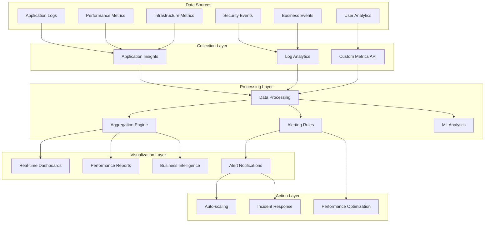

# Feature 12: Performance Monitoring and Observability

## Feature Overview

**Feature ID**: F11  
**Feature Name**: Performance Monitoring and Observability  
**Phase**: Phase 9 (Performance Monitoring + Observability)  
**Dependencies**: Features 01-11 (Complete platform foundation)
**Backend + Frontend**: Complete monitoring infrastructure with observability dashboards

### Business Value Proposition
Implement comprehensive performance monitoring, observability, and operational intelligence that enables proactive issue detection, performance optimization, and business insights. This feature transforms Archie from a functional platform into a fully observable, self-monitoring system that provides deep insights into user behavior, system performance, and business metrics.

### User Impact
- Operations teams can proactively identify and resolve issues before they impact users
- Development teams get detailed performance insights to optimize code and architecture
- Business stakeholders receive usage analytics and adoption metrics for strategic decisions
- Users experience improved system reliability and performance through proactive monitoring
- Support teams have comprehensive diagnostic information for faster issue resolution

### Success Criteria
- Achieve <1 minute mean time to detection (MTTD) for performance issues
- Maintain <99.9% uptime with comprehensive health monitoring
- Provide real-time dashboards with <30 second data refresh intervals
- Enable root cause analysis with distributed tracing across all system components
- Generate automated performance and business reports with actionable insights
- Support performance testing and capacity planning with predictive analytics

### Dependencies
- **Prerequisite**: All existing features for comprehensive monitoring integration
- **Azure Services**: Azure Monitor, Application Insights, Log Analytics, Azure Dashboards
- **Infrastructure**: Existing Archie infrastructure with monitoring instrumentation
- **Integration**: All Archie features and services for end-to-end observability

## Technical Specification

### Architecture Overview

#### Comprehensive Observability Strategy
The monitoring implementation follows a multi-layered observability approach:

1. **Infrastructure Monitoring**: Azure resource performance and health monitoring
2. **Application Performance Monitoring**: Detailed application-level performance tracking
3. **Business Intelligence**: User behavior and business metric analysis
4. **Security Monitoring**: Security event monitoring and threat detection
5. **Distributed Tracing**: End-to-end request tracking across all services
6. **Custom Metrics**: Domain-specific metrics and Key Performance Indicators
7. **Alerting and Automation**: Proactive alerting with automated response actions

#### Observability Architecture Diagram



### Domain Model Extensions

```csharp
// Performance Monitoring
public class PerformanceMetric
{
    public Guid Id { get; private set; }
    public string Name { get; private set; }
    public string Category { get; private set; }
    public MetricType Type { get; private set; }
    public double Value { get; private set; }
    public string Unit { get; private set; }
    public DateTime Timestamp { get; private set; }
    public Dictionary<string, string> Tags { get; private set; } = new();
    public string Source { get; private set; }
    public MetricSeverity Severity { get; private set; }

    public static PerformanceMetric Create(string name, string category, MetricType type, 
        double value, string unit, string source, Dictionary<string, string>? tags = null);
    
    public void AddTag(string key, string value);
    public void UpdateValue(double newValue);
    public bool IsAnomaly(double threshold);
}

public enum MetricType
{
    Counter,        // Monotonically increasing values
    Gauge,          // Point-in-time values
    Histogram,      // Distribution of values
    Summary,        // Summary statistics
    Timer          // Duration measurements
}

public enum MetricSeverity
{
    Info,
    Warning,
    Error,
    Critical
}

// System Health Monitoring
public class HealthCheck
{
    public Guid Id { get; private set; }
    public string Name { get; private set; }
    public string Component { get; private set; }
    public HealthStatus Status { get; private set; }
    public TimeSpan ResponseTime { get; private set; }
    public string? ErrorMessage { get; private set; }
    public DateTime CheckedAt { get; private set; }
    public Dictionary<string, object> Details { get; private set; } = new();
    public List<HealthCheckDependency> Dependencies { get; private set; } = new();

    public static HealthCheck Create(string name, string component);
    public void UpdateStatus(HealthStatus status, TimeSpan responseTime, string? errorMessage = null);
    public void AddDependency(string dependencyName, HealthStatus status);
    public bool IsHealthy();
    public HealthSeverity GetSeverity();
}

public enum HealthStatus
{
    Healthy,
    Degraded,
    Unhealthy,
    Unknown
}

public enum HealthSeverity
{
    Low,
    Medium,
    High,
    Critical
}

public class HealthCheckDependency
{
    public string Name { get; set; }
    public HealthStatus Status { get; set; }
    public TimeSpan ResponseTime { get; set; }
    public string? ErrorMessage { get; set; }
}

// Distributed Tracing
public class TraceSpan
{
    public string TraceId { get; private set; }
    public string SpanId { get; private set; }
    public string? ParentSpanId { get; private set; }
    public string OperationName { get; private set; }
    public string ServiceName { get; private set; }
    public DateTime StartTime { get; private set; }
    public DateTime? EndTime { get; private set; }
    public TimeSpan? Duration { get; private set; }
    public SpanStatus Status { get; private set; }
    public Dictionary<string, object> Tags { get; private set; } = new();
    public List<SpanLog> Logs { get; private set; } = new();

    public static TraceSpan Create(string traceId, string spanId, string operationName, 
        string serviceName, string? parentSpanId = null);
    
    public void Finish(SpanStatus status = SpanStatus.Ok);
    public void AddTag(string key, object value);
    public void AddLog(string message, Dictionary<string, object>? fields = null);
    public void SetError(Exception exception);
}

public enum SpanStatus
{
    Ok,
    Cancelled,
    Unknown,
    InvalidArgument,
    DeadlineExceeded,
    NotFound,
    AlreadyExists,
    PermissionDenied,
    ResourceExhausted,
    FailedPrecondition,
    Aborted,
    OutOfRange,
    Unimplemented,
    Internal,
    Unavailable,
    DataLoss,
    Unauthenticated
}

public class SpanLog
{
    public DateTime Timestamp { get; set; }
    public string Message { get; set; }
    public Dictionary<string, object> Fields { get; set; } = new();
}

// Business Intelligence
public class BusinessMetric
{
    public Guid Id { get; private set; }
    public string Name { get; private set; }
    public BusinessMetricCategory Category { get; private set; }
    public double Value { get; private set; }
    public string Unit { get; private set; }
    public DateTime Timestamp { get; private set; }
    public Dictionary<string, string> Dimensions { get; private set; } = new();
    public TimeSpan Period { get; private set; }

    public static BusinessMetric Create(string name, BusinessMetricCategory category, 
        double value, string unit, TimeSpan period, Dictionary<string, string>? dimensions = null);
    
    public void UpdateValue(double newValue);
    public double CalculateGrowthRate(BusinessMetric previousPeriod);
}

public enum BusinessMetricCategory
{
    UserEngagement,     // Active users, session duration, page views
    RepositoryUsage,    // Repositories analyzed, search queries, documentation generated
    SystemPerformance,  // Response times, throughput, error rates
    BusinessValue,      // Cost per operation, user satisfaction, feature adoption
    Security,          // Security events, compliance metrics, audit statistics
    Operational       // System health, resource utilization, deployment metrics
}

// Alert Management
public class Alert
{
    public Guid Id { get; private set; }
    public string Name { get; private set; }
    public AlertSeverity Severity { get; private set; }
    public AlertStatus Status { get; private set; }
    public string Description { get; private set; }
    public string Source { get; private set; }
    public DateTime CreatedAt { get; private set; }
    public DateTime? AcknowledgedAt { get; private set; }
    public DateTime? ResolvedAt { get; private set; }
    public string? AcknowledgedBy { get; private set; }
    public string? ResolvedBy { get; private set; }
    public Dictionary<string, object> Context { get; private set; } = new();
    public List<AlertAction> Actions { get; private set; } = new();

    public static Alert Create(string name, AlertSeverity severity, string description, string source);
    public void Acknowledge(string acknowledgedBy);
    public void Resolve(string resolvedBy, string? resolution = null);
    public void AddAction(AlertAction action);
    public TimeSpan GetTimeToAcknowledge();
    public TimeSpan GetTimeToResolve();
}

public enum AlertSeverity
{
    Info,
    Warning,
    Error,
    Critical
}

public enum AlertStatus
{
    New,
    Acknowledged,
    InProgress,
    Resolved,
    Suppressed
}

public class AlertAction
{
    public Guid Id { get; private set; }
    public ActionType Type { get; private set; }
    public string Description { get; private set; }
    public DateTime ExecutedAt { get; private set; }
    public ActionStatus Status { get; private set; }
    public string? Result { get; private set; }
    public Dictionary<string, object> Parameters { get; private set; } = new();

    public static AlertAction Create(ActionType type, string description, Dictionary<string, object>? parameters = null);
    public void MarkAsCompleted(string result);
    public void MarkAsFailed(string error);
}

public enum ActionType
{
    EmailNotification,
    SlackNotification,
    AutoScale,
    RestartService,
    RunDiagnostics,
    CreateIncident,
    CustomScript
}

public enum ActionStatus
{
    Pending,
    Executing,
    Completed,
    Failed,
    Cancelled
}

// Performance Analysis
public class PerformanceAnalysis
{
    public Guid Id { get; private set; }
    public string Component { get; private set; }
    public AnalysisType Type { get; private set; }
    public DateTime StartTime { get; private set; }
    public DateTime EndTime { get; private set; }
    public PerformanceBaseline Baseline { get; private set; }
    public PerformanceInsights Insights { get; private set; }
    public List<PerformanceRecommendation> Recommendations { get; private set; } = new();
    public AnalysisStatus Status { get; private set; }

    public static PerformanceAnalysis Create(string component, AnalysisType type, 
        DateTime startTime, DateTime endTime, PerformanceBaseline baseline);
    
    public void AddInsight(PerformanceInsights insights);
    public void AddRecommendation(PerformanceRecommendation recommendation);
    public void MarkAsCompleted();
}

public enum AnalysisType
{
    ResponseTimeAnalysis,
    ThroughputAnalysis,
    ErrorRateAnalysis,
    ResourceUtilizationAnalysis,
    UserBehaviorAnalysis,
    CostAnalysis
}

public enum AnalysisStatus
{
    InProgress,
    Completed,
    Failed
}

public class PerformanceBaseline
{
    public double AverageResponseTime { get; set; }
    public double ThroughputPerSecond { get; set; }
    public double ErrorRatePercentage { get; set; }
    public double CpuUtilizationPercentage { get; set; }
    public double MemoryUtilizationPercentage { get; set; }
    public DateTime BaselinePeriodStart { get; set; }
    public DateTime BaselinePeriodEnd { get; set; }
}

public class PerformanceInsights
{
    public List<string> KeyFindings { get; set; } = new();
    public Dictionary<string, double> MetricComparisons { get; set; } = new();
    public List<PerformanceAnomaly> Anomalies { get; set; } = new();
    public PerformanceTrend Trend { get; set; }
}

public class PerformanceAnomaly
{
    public string MetricName { get; set; }
    public double ExpectedValue { get; set; }
    public double ActualValue { get; set; }
    public double DeviationPercentage { get; set; }
    public DateTime DetectedAt { get; set; }
    public AnomalySeverity Severity { get; set; }
}

public enum AnomalySeverity
{
    Minor,
    Moderate,
    Significant,
    Critical
}

public class PerformanceTrend
{
    public TrendDirection Direction { get; set; }
    public double ChangeRate { get; set; }
    public string Description { get; set; }
}

public enum TrendDirection
{
    Improving,
    Stable,
    Degrading,
    Volatile
}

public class PerformanceRecommendation
{
    public Guid Id { get; private set; }
    public RecommendationType Type { get; private set; }
    public RecommendationPriority Priority { get; private set; }
    public string Title { get; private set; }
    public string Description { get; private set; }
    public string ExpectedImpact { get; private set; }
    public ImplementationComplexity Complexity { get; private set; }
    public List<string> ActionItems { get; private set; } = new();
    public Dictionary<string, object> Metadata { get; private set; } = new();

    public static PerformanceRecommendation Create(RecommendationType type, RecommendationPriority priority, 
        string title, string description, string expectedImpact, ImplementationComplexity complexity);
    
    public void AddActionItem(string actionItem);
}

public enum RecommendationType
{
    ScaleUp,
    ScaleOut,
    Optimization,
    Caching,
    IndexTuning,
    CodeRefactoring,
    ConfigurationChange,
    InfrastructureChange
}

public enum RecommendationPriority
{
    Low,
    Medium,
    High,
    Critical
}

public enum ImplementationComplexity
{
    Simple,
    Moderate,
    Complex,
    Major
}

// Dashboard and Reporting
public class Dashboard
{
    public Guid Id { get; private set; }
    public string Name { get; private set; }
    public string Description { get; private set; }
    public DashboardCategory Category { get; private set; }
    public List<DashboardWidget> Widgets { get; private set; } = new();
    public string CreatedBy { get; private set; }
    public DateTime CreatedAt { get; private set; }
    public DateTime LastModifiedAt { get; private set; }
    public bool IsPublic { get; private set; }
    public TimeSpan RefreshInterval { get; private set; }

    public static Dashboard Create(string name, string description, DashboardCategory category, 
        string createdBy, bool isPublic = false);
    
    public void AddWidget(DashboardWidget widget);
    public void RemoveWidget(Guid widgetId);
    public void UpdateRefreshInterval(TimeSpan interval);
}

public enum DashboardCategory
{
    Executive,      // High-level business metrics
    Operations,     // System health and performance
    Development,    // Development team metrics
    Security,       // Security monitoring
    Business,       // Business intelligence
    Custom         // User-defined dashboards
}

public class DashboardWidget
{
    public Guid Id { get; private set; }
    public string Title { get; private set; }
    public WidgetType Type { get; private set; }
    public WidgetConfiguration Configuration { get; private set; }
    public int Position { get; private set; }
    public WidgetSize Size { get; private set; }

    public static DashboardWidget Create(string title, WidgetType type, 
        WidgetConfiguration configuration, int position, WidgetSize size);
}

public enum WidgetType
{
    LineChart,
    AreaChart,
    BarChart,
    PieChart,
    ScatterPlot,
    Histogram,
    Heatmap,
    Table,
    SingleValue,
    Gauge,
    Map,
    Text
}

public class WidgetConfiguration
{
    public string QueryExpression { get; set; }
    public TimeSpan TimeRange { get; set; }
    public Dictionary<string, object> Filters { get; set; } = new();
    public List<string> Dimensions { get; set; } = new();
    public string AggregationType { get; set; }
    public Dictionary<string, object> DisplayOptions { get; set; } = new();
}

public class WidgetSize
{
    public int Width { get; set; }
    public int Height { get; set; }
}
```

### API Specification Extensions

#### GraphQL Schema Changes
```graphql
# Performance Monitoring
type PerformanceMetric {
  id: ID!
  name: String!
  category: String!
  type: MetricType!
  value: Float!
  unit: String!
  timestamp: DateTime!
  tags: JSON!
  source: String!
  severity: MetricSeverity!
}

enum MetricType {
  COUNTER
  GAUGE
  HISTOGRAM
  SUMMARY
  TIMER
}

enum MetricSeverity {
  INFO
  WARNING
  ERROR
  CRITICAL
}

# System Health Monitoring
type HealthCheck {
  id: ID!
  name: String!
  component: String!
  status: HealthStatus!
  responseTime: Float! # TimeSpan as total milliseconds
  errorMessage: String
  checkedAt: DateTime!
  details: JSON!
  dependencies: [HealthCheckDependency!]!
}

enum HealthStatus {
  HEALTHY
  DEGRADED
  UNHEALTHY
  UNKNOWN
}

type HealthCheckDependency {
  name: String!
  status: HealthStatus!
  responseTime: Float!
  errorMessage: String
}

# Distributed Tracing
type TraceSpan {
  traceId: String!
  spanId: String!
  parentSpanId: String
  operationName: String!
  serviceName: String!
  startTime: DateTime!
  endTime: DateTime
  duration: Float # TimeSpan as total milliseconds
  status: SpanStatus!
  tags: JSON!
  logs: [SpanLog!]!
}

enum SpanStatus {
  OK
  CANCELLED
  UNKNOWN
  INVALID_ARGUMENT
  DEADLINE_EXCEEDED
  NOT_FOUND
  ALREADY_EXISTS
  PERMISSION_DENIED
  RESOURCE_EXHAUSTED
  FAILED_PRECONDITION
  ABORTED
  OUT_OF_RANGE
  UNIMPLEMENTED
  INTERNAL
  UNAVAILABLE
  DATA_LOSS
  UNAUTHENTICATED
}

type SpanLog {
  timestamp: DateTime!
  message: String!
  fields: JSON!
}

# Business Intelligence
type BusinessMetric {
  id: ID!
  name: String!
  category: BusinessMetricCategory!
  value: Float!
  unit: String!
  timestamp: DateTime!
  dimensions: JSON!
  period: Float! # TimeSpan as total seconds
}

enum BusinessMetricCategory {
  USER_ENGAGEMENT
  REPOSITORY_USAGE
  SYSTEM_PERFORMANCE
  BUSINESS_VALUE
  SECURITY
  OPERATIONAL
}

# Alert Management
type Alert {
  id: ID!
  name: String!
  severity: AlertSeverity!
  status: AlertStatus!
  description: String!
  source: String!
  createdAt: DateTime!
  acknowledgedAt: DateTime
  resolvedAt: DateTime
  acknowledgedBy: String
  resolvedBy: String
  context: JSON!
  actions: [AlertAction!]!
  timeToAcknowledge: Float # TimeSpan as total milliseconds
  timeToResolve: Float
}

enum AlertSeverity {
  INFO
  WARNING
  ERROR
  CRITICAL
}

enum AlertStatus {
  NEW
  ACKNOWLEDGED
  IN_PROGRESS
  RESOLVED
  SUPPRESSED
}

type AlertAction {
  id: ID!
  type: ActionType!
  description: String!
  executedAt: DateTime!
  status: ActionStatus!
  result: String
  parameters: JSON!
}

enum ActionType {
  EMAIL_NOTIFICATION
  SLACK_NOTIFICATION
  AUTO_SCALE
  RESTART_SERVICE
  RUN_DIAGNOSTICS
  CREATE_INCIDENT
  CUSTOM_SCRIPT
}

enum ActionStatus {
  PENDING
  EXECUTING
  COMPLETED
  FAILED
  CANCELLED
}

# Performance Analysis
type PerformanceAnalysis {
  id: ID!
  component: String!
  type: AnalysisType!
  startTime: DateTime!
  endTime: DateTime!
  baseline: PerformanceBaseline!
  insights: PerformanceInsights!
  recommendations: [PerformanceRecommendation!]!
  status: AnalysisStatus!
}

enum AnalysisType {
  RESPONSE_TIME_ANALYSIS
  THROUGHPUT_ANALYSIS
  ERROR_RATE_ANALYSIS
  RESOURCE_UTILIZATION_ANALYSIS
  USER_BEHAVIOR_ANALYSIS
  COST_ANALYSIS
}

enum AnalysisStatus {
  IN_PROGRESS
  COMPLETED
  FAILED
}

type PerformanceBaseline {
  averageResponseTime: Float!
  throughputPerSecond: Float!
  errorRatePercentage: Float!
  cpuUtilizationPercentage: Float!
  memoryUtilizationPercentage: Float!
  baselinePeriodStart: DateTime!
  baselinePeriodEnd: DateTime!
}

type PerformanceInsights {
  keyFindings: [String!]!
  metricComparisons: JSON!
  anomalies: [PerformanceAnomaly!]!
  trend: PerformanceTrend!
}

type PerformanceAnomaly {
  metricName: String!
  expectedValue: Float!
  actualValue: Float!
  deviationPercentage: Float!
  detectedAt: DateTime!
  severity: AnomalySeverity!
}

enum AnomalySeverity {
  MINOR
  MODERATE
  SIGNIFICANT
  CRITICAL
}

type PerformanceTrend {
  direction: TrendDirection!
  changeRate: Float!
  description: String!
}

enum TrendDirection {
  IMPROVING
  STABLE
  DEGRADING
  VOLATILE
}

type PerformanceRecommendation {
  id: ID!
  type: RecommendationType!
  priority: RecommendationPriority!
  title: String!
  description: String!
  expectedImpact: String!
  complexity: ImplementationComplexity!
  actionItems: [String!]!
  metadata: JSON!
}

enum RecommendationType {
  SCALE_UP
  SCALE_OUT
  OPTIMIZATION
  CACHING
  INDEX_TUNING
  CODE_REFACTORING
  CONFIGURATION_CHANGE
  INFRASTRUCTURE_CHANGE
}

enum RecommendationPriority {
  LOW
  MEDIUM
  HIGH
  CRITICAL
}

enum ImplementationComplexity {
  SIMPLE
  MODERATE
  COMPLEX
  MAJOR
}

# Dashboard and Reporting
type Dashboard {
  id: ID!
  name: String!
  description: String!
  category: DashboardCategory!
  widgets: [DashboardWidget!]!
  createdBy: String!
  createdAt: DateTime!
  lastModifiedAt: DateTime!
  isPublic: Boolean!
  refreshInterval: Float! # TimeSpan as total seconds
}

enum DashboardCategory {
  EXECUTIVE
  OPERATIONS
  DEVELOPMENT
  SECURITY
  BUSINESS
  CUSTOM
}

type DashboardWidget {
  id: ID!
  title: String!
  type: WidgetType!
  configuration: WidgetConfiguration!
  position: Int!
  size: WidgetSize!
}

enum WidgetType {
  LINE_CHART
  AREA_CHART
  BAR_CHART
  PIE_CHART
  SCATTER_PLOT
  HISTOGRAM
  HEATMAP
  TABLE
  SINGLE_VALUE
  GAUGE
  MAP
  TEXT
}

type WidgetConfiguration {
  queryExpression: String!
  timeRange: Float! # TimeSpan as total seconds
  filters: JSON!
  dimensions: [String!]!
  aggregationType: String!
  displayOptions: JSON!
}

type WidgetSize {
  width: Int!
  height: Int!
}

# System Overview
type SystemOverview {
  overallHealth: HealthStatus!
  activeAlerts: [Alert!]!
  performanceSummary: PerformanceSummary!
  resourceUtilization: ResourceUtilization!
  recentActivity: [ActivitySummary!]!
  keyMetrics: [BusinessMetric!]!
}

type PerformanceSummary {
  averageResponseTime: Float!
  requestsPerSecond: Float!
  errorRate: Float!
  availability: Float!
  userSatisfactionScore: Float!
}

type ResourceUtilization {
  cpuUtilization: Float!
  memoryUtilization: Float!
  storageUtilization: Float!
  networkUtilization: Float!
  costUtilization: Float!
}

type ActivitySummary {
  timestamp: DateTime!
  activity: String!
  impact: ActivityImpact!
  details: String!
}

enum ActivityImpact {
  POSITIVE
  NEUTRAL
  NEGATIVE
  CRITICAL
}

# Input types
input PerformanceMetricInput {
  name: String!
  category: String!
  type: MetricType!
  value: Float!
  unit: String!
  tags: JSON
  source: String!
}

input BusinessMetricInput {
  name: String!
  category: BusinessMetricCategory!
  value: Float!
  unit: String!
  period: Float! # TimeSpan as total seconds
  dimensions: JSON
}

input CreateDashboardInput {
  name: String!
  description: String!
  category: DashboardCategory!
  isPublic: Boolean = false
  refreshInterval: Float = 300 # 5 minutes default
}

input DashboardWidgetInput {
  title: String!
  type: WidgetType!
  configuration: WidgetConfigurationInput!
  position: Int!
  size: WidgetSizeInput!
}

input WidgetConfigurationInput {
  queryExpression: String!
  timeRange: Float! # TimeSpan as total seconds
  filters: JSON
  dimensions: [String!]
  aggregationType: String!
  displayOptions: JSON
}

input WidgetSizeInput {
  width: Int!
  height: Int!
}

input AlertInput {
  name: String!
  severity: AlertSeverity!
  description: String!
  source: String!
  context: JSON
}

input PerformanceAnalysisInput {
  component: String!
  type: AnalysisType!
  startTime: DateTime!
  endTime: DateTime!
}

input MetricQueryInput {
  metricNames: [String!]
  categories: [String!]
  sources: [String!]
  severities: [MetricSeverity!]
  startTime: DateTime!
  endTime: DateTime!
  aggregationType: String = "avg"
  groupBy: [String!]
}

input BusinessMetricQueryInput {
  categories: [BusinessMetricCategory!]
  names: [String!]
  startTime: DateTime!
  endTime: DateTime!
  dimensions: JSON
  aggregationType: String = "sum"
}

input AlertQueryInput {
  severities: [AlertSeverity!]
  statuses: [AlertStatus!]
  sources: [String!]
  startTime: DateTime
  endTime: DateTime
}

# Extended queries
extend type Query {
  # System overview
  systemOverview: SystemOverview!
  systemHealth: [HealthCheck!]!
  healthCheck(componentName: String!): HealthCheck
  
  # Performance monitoring
  performanceMetrics(input: MetricQueryInput!): [PerformanceMetric!]!
  businessMetrics(input: BusinessMetricQueryInput!): [BusinessMetric!]!
  performanceAnalysis(id: ID!): PerformanceAnalysis
  performanceAnalyses(component: String, type: AnalysisType, limit: Int = 10): [PerformanceAnalysis!]!
  
  # Distributed tracing
  trace(traceId: String!): [TraceSpan!]!
  traces(serviceName: String, operationName: String, startTime: DateTime!, endTime: DateTime!, limit: Int = 100): [TraceSpan!]!
  
  # Alert management
  alerts(input: AlertQueryInput!, limit: Int = 50, offset: Int = 0): [Alert!]!
  alert(id: ID!): Alert
  activeAlerts(severity: AlertSeverity): [Alert!]!
  
  # Dashboard and reporting
  dashboards(category: DashboardCategory, createdBy: String): [Dashboard!]!
  dashboard(id: ID!): Dashboard
  publicDashboards: [Dashboard!]!
  
  # Analytics and insights
  usageAnalytics(startTime: DateTime!, endTime: DateTime!): UsageAnalytics!
  performanceTrends(component: String, metric: String, timeRange: Float!): [TrendPoint!]!
  anomalyDetection(component: String, metric: String, timeRange: Float!): [PerformanceAnomaly!]!
}

type UsageAnalytics {
  totalUsers: Int!
  activeUsers: Int!
  repositoriesAnalyzed: Int!
  searchQueriesExecuted: Int!
  documentationGenerated: Int!
  conversationsStarted: Int!
  averageSessionDuration: Float!
  userRetentionRate: Float!
  featureAdoptionRates: JSON!
}

type TrendPoint {
  timestamp: DateTime!
  value: Float!
  trend: TrendDirection!
  changeRate: Float!
}

# Extended mutations
extend type Mutation {
  # Performance monitoring
  recordPerformanceMetric(input: PerformanceMetricInput!): PerformanceMetric!
  recordBusinessMetric(input: BusinessMetricInput!): BusinessMetric!
  triggerPerformanceAnalysis(input: PerformanceAnalysisInput!): PerformanceAnalysis!
  
  # Alert management
  createAlert(input: AlertInput!): Alert!
  acknowledgeAlert(alertId: ID!): Alert!
  resolveAlert(alertId: ID!, resolution: String): Alert!
  suppressAlert(alertId: ID!, reason: String!): Alert!
  
  # Dashboard management
  createDashboard(input: CreateDashboardInput!): Dashboard!
  updateDashboard(dashboardId: ID!, name: String, description: String): Dashboard!
  deleteDashboard(dashboardId: ID!): Boolean!
  addWidgetToDashboard(dashboardId: ID!, widget: DashboardWidgetInput!): Dashboard!
  removeWidgetFromDashboard(dashboardId: ID!, widgetId: ID!): Dashboard!
  
  # System management
  runHealthCheck(componentName: String!): HealthCheck!
  runSystemDiagnostics: [HealthCheck!]!
  generatePerformanceReport(startTime: DateTime!, endTime: DateTime!, components: [String!]): PerformanceReport!
}

type PerformanceReport {
  id: ID!
  generatedAt: DateTime!
  startTime: DateTime!
  endTime: DateTime!
  components: [String!]!
  summary: PerformanceSummary!
  details: JSON!
  recommendations: [PerformanceRecommendation!]!
  downloadUrl: String!
}

# Real-time subscriptions
extend type Subscription {
  # Real-time monitoring
  performanceMetrics(categories: [String!], sources: [String!]): PerformanceMetric!
  systemHealthUpdates: HealthCheck!
  alertNotifications(severities: [AlertSeverity!]): Alert!
  
  # Dashboard updates
  dashboardUpdates(dashboardId: ID!): Dashboard!
  
  # Trace streaming
  liveTraces(serviceName: String, operationName: String): TraceSpan!
  
  # Business metrics
  businessMetricUpdates(categories: [BusinessMetricCategory!]): BusinessMetric!
}

# Repository extensions for monitoring
extend type Repository {
  performanceMetrics(timeRange: Float!, metricTypes: [String!]): [PerformanceMetric!]!
  healthStatus: HealthStatus!
  recentActivity(limit: Int = 10): [ActivitySummary!]!
  usageStatistics(timeRange: Float!): RepositoryUsageStatistics!
}

type RepositoryUsageStatistics {
  searchQueries: Int!
  documentationViews: Int!
  analysisRequests: Int!
  conversationStarts: Int!
  uniqueUsers: Int!
  averageResponseTime: Float!
}

# User extensions for analytics
extend type User {
  usageAnalytics(timeRange: Float!): UserUsageAnalytics!
  performanceImpact: UserPerformanceImpact!
}

type UserUsageAnalytics {
  sessionsCount: Int!
  totalSessionDuration: Float!
  repositoriesAccessed: Int!
  searchQueriesExecuted: Int!
  conversationsStarted: Int!
  featuresUsed: [String!]!
}

type UserPerformanceImpact {
  averageResponseTime: Float!
  errorRate: Float!
  satisfactionScore: Float!
  mostUsedFeatures: [String!]!
}
```

### Integration Points

#### Application Insights Integration
```csharp
public interface IApplicationInsightsService
{
    Task TrackEventAsync(string eventName, Dictionary<string, string>? properties = null, 
        Dictionary<string, double>? metrics = null, CancellationToken cancellationToken = default);
    
    Task TrackMetricAsync(string metricName, double value, Dictionary<string, string>? properties = null, 
        CancellationToken cancellationToken = default);
    
    Task TrackDependencyAsync(string dependencyName, string commandName, DateTime startTime, TimeSpan duration, 
        bool success, CancellationToken cancellationToken = default);
    
    Task TrackExceptionAsync(Exception exception, Dictionary<string, string>? properties = null, 
        Dictionary<string, double>? metrics = null, CancellationToken cancellationToken = default);
    
    Task TrackRequestAsync(string requestName, DateTime startTime, TimeSpan duration, 
        string responseCode, bool success, CancellationToken cancellationToken = default);
    
    Task FlushAsync(CancellationToken cancellationToken = default);
}

public interface ICustomMetricsService
{
    Task RecordMetricAsync(PerformanceMetric metric, CancellationToken cancellationToken = default);
    Task RecordBusinessMetricAsync(BusinessMetric metric, CancellationToken cancellationToken = default);
    Task<List<PerformanceMetric>> QueryMetricsAsync(MetricQueryCriteria criteria, CancellationToken cancellationToken = default);
    Task<List<BusinessMetric>> QueryBusinessMetricsAsync(BusinessMetricQueryCriteria criteria, CancellationToken cancellationToken = default);
    Task<MetricAggregationResult> AggregateMetricsAsync(string metricName, AggregationType aggregationType, TimeSpan timeRange, CancellationToken cancellationToken = default);
}

public interface IDistributedTracingService
{
    ITraceSpan StartSpan(string operationName, string serviceName, ITraceSpan? parent = null);
    ITraceSpan StartSpan(string operationName, string serviceName, string traceId, string? parentSpanId = null);
    Task<List<TraceSpan>> GetTraceAsync(string traceId, CancellationToken cancellationToken = default);
    Task<List<TraceSpan>> QuerySpansAsync(TraceQueryCriteria criteria, CancellationToken cancellationToken = default);
    Task RecordSpanAsync(TraceSpan span, CancellationToken cancellationToken = default);
}

public interface IHealthCheckService
{
    Task<HealthCheck> CheckHealthAsync(string componentName, CancellationToken cancellationToken = default);
    Task<List<HealthCheck>> CheckAllHealthAsync(CancellationToken cancellationToken = default);
    Task<HealthCheck> CheckDependencyHealthAsync(string dependencyName, CancellationToken cancellationToken = default);
    Task RegisterHealthCheckAsync(string componentName, Func<CancellationToken, Task<HealthCheckResult>> healthCheckFunc);
    Task<SystemOverview> GetSystemOverviewAsync(CancellationToken cancellationToken = default);
}
```

#### Performance Monitoring Implementation
```csharp
public class PerformanceMonitoringService : IPerformanceMonitoringService
{
    private readonly IApplicationInsightsService _applicationInsights;
    private readonly ICustomMetricsService _customMetrics;
    private readonly IDistributedTracingService _tracing;
    private readonly ILogger<PerformanceMonitoringService> _logger;

    public PerformanceMonitoringService(IApplicationInsightsService applicationInsights, 
        ICustomMetricsService customMetrics, IDistributedTracingService tracing, 
        ILogger<PerformanceMonitoringService> logger)
    {
        _applicationInsights = applicationInsights;
        _customMetrics = customMetrics;
        _tracing = tracing;
        _logger = logger;
    }

    public async Task<IDisposable> TrackOperationAsync(string operationName, string serviceName, 
        Dictionary<string, string>? properties = null)
    {
        var span = _tracing.StartSpan(operationName, serviceName);
        var stopwatch = Stopwatch.StartNew();
        
        foreach (var property in properties ?? new Dictionary<string, string>())
        {
            span.AddTag(property.Key, property.Value);
        }

        await _applicationInsights.TrackEventAsync($"{operationName}.Started", properties);

        return new OperationTracker(span, stopwatch, operationName, serviceName, 
            _applicationInsights, _customMetrics, _logger);
    }

    public async Task RecordUserActionAsync(string userId, string action, Dictionary<string, string>? properties = null, 
        TimeSpan? duration = null)
    {
        var eventProperties = new Dictionary<string, string>(properties ?? new Dictionary<string, string>())
        {
            ["UserId"] = userId,
            ["Action"] = action,
            ["Timestamp"] = DateTime.UtcNow.ToString("O")
        };

        var metrics = new Dictionary<string, double>();
        if (duration.HasValue)
        {
            metrics["Duration"] = duration.Value.TotalMilliseconds;
        }

        await _applicationInsights.TrackEventAsync("UserAction", eventProperties, metrics);

        // Record as business metric
        var businessMetric = BusinessMetric.Create(
            $"user_action_{action.ToLowerInvariant()}",
            BusinessMetricCategory.UserEngagement,
            1,
            "count",
            TimeSpan.FromMinutes(1),
            new Dictionary<string, string> { ["action"] = action, ["user_id"] = userId });

        await _customMetrics.RecordBusinessMetricAsync(businessMetric);
    }

    public async Task RecordRepositoryOperationAsync(Guid repositoryId, string operation, 
        bool success, TimeSpan duration, Dictionary<string, object>? metadata = null)
    {
        var properties = new Dictionary<string, string>
        {
            ["RepositoryId"] = repositoryId.ToString(),
            ["Operation"] = operation,
            ["Success"] = success.ToString(),
            ["Duration"] = duration.TotalMilliseconds.ToString()
        };

        if (metadata != null)
        {
            foreach (var item in metadata)
            {
                properties[$"Metadata_{item.Key}"] = item.Value?.ToString() ?? "";
            }
        }

        var metrics = new Dictionary<string, double>
        {
            ["Duration"] = duration.TotalMilliseconds,
            ["Success"] = success ? 1 : 0
        };

        await _applicationInsights.TrackEventAsync("RepositoryOperation", properties, metrics);

        // Record performance metrics
        var responseTimeMetric = PerformanceMetric.Create(
            $"repository_operation_duration_{operation.ToLowerInvariant()}",
            "Repository",
            MetricType.Timer,
            duration.TotalMilliseconds,
            "milliseconds",
            "RepositoryService",
            new Dictionary<string, string> 
            { 
                ["operation"] = operation, 
                ["repository_id"] = repositoryId.ToString() 
            });

        await _customMetrics.RecordMetricAsync(responseTimeMetric);

        if (!success)
        {
            var errorMetric = PerformanceMetric.Create(
                $"repository_operation_errors_{operation.ToLowerInvariant()}",
                "Repository",
                MetricType.Counter,
                1,
                "count",
                "RepositoryService");

            await _customMetrics.RecordMetricAsync(errorMetric);
        }
    }

    public async Task RecordSystemResourceUsageAsync(string resourceType, double utilizationPercentage)
    {
        var metric = PerformanceMetric.Create(
            $"system_resource_utilization_{resourceType.ToLowerInvariant()}",
            "System",
            MetricType.Gauge,
            utilizationPercentage,
            "percentage",
            "SystemMonitor");

        await _customMetrics.RecordMetricAsync(metric);
        await _applicationInsights.TrackMetricAsync($"System.{resourceType}.Utilization", utilizationPercentage);
    }
}

public class OperationTracker : IDisposable
{
    private readonly ITraceSpan _span;
    private readonly Stopwatch _stopwatch;
    private readonly string _operationName;
    private readonly string _serviceName;
    private readonly IApplicationInsightsService _applicationInsights;
    private readonly ICustomMetricsService _customMetrics;
    private readonly ILogger _logger;
    private bool _disposed = false;

    public OperationTracker(ITraceSpan span, Stopwatch stopwatch, string operationName, string serviceName,
        IApplicationInsightsService applicationInsights, ICustomMetricsService customMetrics, ILogger logger)
    {
        _span = span;
        _stopwatch = stopwatch;
        _operationName = operationName;
        _serviceName = serviceName;
        _applicationInsights = applicationInsights;
        _customMetrics = customMetrics;
        _logger = logger;
    }

    public void Dispose()
    {
        if (_disposed) return;

        try
        {
            _stopwatch.Stop();
            var duration = _stopwatch.Elapsed;

            _span.Finish(SpanStatus.Ok);

            var properties = new Dictionary<string, string>
            {
                ["Operation"] = _operationName,
                ["Service"] = _serviceName,
                ["Duration"] = duration.TotalMilliseconds.ToString()
            };

            var metrics = new Dictionary<string, double>
            {
                ["Duration"] = duration.TotalMilliseconds
            };

            _ = Task.Run(async () =>
            {
                await _applicationInsights.TrackEventAsync($"{_operationName}.Completed", properties, metrics);
                
                var performanceMetric = PerformanceMetric.Create(
                    $"{_operationName.ToLowerInvariant()}_duration",
                    _serviceName,
                    MetricType.Timer,
                    duration.TotalMilliseconds,
                    "milliseconds",
                    _serviceName);

                await _customMetrics.RecordMetricAsync(performanceMetric);
            });
        }
        catch (Exception ex)
        {
            _logger.LogError(ex, "Error disposing operation tracker for {OperationName}", _operationName);
        }
        finally
        {
            _disposed = true;
        }
    }
}
```

#### Alert Management System
```csharp
public class AlertManagementService : IAlertManagementService
{
    private readonly IAlertRepository _alertRepository;
    private readonly INotificationService _notificationService;
    private readonly ILogger<AlertManagementService> _logger;

    public async Task<Alert> CreateAlertAsync(string name, AlertSeverity severity, string description, 
        string source, Dictionary<string, object>? context = null, CancellationToken cancellationToken = default)
    {
        var alert = Alert.Create(name, severity, description, source);
        
        if (context != null)
        {
            foreach (var item in context)
            {
                alert.Context[item.Key] = item.Value;
            }
        }

        await _alertRepository.SaveAsync(alert, cancellationToken);
        
        // Execute automatic actions based on severity
        await ExecuteAutomaticActionsAsync(alert, cancellationToken);
        
        // Send notifications
        await _notificationService.SendAlertNotificationAsync(alert, cancellationToken);
        
        _logger.LogInformation("Created alert {AlertId} with severity {Severity}", alert.Id, alert.Severity);
        
        return alert;
    }

    public async Task<Alert> AcknowledgeAlertAsync(Guid alertId, string acknowledgedBy, 
        CancellationToken cancellationToken = default)
    {
        var alert = await _alertRepository.GetByIdAsync(alertId, cancellationToken);
        if (alert == null)
        {
            throw new InvalidOperationException($"Alert {alertId} not found");
        }

        alert.Acknowledge(acknowledgedBy);
        await _alertRepository.SaveAsync(alert, cancellationToken);
        
        _logger.LogInformation("Alert {AlertId} acknowledged by {User}", alertId, acknowledgedBy);
        
        return alert;
    }

    public async Task MonitorPerformanceMetricsAsync(CancellationToken cancellationToken = default)
    {
        // This would run as a background service
        while (!cancellationToken.IsCancellationRequested)
        {
            try
            {
                await CheckResponseTimeAlertsAsync(cancellationToken);
                await CheckErrorRateAlertsAsync(cancellationToken);
                await CheckResourceUtilizationAlertsAsync(cancellationToken);
                await CheckBusinessMetricAlertsAsync(cancellationToken);
                
                await Task.Delay(TimeSpan.FromMinutes(1), cancellationToken);
            }
            catch (Exception ex)
            {
                _logger.LogError(ex, "Error in performance monitoring loop");
                await Task.Delay(TimeSpan.FromMinutes(5), cancellationToken);
            }
        }
    }

    private async Task CheckResponseTimeAlertsAsync(CancellationToken cancellationToken)
    {
        // Query recent response time metrics
        var criteria = new MetricQueryCriteria
        {
            MetricNames = new[] { "api_response_time", "search_response_time", "documentation_generation_time" },
            StartTime = DateTime.UtcNow.AddMinutes(-10),
            EndTime = DateTime.UtcNow,
            AggregationType = "avg"
        };

        var metrics = await _customMetrics.QueryMetricsAsync(criteria, cancellationToken);
        
        foreach (var metric in metrics)
        {
            var threshold = GetResponseTimeThreshold(metric.Name);
            if (metric.Value > threshold)
            {
                await CreateAlertAsync(
                    $"High Response Time: {metric.Name}",
                    metric.Value > threshold * 2 ? AlertSeverity.Critical : AlertSeverity.Warning,
                    $"Response time for {metric.Name} is {metric.Value:F2}ms, exceeding threshold of {threshold}ms",
                    "PerformanceMonitor",
                    new Dictionary<string, object>
                    {
                        ["metric_name"] = metric.Name,
                        ["current_value"] = metric.Value,
                        ["threshold"] = threshold,
                        ["timestamp"] = metric.Timestamp
                    },
                    cancellationToken);
            }
        }
    }

    private async Task ExecuteAutomaticActionsAsync(Alert alert, CancellationToken cancellationToken)
    {
        switch (alert.Severity)
        {
            case AlertSeverity.Critical:
                await ExecuteCriticalAlertActionsAsync(alert, cancellationToken);
                break;
            case AlertSeverity.Error:
                await ExecuteErrorAlertActionsAsync(alert, cancellationToken);
                break;
            case AlertSeverity.Warning:
                await ExecuteWarningAlertActionsAsync(alert, cancellationToken);
                break;
            case AlertSeverity.Info:
                // Info alerts typically don't require automatic actions
                break;
        }
    }

    private async Task ExecuteCriticalAlertActionsAsync(Alert alert, CancellationToken cancellationToken)
    {
        // For critical alerts, we might want to:
        // 1. Send immediate notifications to on-call team
        // 2. Trigger auto-scaling if it's a performance issue
        // 3. Run diagnostic scripts
        // 4. Create high-priority incidents
        
        var actions = new List<AlertAction>
        {
            AlertAction.Create(ActionType.EmailNotification, "Send critical alert notification", 
                new Dictionary<string, object> { ["recipients"] = "oncall-team@company.com" }),
            AlertAction.Create(ActionType.RunDiagnostics, "Run system diagnostics", 
                new Dictionary<string, object> { ["diagnostic_type"] = "full_system" })
        };

        foreach (var action in actions)
        {
            alert.AddAction(action);
            await ExecuteActionAsync(action, cancellationToken);
        }
    }

    private async Task ExecuteActionAsync(AlertAction action, CancellationToken cancellationToken)
    {
        try
        {
            action.Status = ActionStatus.Executing;
            
            switch (action.Type)
            {
                case ActionType.EmailNotification:
                    await SendEmailNotificationAsync(action, cancellationToken);
                    break;
                case ActionType.RunDiagnostics:
                    await RunDiagnosticsAsync(action, cancellationToken);
                    break;
                case ActionType.AutoScale:
                    await TriggerAutoScalingAsync(action, cancellationToken);
                    break;
                default:
                    throw new NotImplementedException($"Action type {action.Type} not implemented");
            }
            
            action.MarkAsCompleted("Action completed successfully");
        }
        catch (Exception ex)
        {
            action.MarkAsFailed(ex.Message);
            _logger.LogError(ex, "Failed to execute alert action {ActionId} of type {ActionType}", 
                action.Id, action.Type);
        }
    }

    private static double GetResponseTimeThreshold(string metricName)
    {
        return metricName.ToLowerInvariant() switch
        {
            "api_response_time" => 1000, // 1 second
            "search_response_time" => 500, // 500ms
            "documentation_generation_time" => 30000, // 30 seconds
            _ => 5000 // 5 seconds default
        };
    }
}
```

### Configuration Extensions

#### Monitoring Configuration
```csharp
public class MonitoringOptions
{
    public const string SectionName = "Monitoring";
    
    public ApplicationInsightsOptions ApplicationInsights { get; set; } = new();
    public CustomMetricsOptions CustomMetrics { get; set; } = new();
    public AlertingOptions Alerting { get; set; } = new();
    public HealthCheckOptions HealthChecks { get; set; } = new();
    public TracingOptions Tracing { get; set; } = new();
}

public class ApplicationInsightsOptions
{
    [Required]
    public string InstrumentationKey { get; set; } = string.Empty; // From Azure Key Vault
    
    [Required]
    public string ConnectionString { get; set; } = string.Empty; // From Azure Key Vault
    
    public bool EnableAdaptiveSampling { get; set; } = true;
    public double SamplingPercentage { get; set; } = 100.0;
    public bool EnablePerformanceCounters { get; set; } = true;
    public bool EnableDependencyTracking { get; set; } = true;
    public bool EnableRequestTracking { get; set; } = true;
    public bool EnableExceptionTracking { get; set; } = true;
    
    [Range(1, 300)]
    public int FlushIntervalSeconds { get; set; } = 30;
}

public class CustomMetricsOptions
{
    [Required]
    public string LogAnalyticsWorkspaceId { get; set; } = string.Empty; // From configuration
    
    [Required]
    public string LogAnalyticsSharedKey { get; set; } = string.Empty; // From Azure Key Vault
    
    public bool EnableBusinessMetrics { get; set; } = true;
    public bool EnablePerformanceMetrics { get; set; } = true;
    public bool EnableUserAnalytics { get; set; } = true;
    
    [Range(10, 300)]
    public int MetricAggregationIntervalSeconds { get; set; } = 60;
    
    [Range(1, 10000)]
    public int MaxMetricsPerBatch { get; set; } = 100;
    
    [Range(1, 365)]
    public int MetricRetentionDays { get; set; } = 90;
}

public class AlertingOptions
{
    public bool EnableRealTimeAlerting { get; set; } = true;
    public bool EnableAutomaticActions { get; set; } = true;
    public bool EnableNotificationAggregation { get; set; } = true;
    
    [Range(30, 3600)]
    public int AlertEvaluationIntervalSeconds { get; set; } = 60;
    
    [Range(1, 60)]
    public int AlertSuppressionMinutes { get; set; } = 5;
    
    public Dictionary<string, AlertThreshold> AlertThresholds { get; set; } = new()
    {
        {
            "api_response_time",
            new AlertThreshold
            {
                WarningThreshold = 1000,  // 1 second
                CriticalThreshold = 5000, // 5 seconds
                Unit = "milliseconds"
            }
        },
        {
            "error_rate",
            new AlertThreshold
            {
                WarningThreshold = 5.0,   // 5%
                CriticalThreshold = 10.0, // 10%
                Unit = "percentage"
            }
        },
        {
            "cpu_utilization",
            new AlertThreshold
            {
                WarningThreshold = 80.0,  // 80%
                CriticalThreshold = 95.0, // 95%
                Unit = "percentage"
            }
        }
    };
    
    public List<string> NotificationChannels { get; set; } = new()
    {
        "email",
        "slack",
        "teams"
    };
}

public class AlertThreshold
{
    public double WarningThreshold { get; set; }
    public double CriticalThreshold { get; set; }
    public string Unit { get; set; } = string.Empty;
}

public class HealthCheckOptions
{
    [Range(10, 300)]
    public int HealthCheckIntervalSeconds { get; set; } = 30;
    
    [Range(1, 60)]
    public int HealthCheckTimeoutSeconds { get; set; } = 10;
    
    public bool EnableDetailedHealthChecks { get; set; } = true;
    public bool EnableDependencyHealthChecks { get; set; } = true;
    
    public List<string> CriticalComponents { get; set; } = new()
    {
        "database",
        "azure-search",
        "azure-openai",
        "service-bus",
        "key-vault"
    };
    
    public Dictionary<string, HealthCheckConfiguration> ComponentHealthChecks { get; set; } = new();
}

public class HealthCheckConfiguration
{
    public string Endpoint { get; set; } = string.Empty;
    public int TimeoutSeconds { get; set; } = 10;
    public Dictionary<string, string> Headers { get; set; } = new();
    public string ExpectedStatusCode { get; set; } = "200";
    public string? ExpectedContent { get; set; }
}

public class TracingOptions
{
    public bool EnableDistributedTracing { get; set; } = true;
    public bool EnableDetailedTracing { get; set; } = true;
    
    [Range(0.0, 1.0)]
    public double SamplingRate { get; set; } = 0.1; // 10% sampling
    
    public bool EnableSqlCommandTracing { get; set; } = true;
    public bool EnableHttpClientTracing { get; set; } = true;
    public bool EnableAzureServiceTracing { get; set; } = true;
    
    [Range(1, 168)]
    public int TraceRetentionHours { get; set; } = 72; // 3 days
    
    public List<string> IgnoredOperations { get; set; } = new()
    {
        "health-check",
        "metrics-collection",
        "heartbeat"
    };
}
```

### Performance Requirements

#### Monitoring Performance Targets
- **Metric Collection Latency**: <100ms for metric recording and ingestion
- **Alert Processing Time**: <30 seconds for alert evaluation and notification
- **Dashboard Refresh Rate**: <30 seconds for real-time dashboard updates
- **Health Check Response**: <10 seconds for comprehensive system health checks
- **Trace Collection Overhead**: <5% performance impact from distributed tracing
- **Query Performance**: <5 seconds for complex analytics queries across large datasets

#### Scalability and Reliability Targets
- **Metric Throughput**: Handle 10,000+ metrics per minute per component
- **Alert Volume**: Process 1,000+ alerts per hour without performance degradation
- **Dashboard Concurrent Users**: Support 100+ concurrent dashboard users
- **Data Retention**: Maintain 90 days of detailed metrics with 2-year aggregated data
- **System Availability**: 99.9% uptime for monitoring infrastructure
- **Recovery Time**: <5 minutes recovery time for monitoring system failures

### Implementation Roadmap

#### Phase 1: Core Monitoring Infrastructure (Weeks 1-3)
1. **Application Insights Integration**
   - Set up Application Insights with comprehensive telemetry
   - Implement custom event tracking for business operations
   - Create performance metric collection and reporting
   - Add distributed tracing with correlation IDs

2. **Health Monitoring System**
   - Implement comprehensive health checks for all components
   - Create system overview dashboard with real-time status
   - Add dependency health monitoring and cascade failure detection
   - Build automated health reporting and alerting

#### Phase 2: Advanced Analytics and Alerting (Weeks 4-6)
1. **Business Intelligence and Analytics**
   - Implement user behavior tracking and analytics
   - Create repository usage analytics and insights
   - Build cost tracking and optimization analytics
   - Add predictive analytics for capacity planning

2. **Alert Management System**
   - Create comprehensive alert rules and thresholds
   - Implement automatic alert actions and escalation
   - Build alert correlation and noise reduction
   - Add incident management and response workflows

#### Phase 3: Custom Dashboards and Reporting (Weeks 7-9)
1. **Interactive Dashboards**
   - Create role-based dashboards (Executive, Operations, Development)
   - Implement real-time data visualization with automatic refresh
   - Build custom widget library with drag-and-drop functionality
   - Add dashboard sharing and collaboration features

2. **Performance Analysis and Optimization**
   - Implement automated performance analysis and recommendations
   - Create bottleneck detection and root cause analysis
   - Build capacity planning and scaling recommendations
   - Add performance regression detection and alerting

#### Phase 4: Advanced Features and AI-Driven Insights (Weeks 10-12)
1. **Machine Learning and Predictive Analytics**
   - Implement anomaly detection using machine learning
   - Create predictive scaling and capacity planning
   - Build user behavior prediction and personalization
   - Add intelligent alert prioritization and classification

2. **Enterprise Integration and Compliance**
   - Create comprehensive audit trails and compliance reporting
   - Implement security monitoring and threat detection integration
   - Build enterprise reporting and executive dashboards
   - Add API and webhook integrations for external systems

### Technical Risks and Mitigation Strategies

#### Risk 1: Monitoring Overhead and Performance Impact
**Risk**: Comprehensive monitoring may significantly impact system performance
**Impact**: Medium - Degraded user experience and increased resource consumption
**Mitigation**:
- Implement sampling strategies for high-volume operations
- Use asynchronous processing for all monitoring data collection
- Optimize metric aggregation and batch processing
- Create performance budget monitoring for monitoring overhead
- **Fallback**: Reduced monitoring granularity with essential metrics only

#### Risk 2: Data Volume and Storage Costs
**Risk**: Large volumes of monitoring data may result in excessive storage costs
**Impact**: Medium - Budget overruns and data management challenges
**Mitigation**:
- Implement intelligent data retention and archival policies
- Use data compression and efficient storage formats
- Create automated data lifecycle management
- Monitor and alert on storage costs and usage trends
- **Fallback**: Reduced data retention periods and selective metric collection

#### Risk 3: Alert Fatigue and False Positives
**Risk**: Too many alerts may lead to alert fatigue and reduced responsiveness
**Impact**: Medium - Important alerts missed and reduced operational effectiveness
**Mitigation**:
- Implement intelligent alert correlation and deduplication
- Use machine learning for false positive reduction
- Create alert prioritization and escalation workflows
- Provide comprehensive alert context and troubleshooting guidance
- **Fallback**: Manual alert tuning and threshold adjustment

#### Risk 4: Dashboard Performance with Large Datasets
**Risk**: Real-time dashboards may become slow with large amounts of historical data
**Impact**: Medium - Poor user experience and reduced dashboard adoption
**Mitigation**:
- Implement data aggregation and pre-computation for dashboard queries
- Use efficient caching strategies for frequently accessed data
- Create dashboard optimization and performance monitoring
- Provide dashboard loading states and progressive data loading
- **Fallback**: Simplified dashboards with reduced data complexity

#### Risk 5: Monitoring System Reliability and Dependencies
**Risk**: Monitoring system failures may leave operations teams blind to issues
**Impact**: High - Inability to detect and respond to system problems
**Mitigation**:
- Implement redundant monitoring infrastructure and failover
- Create monitoring-of-monitoring systems and health checks
- Use external monitoring services for critical system validation
- Build offline monitoring capabilities and alert mechanisms
- **Fallback**: Manual monitoring procedures and external monitoring services

### Security & Compliance Requirements

#### Monitoring Data Security
- **Data Encryption**: All monitoring data encrypted at rest and in transit
- **Access Control**: Role-based access control for monitoring dashboards and data
- **Audit Trails**: Comprehensive logging of all monitoring system access and changes
- **Data Privacy**: PII and sensitive data exclusion from monitoring collections
- **Retention Policies**: Secure data disposal after retention period expiration

#### Australian Compliance Integration
- **Data Residency**: All monitoring data stored within Australian Azure regions
- **Compliance Reporting**: Automated generation of compliance monitoring reports
- **Audit Integration**: Integration with existing security audit and compliance systems
- **Regulatory Alignment**: Monitoring configurations aligned with Australian regulatory requirements
- **Privacy Protection**: Monitoring practices compliant with Australian Privacy Principles

## Testing Strategy

### Unit Testing Requirements (80% coverage minimum)

#### Monitoring Service Tests
```csharp
[TestFixture]
public class PerformanceMonitoringServiceTests
{
    [Test]
    public async Task TrackOperationAsync_ValidOperation_RecordsMetricsCorrectly()
    {
        // Test operation tracking and metric recording
    }
    
    [Test]
    public async Task RecordUserActionAsync_UserAction_CreatesBusinessMetric()
    {
        // Test user action tracking and business metric creation
    }
    
    [Test]
    public async Task RecordRepositoryOperationAsync_RepositoryOperation_TracksPerformance()
    {
        // Test repository operation performance tracking
    }
}
```

#### Alert Management Tests
```csharp
[TestFixture]
public class AlertManagementServiceTests
{
    [Test]
    public async Task CreateAlertAsync_CriticalSeverity_ExecutesAutomaticActions()
    {
        // Test automatic action execution for critical alerts
    }
    
    [Test]
    public async Task MonitorPerformanceMetricsAsync_ThresholdExceeded_CreatesAlert()
    {
        // Test automatic alert creation from metric monitoring
    }
    
    [Test]
    public async Task AcknowledgeAlertAsync_ValidAlert_UpdatesAlertStatus()
    {
        // Test alert acknowledgment and status updates
    }
}
```

#### Health Check Tests
```csharp
[TestFixture]
public class HealthCheckServiceTests
{
    [Test]
    public async Task CheckHealthAsync_HealthyComponent_ReturnsHealthyStatus()
    {
        // Test health check for healthy components
    }
    
    [Test]
    public async Task CheckAllHealthAsync_MixedComponentHealth_ReturnsAccurateOverview()
    {
        // Test comprehensive health check aggregation
    }
    
    [Test]
    public async Task CheckDependencyHealthAsync_FailedDependency_ReturnsUnhealthyStatus()
    {
        // Test dependency health checking
    }
}
```

### Integration Testing Requirements (40% coverage minimum)

#### End-to-End Monitoring Tests
- **Complete Monitoring Pipeline**: Metric collection to dashboard visualization
- **Alert Workflow**: Metric threshold breach to alert resolution
- **Health Check Integration**: Component health monitoring across all services
- **Business Intelligence**: User action tracking to business metric reporting
- **Performance Analysis**: Automated performance analysis and recommendations

#### Azure Services Integration Tests
- **Application Insights Integration**: Complete telemetry collection and querying
- **Log Analytics Integration**: Custom metric storage and retrieval
- **Azure Monitor Integration**: Alert rules and notification workflows
- **Dashboard Services**: Real-time dashboard data and visualization

#### Cross-Feature Monitoring Tests
- **Repository Monitoring**: Complete repository operation monitoring and analytics
- **User Activity Tracking**: User behavior monitoring across all features
- **System Performance**: End-to-end system performance monitoring and alerting
- **Security Monitoring**: Security event tracking and incident correlation

### Performance Testing Requirements

#### Monitoring System Performance
- **Metric Ingestion**: 10,000+ metrics per minute without degradation
- **Alert Processing**: <30 seconds for alert evaluation and notification
- **Dashboard Loading**: <5 seconds for complex dashboard initial load
- **Query Performance**: <10 seconds for complex analytics queries
- **Real-time Updates**: <30 seconds for dashboard data refresh

#### System Impact Assessment
- **Application Overhead**: <5% performance impact from monitoring instrumentation
- **Resource Usage**: Monitoring system resource usage within acceptable limits
- **Network Impact**: Minimal impact on network performance from monitoring traffic
- **Storage Growth**: Predictable and manageable monitoring data storage growth

### Test Data Requirements

#### Monitoring Test Scenarios
- **High Load Scenarios**: System behavior under high user and request load
- **Error Scenarios**: System monitoring during various failure conditions  
- **Performance Degradation**: Monitoring response to gradual performance degradation
- **Anomaly Detection**: System behavior during unusual usage patterns
- **Recovery Scenarios**: Monitoring system behavior during system recovery

#### Alert and Dashboard Test Cases
- **Alert Scenarios**: Various alert conditions and severity levels
- **Dashboard Usage**: Multiple concurrent users with different dashboard configurations
- **Data Volume**: Large historical data queries and aggregations
- **Real-time Updates**: High-frequency real-time data updates and streaming
- **Custom Configurations**: User-defined alerts, dashboards, and monitoring configurations

## Quality Assurance

### Code Review Checkpoints
- [ ] Monitoring implementation follows Azure best practices and optimization guidelines
- [ ] Performance metrics collection has minimal impact on system performance
- [ ] Alert logic is comprehensive but avoids false positives and alert fatigue
- [ ] Dashboard queries are optimized for performance with large datasets
- [ ] Health checks cover all critical system components and dependencies
- [ ] Distributed tracing provides comprehensive request flow visibility
- [ ] Business intelligence tracking respects user privacy and data protection
- [ ] Security monitoring integrates with existing security infrastructure
- [ ] Australian compliance requirements are properly implemented
- [ ] Error handling prevents monitoring system failures from affecting core functionality

### Definition of Done Checklist
- [ ] All unit tests pass with >80% coverage
- [ ] Integration tests pass with >40% coverage
- [ ] Application Insights integration captures comprehensive telemetry
- [ ] Custom metrics system records business and performance metrics
- [ ] Alert management system processes alerts according to severity levels
- [ ] Health check system monitors all critical components
- [ ] Distributed tracing provides end-to-end request visibility
- [ ] Real-time dashboards display accurate system and business metrics
- [ ] Performance analysis provides actionable insights and recommendations
- [ ] Business intelligence tracking provides user and repository usage analytics
- [ ] Security monitoring detects and alerts on security events
- [ ] Australian compliance reporting generates required reports
- [ ] Performance impact of monitoring system is within acceptable limits
- [ ] Security review completed and approved

### Monitoring and Observability

#### Self-Monitoring Metrics
- **Monitoring System Health**:
  - Metric collection success rates and latencies
  - Alert processing times and delivery rates
  - Dashboard query performance and error rates
  - Health check execution times and reliability

- **Data Quality and Accuracy**:
  - Metric accuracy and consistency validation
  - Alert false positive and false negative rates
  - Dashboard data freshness and completeness
  - Monitoring coverage completeness across all system components

- **User Experience and Adoption**:
  - Dashboard usage patterns and user engagement
  - Alert acknowledgment and resolution times
  - Feature adoption rates for monitoring capabilities
  - User feedback and satisfaction with monitoring tools

#### Critical Alerts for Monitoring System
- **System Health Alerts**:
  - Monitoring system component failures
  - Metric collection failures or significant delays
  - Alert delivery failures or processing delays
  - Dashboard service availability issues

- **Data Quality Alerts**:
  - Significant gaps in metric collection
  - Alert threshold breaches for monitoring overhead
  - Data storage or retention policy violations
  - Anomalous patterns in monitoring data itself

#### Meta-Dashboards
- **Monitoring System Performance Dashboard**:
  - Real-time monitoring system health and performance
  - Metric collection rates and processing statistics
  - Alert volume and processing performance
  - Resource usage and cost optimization insights

- **Data Quality and Coverage Dashboard**:
  - Monitoring coverage heatmap across all system components
  - Data quality metrics and trend analysis
  - Alert effectiveness and false positive analysis
  - Business intelligence data accuracy and completeness

### Documentation Requirements
- **Monitoring Guide**: Comprehensive guide to monitoring system usage and configuration
- **Dashboard Creation Manual**: Instructions for creating custom dashboards and alerts
- **Performance Analysis Guide**: How to interpret performance data and recommendations
- **Alert Response Procedures**: Standard operating procedures for alert handling and escalation
- **Business Intelligence Manual**: Guide to understanding and using business analytics data

---

## Conclusion

This feature establishes Archie as a fully observable, self-monitoring platform that provides comprehensive insights into system performance, user behavior, and business metrics. By implementing sophisticated monitoring, alerting, and analytics capabilities, operations teams can proactively manage system health while development teams gain deep performance insights for continuous optimization.

The comprehensive observability approach enables data-driven decision making at all levels of the organization, from operational efficiency improvements to strategic business planning. This foundation supports advanced capabilities like predictive analytics, automated optimization, and intelligent incident response, positioning Archie as a truly intelligent and self-optimizing platform.