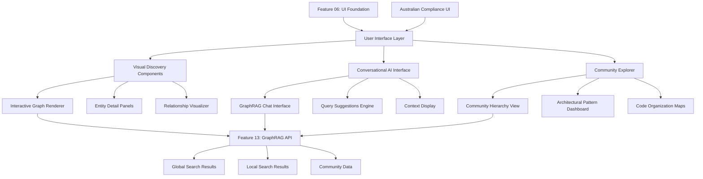

# Feature 13: GraphRAG-Powered Visual Discovery Interface

## Feature Overview

**Feature ID**: F13  
**Feature Name**: GraphRAG-Powered Visual Discovery Interface  
**Phase**: Phase 7 (DeepWiki Experience - Frontend)  
**Dependencies**: Feature 05 (Semantic Kernel Foundation), Feature 12 (GraphRAG Engine)
**Type**: Frontend Experience - Delivers DeepWiki-like Visual Code Exploration

### Business Value Proposition
Delivers a DeepWiki-like visual code exploration experience powered by Microsoft GraphRAG, enabling developers to interactively explore codebases through conversational AI, community-based architectural views, and relationship visualizations. This feature transforms the sophisticated GraphRAG backend capabilities into an intuitive, enterprise-grade user interface that provides superior code understanding compared to traditional documentation tools, with the added benefits of Australian data sovereignty and GraphRAG's proven 3x-90x accuracy improvements.

### User Impact
- **Development Teams**: Experience DeepWiki-style conversational code exploration with enterprise-grade accuracy and Australian data residency
- **Technical Architects**: Visualize architectural patterns and communities detected by Microsoft GraphRAG algorithms
- **Code Reviewers**: Navigate code change impacts through interactive relationship visualizations and multi-hop traversal
- **New Team Members**: Accelerate codebase understanding through guided visual discovery workflows and AI-powered explanations
- **Engineering Managers**: Access architectural health dashboards showing community structures and code organization
- **Enterprise Users**: Benefit from compliance-ready interface with audit trails and governance integration

### Success Criteria
- **Visual Performance**: Interactive graph renders within 3 seconds for repositories with 50K+ entities
- **Conversational Accuracy**: GraphRAG-powered chat achieves >90% user satisfaction with architectural questions
- **Discovery Workflow**: 80% of new users successfully explore codebase relationships within first session
- **Community Visualization**: Clear representation of Microsoft GraphRAG community detection with drill-down capabilities
- **Mobile Responsiveness**: Full functionality on tablets and mobile devices with touch-optimized interactions
- **Australian Compliance**: User interface maintains data residency compliance with audit logging
- **Integration Success**: Seamless workflows between visual exploration, conversational queries, and documentation viewing

### Dependencies
- **Feature 05**: Requires completed Semantic Kernel code analysis providing entity extraction and relationship data
- **Feature 13**: Requires GraphRAG knowledge graphs with community detection and global/local search capabilities
- **Feature 06**: Leverages existing Next.js web interface foundation with React components and GraphQL integration
- **Graph Visualization**: D3.js or yFiles for interactive network visualizations and community clustering
- **Real-time Updates**: WebSocket subscriptions for live GraphRAG query results and graph updates
- **Australian Infrastructure**: Frontend hosted on Azure Static Web Apps with Australia East deployment

## Technical Specification

### Architecture Overview

#### DeepWiki-Style User Experience Architecture
This feature delivers a DeepWiki-like experience with enterprise advantages through Microsoft GraphRAG integration:



#### Component Architecture (React + Next.js)
1. **Graph Visualization Layer**: Interactive network diagrams with community clustering
2. **Conversational Interface**: Chat-style GraphRAG query interface with context display
3. **Community Explorer**: Hierarchical navigation of architectural patterns and components  
4. **Entity Detail System**: Deep-dive panels for code entities with relationship exploration
5. **Search Integration**: Visual search results with graph highlighting and navigation
6. **Compliance Dashboard**: Australian sovereignty monitoring and audit trail display

### Frontend Technology Stack

#### Core Technologies (Extends Feature 06)
- **Next.js 15 + TypeScript**: Server-side rendering and optimized performance
- **React 18**: Component architecture with concurrent features and optimizations
- **GraphQL + Apollo Client**: Real-time subscriptions and intelligent caching
- **Tailwind CSS + shadcn/ui**: Consistent design system with accessibility support
- **Azure Static Web Apps**: Australian deployment with CDN and integrated authentication

#### Visualization Technologies
- **D3.js v7**: Custom graph layouts and interactive visualizations
- **react-force-graph-3d**: 3D network visualization for complex relationship exploration
- **Recharts**: Charts and metrics visualization for community analytics
- **Framer Motion**: Smooth animations and transitions for user interactions
- **React Virtual**: Efficient rendering of large entity lists and search results

#### Real-time Integration
- **Apollo GraphQL Subscriptions**: Live GraphRAG query results and progress updates
- **WebSocket Client**: Real-time graph construction progress and community updates
- **React Query**: Optimistic updates and background synchronization
- **Service Worker**: Offline capability for cached GraphRAG results and entities

### Component Specifications

#### Interactive Graph Visualization Component
```typescript
// GraphRAGVisualization.tsx
interface GraphRAGVisualizationProps {
  knowledgeGraphId: string;
  initialView?: 'communities' | 'entities' | 'relationships';
  focusEntityId?: string;
  height?: number;
  width?: number;
  enableCommunityColoring?: boolean;
  enableInteractiveExploration?: boolean;
  onEntitySelect?: (entityId: string) => void;
  onCommunitySelect?: (communityId: string) => void;
}

interface GraphNode {
  id: string;
  name: string;
  type: EntityType;
  communityId?: string;
  rank: number;
  x?: number;
  y?: number;
  z?: number;
  color?: string;
  size?: number;
  metadata: EntityMetadata;
}

interface GraphEdge {
  source: string;
  target: string;
  type: RelationshipType;
  weight: number;
  color?: string;
  width?: number;
}

interface CommunityCluster {
  id: string;
  title: string;
  summary: string;
  level: number;
  nodes: GraphNode[];
  bounds: BoundingBox;
  color: string;
}

export const GraphRAGVisualization: React.FC<GraphRAGVisualizationProps> = ({
  knowledgeGraphId,
  initialView = 'communities',
  focusEntityId,
  height = 800,
  width = 1200,
  enableCommunityColoring = true,
  enableInteractiveExploration = true,
  onEntitySelect,
  onCommunitySelect
}) => {
  const [graphData, setGraphData] = useState<{
    nodes: GraphNode[];
    links: GraphEdge[];
    communities: CommunityCluster[];
  }>({ nodes: [], links: [], communities: [] });
  
  const [selectedEntity, setSelectedEntity] = useState<GraphNode | null>(null);
  const [selectedCommunity, setSelectedCommunity] = useState<CommunityCluster | null>(null);
  const [viewMode, setViewMode] = useState<'2d' | '3d'>('2d');
  const [layoutAlgorithm, setLayoutAlgorithm] = useState<'force' | 'hierarchical' | 'community'>('community');

  // Load GraphRAG data
  const { data: knowledgeGraph, loading } = useQuery(GET_KNOWLEDGE_GRAPH, {
    variables: { id: knowledgeGraphId },
    pollInterval: 30000 // Refresh every 30 seconds
  });

  // Real-time updates
  const { data: graphUpdates } = useSubscription(KNOWLEDGE_GRAPH_UPDATES, {
    variables: { knowledgeGraphId }
  });

  useEffect(() => {
    if (knowledgeGraph?.knowledgeGraph) {
      const transformedData = transformGraphRAGData(knowledgeGraph.knowledgeGraph);
      setGraphData(transformedData);
    }
  }, [knowledgeGraph]);

  const handleNodeClick = useCallback((node: GraphNode) => {
    setSelectedEntity(node);
    onEntitySelect?.(node.id);
    
    // Highlight related entities
    highlightEntityNeighborhood(node.id);
  }, [onEntitySelect]);

  const handleCommunityClick = useCallback((community: CommunityCluster) => {
    setSelectedCommunity(community);
    onCommunitySelect?.(community.id);
    
    // Focus on community nodes
    focusOnCommunity(community.id);
  }, [onCommunitySelect]);

  const renderCommunityView = () => (
    <div className="relative w-full h-full">
      {/* Community-colored force graph */}
      <ForceGraph3D
        graphData={graphData}
        nodeLabel={(node: GraphNode) => `${node.name} (${node.type})`}
        nodeColor={(node: GraphNode) => getCommunityColor(node.communityId)}
        nodeSize={(node: GraphNode) => Math.max(4, Math.min(20, node.rank * 30))}
        linkColor={(edge: GraphEdge) => getRelationshipColor(edge.type)}
        linkWidth={(edge: GraphEdge) => Math.max(1, edge.weight * 3)}
        onNodeClick={handleNodeClick}
        backgroundColor="#1a1a2e"
        controlType="orbit"
        height={height}
        width={width}
      />
      
      {/* Community legend */}
      <CommunityLegend
        communities={graphData.communities}
        onCommunityToggle={handleCommunityToggle}
        className="absolute top-4 right-4"
      />
    </div>
  );

  const renderEntityView = () => (
    <div className="relative w-full h-full">
      {/* Entity-focused graph with relationship emphasis */}
      <ForceGraph2D
        graphData={graphData}
        nodeCanvasObject={renderCustomNode}
        linkCanvasObject={renderCustomEdge}
        onNodeClick={handleNodeClick}
        onLinkClick={handleRelationshipClick}
        height={height}
        width={width}
        cooldownTicks={100}
        d3AlphaDecay={0.0228}
        d3VelocityDecay={0.4}
      />
      
      {/* Entity filters */}
      <EntityFilters
        availableTypes={getAvailableEntityTypes(graphData.nodes)}
        onFilterChange={handleEntityFilter}
        className="absolute top-4 left-4"
      />
    </div>
  );

  if (loading) {
    return <GraphLoadingSkeleton height={height} width={width} />;
  }

  return (
    <div className="graph-visualization-container border rounded-lg bg-background">
      {/* Visualization controls */}
      <div className="flex items-center justify-between p-4 border-b">
        <div className="flex items-center space-x-4">
          <ViewModeToggle
            mode={viewMode}
            onModeChange={setViewMode}
          />
          <LayoutSelector
            algorithm={layoutAlgorithm}
            onAlgorithmChange={setLayoutAlgorithm}
          />
        </div>
        
        <div className="flex items-center space-x-2">
          <GraphSearchBox
            onEntitySearch={handleEntitySearch}
            placeholder="Search entities, relationships, or communities..."
          />
          <GraphExportButton
            graphData={graphData}
            format={['png', 'svg', 'json']}
          />
        </div>
      </div>

      {/* Main visualization area */}
      <div className="relative" style={{ height, width }}>
        {initialView === 'communities' ? renderCommunityView() : renderEntityView()}
        
        {/* Entity detail panel */}
        {selectedEntity && (
          <EntityDetailPanel
            entity={selectedEntity}
            relationships={getEntityRelationships(selectedEntity.id)}
            onClose={() => setSelectedEntity(null)}
            onNavigateToRelated={handleNavigateToRelated}
            className="absolute top-0 right-0 w-96 h-full bg-background/95 backdrop-blur-sm border-l"
          />
        )}
        
        {/* Community detail panel */}
        {selectedCommunity && (
          <CommunityDetailPanel
            community={selectedCommunity}
            entities={selectedCommunity.nodes}
            onClose={() => setSelectedCommunity(null)}
            onEntitySelect={handleNodeClick}
            className="absolute bottom-0 left-0 w-full h-64 bg-background/95 backdrop-blur-sm border-t"
          />
        )}
      </div>
    </div>
  );
};
```

#### Conversational GraphRAG Interface
```typescript
// GraphRAGChat.tsx
interface GraphRAGChatProps {
  knowledgeGraphId: string;
  initialContext?: QueryContext;
  enableGlobalSearch?: boolean;
  enableLocalSearch?: boolean;
  enableHybridSearch?: boolean;
  onEntityReference?: (entityId: string) => void;
  onCommunityReference?: (communityId: string) => void;
}

interface ChatMessage {
  id: string;
  content: string;
  role: 'user' | 'assistant';
  timestamp: Date;
  queryType?: GraphRAGQueryType;
  confidence?: number;
  sources?: GraphRAGSource[];
  contexts?: GraphRAGContext[];
  metadata?: MessageMetadata;
}

export const GraphRAGChat: React.FC<GraphRAGChatProps> = ({
  knowledgeGraphId,
  initialContext,
  enableGlobalSearch = true,
  enableLocalSearch = true,
  enableHybridSearch = true,
  onEntityReference,
  onCommunityReference
}) => {
  const [messages, setMessages] = useState<ChatMessage[]>([]);
  const [currentQuery, setCurrentQuery] = useState('');
  const [isProcessing, setIsProcessing] = useState(false);
  const [queryContext, setQueryContext] = useState<QueryContext | undefined>(initialContext);
  const [suggestedQueries, setSuggestedQueries] = useState<string[]>([]);

  // GraphRAG query mutations
  const [executeGlobalSearch] = useMutation(GRAPHRAG_GLOBAL_SEARCH);
  const [executeLocalSearch] = useMutation(GRAPHRAG_LOCAL_SEARCH);
  const [executeHybridSearch] = useMutation(GRAPHRAG_HYBRID_SEARCH);

  // Query suggestions based on repository analysis
  const { data: suggestions } = useQuery(GET_QUERY_SUGGESTIONS, {
    variables: { knowledgeGraphId },
    skip: !knowledgeGraphId
  });

  useEffect(() => {
    if (suggestions?.querysuggestions) {
      setSuggestedQueries(suggestions.querysuggestions.slice(0, 6));
    }
  }, [suggestions]);

  const handleSendMessage = useCallback(async (query: string, queryType: GraphRAGQueryType = 'HYBRID_SEARCH') => {
    if (!query.trim() || isProcessing) return;

    // Add user message
    const userMessage: ChatMessage = {
      id: generateId(),
      content: query,
      role: 'user',
      timestamp: new Date()
    };
    setMessages(prev => [...prev, userMessage]);
    setCurrentQuery('');
    setIsProcessing(true);

    try {
      let result: GraphRAGResult;
      
      // Execute appropriate search based on query type
      switch (queryType) {
        case 'GLOBAL_SEARCH':
          const globalResult = await executeGlobalSearch({
            variables: { knowledgeGraphId, query, context: queryContext }
          });
          result = globalResult.data.graphragGlobalSearch;
          break;
          
        case 'LOCAL_SEARCH':
          const localResult = await executeLocalSearch({
            variables: { knowledgeGraphId, query, context: queryContext }
          });
          result = localResult.data.graphragLocalSearch;
          break;
          
        default:
          const hybridResult = await executeHybridSearch({
            variables: { knowledgeGraphId, query, context: queryContext }
          });
          result = hybridResult.data.graphragHybridSearch;
      }

      // Add assistant response
      const assistantMessage: ChatMessage = {
        id: generateId(),
        content: result.response,
        role: 'assistant',
        timestamp: new Date(),
        queryType: result.queryType,
        confidence: result.confidence,
        sources: result.sources,
        contexts: result.contexts,
        metadata: {
          processingTime: result.processingTime,
          queryId: result.queryId
        }
      };
      setMessages(prev => [...prev, assistantMessage]);

    } catch (error) {
      console.error('GraphRAG query failed:', error);
      
      const errorMessage: ChatMessage = {
        id: generateId(),
        content: 'I apologize, but I encountered an error processing your query. Please try again or rephrase your question.',
        role: 'assistant',
        timestamp: new Date(),
        metadata: { error: error.message }
      };
      setMessages(prev => [...prev, errorMessage]);
    } finally {
      setIsProcessing(false);
    }
  }, [knowledgeGraphId, queryContext, isProcessing]);

  const handleSuggestedQuery = useCallback((query: string) => {
    handleSendMessage(query, 'HYBRID_SEARCH');
  }, [handleSendMessage]);

  const handleEntityClick = useCallback((entityId: string) => {
    onEntityReference?.(entityId);
  }, [onEntityReference]);

  const handleCommunityClick = useCallback((communityId: string) => {
    onCommunityReference?.(communityId);
  }, [onCommunityReference]);

  const renderMessage = (message: ChatMessage) => (
    <div key={message.id} className={`message ${message.role} mb-4 p-4 rounded-lg ${
      message.role === 'user' ? 'bg-primary text-primary-foreground ml-8' : 'bg-muted mr-8'
    }`}>
      <div className="message-content prose prose-sm max-w-none">
        <ReactMarkdown
          components={{
            a: ({ href, children }) => (
              <a 
                href={href}
                onClick={(e) => handleLinkClick(e, href)}
                className="text-blue-600 hover:text-blue-800 underline"
              >
                {children}
              </a>
            )
          }}
        >
          {message.content}
        </ReactMarkdown>
      </div>
      
      {/* Message metadata */}
      {message.role === 'assistant' && (
        <div className="message-metadata mt-3 pt-3 border-t border-border/50">
          <div className="flex items-center justify-between text-xs text-muted-foreground">
            <div className="flex items-center space-x-4">
              {message.queryType && (
                <span className="px-2 py-1 bg-secondary rounded">
                  {message.queryType.replace('_', ' ').toLowerCase()}
                </span>
              )}
              {message.confidence && (
                <span className="flex items-center">
                  <TrendingUp className="w-3 h-3 mr-1" />
                  {Math.round(message.confidence * 100)}% confidence
                </span>
              )}
            </div>
            <span>{formatDistanceToNow(message.timestamp)} ago</span>
          </div>
          
          {/* Sources */}
          {message.sources && message.sources.length > 0 && (
            <div className="mt-2">
              <details className="group">
                <summary className="cursor-pointer text-xs text-muted-foreground hover:text-foreground">
                  View {message.sources.length} source references
                </summary>
                <div className="mt-2 space-y-1">
                  {message.sources.map((source, index) => (
                    <SourceReference
                      key={index}
                      source={source}
                      onEntityClick={handleEntityClick}
                      className="text-xs"
                    />
                  ))}
                </div>
              </details>
            </div>
          )}
        </div>
      )}
    </div>
  );

  return (
    <div className="graphrag-chat-container flex flex-col h-full bg-background border rounded-lg">
      {/* Chat header */}
      <div className="chat-header flex items-center justify-between p-4 border-b">
        <div className="flex items-center space-x-2">
          <MessageCircle className="w-5 h-5" />
          <h3 className="font-semibold">GraphRAG Code Explorer</h3>
          <Badge variant="secondary">3x-90x more accurate</Badge>
        </div>
        
        <div className="flex items-center space-x-2">
          <QueryTypeSelector
            enableGlobal={enableGlobalSearch}
            enableLocal={enableLocalSearch}
            enableHybrid={enableHybridSearch}
            onTypeSelect={setDefaultQueryType}
          />
          <Button variant="ghost" size="sm" onClick={clearChat}>
            <RotateCcw className="w-4 h-4" />
          </Button>
        </div>
      </div>
      
      {/* Messages area */}
      <div className="messages-container flex-1 overflow-y-auto p-4 space-y-4">
        {messages.length === 0 ? (
          <div className="empty-state text-center py-12">
            <Bot className="w-12 h-12 mx-auto mb-4 text-muted-foreground" />
            <h4 className="text-lg font-medium mb-2">Explore your codebase with AI</h4>
            <p className="text-muted-foreground mb-6 max-w-md mx-auto">
              Ask questions about your code architecture, patterns, dependencies, or specific implementations.
              GraphRAG provides accurate answers by understanding your codebase relationships.
            </p>
            
            {/* Suggested queries */}
            {suggestedQueries.length > 0 && (
              <div className="suggested-queries">
                <p className="text-sm font-medium mb-3">Try asking:</p>
                <div className="grid grid-cols-1 md:grid-cols-2 gap-2 max-w-2xl mx-auto">
                  {suggestedQueries.map((query, index) => (
                    <Button
                      key={index}
                      variant="outline"
                      size="sm"
                      onClick={() => handleSuggestedQuery(query)}
                      className="text-left justify-start h-auto py-2 px-3"
                    >
                      <span className="truncate">{query}</span>
                    </Button>
                  ))}
                </div>
              </div>
            )}
          </div>
        ) : (
          <>
            {messages.map(renderMessage)}
            {isProcessing && (
              <div className="processing-indicator flex items-center space-x-2 p-4">
                <Loader2 className="w-4 h-4 animate-spin" />
                <span className="text-sm text-muted-foreground">
                  Processing with GraphRAG...
                </span>
              </div>
            )}
          </>
        )}
      </div>
      
      {/* Input area */}
      <div className="chat-input p-4 border-t">
        <div className="flex items-end space-x-2">
          <div className="flex-1">
            <Textarea
              value={currentQuery}
              onChange={(e) => setCurrentQuery(e.target.value)}
              placeholder="Ask about your codebase architecture, patterns, or specific implementations..."
              className="min-h-[80px] resize-none"
              onKeyDown={(e) => {
                if (e.key === 'Enter' && !e.shiftKey && !isProcessing) {
                  e.preventDefault();
                  handleSendMessage(currentQuery);
                }
              }}
            />
            <div className="flex items-center justify-between mt-2 text-xs text-muted-foreground">
              <span>Press Enter to send, Shift+Enter for new line</span>
              <span>{currentQuery.length}/2000</span>
            </div>
          </div>
          
          <Button
            onClick={() => handleSendMessage(currentQuery)}
            disabled={!currentQuery.trim() || isProcessing}
            size="lg"
            className="px-6"
          >
            <Send className="w-4 h-4" />
          </Button>
        </div>
      </div>
    </div>
  );
};
```

#### Community Explorer Component
```typescript
// CommunityExplorer.tsx
interface CommunityExplorerProps {
  knowledgeGraphId: string;
  onEntitySelect?: (entityId: string) => void;
  onCommunityAnalyze?: (communityId: string) => void;
  className?: string;
}

export const CommunityExplorer: React.FC<CommunityExplorerProps> = ({
  knowledgeGraphId,
  onEntitySelect,
  onCommunityAnalyze,
  className
}) => {
  const [selectedLevel, setSelectedLevel] = useState(0);
  const [expandedCommunities, setExpandedCommunities] = useState<Set<string>>(new Set());
  const [filterCriteria, setFilterCriteria] = useState<CommunityFilter>({});

  const { data: communities, loading } = useQuery(GET_GRAPH_COMMUNITIES, {
    variables: { knowledgeGraphId, level: selectedLevel }
  });

  const renderCommunityHierarchy = (communities: GraphCommunity[], level: number = 0) => {
    return communities.map(community => (
      <div key={community.id} className={`community-node level-${level}`}>
        <div className="community-header flex items-center justify-between p-3 hover:bg-muted/50 rounded-lg">
          <div className="flex items-center space-x-3">
            <Button
              variant="ghost"
              size="sm"
              onClick={() => toggleCommunityExpansion(community.id)}
            >
              {expandedCommunities.has(community.id) ? 
                <ChevronDown className="w-4 h-4" /> : 
                <ChevronRight className="w-4 h-4" />
              }
            </Button>
            
            <div className="community-info">
              <h4 className="font-medium text-sm">{community.title}</h4>
              <p className="text-xs text-muted-foreground">
                {community.entityIds.length} entities • Level {community.level}
              </p>
            </div>
          </div>
          
          <div className="community-actions flex items-center space-x-1">
            <Badge variant="secondary" className="text-xs">
              Rank: {community.rank.toFixed(2)}
            </Badge>
            <Button
              variant="ghost"
              size="sm"
              onClick={() => onCommunityAnalyze?.(community.id)}
            >
              <BarChart className="w-4 h-4" />
            </Button>
          </div>
        </div>
        
        {expandedCommunities.has(community.id) && (
          <div className="community-details ml-8 mt-2 p-3 bg-muted/20 rounded-lg">
            <p className="text-sm text-muted-foreground mb-3">{community.summary}</p>
            
            {/* Entity list */}
            <div className="entities-list">
              <h5 className="font-medium text-xs text-muted-foreground mb-2">ENTITIES</h5>
              <div className="grid grid-cols-1 gap-1">
                {community.entities.slice(0, 10).map(entity => (
                  <Button
                    key={entity.id}
                    variant="ghost"
                    size="sm"
                    onClick={() => onEntitySelect?.(entity.id)}
                    className="justify-start h-8 px-2"
                  >
                    <EntityTypeIcon type={entity.type} className="w-3 h-3 mr-2" />
                    <span className="text-xs truncate">{entity.name}</span>
                  </Button>
                ))}
                {community.entities.length > 10 && (
                  <span className="text-xs text-muted-foreground px-2">
                    +{community.entities.length - 10} more entities
                  </span>
                )}
              </div>
            </div>
            
            {/* Sub-communities */}
            {community.subCommunities && community.subCommunities.length > 0 && (
              <div className="sub-communities mt-4">
                <h5 className="font-medium text-xs text-muted-foreground mb-2">SUB-COMMUNITIES</h5>
                {renderCommunityHierarchy(community.subCommunities, level + 1)}
              </div>
            )}
          </div>
        )}
      </div>
    ));
  };

  return (
    <div className={`community-explorer ${className}`}>
      {/* Explorer header */}
      <div className="explorer-header flex items-center justify-between p-4 border-b">
        <h3 className="font-semibold flex items-center">
          <Layers className="w-5 h-5 mr-2" />
          Architecture Communities
        </h3>
        
        <div className="controls flex items-center space-x-2">
          <LevelSelector
            currentLevel={selectedLevel}
            maxLevel={3}
            onChange={setSelectedLevel}
          />
          <CommunityFilterDropdown
            filter={filterCriteria}
            onChange={setFilterCriteria}
          />
        </div>
      </div>
      
      {/* Communities tree */}
      <div className="communities-tree p-4 space-y-2 max-h-[600px] overflow-y-auto">
        {loading ? (
          <div className="space-y-2">
            {Array.from({ length: 5 }).map((_, i) => (
              <Skeleton key={i} className="h-12 w-full" />
            ))}
          </div>
        ) : communities?.graphCommunities ? (
          renderCommunityHierarchy(communities.graphCommunities)
        ) : (
          <div className="empty-state text-center py-8">
            <Layers className="w-8 h-8 mx-auto mb-2 text-muted-foreground" />
            <p className="text-sm text-muted-foreground">
              No communities detected at this level
            </p>
          </div>
        )}
      </div>
    </div>
  );
};
```

### GraphQL Client Integration

```typescript
// GraphRAG GraphQL Queries and Mutations
export const GET_KNOWLEDGE_GRAPH = gql`
  query GetKnowledgeGraph($id: ID!) {
    knowledgeGraph(id: $id) {
      id
      repositoryId
      status
      metrics {
        entityCount
        relationshipCount
        communityCount
        maxCommunityLevel
        communityDistribution
      }
      isQueryReady
    }
  }
`;

export const GET_GRAPH_COMMUNITIES = gql`
  query GetGraphCommunities($knowledgeGraphId: ID!, $level: Int) {
    graphCommunities(knowledgeGraphId: $knowledgeGraphId, level: $level) {
      id
      title
      summary
      entityIds
      level
      rank
      entities {
        id
        name
        type
        rank
      }
      subCommunities {
        id
        title
        level
        entityIds
      }
    }
  }
`;

export const GRAPHRAG_GLOBAL_SEARCH = gql`
  mutation GraphRAGGlobalSearch($knowledgeGraphId: ID!, $query: String!, $context: QueryContextInput) {
    graphragGlobalSearch(knowledgeGraphId: $knowledgeGraphId, query: $query, context: $context) {
      queryId
      response
      confidence
      processingTime
      queryType
      contexts {
        communityId
        content
        relevance
        type
      }
      sources {
        entityId
        filePath
        startLine
        endLine
        codeSnippet
        relevance
      }
    }
  }
`;

export const GRAPHRAG_LOCAL_SEARCH = gql`
  mutation GraphRAGLocalSearch($knowledgeGraphId: ID!, $query: String!, $focusEntityId: String, $context: QueryContextInput) {
    graphragLocalSearch(knowledgeGraphId: $knowledgeGraphId, query: $query, focusEntityId: $focusEntityId, context: $context) {
      queryId
      response
      confidence
      processingTime
      queryType
      contexts {
        entityId
        content
        relevance
        type
      }
      sources {
        entityId
        filePath
        startLine
        endLine
        codeSnippet
        relevance
      }
    }
  }
`;

export const GRAPHRAG_HYBRID_SEARCH = gql`
  mutation GraphRAGHybridSearch($knowledgeGraphId: ID!, $query: String!, $context: QueryContextInput) {
    graphragHybridSearch(knowledgeGraphId: $knowledgeGraphId, query: $query, context: $context) {
      queryId
      response
      confidence
      processingTime
      queryType
      contexts {
        communityId
        entityId
        content
        relevance
        type
      }
      sources {
        entityId
        filePath
        startLine
        endLine
        codeSnippet
        relevance
      }
    }
  }
`;

export const KNOWLEDGE_GRAPH_UPDATES = gql`
  subscription KnowledgeGraphUpdates($knowledgeGraphId: ID!) {
    knowledgeGraphBuildProgress(id: $knowledgeGraphId) {
      id
      status
      metrics {
        entityCount
        relationshipCount
        communityCount
      }
    }
  }
`;

export const GRAPHRAG_QUERY_PROGRESS = gql`
  subscription GraphRAGQueryProgress($queryId: ID!) {
    graphragQueryProgress(queryId: $queryId) {
      queryId
      response
      confidence
      processingTime
      contexts {
        content
        relevance
        type
      }
    }
  }
`;
```

### Implementation Roadmap

#### Phase 7A: Graph Visualization Foundation (Weeks 1-2)
**Interactive Network Visualization**
1. **D3.js Integration**
   - Set up D3.js v7 with React integration and TypeScript support
   - Implement force-directed graph layout with community clustering
   - Create interactive node and edge rendering with hover states
   - Add zoom, pan, and selection capabilities with touch support

2. **Community Visualization**
   - Implement community-based coloring and clustering visualization
   - Create hierarchical community navigation with drill-down capabilities
   - Add community boundary rendering and highlight interactions
   - Build community legend and filtering controls

#### Phase 7B: Conversational Interface (Weeks 2-3)
**GraphRAG Chat Implementation**
1. **Chat Interface Development**
   - Build React chat component with real-time message rendering
   - Implement GraphQL subscription integration for live query results
   - Add message formatting with markdown support and entity links
   - Create query type selection and context management

2. **Query Intelligence**
   - Implement query suggestions based on repository analysis
   - Add auto-complete functionality with entity and pattern suggestions
   - Create intelligent query routing (global vs local vs hybrid)
   - Build confidence display and source attribution components

#### Phase 7C: Discovery Workflows (Weeks 3-4)
**Integrated Exploration Experience**
1. **Entity Detail System**
   - Create comprehensive entity detail panels with relationship exploration
   - Implement entity neighborhood visualization with multi-hop traversal
   - Add source code integration with syntax highlighting and navigation
   - Build entity comparison and similarity exploration features

2. **Community Explorer**
   - Implement hierarchical community navigation with tree view
   - Create community analytics dashboard with metrics and patterns
   - Add community health indicators and architectural insights
   - Build community-to-code navigation workflows

#### Phase 7D: Production Polish (Weeks 4-5)
**Performance and User Experience**
1. **Performance Optimization**
   - Implement virtual scrolling for large entity lists and search results
   - Add progressive loading and caching for graph data
   - Optimize rendering performance for large graphs (50K+ entities)
   - Create responsive design with mobile-optimized touch interactions

2. **Australian Compliance UI**
   - Add data residency indicators and compliance status display
   - Implement audit trail visualization for user actions
   - Create compliance dashboard with sovereignty monitoring
   - Add privacy controls and data handling transparency

### Testing Strategy

#### Frontend Component Testing (80% coverage minimum)
```typescript
// GraphRAGVisualization.test.tsx
describe('GraphRAGVisualization', () => {
  test('renders graph with community clustering', async () => {
    render(<GraphRAGVisualization knowledgeGraphId="test-graph" />);
    
    await waitFor(() => {
      expect(screen.getByText('Community: Authentication Layer')).toBeInTheDocument();
    });
  });
  
  test('handles entity selection and detail display', async () => {
    const onEntitySelect = jest.fn();
    render(<GraphRAGVisualization knowledgeGraphId="test-graph" onEntitySelect={onEntitySelect} />);
    
    const entityNode = await screen.findByText('UserService');
    fireEvent.click(entityNode);
    
    expect(onEntitySelect).toHaveBeenCalledWith('entity-user-service');
  });
  
  test('filters entities by type and community', async () => {
    render(<GraphRAGVisualization knowledgeGraphId="test-graph" />);
    
    const filterButton = await screen.findByText('Filter');
    fireEvent.click(filterButton);
    
    const classFilter = screen.getByText('Classes only');
    fireEvent.click(classFilter);
    
    await waitFor(() => {
      expect(screen.queryByText('getUserAsync')).not.toBeInTheDocument();
    });
  });
});

// GraphRAGChat.test.tsx  
describe('GraphRAGChat', () => {
  test('sends GraphRAG query and displays response', async () => {
    render(<GraphRAGChat knowledgeGraphId="test-graph" />);
    
    const input = screen.getByPlaceholderText(/ask about your codebase/i);
    fireEvent.change(input, { target: { value: 'How does authentication work?' } });
    
    const sendButton = screen.getByRole('button', { name: /send/i });
    fireEvent.click(sendButton);
    
    await waitFor(() => {
      expect(screen.getByText(/authentication is implemented/i)).toBeInTheDocument();
    });
  });
  
  test('displays query confidence and sources', async () => {
    render(<GraphRAGChat knowledgeGraphId="test-graph" />);
    
    // Trigger query that returns sources
    await sendTestQuery('Show me the authentication patterns');
    
    await waitFor(() => {
      expect(screen.getByText(/92% confidence/i)).toBeInTheDocument();
      expect(screen.getByText(/view 3 source references/i)).toBeInTheDocument();
    });
  });
  
  test('handles entity and community references in responses', async () => {
    const onEntityReference = jest.fn();
    render(<GraphRAGChat knowledgeGraphId="test-graph" onEntityReference={onEntityReference} />);
    
    await sendTestQuery('Tell me about UserService');
    
    const entityLink = await screen.findByText('UserService');
    fireEvent.click(entityLink);
    
    expect(onEntityReference).toHaveBeenCalledWith('entity-user-service');
  });
});
```

#### Integration Testing (30% coverage minimum)
- **End-to-End Graph Rendering**: Test complete pipeline from GraphRAG data to interactive visualization
- **Real-time Query Processing**: Validate chat interface with actual GraphRAG backend integration
- **Community Navigation**: Test hierarchical community exploration with drill-down workflows
- **Cross-Component Integration**: Verify seamless interaction between graph, chat, and explorer components
- **Performance**: Validate rendering performance with large repositories and complex queries

### Australian Compliance and Security

#### Data Sovereignty Interface Features
- **Compliance Status Display**: Real-time indicators showing Australian data residency compliance
- **Audit Trail Visualization**: Interactive timeline of user actions and GraphRAG queries
- **Data Handling Transparency**: Clear displays of where data is processed and stored
- **Privacy Controls**: User controls for data handling preferences and audit settings

#### Security Implementation
- **Secure GraphQL Integration**: Authentication and authorization for all GraphRAG operations
- **Content Security Policy**: Strict CSP headers for XSS protection with visualization libraries
- **Input Sanitization**: Comprehensive validation for user queries and graph interactions  
- **Audit Logging**: Complete client-side audit trail for compliance and security monitoring

## Quality Assurance

### Code Review Checkpoints
- [ ] Graph visualization renders efficiently for large repositories (50K+ entities)
- [ ] Conversational interface integrates seamlessly with GraphRAG backend APIs
- [ ] Community exploration provides meaningful architectural insights
- [ ] Mobile responsiveness maintains full functionality on tablets and phones
- [ ] Australian compliance indicators are prominently displayed and accurate
- [ ] Real-time updates work correctly for graph construction and query progress
- [ ] Integration with existing Features 05 and 13 is seamless and error-free
- [ ] Performance meets targets for interactive exploration and query response

### Definition of Done Checklist
- [ ] All React components pass unit tests with >80% coverage
- [ ] Integration tests pass with >30% coverage covering GraphRAG backend integration
- [ ] Graph visualization renders smoothly for typical repository sizes (10-50K entities)
- [ ] Conversational interface provides accurate responses with source attribution
- [ ] Community explorer successfully displays Microsoft GraphRAG community detection results
- [ ] Mobile and tablet interfaces maintain full functionality with touch optimization
- [ ] Australian data sovereignty compliance is clearly indicated and monitored
- [ ] Real-time subscriptions work correctly for graph updates and query progress
- [ ] Performance benchmarks met for graph rendering and query response times
- [ ] Accessibility standards (WCAG 2.1 AA) achieved across all interface components

## Conclusion

Feature 14 delivers the complete DeepWiki-like user experience for Archie, transforming the sophisticated Microsoft GraphRAG backend capabilities into an intuitive, enterprise-grade visual discovery interface. By combining interactive graph visualization, conversational AI exploration, and community-based architectural insights, this feature provides developers with an unprecedented tool for understanding complex codebases.

The interface maintains the enterprise advantages of Australian data sovereignty, superior GraphRAG accuracy, and compliance-ready audit trails while delivering a user experience that rivals or exceeds open-source alternatives like DeepWiki. This foundation directly supports Feature 14 (Enterprise Analytics) while delivering immediate value through visual code exploration and conversational AI assistance powered by Microsoft's proven GraphRAG methodology.