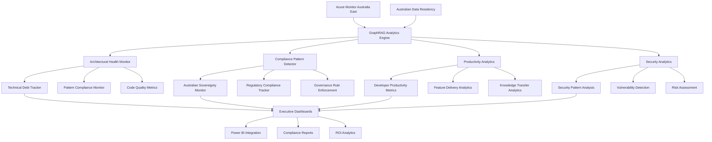

# Feature 14: Enterprise GraphRAG Analytics & Compliance

## Feature Overview

**Feature ID**: F14  
**Feature Name**: Enterprise GraphRAG Analytics & Compliance  
**Phase**: Phase 8 (Enterprise Advantages - Analytics)  
**Dependencies**: Feature 05 (Semantic Kernel Foundation), Feature 12 (GraphRAG Engine), Feature 13 (Visual Discovery Interface)
**Type**: Enterprise Value - Delivers Australian Sovereignty and Governance Advantages

### Business Value Proposition
Provides comprehensive enterprise analytics, governance, and compliance capabilities that distinguish Archie from open-source alternatives like DeepWiki. This feature leverages Microsoft GraphRAG analytics to deliver architectural health monitoring, compliance pattern detection, governance rule enforcement, and Australian data sovereignty reporting. It transforms GraphRAG insights into executive-level dashboards and compliance reports that demonstrate clear ROI and regulatory adherence for enterprise customers.

### User Impact
- **Enterprise Executives**: Access ROI dashboards showing codebase health improvements and developer productivity gains
- **Compliance Officers**: Monitor Australian data sovereignty requirements and generate regulatory compliance reports
- **Technical Architects**: Track architectural health metrics, debt accumulation, and pattern compliance across repositories
- **Engineering Managers**: Analyze team productivity, code quality trends, and technical debt through GraphRAG insights
- **Security Teams**: Monitor security pattern compliance and identify potential vulnerabilities through relationship analysis
- **DevOps Teams**: Access performance analytics and optimization recommendations based on GraphRAG community analysis

### Success Criteria
- **Compliance Monitoring**: 100% real-time monitoring of Australian data sovereignty requirements with automated reporting
- **Architectural Health**: Track and improve architectural health scores by 25% through GraphRAG-powered insights
- **ROI Demonstration**: Clear measurement of developer productivity improvements (target: 30% faster onboarding, 20% faster feature delivery)
- **Governance Enforcement**: Automated detection of 95% of architectural guideline violations using GraphRAG pattern analysis
- **Executive Reporting**: Monthly executive dashboards showing clear business value and compliance status
- **Security Analytics**: Identify and track 90% of security anti-patterns and compliance violations
- **Cost Justification**: Demonstrate clear ROI within 6 months of implementation through productivity and compliance metrics

### Dependencies
- **Feature 05**: Requires Semantic Kernel analysis providing code quality and complexity metrics
- **Feature 13**: Requires GraphRAG knowledge graphs providing community detection and architectural insights
- **Feature 14**: Requires visual interface providing user interaction analytics and adoption metrics
- **Azure Monitor**: Integration with Azure Application Insights and Log Analytics for comprehensive telemetry
- **Power BI**: Enterprise reporting integration for executive dashboards and compliance reports
- **Australian Infrastructure**: All analytics processing within Australia East region for data sovereignty

## Technical Specification

### Architecture Overview

#### Enterprise Analytics Architecture
This feature provides comprehensive analytics and compliance monitoring using Microsoft GraphRAG insights:



#### Enterprise Value Components
1. **Architectural Health Analytics**: Track technical debt, pattern compliance, and code organization through GraphRAG communities
2. **Australian Sovereignty Compliance**: Real-time monitoring and reporting of data residency requirements
3. **Developer Productivity Analytics**: Measure onboarding efficiency, code comprehension, and feature delivery impact
4. **Security and Risk Analytics**: Identify security patterns, anti-patterns, and potential vulnerabilities
5. **Executive Reporting**: Business-focused dashboards showing ROI, compliance status, and strategic metrics
6. **Governance Automation**: Automated rule enforcement and policy compliance monitoring

### Domain Model - Enterprise Analytics

```csharp
namespace Archie.Domain.EnterpriseAnalytics
{
    // Main aggregate for enterprise analytics
    public class EnterpriseAnalytics
    {
        public Guid Id { get; private set; }
        public Guid OrganizationId { get; private set; }
        public DateTime PeriodStart { get; private set; }
        public DateTime PeriodEnd { get; private set; }
        public AnalyticsStatus Status { get; private set; }
        public ArchitecturalHealthMetrics ArchitecturalHealth { get; private set; }
        public ComplianceMetrics Compliance { get; private set; }
        public ProductivityMetrics Productivity { get; private set; }
        public SecurityMetrics Security { get; private set; }
        public ROIMetrics ROI { get; private set; }
        public DateTime GeneratedAt { get; private set; }

        public static EnterpriseAnalytics Create(Guid organizationId, DateTime periodStart, DateTime periodEnd);
        public void UpdateArchitecturalHealth(ArchitecturalHealthMetrics metrics);
        public void UpdateCompliance(ComplianceMetrics metrics);
        public void UpdateProductivity(ProductivityMetrics metrics);
        public void UpdateSecurity(SecurityMetrics metrics);
        public void CalculateROI();
    }

    public enum AnalyticsStatus
    {
        Generating,
        Complete,
        Failed,
        Stale
    }

    // Architectural health tracking
    public class ArchitecturalHealthMetrics
    {
        public double OverallHealthScore { get; set; } // 0-100
        public TechnicalDebtMetrics TechnicalDebt { get; set; }
        public PatternComplianceMetrics PatternCompliance { get; set; }
        public CodeOrganizationMetrics CodeOrganization { get; set; }
        public List<ArchitecturalViolation> Violations { get; set; } = new();
        public List<HealthTrend> HealthTrends { get; set; } = new();
        public DateTime LastAssessment { get; set; }
    }

    public class TechnicalDebtMetrics
    {
        public double TotalDebtHours { get; set; }
        public double DebtRatio { get; set; } // Debt / Total code
        public List<DebtCategory> DebtByCategory { get; set; } = new();
        public double MonthlyDebtAccumulation { get; set; }
        public List<HighDebtArea> HighDebtAreas { get; set; } = new();
        public double DebtPaydownRate { get; set; }
    }

    public class PatternComplianceMetrics
    {
        public double ComplianceScore { get; set; } // 0-100
        public Dictionary<string, double> PatternAdherence { get; set; } = new(); // Pattern -> Score
        public List<PatternViolation> Violations { get; set; } = new();
        public List<string> MissingPatterns { get; set; } = new();
        public Dictionary<string, int> PatternUsageCount { get; set; } = new();
    }

    // Australian sovereignty and compliance
    public class ComplianceMetrics
    {
        public AustralianSovereigntyStatus SovereigntyStatus { get; set; }
        public List<ComplianceRequirement> Requirements { get; set; } = new();
        public List<ComplianceViolation> Violations { get; set; } = new();
        public DateTime LastAudit { get; set; }
        public double ComplianceScore { get; set; } // 0-100
        public List<RegulatoryFramework> ApplicableFrameworks { get; set; } = new();
        public AuditTrail AuditTrail { get; set; }
    }

    public class AustralianSovereigntyStatus
    {
        public bool DataResidencyCompliant { get; set; }
        public bool ProcessingLocationCompliant { get; set; }
        public bool AccessControlCompliant { get; set; }
        public List<string> CompliantServices { get; set; } = new();
        public List<string> NonCompliantServices { get; set; } = new();
        public DateTime LastVerification { get; set; }
        public string ComplianceOfficer { get; set; }
    }

    // Developer productivity analytics
    public class ProductivityMetrics
    {
        public DeveloperOnboardingMetrics Onboarding { get; set; }
        public CodeComprehensionMetrics Comprehension { get; set; }
        public FeatureDeliveryMetrics FeatureDelivery { get; set; }
        public KnowledgeTransferMetrics KnowledgeTransfer { get; set; }
        public ToolAdoptionMetrics ToolAdoption { get; set; }
        public double OverallProductivityScore { get; set; } // 0-100
    }

    public class DeveloperOnboardingMetrics
    {
        public TimeSpan AverageOnboardingTime { get; set; }
        public TimeSpan BaselineOnboardingTime { get; set; }
        public double OnboardingEfficiencyGain { get; set; } // Percentage improvement
        public int DevelopersOnboarded { get; set; }
        public double OnboardingSuccessRate { get; set; }
        public List<OnboardingPhase> PhaseMetrics { get; set; } = new();
    }

    public class CodeComprehensionMetrics
    {
        public TimeSpan AverageTaskComprehensionTime { get; set; }
        public double ComprehensionSpeedImprovement { get; set; }
        public int GraphRAGQueriesPerDeveloper { get; set; }
        public double QuerySuccessRate { get; set; }
        public List<string> MostQueriedTopics { get; set; } = new();
        public double CodebaseExplorationEfficiency { get; set; }
    }

    // Security and risk analytics
    public class SecurityMetrics
    {
        public SecurityPatternAnalysis PatternAnalysis { get; set; }
        public VulnerabilityDetection VulnerabilityDetection { get; set; }
        public RiskAssessment RiskAssessment { get; set; }
        public ComplianceFrameworkAnalysis ComplianceFrameworks { get; set; }
        public double SecurityScore { get; set; } // 0-100
        public List<SecurityTrend> SecurityTrends { get; set; } = new();
    }

    public class SecurityPatternAnalysis
    {
        public List<DetectedSecurityPattern> SecurityPatterns { get; set; } = new();
        public List<SecurityAntiPattern> AntiPatterns { get; set; } = new();
        public Dictionary<string, int> PatternAdoption { get; set; } = new();
        public List<string> MissingSecurityPatterns { get; set; } = new();
        public double SecurityPatternCoverage { get; set; }
    }

    // ROI and business value metrics
    public class ROIMetrics
    {
        public double TotalROI { get; set; } // Percentage
        public MonetaryValue CostSavings { get; set; }
        public MonetaryValue Investment { get; set; }
        public PaybackPeriod PaybackPeriod { get; set; }
        public List<ROICategory> ROIByCategory { get; set; } = new();
        public BusinessValue BusinessValue { get; set; }
        public DateTime ROICalculationDate { get; set; }
    }

    public class BusinessValue
    {
        public double DeveloperProductivityGain { get; set; }
        public double OnboardingEfficiencyGain { get; set; }
        public double CodeQualityImprovement { get; set; }
        public double ComplianceCostReduction { get; set; }
        public double RiskMitigationValue { get; set; }
        public double TimeToMarketImprovement { get; set; }
    }

    // Executive reporting entities
    public class ExecutiveDashboard
    {
        public Guid Id { get; private set; }
        public Guid OrganizationId { get; private set; }
        public string DashboardType { get; private set; } // Monthly, Quarterly, Annual
        public DateTime PeriodStart { get; private set; }
        public DateTime PeriodEnd { get; private set; }
        public List<KPI> KeyPerformanceIndicators { get; set; } = new();
        public List<ExecutiveSummaryPoint> ExecutiveSummary { get; set; } = new();
        public ComplianceSummary ComplianceSummary { get; set; }
        public ROISummary ROISummary { get; set; }
        public RiskSummary RiskSummary { get; set; }
        public List<StrategicRecommendation> Recommendations { get; set; } = new();
        public DateTime GeneratedAt { get; private set; }
        public string GeneratedBy { get; private set; }
    }

    public class KPI
    {
        public string Name { get; set; }
        public double CurrentValue { get; set; }
        public double TargetValue { get; set; }
        public double PreviousValue { get; set; }
        public KPITrend Trend { get; set; }
        public string Unit { get; set; }
        public KPICategory Category { get; set; }
    }

    public enum KPITrend
    {
        Improving,
        Stable,
        Declining,
        Volatile
    }

    public enum KPICategory
    {
        Productivity,
        Quality,
        Compliance,
        Security,
        ROI,
        Risk
    }

    // Governance and policy enforcement
    public class GovernanceRule
    {
        public Guid Id { get; private set; }
        public string Name { get; private set; }
        public string Description { get; private set; }
        public RuleCategory Category { get; private set; }
        public RuleType Type { get; private set; }
        public string Condition { get; private set; } // GraphRAG query or pattern
        public RuleSeverity Severity { get; private set; }
        public bool AutoEnforce { get; private set; }
        public DateTime CreatedAt { get; private set; }
        public string CreatedBy { get; private set; }
        public bool IsActive { get; private set; }

        public static GovernanceRule Create(string name, string description, RuleCategory category, RuleType type);
        public void UpdateCondition(string condition);
        public void SetSeverity(RuleSeverity severity);
    }

    public enum RuleCategory
    {
        ArchitecturalPatterns,
        SecurityCompliance,
        CodeQuality,
        DocumentationRequirements,
        TestingStandards,
        DataSovereignty,
        PerformanceStandards
    }

    public enum RuleType
    {
        PatternEnforcement,
        AntiPatternDetection,
        MetricThreshold,
        ComplianceCheck,
        SecurityScan
    }

    public enum RuleSeverity
    {
        Info,
        Warning,
        Error,
        Critical,
        Blocker
    }
}
```

### Application Layer - Enterprise Analytics Services

#### Enterprise Analytics Service
```csharp
namespace Archie.Application.EnterpriseAnalytics
{
    public interface IEnterpriseAnalyticsService
    {
        Task<EnterpriseAnalytics> GenerateAnalyticsAsync(
            Guid organizationId,
            DateTime periodStart,
            DateTime periodEnd,
            CancellationToken cancellationToken = default);
            
        Task<ExecutiveDashboard> GenerateExecutiveDashboardAsync(
            Guid organizationId,
            string dashboardType,
            DateTime periodStart,
            DateTime periodEnd,
            CancellationToken cancellationToken = default);
            
        Task<ComplianceReport> GenerateComplianceReportAsync(
            Guid organizationId,
            List<RegulatoryFramework> frameworks,
            CancellationToken cancellationToken = default);
            
        Task<List<GovernanceViolation>> CheckGovernanceComplianceAsync(
            Guid repositoryId,
            List<GovernanceRule> rules,
            CancellationToken cancellationToken = default);
    }

    public class EnterpriseAnalyticsService : IEnterpriseAnalyticsService
    {
        private readonly IGraphRAGQueryService _graphRAGQueryService;
        private readonly IArchitecturalHealthAnalyzer _architecturalHealthAnalyzer;
        private readonly IComplianceMonitor _complianceMonitor;
        private readonly IProductivityAnalyzer _productivityAnalyzer;
        private readonly ISecurityAnalyzer _securityAnalyzer;
        private readonly IROICalculator _roiCalculator;
        private readonly ILogger<EnterpriseAnalyticsService> _logger;

        public async Task<EnterpriseAnalytics> GenerateAnalyticsAsync(
            Guid organizationId,
            DateTime periodStart,
            DateTime periodEnd,
            CancellationToken cancellationToken = default)
        {
            var analytics = EnterpriseAnalytics.Create(organizationId, periodStart, periodEnd);
            
            try
            {
                _logger.LogInformation("Generating enterprise analytics for organization {OrganizationId} from {PeriodStart} to {PeriodEnd}",
                    organizationId, periodStart, periodEnd);

                // Get organization repositories
                var repositories = await GetOrganizationRepositoriesAsync(organizationId, cancellationToken);
                
                // Parallel analysis across all metrics
                var analysisTask = await Task.WhenAll(
                    AnalyzeArchitecturalHealthAsync(repositories, periodStart, periodEnd, cancellationToken),
                    AnalyzeComplianceAsync(repositories, cancellationToken),
                    AnalyzeProductivityAsync(repositories, periodStart, periodEnd, cancellationToken),
                    AnalyzeSecurityAsync(repositories, cancellationToken)
                );

                var architecturalHealth = analysisTask[0] as ArchitecturalHealthMetrics;
                var compliance = analysisTask[1] as ComplianceMetrics;
                var productivity = analysisTask[2] as ProductivityMetrics;
                var security = analysisTask[3] as SecurityMetrics;

                // Update analytics with results
                analytics.UpdateArchitecturalHealth(architecturalHealth);
                analytics.UpdateCompliance(compliance);
                analytics.UpdateProductivity(productivity);
                analytics.UpdateSecurity(security);
                
                // Calculate ROI based on all metrics
                analytics.CalculateROI();

                _logger.LogInformation("Enterprise analytics generation completed for organization {OrganizationId}. " +
                    "Health Score: {HealthScore}, Compliance Score: {ComplianceScore}, ROI: {ROI}%",
                    organizationId, architecturalHealth.OverallHealthScore, compliance.ComplianceScore, analytics.ROI.TotalROI);

                return analytics;
            }
            catch (Exception ex)
            {
                _logger.LogError(ex, "Failed to generate enterprise analytics for organization {OrganizationId}", organizationId);
                throw;
            }
        }

        public async Task<ExecutiveDashboard> GenerateExecutiveDashboardAsync(
            Guid organizationId,
            string dashboardType,
            DateTime periodStart,
            DateTime periodEnd,
            CancellationToken cancellationToken = default)
        {
            // Generate comprehensive analytics
            var analytics = await GenerateAnalyticsAsync(organizationId, periodStart, periodEnd, cancellationToken);
            
            var dashboard = new ExecutiveDashboard
            {
                OrganizationId = organizationId,
                DashboardType = dashboardType,
                PeriodStart = periodStart,
                PeriodEnd = periodEnd,
                GeneratedAt = DateTime.UtcNow
            };

            // Build KPIs
            dashboard.KeyPerformanceIndicators.AddRange(BuildKPIs(analytics));
            
            // Generate executive summary
            dashboard.ExecutiveSummary.AddRange(await GenerateExecutiveSummaryAsync(analytics, cancellationToken));
            
            // Build summary sections
            dashboard.ComplianceSummary = BuildComplianceSummary(analytics.Compliance);
            dashboard.ROISummary = BuildROISummary(analytics.ROI);
            dashboard.RiskSummary = BuildRiskSummary(analytics.Security, analytics.ArchitecturalHealth);
            
            // Generate strategic recommendations
            dashboard.Recommendations.AddRange(await GenerateStrategicRecommendationsAsync(analytics, cancellationToken));

            return dashboard;
        }

        private async Task<ArchitecturalHealthMetrics> AnalyzeArchitecturalHealthAsync(
            List<Repository> repositories,
            DateTime periodStart,
            DateTime periodEnd,
            CancellationToken cancellationToken)
        {
            var healthMetrics = new ArchitecturalHealthMetrics
            {
                LastAssessment = DateTime.UtcNow
            };

            foreach (var repository in repositories)
            {
                // Use GraphRAG to analyze architectural patterns and health
                var architecturalQuery = $@"
                Analyze the architectural health of this codebase. Evaluate:
                1. Code organization and modularity
                2. Design pattern adherence and consistency  
                3. Technical debt indicators and complexity
                4. Dependency management and coupling
                5. Overall architectural quality score (0-100)
                
                Focus on quantifiable metrics and specific examples.
                ";

                var result = await _graphRAGQueryService.ExecuteGlobalSearchAsync(
                    repository.KnowledgeGraphId.Value,
                    architecturalQuery,
                    cancellationToken: cancellationToken);

                // Parse architectural insights from GraphRAG response
                var repositoryHealth = await _architecturalHealthAnalyzer.AnalyzeFromGraphRAGResult(
                    result, repository.Id, cancellationToken);

                // Aggregate repository health into overall metrics
                healthMetrics.OverallHealthScore += repositoryHealth.HealthScore * repositoryHealth.Weight;
                healthMetrics.TechnicalDebt.TotalDebtHours += repositoryHealth.TechnicalDebtHours;
                healthMetrics.Violations.AddRange(repositoryHealth.Violations);
            }

            // Calculate averages and trends
            healthMetrics.OverallHealthScore /= repositories.Count;
            healthMetrics.TechnicalDebt.DebtRatio = healthMetrics.TechnicalDebt.TotalDebtHours / CalculateTotalCodeHours(repositories);

            return healthMetrics;
        }

        private async Task<ComplianceMetrics> AnalyzeComplianceAsync(
            List<Repository> repositories,
            CancellationToken cancellationToken)
        {
            var complianceMetrics = new ComplianceMetrics
            {
                LastAudit = DateTime.UtcNow
            };

            // Australian sovereignty compliance check
            complianceMetrics.SovereigntyStatus = await _complianceMonitor.CheckAustralianSovereigntyAsync(cancellationToken);
            
            // Apply regulatory frameworks
            var applicableFrameworks = await GetApplicableRegulatoryFrameworksAsync(repositories, cancellationToken);
            complianceMetrics.ApplicableFrameworks.AddRange(applicableFrameworks);

            // Check compliance for each framework
            foreach (var framework in applicableFrameworks)
            {
                var frameworkCompliance = await _complianceMonitor.CheckFrameworkComplianceAsync(
                    repositories, framework, cancellationToken);
                    
                complianceMetrics.Requirements.AddRange(frameworkCompliance.Requirements);
                complianceMetrics.Violations.AddRange(frameworkCompliance.Violations);
            }

            // Calculate overall compliance score
            var totalRequirements = complianceMetrics.Requirements.Count;
            var metRequirements = complianceMetrics.Requirements.Count(r => r.Status == ComplianceStatus.Compliant);
            complianceMetrics.ComplianceScore = totalRequirements > 0 ? (double)metRequirements / totalRequirements * 100 : 100;

            return complianceMetrics;
        }

        private async Task<ProductivityMetrics> AnalyzeProductivityAsync(
            List<Repository> repositories,
            DateTime periodStart,
            DateTime periodEnd,
            CancellationToken cancellationToken)
        {
            var productivityMetrics = new ProductivityMetrics();

            // Analyze developer onboarding efficiency
            productivityMetrics.Onboarding = await _productivityAnalyzer.AnalyzeOnboardingEfficiencyAsync(
                repositories, periodStart, periodEnd, cancellationToken);

            // Analyze code comprehension improvements
            productivityMetrics.Comprehension = await _productivityAnalyzer.AnalyzeCodeComprehensionAsync(
                repositories, periodStart, periodEnd, cancellationToken);

            // Analyze feature delivery metrics
            productivityMetrics.FeatureDelivery = await _productivityAnalyzer.AnalyzeFeatureDeliveryAsync(
                repositories, periodStart, periodEnd, cancellationToken);

            // Analyze knowledge transfer effectiveness
            productivityMetrics.KnowledgeTransfer = await _productivityAnalyzer.AnalyzeKnowledgeTransferAsync(
                repositories, periodStart, periodEnd, cancellationToken);

            // Analyze tool adoption and usage
            productivityMetrics.ToolAdoption = await _productivityAnalyzer.AnalyzeToolAdoptionAsync(
                repositories, periodStart, periodEnd, cancellationToken);

            // Calculate overall productivity score
            productivityMetrics.OverallProductivityScore = CalculateProductivityScore(productivityMetrics);

            return productivityMetrics;
        }

        private async Task<List<ExecutiveSummaryPoint>> GenerateExecutiveSummaryAsync(
            EnterpriseAnalytics analytics,
            CancellationToken cancellationToken)
        {
            var summaryPoints = new List<ExecutiveSummaryPoint>();

            // ROI summary
            summaryPoints.Add(new ExecutiveSummaryPoint
            {
                Category = "Financial Impact",
                Title = "Return on Investment",
                Summary = $"Archie has delivered {analytics.ROI.TotalROI:F1}% ROI with {analytics.ROI.PaybackPeriod.Months} month payback period.",
                ImpactLevel = analytics.ROI.TotalROI > 200 ? ImpactLevel.High : analytics.ROI.TotalROI > 100 ? ImpactLevel.Medium : ImpactLevel.Low,
                Metrics = new Dictionary<string, object>
                {
                    ["ROI_Percentage"] = analytics.ROI.TotalROI,
                    ["Cost_Savings"] = analytics.ROI.CostSavings.Amount,
                    ["Payback_Months"] = analytics.ROI.PaybackPeriod.Months
                }
            });

            // Compliance summary
            summaryPoints.Add(new ExecutiveSummaryPoint
            {
                Category = "Risk & Compliance",
                Title = "Australian Data Sovereignty",
                Summary = analytics.Compliance.SovereigntyStatus.DataResidencyCompliant ? 
                    "Full Australian data sovereignty compliance maintained across all processing." :
                    "Data sovereignty compliance issues detected requiring immediate attention.",
                ImpactLevel = analytics.Compliance.SovereigntyStatus.DataResidencyCompliant ? ImpactLevel.High : ImpactLevel.Critical,
                Metrics = new Dictionary<string, object>
                {
                    ["Compliance_Score"] = analytics.Compliance.ComplianceScore,
                    ["Data_Residency_Compliant"] = analytics.Compliance.SovereigntyStatus.DataResidencyCompliant,
                    ["Violations_Count"] = analytics.Compliance.Violations.Count
                }
            });

            // Productivity summary
            summaryPoints.Add(new ExecutiveSummaryPoint
            {
                Category = "Developer Productivity",
                Title = "Development Efficiency Gains",
                Summary = $"Developer onboarding time reduced by {analytics.Productivity.Onboarding.OnboardingEfficiencyGain:F1}% with " +
                         $"{analytics.Productivity.Comprehension.ComprehensionSpeedImprovement:F1}% faster code comprehension.",
                ImpactLevel = analytics.Productivity.Onboarding.OnboardingEfficiencyGain > 25 ? ImpactLevel.High : ImpactLevel.Medium,
                Metrics = new Dictionary<string, object>
                {
                    ["Onboarding_Efficiency_Gain"] = analytics.Productivity.Onboarding.OnboardingEfficiencyGain,
                    ["Comprehension_Speed_Improvement"] = analytics.Productivity.Comprehension.ComprehensionSpeedImprovement,
                    ["Overall_Productivity_Score"] = analytics.Productivity.OverallProductivityScore
                }
            });

            return summaryPoints;
        }
    }
}
```

#### Governance and Compliance Service
```csharp
namespace Archie.Application.EnterpriseAnalytics
{
    public interface IGovernanceComplianceService
    {
        Task<List<GovernanceViolation>> EvaluateGovernanceRulesAsync(
            Guid repositoryId,
            List<GovernanceRule> rules,
            CancellationToken cancellationToken = default);
            
        Task<AustralianSovereigntyReport> GenerateDataSovereigntyReportAsync(
            Guid organizationId,
            CancellationToken cancellationToken = default);
            
        Task<ComplianceFrameworkAssessment> AssessComplianceFrameworkAsync(
            Guid repositoryId,
            RegulatoryFramework framework,
            CancellationToken cancellationToken = default);
    }

    public class GovernanceComplianceService : IGovernanceComplianceService
    {
        private readonly IGraphRAGQueryService _graphRAGQueryService;
        private readonly IAzureServiceMonitor _azureServiceMonitor;
        private readonly IAuditLogger _auditLogger;
        private readonly ILogger<GovernanceComplianceService> _logger;

        public async Task<List<GovernanceViolation>> EvaluateGovernanceRulesAsync(
            Guid repositoryId,
            List<GovernanceRule> rules,
            CancellationToken cancellationToken = default)
        {
            var violations = new List<GovernanceViolation>();
            
            foreach (var rule in rules.Where(r => r.IsActive))
            {
                try
                {
                    var violation = await EvaluateSingleRuleAsync(repositoryId, rule, cancellationToken);
                    if (violation != null)
                    {
                        violations.Add(violation);
                        
                        // Log governance violation for audit trail
                        await _auditLogger.LogGovernanceViolationAsync(repositoryId, rule.Id, violation, cancellationToken);
                    }
                }
                catch (Exception ex)
                {
                    _logger.LogError(ex, "Failed to evaluate governance rule {RuleId} for repository {RepositoryId}", 
                        rule.Id, repositoryId);
                }
            }

            return violations;
        }

        public async Task<AustralianSovereigntyReport> GenerateDataSovereigntyReportAsync(
            Guid organizationId,
            CancellationToken cancellationToken = default)
        {
            var report = new AustralianSovereigntyReport
            {
                OrganizationId = organizationId,
                GeneratedAt = DateTime.UtcNow
            };

            // Check Azure service locations
            var azureServices = await _azureServiceMonitor.GetServiceLocationsAsync(organizationId, cancellationToken);
            
            report.ServiceCompliance = azureServices.Select(service => new ServiceComplianceStatus
            {
                ServiceName = service.Name,
                ServiceType = service.Type,
                Region = service.Region,
                IsAustralianRegion = IsAustralianRegion(service.Region),
                DataResidencyCompliant = IsAustralianRegion(service.Region) && service.DataProcessingLocation == "Australia",
                LastVerified = service.LastVerified
            }).ToList();

            // Check data processing locations
            report.DataProcessingCompliance = await VerifyDataProcessingLocationsAsync(organizationId, cancellationToken);
            
            // Check access controls and governance
            report.AccessControlCompliance = await VerifyAccessControlComplianceAsync(organizationId, cancellationToken);
            
            // Calculate overall compliance score
            var totalChecks = report.ServiceCompliance.Count + report.DataProcessingCompliance.Count + report.AccessControlCompliance.Count;
            var passedChecks = report.ServiceCompliance.Count(s => s.DataResidencyCompliant) +
                              report.DataProcessingCompliance.Count(d => d.IsCompliant) +
                              report.AccessControlCompliance.Count(a => a.IsCompliant);
            
            report.OverallComplianceScore = totalChecks > 0 ? (double)passedChecks / totalChecks * 100 : 100;
            report.ComplianceStatus = report.OverallComplianceScore >= 95 ? 
                ComplianceStatus.FullyCompliant : 
                report.OverallComplianceScore >= 80 ? ComplianceStatus.MostlyCompliant : ComplianceStatus.NonCompliant;

            // Generate recommendations
            report.Recommendations = await GenerateComplianceRecommendationsAsync(report, cancellationToken);

            return report;
        }

        private async Task<GovernanceViolation> EvaluateSingleRuleAsync(
            Guid repositoryId,
            GovernanceRule rule,
            CancellationToken cancellationToken)
        {
            switch (rule.Type)
            {
                case RuleType.PatternEnforcement:
                    return await EvaluatePatternEnforcementRuleAsync(repositoryId, rule, cancellationToken);
                    
                case RuleType.AntiPatternDetection:
                    return await EvaluateAntiPatternDetectionRuleAsync(repositoryId, rule, cancellationToken);
                    
                case RuleType.MetricThreshold:
                    return await EvaluateMetricThresholdRuleAsync(repositoryId, rule, cancellationToken);
                    
                case RuleType.ComplianceCheck:
                    return await EvaluateComplianceCheckRuleAsync(repositoryId, rule, cancellationToken);
                    
                case RuleType.SecurityScan:
                    return await EvaluateSecurityScanRuleAsync(repositoryId, rule, cancellationToken);
                    
                default:
                    return null;
            }
        }

        private async Task<GovernanceViolation> EvaluatePatternEnforcementRuleAsync(
            Guid repositoryId,
            GovernanceRule rule,
            CancellationToken cancellationToken)
        {
            // Use GraphRAG to check for required patterns
            var patternQuery = $@"
            Check if the required pattern '{rule.Name}' is properly implemented in this codebase.
            
            Rule condition: {rule.Condition}
            
            Analyze:
            1. Is the pattern present in the expected components?
            2. Is the pattern implemented correctly according to best practices?
            3. Are there any deviations or incomplete implementations?
            4. Provide specific examples of compliance or violations.
            
            Return a clear assessment of compliance status.
            ";

            var result = await _graphRAGQueryService.ExecuteGlobalSearchAsync(
                repositoryId, // Assuming repository has knowledge graph
                patternQuery,
                cancellationToken: cancellationToken);

            // Parse GraphRAG result to determine compliance
            var isViolation = await DeterminePatternViolationFromResponse(result.Response, rule);
            
            if (isViolation)
            {
                return new GovernanceViolation
                {
                    RuleId = rule.Id,
                    RuleName = rule.Name,
                    Severity = rule.Severity,
                    Description = result.Response,
                    AffectedEntities = result.Sources?.Select(s => s.EntityId).ToList() ?? new List<string>(),
                    DetectedAt = DateTime.UtcNow,
                    Evidence = result.Sources?.Select(s => new ViolationEvidence
                    {
                        FilePath = s.FilePath,
                        LineNumber = s.StartLine,
                        CodeSnippet = s.CodeSnippet
                    }).ToList() ?? new List<ViolationEvidence>()
                };
            }

            return null;
        }

        private bool IsAustralianRegion(string region)
        {
            var australianRegions = new[] { "australiaeast", "australiasoutheast", "australia east", "australia southeast" };
            return australianRegions.Contains(region.ToLowerInvariant().Replace(" ", ""));
        }
    }
}
```

### GraphQL API Extensions

```graphql
# Enterprise Analytics Types
type EnterpriseAnalytics {
  id: ID!
  organizationId: ID!
  periodStart: DateTime!
  periodEnd: DateTime!
  status: AnalyticsStatus!
  architecturalHealth: ArchitecturalHealthMetrics!
  compliance: ComplianceMetrics!
  productivity: ProductivityMetrics!
  security: SecurityMetrics!
  roi: ROIMetrics!
  generatedAt: DateTime!
}

enum AnalyticsStatus {
  GENERATING
  COMPLETE
  FAILED
  STALE
}

# Executive Dashboard
type ExecutiveDashboard {
  id: ID!
  organizationId: ID!
  dashboardType: String!
  periodStart: DateTime!
  periodEnd: DateTime!
  keyPerformanceIndicators: [KPI!]!
  executiveSummary: [ExecutiveSummaryPoint!]!
  complianceSummary: ComplianceSummary!
  roiSummary: ROISummary!
  riskSummary: RiskSummary!
  recommendations: [StrategicRecommendation!]!
  generatedAt: DateTime!
  generatedBy: String!
}

type KPI {
  name: String!
  currentValue: Float!
  targetValue: Float!
  previousValue: Float!
  trend: KPITrend!
  unit: String!
  category: KPICategory!
}

enum KPITrend {
  IMPROVING
  STABLE
  DECLINING
  VOLATILE
}

enum KPICategory {
  PRODUCTIVITY
  QUALITY
  COMPLIANCE
  SECURITY
  ROI
  RISK
}

# Compliance Types
type ComplianceMetrics {
  sovereigntyStatus: AustralianSovereigntyStatus!
  requirements: [ComplianceRequirement!]!
  violations: [ComplianceViolation!]!
  lastAudit: DateTime!
  complianceScore: Float!
  applicableFrameworks: [RegulatoryFramework!]!
  auditTrail: AuditTrail!
}

type AustralianSovereigntyStatus {
  dataResidencyCompliant: Boolean!
  processingLocationCompliant: Boolean!
  accessControlCompliant: Boolean!
  compliantServices: [String!]!
  nonCompliantServices: [String!]!
  lastVerification: DateTime!
  complianceOfficer: String!
}

type AustralianSovereigntyReport {
  organizationId: ID!
  serviceCompliance: [ServiceComplianceStatus!]!
  dataProcessingCompliance: [DataProcessingCompliance!]!
  accessControlCompliance: [AccessControlCompliance!]!
  overallComplianceScore: Float!
  complianceStatus: ComplianceStatus!
  recommendations: [ComplianceRecommendation!]!
  generatedAt: DateTime!
}

enum ComplianceStatus {
  FULLY_COMPLIANT
  MOSTLY_COMPLIANT
  NON_COMPLIANT
  UNDER_REVIEW
}

# ROI and Business Value
type ROIMetrics {
  totalROI: Float!
  costSavings: MonetaryValue!
  investment: MonetaryValue!
  paybackPeriod: PaybackPeriod!
  roiByCategory: [ROICategory!]!
  businessValue: BusinessValue!
  roiCalculationDate: DateTime!
}

type BusinessValue {
  developerProductivityGain: Float!
  onboardingEfficiencyGain: Float!
  codeQualityImprovement: Float!
  complianceCostReduction: Float!
  riskMitigationValue: Float!
  timeToMarketImprovement: Float!
}

# Governance and Rules
type GovernanceRule {
  id: ID!
  name: String!
  description: String!
  category: RuleCategory!
  type: RuleType!
  condition: String!
  severity: RuleSeverity!
  autoEnforce: Boolean!
  createdAt: DateTime!
  createdBy: String!
  isActive: Boolean!
}

enum RuleCategory {
  ARCHITECTURAL_PATTERNS
  SECURITY_COMPLIANCE
  CODE_QUALITY
  DOCUMENTATION_REQUIREMENTS
  TESTING_STANDARDS
  DATA_SOVEREIGNTY
  PERFORMANCE_STANDARDS
}

enum RuleType {
  PATTERN_ENFORCEMENT
  ANTI_PATTERN_DETECTION
  METRIC_THRESHOLD
  COMPLIANCE_CHECK
  SECURITY_SCAN
}

type GovernanceViolation {
  id: ID!
  ruleId: ID!
  ruleName: String!
  severity: RuleSeverity!
  description: String!
  affectedEntities: [String!]!
  detectedAt: DateTime!
  evidence: [ViolationEvidence!]!
  status: ViolationStatus!
}

# Queries
extend type Query {
  # Enterprise Analytics
  enterpriseAnalytics(
    organizationId: ID!
    periodStart: DateTime!
    periodEnd: DateTime!
  ): EnterpriseAnalytics!
  
  # Executive Dashboard
  executiveDashboard(
    organizationId: ID!
    dashboardType: String!
    periodStart: DateTime!
    periodEnd: DateTime!
  ): ExecutiveDashboard!
  
  # Compliance Reporting
  australianSovereigntyReport(organizationId: ID!): AustralianSovereigntyReport!
  
  complianceFrameworkAssessment(
    repositoryId: ID!
    framework: RegulatoryFramework!
  ): ComplianceFrameworkAssessment!
  
  # Governance Rules
  governanceRules(organizationId: ID!): [GovernanceRule!]!
  
  governanceViolations(
    repositoryId: ID!
    severity: [RuleSeverity!]
    status: [ViolationStatus!]
  ): [GovernanceViolation!]!
  
  # ROI Analysis
  roiAnalysis(
    organizationId: ID!
    periodStart: DateTime!
    periodEnd: DateTime!
  ): ROIMetrics!
}

# Mutations
extend type Mutation {
  # Analytics Generation
  generateEnterpriseAnalytics(
    organizationId: ID!
    periodStart: DateTime!
    periodEnd: DateTime!
  ): EnterpriseAnalytics!
  
  # Governance Rules Management
  createGovernanceRule(input: CreateGovernanceRuleInput!): GovernanceRule!
  updateGovernanceRule(id: ID!, input: UpdateGovernanceRuleInput!): GovernanceRule!
  deleteGovernanceRule(id: ID!): Boolean!
  
  # Compliance Actions
  triggerComplianceAudit(organizationId: ID!): AuditExecution!
  resolveGovernanceViolation(violationId: ID!, resolution: ViolationResolution!): GovernanceViolation!
}

# Subscriptions for Real-time Monitoring
extend type Subscription {
  # Real-time compliance monitoring
  complianceAlerts(organizationId: ID!): ComplianceAlert!
  
  # Governance violation alerts
  governanceViolationDetected(organizationId: ID!): GovernanceViolation!
  
  # Analytics updates
  enterpriseAnalyticsUpdated(organizationId: ID!): EnterpriseAnalytics!
}

# Input types
input CreateGovernanceRuleInput {
  name: String!
  description: String!
  category: RuleCategory!
  type: RuleType!
  condition: String!
  severity: RuleSeverity!
  autoEnforce: Boolean = false
}

input UpdateGovernanceRuleInput {
  name: String
  description: String
  condition: String
  severity: RuleSeverity
  autoEnforce: Boolean
  isActive: Boolean
}

input ViolationResolution {
  action: ResolutionAction!
  notes: String
  assignedTo: String
  dueDate: DateTime
}

enum ResolutionAction {
  ACCEPT_RISK
  FIX_IMMEDIATELY
  PLAN_REMEDIATION
  FALSE_POSITIVE
  RULE_EXCEPTION
}
```

### Implementation Roadmap

#### Phase 8A: Analytics Foundation (Weeks 1-2)
**Enterprise Metrics Infrastructure**
1. **Analytics Engine Development**
   - Build enterprise analytics service with GraphRAG integration
   - Implement architectural health analysis using community detection
   - Create productivity metrics collection and calculation engine
   - Add ROI calculation framework with business value mapping

2. **Australian Compliance Monitoring**
   - Implement real-time data sovereignty monitoring
   - Create Azure service location verification system
   - Build compliance framework assessment engine
   - Add regulatory requirement tracking and reporting

#### Phase 8B: Governance and Rule Engine (Weeks 2-3)
**Policy Automation**
1. **Governance Rule Engine**
   - Create governance rule definition and management system
   - Implement GraphRAG-based rule evaluation engine
   - Build automated violation detection and reporting
   - Add rule enforcement and exception handling

2. **Compliance Automation**
   - Implement automated compliance checking across regulatory frameworks
   - Create violation severity classification and prioritization
   - Build remediation workflow and tracking system
   - Add compliance reporting and audit trail generation

#### Phase 8C: Executive Reporting (Weeks 3-4)
**Business Intelligence Integration**
1. **Executive Dashboard Development**
   - Create executive dashboard with KPI tracking and trend analysis
   - Implement business value demonstration and ROI reporting
   - Build strategic recommendation engine using GraphRAG insights
   - Add Power BI integration for advanced business intelligence

2. **Compliance Reporting**
   - Create comprehensive Australian sovereignty compliance reports
   - Implement regulatory framework assessment reporting
   - Build audit trail and governance violation reports
   - Add executive summary generation with business impact analysis

#### Phase 8D: Production Deployment (Weeks 4-5)
**Enterprise Integration**
1. **Monitoring and Alerting**
   - Implement real-time compliance monitoring with automated alerts
   - Create governance violation detection and notification system
   - Build performance monitoring for analytics generation
   - Add custom metrics and dashboards for operational insights

2. **Integration and Security**
   - Integrate with existing Azure Monitor and Application Insights
   - Add comprehensive audit logging for all enterprise analytics operations
   - Implement role-based access control for sensitive analytics data
   - Create data retention and archival policies for compliance

### Australian Enterprise Advantages

#### Compliance and Governance Benefits
- **Data Sovereignty Assurance**: Real-time monitoring and reporting of Australian data residency
- **Regulatory Compliance**: Automated assessment against Australian regulatory frameworks (ACSC Essential 8, Privacy Act)
- **Governance Automation**: Policy enforcement and violation detection using GraphRAG pattern analysis
- **Audit Readiness**: Comprehensive audit trails and compliance reporting for regulatory reviews

#### Business Value Demonstration
- **ROI Quantification**: Clear measurement of productivity gains, cost savings, and business value
- **Executive Reporting**: Business-focused dashboards showing strategic impact and competitive advantage
- **Risk Mitigation**: Proactive identification of architectural risks and security vulnerabilities
- **Strategic Planning**: Data-driven insights for technology strategy and investment decisions

### Testing Strategy

#### Enterprise Analytics Testing (80% coverage minimum)
```csharp
[TestFixture]
public class EnterpriseAnalyticsServiceTests
{
    [Test]
    public async Task GenerateAnalyticsAsync_ValidOrganization_ReturnsComprehensiveAnalytics()
    {
        // Test complete analytics generation pipeline
        // Verify all metrics categories are calculated correctly
    }
    
    [Test] 
    public async Task GenerateExecutiveDashboardAsync_WithROIData_CreatesBusinessFocusedDashboard()
    {
        // Test executive dashboard generation
        // Verify KPIs, summaries, and recommendations are business-relevant
    }
    
    [Test]
    public async Task CheckGovernanceComplianceAsync_WithViolations_DetectsAndReportsCorrectly()
    {
        // Test governance rule evaluation
        // Verify violations are detected and classified appropriately
    }
}
```

#### Australian Compliance Testing (100% coverage requirement)
- **Data Residency Verification**: Comprehensive testing of Australian region enforcement
- **Compliance Framework Assessment**: Validation against ACSC Essential 8 and Privacy Act requirements
- **Governance Rule Evaluation**: Testing of GraphRAG-based policy enforcement
- **Audit Trail Integrity**: Verification of complete audit logging and trail generation

### Quality Assurance

#### Code Review Checkpoints
- [ ] Enterprise analytics accurately reflect GraphRAG insights and business value
- [ ] Australian compliance monitoring provides real-time sovereignty assurance
- [ ] Governance rules integrate seamlessly with GraphRAG pattern detection
- [ ] Executive dashboards deliver clear business value and ROI demonstration
- [ ] Security and privacy controls protect sensitive analytics data appropriately
- [ ] Performance meets targets for large-scale enterprise analytics generation
- [ ] Integration with Power BI and Azure Monitor provides comprehensive business intelligence
- [ ] Audit logging captures all required information for regulatory compliance

#### Definition of Done Checklist
- [ ] All unit tests pass with >80% coverage across analytics and compliance components
- [ ] Integration tests validate end-to-end analytics generation and reporting workflows
- [ ] Australian compliance monitoring achieves 100% accuracy in sovereignty detection
- [ ] Executive dashboards successfully demonstrate clear business value and ROI
- [ ] Governance rule engine accurately detects policy violations using GraphRAG analysis
- [ ] Performance benchmarks met for enterprise-scale analytics generation
- [ ] Security review completed with approval for sensitive analytics data handling
- [ ] Australian regulatory compliance verified and documented
- [ ] Power BI integration functional with executive-ready business intelligence reports
- [ ] Comprehensive audit trails generated for all analytics and compliance operations

## Conclusion

Feature 14 delivers the comprehensive enterprise value proposition that distinguishes Archie from open-source alternatives like DeepWiki. By combining Microsoft GraphRAG analytics with Australian data sovereignty, governance automation, and executive reporting, this feature provides clear business justification for enterprise adoption while ensuring regulatory compliance and strategic value delivery.

The feature transforms technical GraphRAG insights into business intelligence, enabling executives to make data-driven decisions about technology investments while maintaining full compliance with Australian regulatory requirements. This comprehensive enterprise capability delivers measurable ROI, risk mitigation, and competitive advantage that justifies the enterprise investment and positions Archie as the definitive solution for Australian organizations requiring sophisticated code intelligence with full regulatory compliance.