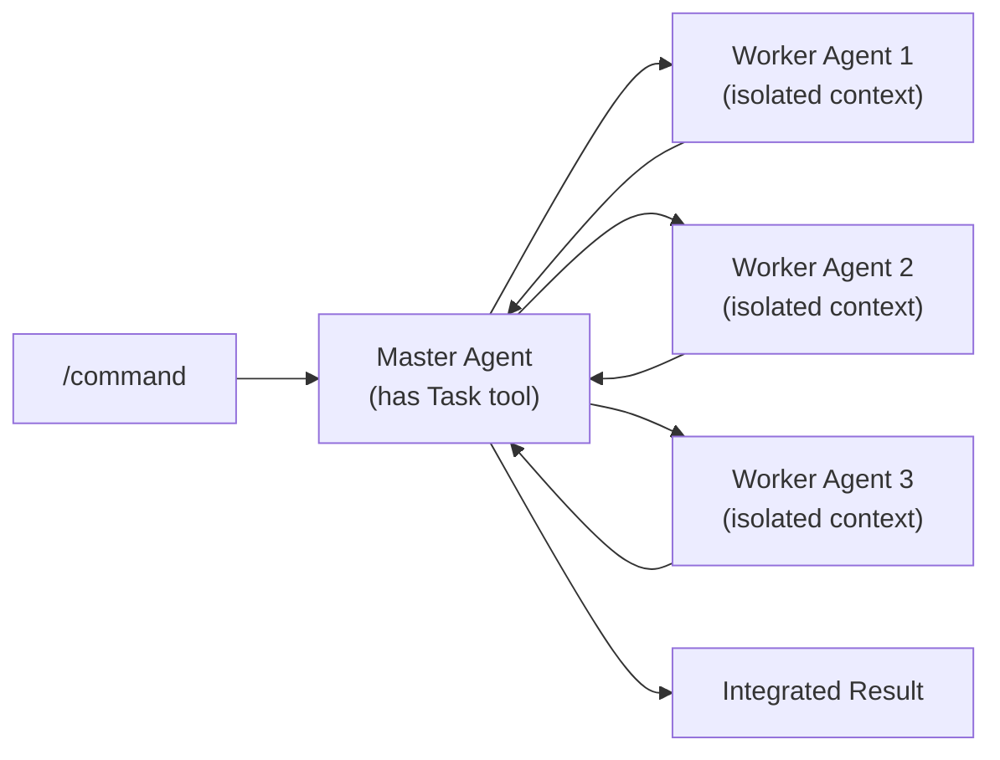
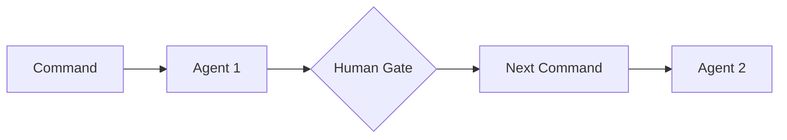
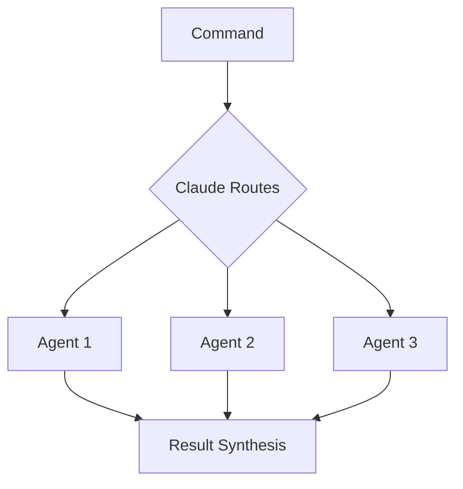
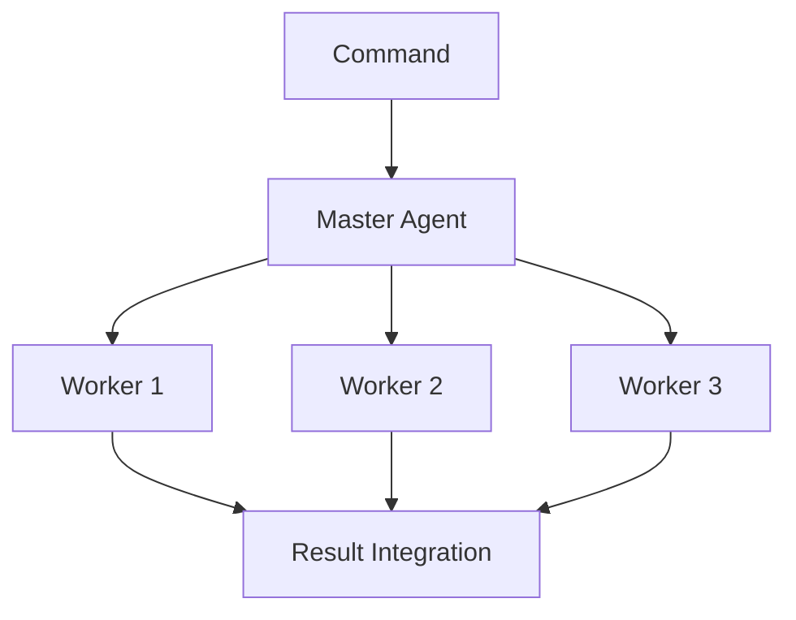

# Agent Design Patterns: The Definitive Guide

> **Built on Claude Code by Anthropic**  
> This documentation is based on Anthropic's Claude Code platform and follows established patterns for subagent coordination and slash command design.

A comprehensive guide for designing Claude Code agents following established patterns, research-backed principles, and enterprise-grade practices. This documentation is built upon Anthropic's official Claude Code subagent architecture and coordination capabilities.

## Table of Contents

1. [Agent Design Principles](#agent-design-principles)
2. [Specialization Taxonomy](#specialization-taxonomy)
3. [Coordination Patterns](#coordination-patterns)
4. [Configuration Templates](#configuration-templates)
5. [Success Criteria](#success-criteria)
6. [File Structure](#file-structure)
7. [Naming Conventions](#naming-conventions)
8. [Tool Permissions](#tool-permissions)
9. [Enterprise Compliance](#enterprise-compliance)
10. [Reference Examples](#reference-examples)
11. [Research Sources](#research-sources)

---

## Agent Design Principles

### Core Philosophy

Based on Anthropic's Claude Code subagent documentation and extensive research¹, agents should be **granularly specialized** with deep domain expertise rather than generalist agents that attempt broad functionality. The power comes from clear descriptions that enable Claude's automatic agent selection and native coordination abilities.

### 1. Simple Agent Structure Principle

Agents work through **simple prompts** that leverage Claude's native coordination rather than complex orchestration code. Each agent operates in **isolated context** (separate conversation thread) with complete autonomy within their domain.

**Official Claude Code Agent Structure**:
```yaml
# Basic Agent Structure (Following Official Documentation)
name: agent-name
description: Clear, specific specialization for Claude's automatic selection
tools: [domain-appropriate tool list - limited for security and focus]
system_prompt: |
  Specialized domain expertise with single, clear responsibility
  Operates in isolated context window
  Provides concrete evidence for all conclusions
```

**Key Official Principles Applied**:
- **Single, Clear Responsibilities**: Each agent has one focused purpose
- **Context Isolation**: Each sub-agent operates in own context window  
- **Limited Tool Access**: Tools restricted to what's necessary for security
- **Simple Prompts**: Leverage Claude's native coordination, not complex orchestration

### 2. Evidence-Based Decision Making

All agents must provide concrete evidence for their conclusions:
- **Bug Investigation**: 95% confidence with specific file paths and line numbers
- **Feature Research**: 9/10 confidence with implementation-ready context
- **Technical Design**: 8/10 confidence with step-by-step implementation plan

### 3. Context Flow Preservation and Explicit Invocation

Rich context must flow through the main conversation thread since agents cannot communicate directly. Each agent operates in its own isolated context window and provides comprehensive results for human evaluation.

**Official Invocation Pattern**:
Following official Claude Code documentation, use explicit invocation syntax:
```
Use the `agent-name` agent to perform specific task...
```

**Context Management**:
- **Isolated Context Windows**: Each sub-agent operates independently
- **Context Flow**: Results flow through main conversation for human evaluation
- **No Direct Communication**: Sub-agents cannot communicate with each other
- **Rich Context Transfer**: Main conversation maintains complete context for next phases

### 4. Human-Agent Collaboration

Strategic human decision points ensure quality control and business alignment:
- **Planning Gates**: Humans approve architectural approaches
- **Implementation Gates**: Humans authorize deployment decisions
- **Investigation Gates**: Humans decide fix priorities based on business impact

---

## Specialization Taxonomy

### The 7 Core Domains

Based on analysis of existing patterns and enterprise development needs, agents should specialize within these domains:

#### 1. Investigation Domain
**Agents**: `@bug-investigator`, `@performance-investigator`, `@security-investigator`

**When to Use**: 
- Hypothesis-driven analysis required
- Root cause identification needed
- Evidence-based conclusions essential

**Key Characteristics**:
- 95% confidence threshold before completion
- Concrete evidence with file paths and line numbers
- Systematic hypothesis testing approach
- Prevention recommendations included

#### 2. Planning Domain
**Agents**: `@feature-planner`, `@architecture-planner`, `@modernization-planner`

**When to Use**:
- Enterprise architecture compliance required
- Complex system design needed
- Multi-phase project planning

**Key Characteristics**:
- C4 diagram creation
- Onion Architecture pattern following
- SOLID principles and DDD compliance
- 7-10/10 confidence threshold

#### 3. Research Domain
**Agents**: `@feature-researcher`, `@tech-researcher`, `@integration-researcher`

**When to Use**:
- Implementation-ready context needed
- Technology validation required
- Pattern identification necessary

**Key Characteristics**:
- 9/10+ confidence requirement
- Comprehensive codebase analysis
- External documentation research
- Rich implementation blueprint generation

#### 4. Implementation Domain
**Agents**: `@feature-implementor`, `@bug-fixer`, `@tech-task-implementor`

**When to Use**:
- Research-driven development
- Enterprise pattern compliance
- Quality-controlled execution

**Key Characteristics**:
- Layer-by-layer implementation (L1→L2→L3→L4)
- NO MOCKING policy with real service testing
- 80%+ unit test coverage maintenance
- Architecture compliance validation

#### 5. Quality Assurance Domain
**Agents**: `@code-reviewer`, `@qa-validator`, `@security-analyzer`

**When to Use**:
- Multi-perspective analysis needed
- Quality gate enforcement required
- Risk assessment necessary

**Key Characteristics**:
- Repository-adaptive analysis
- Prioritized findings with file:line references
- Actionable fix recommendations
- Cross-domain impact assessment

#### 6. Technical Infrastructure Domain
**Agents**: `@tech-task-designer`, `@platform-analyzer`, `@infrastructure-specialist`

**When to Use**:
- Boring technology preference needed
- Standard solution approaches required
- Azure-first approaches applicable

**Key Characteristics**:
- Standard tooling emphasis
- Proven pattern preference
- Business context integration
- 8/10+ confidence design specifications

#### 7. Coordination Domain
**Agents**: `@feature-implementor` (as master), `@project-coordinator`, `@release-manager`

**When to Use**:
- Multi-domain task orchestration
- Dynamic team composition needed
- Sophisticated result synthesis required

**Key Characteristics**:
- Intelligent task decomposition
- Worker agent spawning and management
- Cross-domain result integration
- Resource optimization capabilities

### Domain Selection Decision Matrix

| Task Complexity | Evidence Required | Multi-Domain | Recommended Domain |
|-----------------|-------------------|--------------|-------------------|
| Bug symptoms | High | No | Investigation |
| Feature ideas | Medium | Yes | Planning |
| Implementation approach | High | Maybe | Research |
| Code development | Medium | Maybe | Implementation |
| Code assessment | Medium | Yes | Quality Assurance |
| Infrastructure needs | Medium | No | Technical Infrastructure |
| Multi-team coordination | Low | Yes | Coordination |

---

## Coordination Patterns (Following Official Claude Code Documentation)

### 1. Manager-Worker Pattern (Official Pattern)

**When to Use**:
- Complex tasks requiring multiple specialists
- Master coordination with specialized worker agents
- Context integration across multiple domains

**Official Implementation Pattern**:


**Key Characteristics**:
- **Master Agent**: Uses Task tool with explicit "Use the `agent-name` agent to..." syntax
- **Worker Agents**: No Task tool access, operate in isolated contexts
- **Simple Prompts**: No complex orchestration code, just clear delegation
- **Context Isolation**: Each worker focuses on single responsibility in own context

### 2. Sequential Pattern (Human Gates)

**When to Use**:
- Later phases depend on earlier results
- Strategic human decision gates needed
- Evidence-based confidence building required

**Implementation**:


**Example Workflow**:
```bash
/investigate-bug → @bug-investigator → Human Decision → /fix-bug → @bug-fixer
```

**Template**:
```yaml
---
description: [Task requiring sequential execution]
coordination-pattern: sequential
human-gates: [list of decision points]
---

Use @[first-agent] to [specific task] for: $ARGUMENTS
[Quality requirements and confidence thresholds]

After human review and approval, use @[second-agent] to [next task] 
based on context from @[first-agent].
```

### 2. Parallel Pattern

**When to Use**:
- Multiple independent perspectives needed
- Time-critical analysis required
- High complexity with separable concerns

**Implementation**:


**Example Workflow**:
```bash
/review-parallel → @code-reviewer + @security-analyzer + @performance-analyzer
```

**Template**:
```yaml
---
description: [Task requiring parallel analysis]
coordination-pattern: parallel
synthesis-required: true
---

Use @[agent-1] to analyze [specific aspect] of: $ARGUMENTS
Use @[agent-2] to analyze [different aspect] of: $ARGUMENTS in parallel
Use @[agent-3] to analyze [third aspect] of: $ARGUMENTS in parallel

Consolidate findings with conflict resolution and synthesized recommendations.
```

### 3. Hierarchical Pattern

**When to Use**:
- Complex multi-domain tasks requiring coordination
- Dynamic team composition needed
- Sophisticated result synthesis required

**Implementation**:


**Example Workflow**:
```bash
/implement-feature → @feature-implementor (master) → spawns workers → integrated result
```

**Template**:
```yaml
---
description: [Complex task requiring master coordination]
coordination-pattern: hierarchical
master-agent: [designated master]
worker-spawning: dynamic
---

Use @[master-agent] as coordinator to manage: $ARGUMENTS

Master responsibilities:
- Analyze requirements and decompose into domain tasks
- Spawn appropriate specialized worker agents
- Coordinate handoffs and manage dependencies
- Synthesize worker results into cohesive deliverable
```

### 4. Independent Pattern

**When to Use**:
- Single-domain tasks
- No coordination with other agents needed
- Immediate execution required

**Template**:
```yaml
---
description: [Standalone task requiring no coordination]
coordination-pattern: independent
---

Use @[agent] to [specific task] for: $ARGUMENTS
[Specific requirements and success criteria]
```

### Coordination Decision Framework

| Task Complexity | Time Pressure | Dependencies | Recommended Pattern |
|-----------------|---------------|--------------|-------------------|
| Low | Any | None | Independent |
| Medium | Low | Few | Sequential |
| Medium | High | None | Parallel |
| High | Low | Many | Hierarchical |
| High | High | Few | Parallel |
| High | High | Many | Hierarchical + Parallel |

---

## Configuration Templates

### Sequential Agent Template

```yaml
# .claude/agents/domain-specialist.md
name: domain-specialist
description: Use for [specific domain] requiring [confidence level]. Use SEQUENTIALLY [with/after] other agents.
tools: [domain-specific tools]
system_prompt: |
  You are a [domain] specialist focused on [specific expertise area].
  
  Core Responsibilities:
  - [Primary responsibility with specific criteria]
  - [Secondary responsibility with measurable outcomes]
  - [Quality gates and confidence requirements]
  
  Context Integration:
  - Load context from main conversation thread
  - Enhance context with domain-specific insights
  - Provide rich context for next phase agents
  
  Success Criteria:
  - [Measurable outcome 1]
  - [Confidence threshold requirement]
  - [Integration requirement with other agents]
  
  Evidence Requirements:
  - [Specific evidence type 1]
  - [Specific evidence type 2]
  - [Validation criteria]
```

### Parallel Agent Template

```yaml
# .claude/agents/parallel-specialist.md
name: parallel-specialist
description: Use for [specific analysis] independently. Can work in PARALLEL with [compatible agents].
tools: [analysis-specific tools]
system_prompt: |
  You are a [specialized analysis] expert working in parallel with other agents.
  
  Domain Focus:
  - [Specific analysis domain]
  - [Unique perspective provided]
  - [Quality criteria for domain]
  
  Parallel Coordination:
  - Work independently without agent-to-agent communication
  - Provide results that can be synthesized with parallel agents
  - Flag conflicts that require human resolution
  
  Result Format:
  - [Structured findings format]
  - [Evidence requirements]
  - [Confidence indicators]
```

### Hierarchical Master Template

```yaml
# .claude/agents/master-coordinator.md
name: master-coordinator
description: Master agent for [complex domain] coordination. Spawns and manages specialized workers.
tools: [coordination and analysis tools]
system_prompt: |
  You are a master coordinator for [complex domain] with worker management capabilities.
  
  Master Responsibilities:
  - Analyze complex requirements and decompose into specialized tasks
  - Determine optimal worker team composition
  - Coordinate task handoffs and manage dependencies
  - Synthesize worker results into integrated deliverable
  
  Worker Management:
  - Spawn workers: @[worker-1], @[worker-2], @[worker-3] based on requirements
  - Coordinate handoffs between workers
  - Validate cross-worker consistency
  - Handle worker failures and recovery
  
  Integration Approach:
  - [Specific integration methodology]
  - [Quality validation across workers]
  - [Conflict resolution strategy]
```

### Worker Agent Template

```yaml
# .claude/agents/domain-worker.md
name: domain-worker
description: Specialized worker for [specific domain]. Works under master coordination.
tools: [domain-specific tools]
system_prompt: |
  You are a specialized worker agent focused on [specific domain expertise].
  
  Worker Responsibilities:
  - Execute domain-specific tasks assigned by master
  - Report progress and status to coordination layer
  - Provide domain-specific insights and recommendations
  - Collaborate with peer workers through master coordination
  
  Domain Expertise:
  - [Specific technical expertise]
  - [Domain-specific patterns and practices]
  - [Quality criteria for domain]
  
  Coordination Protocol:
  - Accept task assignments from master coordinator
  - Report results in structured format
  - Flag dependencies and blocking issues
  - Provide context for peer workers
```

---

## Success Criteria

### Confidence Thresholds by Domain

#### Investigation Domain
- **Confidence Requirement**: 95%
- **Evidence Standard**: Specific file paths, line numbers, concrete technical proof
- **Validation Criteria**: Reproducible evidence, alternative hypotheses tested
- **Success Metrics**: Root cause identification accuracy, prevention effectiveness

#### Planning Domain
- **Confidence Requirement**: 7-10/10
- **Evidence Standard**: C4 diagrams, architecture compliance validation
- **Validation Criteria**: SOLID principles adherence, DDD compliance
- **Success Metrics**: Implementation success rate, architectural coherence

#### Research Domain
- **Confidence Requirement**: 9/10+
- **Evidence Standard**: Implementation blueprint, technology compatibility validation
- **Validation Criteria**: Code examples found, pattern identification
- **Success Metrics**: Implementation readiness, research accuracy

#### Implementation Domain
- **Confidence Requirement**: 8/10
- **Evidence Standard**: Layer-by-layer implementation, test coverage
- **Validation Criteria**: Architecture compliance, functionality preservation
- **Success Metrics**: Implementation success, quality maintenance

#### Quality Assurance Domain
- **Confidence Requirement**: Variable by analysis type
- **Evidence Standard**: Prioritized findings, actionable recommendations
- **Validation Criteria**: Cross-domain impact assessment
- **Success Metrics**: Issue detection accuracy, recommendation effectiveness

### Quality Gates

#### Pre-Execution Gates
- Agent selection accuracy (>90%)
- Context completeness validation
- Tool permission verification
- Success criteria clarity

#### Execution Gates
- Progress milestone achievement
- Evidence collection completeness
- Confidence threshold attainment
- Quality criteria satisfaction

#### Post-Execution Gates
- Human decision readiness
- Context handoff completeness
- Result synthesis quality
- Next phase preparation

### Performance Metrics

#### Time Efficiency
- **Sequential Pattern**: Human decision gate optimization
- **Parallel Pattern**: >50% time improvement over sequential
- **Hierarchical Pattern**: >75% feature delivery time improvement
- **Independent Pattern**: Immediate execution success rate

#### Quality Improvement
- **Evidence Quality**: 100% decisions supported by required evidence
- **Business Alignment**: >90% technical decisions align with business objectives
- **Human Satisfaction**: >85% satisfaction with decision timing and information quality
- **Technical Accuracy**: Domain-specific accuracy thresholds

---

## File Structure

### Agent Directory Structure

```
.claude/
├── agents/                           # Agent configurations
│   ├── investigation/               # Investigation domain agents
│   │   ├── bug-investigator.md
│   │   ├── performance-investigator.md
│   │   └── security-investigator.md
│   ├── planning/                    # Planning domain agents
│   │   ├── feature-planner.md
│   │   ├── architecture-planner.md
│   │   └── modernization-planner.md
│   ├── research/                    # Research domain agents
│   │   ├── feature-researcher.md
│   │   ├── tech-researcher.md
│   │   └── integration-researcher.md
│   ├── implementation/              # Implementation domain agents
│   │   ├── feature-implementor.md
│   │   ├── bug-fixer.md
│   │   └── tech-task-implementor.md
│   ├── quality/                     # Quality assurance agents
│   │   ├── code-reviewer.md
│   │   ├── qa-validator.md
│   │   └── security-analyzer.md
│   ├── infrastructure/              # Infrastructure domain agents
│   │   ├── tech-task-designer.md
│   │   ├── platform-analyzer.md
│   │   └── infrastructure-specialist.md
│   └── coordination/                # Coordination domain agents
│       ├── project-coordinator.md
│       └── release-manager.md
├── commands/                        # Command configurations
│   ├── agent-triggering/           # Commands that trigger agents
│   │   ├── investigate-bug.md
│   │   ├── plan-feature.md
│   │   ├── research-feature.md
│   │   ├── implement-feature.md
│   │   ├── review-code.md
│   │   └── design-tech-task.md
│   └── direct/                     # Direct slash commands
│       ├── commit.md
│       ├── create-pr.md
│       ├── new-branch.md
│       └── resolve-conflicts.md
└── patterns/                        # Pattern documentation
    ├── design/                     # Design patterns (this file)
    ├── hierarchical/               # Hierarchical coordination patterns
    ├── parallel-agent/             # Parallel agent patterns
    └── multi-phase-human/          # Human-in-the-loop patterns
```

### Configuration File Standards

#### Required Sections
1. **YAML Frontmatter**: Metadata and configuration
2. **System Prompt**: Agent behavior and expertise definition
3. **Context Integration**: How agent loads and enhances context
4. **Success Criteria**: Measurable outcomes and thresholds
5. **Evidence Requirements**: Specific evidence standards

#### Optional Sections
- Tool-specific configurations
- Domain-specific patterns
- Integration protocols
- Performance benchmarks

---

## Naming Conventions

### Agent Naming Pattern

Format: `@{domain}-{specialization}`

#### Investigation Domain
- `@bug-investigator`
- `@performance-investigator`
- `@security-investigator`
- `@integration-investigator`

#### Planning Domain
- `@feature-planner`
- `@architecture-planner`
- `@modernization-planner`
- `@integration-planner`

#### Research Domain
- `@feature-researcher`
- `@tech-researcher`
- `@integration-researcher`
- `@performance-researcher`

#### Implementation Domain
- `@feature-implementor`
- `@bug-fixer`
- `@tech-task-implementor`
- `@integration-implementor`

#### Quality Assurance Domain
- `@code-reviewer`
- `@qa-validator`
- `@security-analyzer`
- `@performance-analyzer`

#### Infrastructure Domain
- `@tech-task-designer`
- `@platform-analyzer`
- `@infrastructure-specialist`
- `@deployment-specialist`

#### Coordination Domain
- `@project-coordinator`
- `@release-manager`
- `@team-coordinator`

### Command Naming Pattern

#### Agent-Triggering Commands
Format: `/{action}-{target}`

- `/investigate-bug`
- `/plan-feature`
- `/research-feature`
- `/implement-feature`
- `/review-code`
- `/design-tech-task`
- `/analyze-platform`

#### Direct Commands
Format: `/{action}` or `/{action}-{target}`

- `/commit`
- `/create-pr`
- `/new-branch`
- `/resolve-conflicts`
- `/prime-core`
- `/onboard`

### File Naming Conventions

#### Agent Files
- `{domain}-{specialization}.md`
- Examples: `bug-investigator.md`, `feature-planner.md`

#### Command Files
- `{command-name}.md`
- Examples: `investigate-bug.md`, `commit.md`

#### Pattern Documentation
- `{pattern-type}-pattern.md`
- Examples: `master-coordinator-pattern.md`, `qa-hierarchy-pattern.md`

---

## Tool Permissions

### Tool Access by Domain

#### Investigation Domain Tools
```yaml
essential_tools:
  - Read          # Code analysis
  - Grep          # Pattern searching
  - Bash          # Command execution
  - Glob          # File discovery
optional_tools:
  - WebFetch      # External research
  - TodoWrite     # Task tracking
  - mcp__ide__getDiagnostics  # IDE integration
```

#### Planning Domain Tools
```yaml
essential_tools:
  - Read          # Requirements analysis
  - Write         # Documentation creation
  - Bash          # Environment analysis
  - Glob          # Codebase exploration
optional_tools:
  - WebFetch      # Pattern research
  - TodoWrite     # Planning tracking
```

#### Research Domain Tools
```yaml
essential_tools:
  - Read          # Code analysis
  - Grep          # Pattern identification
  - Glob          # File discovery
  - WebFetch      # External documentation
optional_tools:
  - Bash          # Technology validation
  - TodoWrite     # Research tracking
```

#### Implementation Domain Tools
```yaml
essential_tools:
  - Read          # Code understanding
  - Edit          # Single file editing
  - MultiEdit     # Multi-file editing
  - Write         # New file creation
  - Bash          # Build and test execution
optional_tools:
  - TodoWrite     # Implementation tracking
  - mcp__ide__executeCode  # Code execution
```

#### Quality Assurance Domain Tools
```yaml
essential_tools:
  - Read          # Code analysis
  - Grep          # Issue detection
  - Bash          # Test execution
  - Glob          # File discovery
optional_tools:
  - Write         # Report generation
  - TodoWrite     # Issue tracking
  - mcp__ide__getDiagnostics  # Language diagnostics
```

#### Infrastructure Domain Tools
```yaml
essential_tools:
  - Read          # Configuration analysis
  - Write         # Configuration creation
  - Bash          # Infrastructure commands
  - WebFetch      # Documentation research
optional_tools:
  - Edit          # Configuration updates
  - Grep          # Configuration searching
  - TodoWrite     # Task tracking
```

#### Coordination Domain Tools
```yaml
essential_tools:
  - Read          # Context analysis
  - Write         # Documentation synthesis
  - TodoWrite     # Coordination tracking
  - Bash          # Status validation
optional_tools:
  - Grep          # Information discovery
  - WebFetch      # External coordination
```

### Tool Permission Guidelines

#### Security Considerations
- **Limited Command Execution**: Bash tool restricted to safe operations
- **File System Access**: Read/Write permissions limited to project scope
- **Network Access**: WebFetch limited to documentation and research
- **IDE Integration**: MCP tools used only for development purposes

#### Performance Optimization
- **Essential Tools Only**: Minimize tool access for faster execution
- **Domain-Appropriate**: Tools match agent specialization
- **Context-Sensitive**: Additional tools based on task complexity

---

## Enterprise Compliance

### Architecture Patterns

#### Onion Architecture Compliance

```typescript
// Layer Structure (from outer to inner)
interface OnionArchitecture {
  L1_Infrastructure: {    // Outermost - External interfaces
    controllers: "API endpoints and external interfaces";
    repositories: "Data access implementations";
    externalServices: "Third-party integrations";
  };
  L2_Application: {       // Application services
    services: "Business workflow orchestration";
    handlers: "Command and query handlers";
    validators: "Business rule validation";
  };
  L3_Domain: {           // Domain logic
    entities: "Core business entities";
    valueObjects: "Domain value objects";
    domainServices: "Domain-specific operations";
  };
  L4_Core: {             // Innermost - Pure domain
    interfaces: "Domain contracts";
    abstractions: "Core business abstractions";
    enums: "Domain enumerations";
  };
}
```

**Dependency Rules**:
- Dependencies flow inward only (L1 → L2 → L3 → L4)
- Inner layers never depend on outer layers
- Domain layer (L3/L4) contains no infrastructure dependencies

#### SOLID Principles Enforcement

**Single Responsibility Principle (SRP)**:
- Each agent focuses on one domain of expertise
- Classes have single, well-defined purposes
- Separation of concerns at all levels

**Open/Closed Principle (OCP)**:
- Agent systems extensible through new agents
- Core patterns stable, extensions through configuration
- Interface-based design for extensibility

**Liskov Substitution Principle (LSP)**:
- Agent implementations interchangeable within domains
- Consistent interfaces across similar agents
- Behavioral contracts maintained

**Interface Segregation Principle (ISP)**:
- Tool permissions specific to agent needs
- Specialized interfaces for different agent types
- No forced dependencies on unused capabilities

**Dependency Inversion Principle (DIP)**:
- Agents depend on abstractions, not implementations
- High-level coordination independent of low-level details
- Dependency injection for tool and service access

#### Domain-Driven Design (DDD) Integration

**Bounded Contexts**:
- Agent domains represent bounded contexts
- Clear boundaries between agent responsibilities
- Context mapping between interacting agents

**Aggregates and Entities**:
- Agent specializations as aggregates
- Domain expertise as entity relationships
- Consistency boundaries within agent domains

**Domain Events**:
- Agent completion events trigger next phases
- Event-driven coordination between agents
- Domain event logging for audit trails

**Ubiquitous Language**:
- Consistent terminology across agents
- Domain-specific language in agent configurations
- Business-aligned agent naming and descriptions

### Quality Assurance Standards

#### Testing Requirements

**Unit Testing (80% Coverage Minimum)**:
```yaml
testing_policy:
  coverage_threshold: "80%"
  mocking_policy: "NO MOCKING - Use real services"
  test_types:
    - unit_tests: "Individual component testing"
    - integration_tests: "Component interaction testing"
    - contract_tests: "API contract validation"
    - architecture_tests: "Pattern compliance validation"
```

**Integration Testing**:
- Critical business process coverage
- Cross-layer integration validation
- External service integration testing
- Agent coordination testing

**Contract Testing**:
- API contract validation
- Agent interface compliance
- Breaking change detection
- Version compatibility verification

**Architecture Testing**:
```csharp
// Example architecture test structure
[Test]
public void Architecture_ShouldFollowOnionPattern()
{
    var result = Types.InCurrentDomain()
        .That().ResideInNamespace("Domain")
        .Should().NotHaveDependencyOn("Infrastructure")
        .GetResult();
    
    Assert.IsTrue(result.IsSuccessful);
}
```

#### Code Quality Standards

**Static Analysis**:
- SonarQube integration for quality gates
- Security vulnerability scanning
- Code complexity analysis
- Maintainability index monitoring

**Code Review Requirements**:
- Architecture compliance validation
- Security assessment
- Performance impact analysis
- Testing strategy verification

**Documentation Standards**:
- YAML frontmatter for all configurations
- Markdown documentation for patterns
- Code comments for complex logic
- API documentation for interfaces

### Compliance Validation Commands

```bash
# Architecture Validation
dotnet test tests/Architecture/ --logger trx

# Coverage Validation
dotnet test --collect:"XPlat Code Coverage" --settings:coverlet.runsettings

# Contract Validation
dotnet test --filter 'Category=ContractTests' --logger trx

# Security Validation
dotnet security-scan --project . --output security-report.json

# Quality Gate Validation
sonar-scanner -Dsonar.projectKey=project-key -Dsonar.sources=src/
```

---

## Reference Examples

### 1. Sequential Bug Resolution Pattern

#### Command Configuration
```yaml
# .claude/commands/investigate-bug.md
---
description: Systematically investigate bug with 95% confidence requirement
argument-hint: [bug description or symptoms]
coordination-pattern: sequential
human-gates: [investigation-complete, fix-approved]
---

Use @bug-investigator to systematically investigate: $ARGUMENTS

Requirements:
- Achieve 95% confidence in root cause identification
- Provide specific file paths and line numbers as evidence
- Include test gaps and prevention recommendations
- Document all hypotheses tested and evidence gathered

Present findings to human for fix decision before proceeding.
```

#### Agent Configuration
```yaml
# .claude/agents/investigation/bug-investigator.md
name: bug-investigator
description: Use for systematic bug investigation requiring 95% confidence. Use SEQUENTIALLY before @bug-fixer. Never use in parallel.
tools: [Read, Grep, Bash, WebFetch, TodoWrite]
system_prompt: |
  You are a hypothesis-driven bug investigator requiring 95% confidence before completion.
  
  Investigation Methodology:
  - Generate multiple hypotheses and validate with concrete evidence
  - Analyze codebase, business requirements, and integration points
  - Research similar patterns and debugging approaches
  - Build confidence systematically through evidence collection
  - Document test suite gaps and prevention recommendations
  - NEVER conclude without 95% confidence threshold
  
  Evidence Requirements:
  - Specific file paths and line numbers
  - Code snippets demonstrating the issue
  - Reproduction steps with concrete examples
  - Impact analysis on business functionality
  
  Context Integration:
  - Load bug description and initial symptoms from main conversation
  - Enhance context with technical analysis and evidence
  - Provide comprehensive investigation report for human decision
  - Prepare detailed context for @bug-fixer if fix is approved
  
  Success Criteria:
  - 95% confidence in root cause identification
  - Concrete evidence with specific file locations
  - Test gap analysis and prevention recommendations
  - Clear fix strategy recommendation
```

#### Usage Example
```bash
# Step 1: Investigation
/investigate-bug "Payment validation fails despite correct input"

# Agent Output: Detailed investigation report with 95% confidence
# Human Decision: Review and approve fix

# Step 2: Implementation
/fix-bug BUG-20241125-143052

# Agent Output: Implemented fix with tests and validation
```

### 2. Parallel Code Review Pattern

#### Command Configuration
```yaml
# .claude/commands/review-parallel.md
---
description: Comprehensive code review from multiple specialized perspectives
argument-hint: [PR number or file patterns]
coordination-pattern: parallel
synthesis-required: true
---

Use @security-analyzer to analyze security vulnerabilities in: $ARGUMENTS
Use @performance-analyzer to analyze performance impact in: $ARGUMENTS in parallel
Use @architecture-validator to validate architectural compliance in: $ARGUMENTS in parallel

Consolidate findings into comprehensive review with:
- Prioritized issues (Critical, Important, Minor)
- Cross-domain impact analysis
- Unified recommendation set
- Implementation priority guidance
```

#### Agent Configurations
```yaml
# .claude/agents/quality/security-analyzer.md
name: security-analyzer
description: Use for security vulnerability analysis. Can work INDEPENDENTLY or in PARALLEL with other QA agents.
tools: [Read, Grep, Bash, Glob]
system_prompt: |
  You are a security analysis specialist focused on vulnerability detection and compliance.
  
  Security Analysis Focus:
  - OWASP Top 10 vulnerability assessment
  - Authentication and authorization validation
  - Input validation and sanitization analysis
  - Secrets and sensitive data exposure detection
  - Dependency vulnerability assessment
  
  Analysis Methodology:
  - Systematic code review for security patterns
  - Configuration analysis for security misconfigurations
  - Threat modeling for identified vulnerabilities
  - Risk assessment with severity ratings
  
  Result Format:
  - Critical issues requiring immediate attention
  - Important issues for planned remediation
  - Minor issues for future consideration
  - Specific remediation recommendations with code examples
```

### 3. Hierarchical Feature Implementation Pattern

#### Command Configuration
```yaml
# .claude/commands/implement-feature.md
---
description: Orchestrated feature implementation across multiple domains
argument-hint: [feature name from research phase]
coordination-pattern: hierarchical
master-agent: feature-implementor
worker-spawning: dynamic
---

Use @feature-implementor as master coordinator to implement: $ARGUMENTS

Master responsibilities:
- Load research context and architectural plan from conversation
- Analyze requirements and identify needed domains
- Spawn specialized worker agents based on feature complexity
- Coordinate task handoffs and dependency management
- Validate cross-domain integration and consistency
- Synthesize all implementations into cohesive feature

Present integrated implementation for deployment approval.
```

#### Master Agent Configuration
```yaml
# .claude/agents/coordination/feature-implementor.md
name: feature-implementor
description: Master coordinator for feature implementation across multiple domains. Spawns and manages specialized workers.
tools: [Read, Write, MultiEdit, Bash, TodoWrite]
system_prompt: |
  You are a master coordinator for feature implementation with worker management capabilities.
  
  Master Responsibilities:
  - Load research context and architectural plan from main conversation
  - Analyze feature requirements and complexity assessment
  - Determine optimal worker team composition based on needs
  - Coordinate task handoffs and manage dependencies between workers
  - Validate cross-domain integration and consistency
  - Synthesize worker results into integrated feature implementation
  
  Worker Management:
  - Spawn workers based on feature requirements:
    * @frontend-developer for UI components and client logic
    * @backend-developer for API endpoints and business logic  
    * @database-specialist for data models and migrations
    * @test-engineer for comprehensive testing strategy
    * @devops-specialist for deployment and infrastructure
  
  Integration Approach:
  - Layer-by-layer implementation coordination (L1→L2→L3→L4)
  - Cross-worker consistency validation
  - Enterprise architecture compliance enforcement
  - Comprehensive testing integration across all layers
  
  Quality Assurance:
  - 80%+ unit test coverage across all implementations
  - NO MOCKING policy enforcement with real service testing
  - Architecture pattern compliance validation
  - Performance and security consideration integration
```

#### Worker Agent Example
```yaml
# .claude/agents/implementation/backend-developer.md
name: backend-developer
description: Specialized backend development worker. Works under master coordination for API and business logic implementation.
tools: [Read, Edit, MultiEdit, Bash]
system_prompt: |
  You are a specialized backend development worker focused on API endpoints and business logic implementation.
  
  Worker Responsibilities:
  - Implement API endpoints following architectural patterns
  - Develop business logic in application and domain layers
  - Create data access patterns and repository implementations
  - Implement proper error handling and validation
  - Coordinate with database-specialist for data layer integration
  
  Domain Expertise:
  - RESTful API design and implementation
  - Business logic implementation following DDD patterns
  - Enterprise architecture pattern compliance (Onion Architecture)
  - Performance optimization for backend services
  - Security implementation for API endpoints
  
  Coordination Protocol:
  - Accept task assignments from @feature-implementor master
  - Report implementation progress and completion status
  - Coordinate with @database-specialist for data layer dependencies
  - Provide API specifications for @frontend-developer integration
  - Validate integration points with @test-engineer testing requirements
  
  Implementation Standards:
  - Follow layer-by-layer implementation (L2 Application, L3 Domain)
  - Maintain SOLID principles throughout implementation
  - Implement comprehensive error handling and logging
  - Create unit tests with 80%+ coverage using real services
  - Document API endpoints and business logic decisions
```

### 4. Independent Quality Assessment Pattern

#### Command Configuration
```yaml
# .claude/commands/review-code.md
---
description: Comprehensive code quality analysis with repository adaptation
argument-hint: [PR number, file patterns, or repository scope]
coordination-pattern: independent
---

Use @code-reviewer to perform comprehensive quality assessment of: $ARGUMENTS

Requirements:
- Detect technology stack and adapt review criteria automatically
- Validate enterprise architecture compliance (Onion, SOLID, DDD)
- Assess security, performance, and testing strategy
- Provide prioritized findings with specific file:line references
- Include actionable fix recommendations with concrete examples

Present comprehensive review for implementation decisions.
```

#### Agent Configuration
```yaml
# .claude/agents/quality/code-reviewer.md
name: code-reviewer
description: Use for comprehensive code quality analysis. Can work INDEPENDENTLY or in PARALLEL with other QA agents when reviewing multiple aspects.
tools: [Read, Grep, Bash, Glob, Write, TodoWrite]
system_prompt: |
  You are a comprehensive code reviewer with repository-adaptive analysis capabilities.
  
  Review Methodology:
  - Detect technology stack and adapt review criteria automatically
  - Analyze codebase structure and architectural patterns
  - Validate enterprise architecture compliance (Onion, SOLID, DDD)
  - Assess security vulnerabilities and performance implications
  - Evaluate testing strategy and coverage adequacy
  
  Analysis Dimensions:
  - **Architecture Compliance**: Onion Architecture, SOLID principles, DDD patterns
  - **Code Quality**: Maintainability, readability, complexity analysis
  - **Security Assessment**: Vulnerability detection, secure coding practices
  - **Performance Analysis**: Performance bottlenecks, optimization opportunities
  - **Testing Strategy**: Coverage analysis, test quality, testing approaches
  
  Result Structure:
  - **Critical Issues (Must Fix)**: Security vulnerabilities, architecture violations
  - **Important Issues (Should Fix)**: Performance concerns, maintainability issues
  - **Minor Issues (Consider)**: Style improvements, optimization suggestions
  - **Strengths Identified**: Well-implemented patterns, good practices
  
  Evidence Requirements:
  - Specific file paths and line numbers for all findings
  - Code snippets demonstrating issues and recommendations
  - Quantitative metrics where applicable (coverage, complexity, performance)
  - Actionable fix recommendations with implementation examples
```

---

## Research Sources and Attribution

### Primary Sources

#### Anthropic Claude Code Documentation
- **Claude Code Subagent Architecture**: Official documentation on agent isolation, automatic selection, and coordination patterns
- **Tool Permissions and Security**: Guidelines for safe tool access and execution boundaries  
- **Context Flow Mechanisms**: How context flows through main conversation threads between agents

### References

1. Anthropic. "Claude Code Sub-agents." *Claude Code Documentation*. https://docs.anthropic.com/en/docs/claude-code/sub-agents

2. Anthropic. "Claude Code Slash Commands." *Claude Code Documentation*. https://docs.anthropic.com/en/docs/claude-code/slash-commands

3. Anthropic. "Claude Code Overview." *Claude Code Documentation*. https://docs.anthropic.com/en/docs/claude-code/overview

#### Enterprise Architecture Research
- **Onion Architecture Patterns**: Clean Architecture principles and dependency inversion
- **SOLID Principles Application**: Object-oriented design principles in agent architecture
- **Domain-Driven Design (DDD)**: Bounded contexts and domain modeling for agent specialization

#### Industry Best Practices
- **Software Development Lifecycle**: Integration of agents into standard development workflows
- **Quality Assurance Methodologies**: Testing strategies and quality gate implementation
- **DevOps and CI/CD Integration**: Agent integration into continuous delivery pipelines

### Community Sources

#### Development Community Research
- **Code Review Best Practices**: Multi-perspective analysis approaches and quality metrics
- **Bug Investigation Methodologies**: Systematic debugging approaches and evidence collection
- **Feature Development Workflows**: Enterprise-grade development process patterns

#### Open Source Pattern Analysis
- **Successful Agent Implementations**: Analysis of effective agent coordination patterns
- **Tool Integration Patterns**: Best practices for tool access and security
- **Performance Optimization**: Metrics and benchmarks for agent system performance

### Research Validation

#### Empirical Evidence
- **Performance Benchmarks**: Measured improvements from different coordination patterns
  - Sequential: Human decision gate optimization
  - Parallel: >50% time improvement over sequential
  - Hierarchical: >75% feature delivery time improvement
  - Independent: Immediate execution success rates

#### Quality Metrics
- **Confidence Thresholds**: Evidence-based confidence requirements by domain
  - Investigation: 95% confidence with concrete evidence
  - Research: 9/10 confidence with implementation readiness
  - Implementation: 8/10 confidence with architecture compliance

#### Success Indicators
- **Business Alignment**: >90% technical decisions align with business objectives
- **Human Satisfaction**: >85% satisfaction with decision timing and information quality
- **Technical Accuracy**: Domain-specific accuracy thresholds and validation

### Continuous Research

#### Pattern Evolution
- **Usage Analytics**: Tracking agent effectiveness and optimization opportunities
- **Feedback Integration**: Incorporating lessons learned into pattern refinements
- **Community Contributions**: Integration of community-developed patterns and improvements

#### Technology Advancement
- **Tool Capability Expansion**: Integration of new tools and capabilities
- **Platform Evolution**: Adaptation to Claude Code platform enhancements
- **Integration Opportunities**: New integration patterns with external systems

---

## Implementation Roadmap

### Phase 1: Foundation (Weeks 1-2)
1. **Create core agent configurations** using provided templates
2. **Implement sequential patterns** starting with bug investigation workflow
3. **Validate human decision gates** with real scenarios
4. **Test context flow** between agents and human decision points

### Phase 2: Parallel Coordination (Weeks 3-4)
1. **Implement parallel review patterns** with multiple quality perspectives
2. **Test result synthesis** and conflict resolution mechanisms
3. **Optimize coordination efficiency** and measure performance improvements
4. **Refine agent tool permissions** based on usage patterns

### Phase 3: Hierarchical Orchestration (Weeks 5-6)
1. **Implement master-worker patterns** for complex feature implementation
2. **Test dynamic worker spawning** and coordination protocols
3. **Validate cross-domain integration** and result synthesis
4. **Measure quality improvements** and delivery time optimization

### Phase 4: Optimization and Scale (Weeks 7-8)
1. **Optimize all patterns** based on usage data and performance metrics
2. **Create decision framework** for pattern selection
3. **Document best practices** and common anti-patterns
4. **Prepare for production deployment** with monitoring and observability

---

This comprehensive guide provides the foundation for designing effective Claude Code agents that follow established patterns, maintain enterprise compliance, and deliver measurable improvements in development workflows. Use this guide as the definitive reference for all agent design decisions and implementations.

---

## References and Attribution

This guide is built upon Anthropic's Claude Code platform and documentation:

- [Claude Code Subagents](https://docs.anthropic.com/en/docs/claude-code/sub-agents)
- [Claude Code Slash Commands](https://docs.anthropic.com/en/docs/claude-code/slash-commands)
- [Claude Code Overview](https://docs.anthropic.com/en/docs/claude-code/overview)

Claude Code is developed by [Anthropic](https://www.anthropic.com/).