# Bug Investigation Workflow - Sequential with Human Gates

> **Built on Claude Code by Anthropic**  
> This documentation is based on Anthropic's Claude Code platform and follows established patterns for subagent coordination and slash command design.

## Pattern: Sequential Agent Chain with Human Decision Points

**Primary Goal**: Systematically investigate bugs through evidence-first methodology with sequential phases and human validation gates to prevent assumption-driven failures.

**Success Criteria**:
- **Evidence-first collection** before any categorization or assumptions
- **10% confidence starting point** with systematic evidence building to 95%
- **Assumption detection and prevention** using hypothesis-validator integration
- Human approval at each major phase transition
- Complete context preservation between sequential agents
- Clear audit trail of investigation and decision points

```mermaid
flowchart LR
    A["/development/bugs/investigate-bug<br/>payment issue"] --> B["@planners/bug-investigator"] --> C["evidence-report.md"] --> D{"Root cause<br/>found?"} 
    D -->|yes| E["/development/bugs/fix-bug<br/>with context"] --> F["@executors/bug-fixer"] --> G["fix-complete.md"] --> H{"Deploy<br/>fix?"}
    D -->|no| I["Manual investigation"]
    H -->|yes| J["Deployment complete"]
    H -->|no| K["Manual review"]
    
    %% Command styling (Yellow rectangles)
    style A fill:#fff2cc,stroke:#d6b656,stroke-width:2px,color:#000
    style E fill:#fff2cc,stroke:#d6b656,stroke-width:2px,color:#000
    
    %% Planners (Green)
    style B fill:#d5e8d4,stroke:#82b366,stroke-width:2px,rx:10,ry:10,color:#000
    
    %% Executors (Orange) 
    style F fill:#ffd6cc,stroke:#d79b00,stroke-width:2px,rx:10,ry:10,color:#000
    
    %% Document styling (White rectangles)
    style C fill:#ffffff,stroke:#000000,stroke-width:2px,color:#000
    style G fill:#ffffff,stroke:#000000,stroke-width:2px,color:#000
    
    %% Human decision points (Diamond shapes)
    style D fill:#f8cecc,stroke:#b85450,stroke-width:2px,color:#000
    style H fill:#f8cecc,stroke:#b85450,stroke-width:2px,color:#000
    
    %% Manual actions (Purple rectangles)
    style I fill:#e1d5e7,stroke:#9673a6,stroke-width:2px,color:#000
    style J fill:#e1d5e7,stroke:#9673a6,stroke-width:2px,color:#000
    style K fill:#e1d5e7,stroke:#9673a6,stroke-width:2px,color:#000
```



## Coordination Strategy: Sequential with Human Gates

**Command Logic:**
```markdown
---
description: Investigate bug systematically with evidence-first methodology and human validation gates
argument-hint: [bug description]
---

1. Use @planners/bug-investigator with evidence-first approach: $ARGUMENTS
   - Start at 10% confidence, build systematically with evidence
   - Gather concrete evidence before making any categorizations
   - Use @hypothesis-validator to detect and prevent assumptions
   - Validate platform capabilities against official documentation
2. Require 95% confidence in root cause before concluding (built from evidence)
3. Present findings to human for approval before proceeding
4. If approved, use @executors/bug-fixer with:
   - Previous attempt analysis and learning
   - One-change-at-a-time implementation protocol
   - Documentation-first validation patterns
5. Present fix for human deployment approval
```

**Why Sequential (Not Parallel):**
- **Quality First**: Each phase must be validated before proceeding
- **Context Dependency**: Fix phase requires complete investigation results
- **Risk Management**: Human gates prevent incorrect fixes from being deployed
- **Resource Efficiency**: Focused investigation before expensive fix development

**Key Coordination Principles:**
- **Evidence-First Approach**: Concrete evidence gathering before assumptions or categorization
- **10% Confidence Start**: Systematic evidence building prevents assumption-driven failures
- **Assumption Detection**: @hypothesis-validator integration to prevent common failure patterns
- **Sequential Flow**: Later agents depend on earlier results
- **Human Decision Gates**: Critical validation at phase transitions
- **Context Preservation**: Claude maintains full context between agents
- **Simple Orchestration**: Leverages Claude's native coordination capabilities

## Human Decision Points

**Gate 1: Investigation Validation**
- **Input**: Complete evidence report from @planners/bug-investigator
- **Decision**: Is root cause identified with 95% confidence?
- **Options**: 
  - ✅ Approve: Proceed to fix phase with validated root cause
  - ❌ Request more investigation: Return to investigation phase
  - 🔄 Manual investigation: Escalate to human experts

**Gate 2: Fix Approval**
- **Input**: Complete fix implementation from @executors/bug-fixer
- **Decision**: Is fix ready for production deployment?
- **Options**:
  - ✅ Deploy: Approve fix for production deployment
  - ❌ Revise: Request changes to fix implementation
  - 👥 Manual review: Escalate to senior review team

**Decision Criteria:**
- **Evidence-based confidence** level > 95% (built from 10% with concrete evidence)
- **No assumption-driven conclusions** - all findings supported by concrete evidence
- **Platform capabilities validated** against official documentation
- Fix addresses identified root cause with previous attempt learning
- **Incremental implementation planned** with one-change-at-a-time protocol
- No risk of regression or cascade failures
- Proper testing and validation completed

## Command Examples

```bash
# Sequential investigation with human gates
/development/bugs/investigate-bug "Payment processing fails on weekends"

# Claude coordinates with evidence-first methodology:
# 1. Uses @planners/bug-investigator starting at 10% confidence
#    - Gathers concrete evidence before categorization
#    - Uses @hypothesis-validator to prevent assumptions
#    - Validates platform capabilities with official docs
# 2. Presents evidence-based findings (95% confidence) for human review
# 3. If approved, uses @executors/bug-fixer with:
#    - Previous attempt analysis and learning
#    - One-change-at-a-time implementation protocol
#    - Documentation-first validation patterns
# 4. Presents incrementally tested solution for deployment approval
```

## Pattern Effectiveness

**When to Use Sequential:**
- Bug fixes require high confidence in root cause
- Risk of incorrect fixes is high
- Investigation must be complete before fix development
- Human expertise needed for critical decisions

**Success Metrics:**
- 95% root cause accuracy rate
- Zero incorrect fixes deployed
- 100% human validation at decision gates
- Complete context preservation between phases

**Why This Works:**
- **Leverages Claude's strengths**: Natural language coordination, context management
- **Simple command logic**: No complex orchestration code needed
- **Clear decision points**: Human involvement at critical junctures
- **Horizontal flow**: Easy to understand and modify
- **Risk mitigation**: Prevents cascade failures from incorrect fixes

---

## References and Attribution

This guide is built upon Anthropic's Claude Code platform and documentation:

- [Claude Code Subagents](https://docs.anthropic.com/en/docs/claude-code/sub-agents)
- [Claude Code Slash Commands](https://docs.anthropic.com/en/docs/claude-code/slash-commands)
- [Claude Code Overview](https://docs.anthropic.com/en/docs/claude-code/overview)

Claude Code is developed by [Anthropic](https://www.anthropic.com/).