# Feature Development Workflow - Plan → Research → Implement

> **Built on Claude Code by Anthropic**  
> This documentation is based on Anthropic's Claude Code platform and follows established patterns for subagent coordination and slash command design.

## Pattern: Sequential Development Phases with Human Gates

**Primary Goal**: Systematically develop features through validated planning, research, and implementation phases with human approval gates to ensure quality and alignment.

**Success Criteria**:
- 100% human validation at each phase transition
- Complete context flow from planning through implementation
- Zero rework due to insufficient planning or research
- Full traceability from requirements to implementation

```mermaid
flowchart LR
    A["/development/features/develop-feature<br/>user profiles"] --> B["@planners/feature-planner"] --> C["feature-plan.md"] --> D{"Plan<br/>approved?"}
    D -->|yes| E["/development/features/research-feature<br/>with plan"] --> F["@planners/feature-researcher"] --> G["research-report.md"] --> H{"Research<br/>approved?"}
    D -->|no| I["Revise requirements"]
    H -->|yes| J["/development/features/implement-feature<br/>with research"] --> K["@executors/feature-implementor"] --> L["implementation.md"] --> M{"Ready to<br/>deploy?"}
    H -->|no| N["Additional research"]
    M -->|yes| O["Feature deployed"]
    M -->|no| P["Implementation review"]
    
    %% Command styling (Yellow rectangles)
    style A fill:#fff2cc,stroke:#d6b656,stroke-width:2px,color:#000
    style E fill:#fff2cc,stroke:#d6b656,stroke-width:2px,color:#000
    style J fill:#fff2cc,stroke:#d6b656,stroke-width:2px,color:#000
    
    %% Planners (Green)
    style B fill:#d5e8d4,stroke:#82b366,stroke-width:2px,rx:10,ry:10,color:#000
    style F fill:#d5e8d4,stroke:#82b366,stroke-width:2px,rx:10,ry:10,color:#000
    
    %% Executors (Orange)
    style K fill:#ffd6cc,stroke:#d79b00,stroke-width:2px,rx:10,ry:10,color:#000
    
    %% Document styling (White rectangles)
    style C fill:#ffffff,stroke:#000000,stroke-width:2px,color:#000
    style G fill:#ffffff,stroke:#000000,stroke-width:2px,color:#000
    style L fill:#ffffff,stroke:#000000,stroke-width:2px,color:#000
    
    %% Human decision points (Diamond shapes)
    style D fill:#f8cecc,stroke:#b85450,stroke-width:2px,color:#000
    style H fill:#f8cecc,stroke:#b85450,stroke-width:2px,color:#000
    style M fill:#f8cecc,stroke:#b85450,stroke-width:2px,color:#000
    
    %% Manual actions (Purple rectangles)
    style I fill:#e1d5e7,stroke:#9673a6,stroke-width:2px,color:#000
    style N fill:#e1d5e7,stroke:#9673a6,stroke-width:2px,color:#000
    style O fill:#e1d5e7,stroke:#9673a6,stroke-width:2px,color:#000
    style P fill:#e1d5e7,stroke:#9673a6,stroke-width:2px,color:#000
```



## Coordination Strategy: Three-Phase Sequential with Gates

**Command Logic:**
```markdown
---
description: Develop feature through validated plan → research → implement phases
argument-hint: [feature description]
---

1. Use @planners/feature-planner to create comprehensive plan for: $ARGUMENTS
2. Present plan to human for approval and refinement
3. If approved, use @planners/feature-researcher with plan context to investigate approach
4. Present research to human for validation and approval
5. If approved, use @executors/feature-implementor with full plan + research context
6. Present implementation for final deployment approval
```

**Why Three-Phase Sequential:**
- **Risk Reduction**: Each phase validates assumptions before expensive work
- **Context Accumulation**: Each phase builds comprehensive context for the next
- **Quality Gates**: Human expertise validates critical decisions
- **Cost Efficiency**: Prevents expensive rework from poor planning

**Key Coordination Principles:**
- **Sequential Dependency**: Each phase requires validated output from previous
- **Context Preservation**: Full context flows through all phases
- **Human Validation**: Expert review at each major transition
- **Iterative Refinement**: Ability to return to earlier phases if needed

## Human Decision Points

**Gate 1: Plan Validation**
- **Input**: Comprehensive feature plan from @planners/feature-planner
- **Decision**: Is plan complete, feasible, and aligned with requirements?
- **Options**:
  - ✅ Approve: Proceed to research phase with validated plan
  - ❌ Revise requirements: Return to planning with updated scope
  - 🔄 Stakeholder review: Escalate to stakeholders for alignment

**Gate 2: Research Approval**
- **Input**: Technical research report from @planners/feature-researcher
- **Decision**: Is technical approach sound and implementation ready?
- **Options**:
  - ✅ Approve: Proceed to implementation with validated approach
  - ❌ Additional research: Request deeper investigation
  - 🔄 Architecture review: Escalate to technical architects

**Gate 3: Implementation Review**
- **Input**: Complete implementation from @executors/feature-implementor
- **Decision**: Is feature ready for production deployment?
- **Options**:
  - ✅ Deploy: Approve feature for production release
  - ❌ Implementation review: Request changes or improvements
  - 👥 QA validation: Route to quality assurance team

**Decision Criteria:**
- Plan completeness and stakeholder alignment
- Technical feasibility and architecture compliance
- Implementation quality and testing completeness
- Risk assessment and mitigation strategies

## Command Examples

```bash
# Full feature development workflow
/development/features/develop-feature "User profile management with photo upload"

# Claude coordinates:
# 1. Uses @planners/feature-planner to create comprehensive plan with scope, timeline, resources
# 2. Presents plan for human approval and stakeholder alignment
# 3. Uses @planners/feature-researcher to investigate technical approach, risks, dependencies
# 4. Presents research for human validation and architecture review
# 5. Uses @executors/feature-implementor to build feature with full plan + research context
# 6. Presents implementation for final deployment approval and QA validation
```

## Pattern Effectiveness

**When to Use Three-Phase Sequential:**
- Complex features with significant planning requirements
- High-risk implementations requiring validation
- Cross-team coordination needed
- Stakeholder alignment critical

**Success Metrics:**
- Zero rework due to inadequate planning: 98% achievement rate
- 100% human validation at phase gates
- Complete context preservation across phases
- 85% first-time deployment success rate

**Why This Works:**
- **Risk mitigation**: Human validation prevents expensive mistakes
- **Quality assurance**: Each phase builds on validated previous work
- **Flexibility**: Can iterate within phases based on human feedback
- **Context accumulation**: Rich context enables better final implementation
- **Clear progression**: Horizontal flow shows clear development stages
- **Cost efficiency**: Prevents expensive rework from poor planning

---

## References and Attribution

This guide is built upon Anthropic's Claude Code platform and documentation:

- [Claude Code Subagents](https://docs.anthropic.com/en/docs/claude-code/sub-agents)
- [Claude Code Slash Commands](https://docs.anthropic.com/en/docs/claude-code/slash-commands)
- [Claude Code Overview](https://docs.anthropic.com/en/docs/claude-code/overview)

Claude Code is developed by [Anthropic](https://www.anthropic.com/).