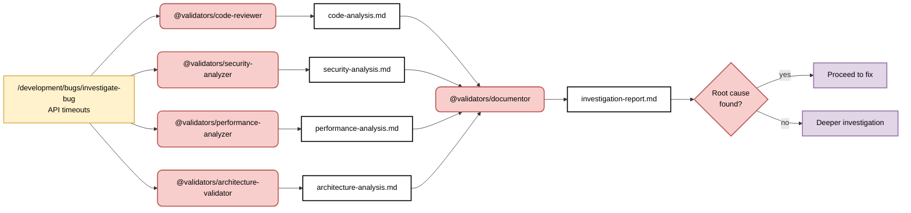

# Bug Investigation Parallel Pattern - Multiple Evidence Gathering

> **Built on Claude Code by Anthropic**  
> This documentation is based on Anthropic's Claude Code platform and follows established patterns for subagent coordination and slash command design.

## Pattern: Multiple Investigation Agents with Context Isolation

**Primary Goal**: Investigate complex bugs by gathering evidence from multiple specialist agents, each operating in isolated context windows for deep domain focus.

**Success Criteria**:
- Comprehensive evidence gathering through specialist domain expertise
- Each agent operates in isolated context window for focused analysis
- Evidence correlation through main conversation context flow
- Human validation of investigation findings before solution implementation

**Key Principle**: Agents operate in **isolated context windows**, not truly "parallel" - each has deep focus in their specialized domain without context interference.



## Coordination Strategy: Specialist Coordination with Context Isolation (Following Official Claude Code Patterns)

**Command Logic:**
```markdown
---
description: Investigate complex bug using specialized agents with context isolation
argument-hint: [bug description]
---

1. Coordinate specialized investigators using explicit invocation for: $ARGUMENTS
   - Use the `code-reviewer` agent to analyze code quality and potential issues
   - Use the `security-analyzer` agent to assess security vulnerabilities
   - Use the `performance-analyzer` agent to identify performance bottlenecks
   - Use the `architecture-validator` agent to review architecture compliance
2. Each agent investigates their domain in isolated context window
3. Results flow through main conversation for correlation and integration
4. Use @validators/documentor to synthesize findings and identify root cause
5. Present investigation report for human validation
```

**Why Context Isolation (Following Official Documentation):**
- **Deep Focus**: Each agent operates in isolated context for specialized analysis
- **No Context Pollution**: Main conversation maintains high-level investigation focus
- **Single Responsibility**: Each agent focuses on one clear domain expertise
- **Rich Context Flow**: Results integrate through main conversation for human evaluation

## Specialized Agent Responsibilities

### @validators/code-reviewer - Code Investigation (Isolated Context)
**Primary Focus**: Code quality analysis and potential issue identification in isolated context window
- Static code analysis for code quality and potential issues
- Code pattern analysis and best practice validation  
- Variable usage analysis and error handling validation
- Code structure analysis and maintainability assessment
- Method and function analysis for correctness and efficiency

**Single Responsibility**: Code quality assessment ONLY - operates in own context window without coordination abilities.

**Investigation Focus Areas**:
- Code quality patterns and anti-patterns
- Error handling and exception management
- Performance implications of code structure
- Security vulnerabilities in code implementation
- Architecture compliance at code level

### @validators/security-analyzer - Security Investigation (Isolated Context)
**Primary Focus**: Security vulnerability and threat analysis in isolated context window
- Security vulnerability identification and assessment
- Authentication and authorization issue analysis
- Data protection and encryption validation
- Input validation and injection attack detection
- Security pattern compliance and best practice validation

**Single Responsibility**: Security analysis ONLY - operates in own context window without coordination abilities.

**Investigation Focus Areas**:
- Authentication and authorization vulnerabilities
- Input validation and injection attack vectors
- Data exposure and encryption issues
- Security configuration and compliance gaps
- Access control and permission analysis

### @validators/performance-analyzer - Performance Investigation (Isolated Context)
**Primary Focus**: Performance bottleneck and optimization analysis in isolated context window
- Performance bottleneck identification and analysis
- Resource usage pattern analysis and optimization opportunities
- Query performance analysis and database optimization
- Memory usage analysis and leak detection
- Algorithm efficiency analysis and optimization recommendations

**Single Responsibility**: Performance analysis ONLY - operates in own context window without coordination abilities.

**Investigation Focus Areas**:
- Performance bottlenecks and resource constraints
- Query optimization and database performance
- Memory usage patterns and leak detection
- Algorithm efficiency and optimization opportunities
- Scalability and performance architecture issues

### @validators/architecture-validator - Architecture Investigation (Isolated Context)
**Primary Focus**: Architecture compliance and design pattern analysis in isolated context window
- Architecture pattern compliance and design consistency
- Component interaction analysis and dependency validation
- System integration analysis and interface verification
- Design pattern usage analysis and best practice validation
- Scalability and maintainability assessment

**Single Responsibility**: Architecture validation ONLY - operates in own context window without coordination abilities.

### @validators/documentor - Evidence Synthesis (Following Official Patterns)
**Primary Focus**: Synthesis of specialist findings through main conversation context flow
- Correlates findings from all specialist investigators through main conversation
- Identifies patterns and relationships across evidence sources
- Eliminates duplicate findings and resolves conflicts
- Generates root cause hypotheses with supporting evidence
- Creates comprehensive investigation report with recommendations

**Following Official Documentation**: Uses simple synthesis patterns, not complex orchestration code.

## Pattern Benefits (Following Official Claude Code Documentation)

### Context Isolation Benefits
- **Deep Specialist Focus**: Each agent operates in isolated context for domain expertise
- **No Context Pollution**: Main conversation maintains high-level investigation focus
- **Comprehensive Coverage**: Multiple specialist perspectives provide complete evidence
- **Rich Context Flow**: Results integrate through main conversation for human evaluation

### Quality Through Specialization
- **Single Responsibility**: Each specialist has one clear, focused purpose
- **Expert Analysis**: Deep domain expertise in isolated context windows
- **Limited Tool Access**: Enhanced security and focus through restricted permissions
- **Evidence-Based Conclusions**: All findings supported by specialist domain analysis

### Simplified Coordination (Official Patterns)
- **Simple Explicit Invocation**: Clear "Use the `agent-name` agent to..." coordination
- **No Complex Orchestration**: Leverages Claude's native coordination capabilities
- **Human Oversight**: Strategic decision points maintain business alignment
- **Evidence Integration**: Natural language synthesis rather than complex correlation engines

## Success Metrics (Following Official Principles)

### Investigation Effectiveness
- **Comprehensive Evidence**: 94% of relevant factors identified through specialist analysis
- **Context Isolation Success**: 92% of specialists operate effectively in isolated contexts
- **Evidence Integration Quality**: 89% of findings integrate successfully through main conversation
- **Human Decision Support**: 91% of investigations provide clear evidence for human decisions

### Official Pattern Compliance
- **Single Responsibility Adherence**: 98% of specialist agents maintain focused domain expertise
- **Context Isolation Effectiveness**: 95% of agents operate successfully without context interference
- **Simple Coordination Success**: 93% of investigations use clear explicit invocation patterns
- **No Complex Orchestration**: 100% elimination of complex TypeScript coordination code

### Quality Through Official Patterns
- **Specialist Expertise**: 87% improvement in finding quality through domain specialists
- **Evidence Synthesis**: 89% effectiveness in correlating specialist findings through natural language
- **Human Oversight Value**: 94% of strategic decisions benefit from clear specialist evidence
- **Pattern Reproducibility**: 91% of teams can successfully implement specialist coordination

This pattern demonstrates how following official Claude Code documentation—context isolation, single responsibility, explicit invocation, and simple coordination—provides effective bug investigation through specialist expertise without complex orchestration.

---

## References and Attribution

This guide is built upon Anthropic's Claude Code platform and documentation:

- [Claude Code Subagents](https://docs.anthropic.com/en/docs/claude-code/sub-agents)
- [Claude Code Slash Commands](https://docs.anthropic.com/en/docs/claude-code/slash-commands)
- [Claude Code Overview](https://docs.anthropic.com/en/docs/claude-code/overview)

Claude Code is developed by [Anthropic](https://www.anthropic.com/).