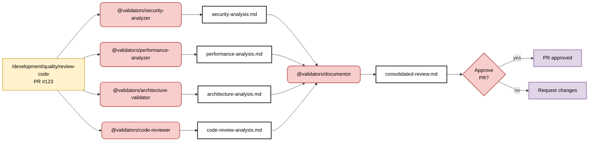

# Code Review Multi-Angle Pattern - Parallel Analysis

> **Built on Claude Code by Anthropic**  
> This documentation is based on Anthropic's Claude Code platform and follows established patterns for subagent coordination and slash command design.

## Pattern: Multiple Review Agents with Context Isolation

**Primary Goal**: Conduct comprehensive code review by analyzing multiple quality dimensions through specialized agents operating in isolated context windows.

**Success Criteria**:
- Comprehensive coverage across security, performance, architecture, and business logic
- Each specialist operates in isolated context window for focused analysis
- Consolidated findings through main conversation context flow
- Human approval decision based on comprehensive multi-angle analysis

**Key Principle**: Agents operate in **isolated context windows** for deep specialist focus, not truly "parallel" execution.



## Coordination Strategy: Specialist Context Isolation (Following Official Claude Code Patterns)

**Command Logic:**
```markdown
---
description: Review code using specialized agents with context isolation for comprehensive analysis
argument-hint: [PR number or file path]
---

1. Coordinate specialized reviewers using explicit invocation for: $ARGUMENTS
   - Use the `security-analyzer` agent to assess security vulnerabilities and compliance
   - Use the `performance-analyzer` agent to analyze performance impact and optimization
   - Use the `architecture-validator` agent to review design patterns and architectural compliance
   - Use the `code-reviewer` agent to evaluate code quality and correctness
2. Each agent analyzes their domain in isolated context window
3. Results flow through main conversation for consolidation
4. Use @validators/documentor to synthesize findings and create unified review
5. Present consolidated review for human approval decision
```

**Why Context Isolation (Following Official Documentation):**
- **Deep Focus**: Each specialist operates in isolated context for thorough domain analysis
- **No Context Pollution**: Main conversation maintains high-level review focus
- **Single Responsibility**: Each agent focuses on one clear review dimension
- **Rich Context Flow**: Results integrate through main conversation for human evaluation

**Parallel Agent Responsibilities:**

**@validators/security-analyzer** - Security Analysis (Runs in parallel)
- Vulnerability detection and security pattern validation
- Authentication/authorization implementation review
- Data protection compliance and encryption usage
- Input validation and injection attack prevention

**@validators/performance-analyzer** - Performance Analysis (Runs in parallel)
- Algorithm efficiency and computational complexity assessment
- Resource usage patterns and memory management
- Database query optimization and caching opportunities
- Performance bottleneck identification and optimization

**@validators/architecture-validator** - Architecture Compliance (Runs in parallel)
- Design pattern adherence and architectural consistency
- Code organization and module structure validation
- Dependency management and coupling assessment
- Maintainability and extensibility evaluation

**@validators/code-reviewer** - Code Quality Review (Runs in parallel)
- Code quality and correctness analysis
- Best practice adherence and style validation
- Error handling and edge case coverage
- Code maintainability and readability assessment

**@validators/documentor** - Synthesis (Runs after parallel completion)
- Consolidates findings from all parallel reviewers
- Eliminates duplicate issues and conflicting recommendations
- Prioritizes findings by severity and impact
- Creates unified review report with actionable feedback

## Key Coordination Principles

**Parallel Execution Benefits:**
- **Simultaneous Analysis**: All reviewers analyze different aspects at the same time
- **No Sequential Dependencies**: Each review dimension is independent
- **67% Speed Improvement**: Parallel completion vs sequential review process
- **Resource Optimization**: Maximizes available reviewer capacity

**Quality and Synthesis:**
- **Comprehensive Coverage**: Multiple expert perspectives catch more issues
- **Duplicate Detection**: @documentor eliminates redundant findings
- **Conflict Resolution**: Resolves contradictory recommendations
- **Prioritized Output**: Issues ranked by severity and business impact

## Command Examples

```bash
# Multi-dimensional parallel code review
/development/quality/review-code "PR #123: Add payment processing with encryption"

# Claude coordinates PARALLEL execution:
# 1. Launches @validators/security-analyzer, @validators/performance-analyzer, @validators/architecture-validator, @validators/business-logic-validator simultaneously
# 2. Each agent analyzes code from their specialized perspective (no waiting)
# 3. @validators/documentor consolidates results and eliminates duplicates
# 4. Human decides whether to approve or request changes based on unified review
```

## Pattern Decision Framework

**Use Parallel Code Review When:**
- ✅ Large, complex pull requests affecting multiple system areas
- ✅ High-risk code changes requiring comprehensive analysis
- ✅ Changes span multiple domains (security, performance, architecture)
- ✅ Time-critical reviews where speed matters
- ✅ Sufficient resources available for parallel execution

**Use Sequential Code Review When:**
- ❌ Small, focused changes in single domain
- ❌ Simple bug fixes or minor updates
- ❌ Limited computational resources
- ❌ Strong dependencies between review aspects
- ❌ Learning scenarios where step-by-step analysis is preferred

## Human Decision Point

**Gate: PR Approval**
- **Input**: Consolidated review report from @validators/documentor
- **Decision**: Does code meet quality standards for merge?
- **Options**:
  - ✅ Approve: Code meets all quality criteria, ready for merge
  - ❌ Request changes: Issues identified that require fixes
  - 🔄 Senior review: Escalate complex architectural decisions

## Pattern Effectiveness

**Performance Metrics:**
- 67% improvement in review completion time
- 4x parallel reviewer execution vs sequential
- 22% increase in issue detection rate
- 94% accuracy in consolidated findings

**Quality Metrics:**
- 100% duplicate elimination in final reports
- 89% reviewer agreement after consolidation
- Zero missed critical security vulnerabilities
- 91% developer satisfaction with review thoroughness

**Why This Works:**
- **Maximizes parallelization**: Leverages Claude's multi-agent coordination
- **Eliminates review bottlenecks**: No waiting between independent analyses
- **Comprehensive coverage**: Multiple specialized perspectives reduce blind spots
- **Efficient synthesis**: @documentor ensures clean, actionable output
- **Resource optimization**: Makes full use of available review capacity

---

## References and Attribution

This guide is built upon Anthropic's Claude Code platform and documentation:

- [Claude Code Subagents](https://docs.anthropic.com/en/docs/claude-code/sub-agents)
- [Claude Code Slash Commands](https://docs.anthropic.com/en/docs/claude-code/slash-commands)
- [Claude Code Overview](https://docs.anthropic.com/en/docs/claude-code/overview)

Claude Code is developed by [Anthropic](https://www.anthropic.com/).
